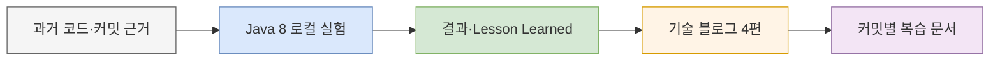

# B2G 외부 연동 회고 산출물 지도

이 문서는 B2G ATAM·Telecop Sender와 RestTemplate 회고에서 만든 자료의 위치, 읽는 순서, 검증 상태를 한곳에 모은다. 경로는 모두 `inchangson.github.io` 저장소 루트 기준이다.

## 권장 읽기 순서

아래 흐름은 과거 구현 근거에서 로컬 실험과 공개 글 초안으로 이어지는 순서를 보여준다.

> 화살표는 학습 순서다. 배포 순서나 프로덕션 호출 흐름을 뜻하지 않는다.

## 경로별 산출물

| 구분 | 시작 경로 | 내용 | 상태 |
|---|---|---|---|
| 전체 안내 | [`docs/b2g-resttemplate-retrospective/README.md`](./README.md) | 조사 범위, 표현 경계, 질문과 검증 상태 | 완료 |
| 프로덕션 근거 | [`docs/b2g-resttemplate-retrospective/source-map.md`](./source-map.md) | SA01 기준 파일·SHA·개인/팀 기여 경계 | 완료 |
| 변경 이력 | [`docs/b2g-resttemplate-retrospective/history.md`](./history.md) | 핵심 파일의 비병합 커밋 25개와 실패 경로 | 완료 |
| Java 8 데모 | [`lab/b2g-resttemplate-lab/README.md`](../../lab/b2g-resttemplate-lab/README.md) | Boot 1.5.12 DemoApplication, 로컬 스텁, 실행법 | 기능 테스트 10개 통과 |
| 실험별 회고 | [`lab/b2g-resttemplate-lab/lessons/`](../../lab/b2g-resttemplate-lab/lessons/) | 업무 성공, 공유 factory, pool, 예외·로그, 프로파일 | 5개 작성 완료 |
| 프로파일 원본 | [`lab/b2g-resttemplate-lab/results/`](../../lab/b2g-resttemplate-lab/results/) | legacy/fixed wall-clock flame graph HTML | 수집 완료, 화면 검토 대기 |
| 블로그 연재 | [`src/content/posts/b2g-external-api-01-sender-boundary.md`](../../src/content/posts/b2g-external-api-01-sender-boundary.md) | Sender → factory → pool → 결과·로그 4편 | 모두 `draft: true` |
| 커밋별 복습 | [`docs/current-work/docs-b2g-resttemplate-retrospective/cognitive/README.md`](../current-work/docs-b2g-resttemplate-retrospective/cognitive/README.md) | 구현 커밋 7개의 목적·영향·리스크·파일표 | HTML 7개 작성 완료 |

## 실험 문서 바로가기

| 순서 | 질문 | 결과 문서 |
|---:|---|---|
| 1 | HTTP 성공과 업무 성공은 같은가 | [01-http-and-business-outcome.md](../../lab/b2g-resttemplate-lab/lessons/01-http-and-business-outcome.md) |
| 2 | 새 RestTemplate이면 timeout도 독립적인가 | [02-shared-request-factory-timeout.md](../../lab/b2g-resttemplate-lab/lessons/02-shared-request-factory-timeout.md) |
| 3 | pool Bean이 있으면 연결을 재사용하는가 | [03-pool-and-connection-close.md](../../lab/b2g-resttemplate-lab/lessons/03-pool-and-connection-close.md) |
| 4 | timeout도 같은 결과·로그 규격으로 남는가 | [04-explicit-result-and-log.md](../../lab/b2g-resttemplate-lab/lessons/04-explicit-result-and-log.md) |
| 5 | 외부 호출 중 스레드는 어디서 기다리는가 | [05-wall-clock-profile.md](../../lab/b2g-resttemplate-lab/lessons/05-wall-clock-profile.md) |

## 블로그 연재 바로가기

시작점: [외부 연동 개선 경험을 코드와 실험으로 설명하려면](../../src/content/posts/b2g-external-api-00-interview-guide.md). 저장소만으로 실행하고 면접 답변까지 연결하는 안내다.

| 순서 | 핵심 질문 | 초안 경로 |
|---:|---|---|
| 1 | Sender로 책임을 옮기면 무엇이 달라지는가 | [`b2g-external-api-01-sender-boundary.md`](../../src/content/posts/b2g-external-api-01-sender-boundary.md) |
| 2 | 새 RestTemplate인데 timeout이 왜 공유되는가 | [`b2g-external-api-02-shared-factory.md`](../../src/content/posts/b2g-external-api-02-shared-factory.md) |
| 3 | pool이 있는데 왜 매번 새 연결을 만드는가 | [`b2g-external-api-03-pool-reuse.md`](../../src/content/posts/b2g-external-api-03-pool-reuse.md) |
| 4 | timeout을 false로 바꾸면 무엇을 놓치는가 | [`b2g-external-api-04-outcome-log.md`](../../src/content/posts/b2g-external-api-04-outcome-log.md) |

## 공개 전 남은 확인

- 두 flame graph를 브라우저에서 열어 workload → RestTemplate → HttpClient → socket read 경로와 표본 비율을 눈으로 확인한다.
- 당시 업무 맥락과 개인 기여 표현을 다시 확인한다.
- 블로그 글의 `draft` 해제 여부를 결정한다.
- 이력서 문구를 바꿀 때는 운영 성능 향상 수치를 사용하지 않는다.

실제 ATAM·Telecop 주소와 인증 정보는 데모에 없다. 데모는 loopback 목적지만 허용하고 redirect를 차단하며, 프로파일 workload는 Docker `--network none`에서 실행했다.
