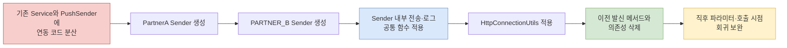

# B2G 외부 연동 개선 회고

> 이 디렉터리는 완성된 성공담이 아니라, legacy-service의 PARTNER_B·PartnerA 변경을 실제 커밋과 Java 8 재현 실험으로 다시 이해하는 작업 기록이다.

## 먼저 바로잡은 한 문장

현재 이력서에는 다음 문장이 있다.

> PARTNER_B·PartnerA 호출을 공통 Sender와 RestTemplate으로 통합하고 연동 로그·예외 규격을 표준화

코드에서 바로 확인되는 표현은 조금 다르다.

- PARTNER_B과 PartnerA은 하나의 Sender가 아니라 연동처별 Sender로 분리되었다.
- 두 Sender가 공통으로 사용한 것은 `HttpConnectionUtils`와 주입된 `RestTemplate`이다.
- 요청·응답 로그를 모은 경로는 확인되지만, timeout과 연결 실패까지 같은 결과 규격으로 바뀐 것은 아니다.
- 커넥션 풀 Bean은 이 작업 전에 이미 존재했다. 이번 작업에서 풀을 새로 도입했다고 쓰면 안 된다.

따라서 구현 사실에 가까운 표현은 다음과 같다.

> PARTNER_B·PartnerA 발신 로직을 연동처별 Sender로 분리하고, 공통 RestTemplate 기반 전송과 요청·응답 로그 경로를 정리했다.

## 조사 범위

| 구분 | 기준 | 사용 목적 |
|---|---|---|
| 주 변경 구간 | legacy-service 비공개 분석 구간 | Sender 분리와 HTTP·로그 공통화 과정 |
| 종료 상태 | 비공개 이력의 커밋된 blob | 당시 구조 설명 |
| 직후 보완 | 비공개 이력, 비공개 이력, 비공개 이력 | 정리 직후 발견된 파라미터·호출 시점 보완 |
| 실행 환경 | Java 8, Boot 1.5.12, Spring 4.3.16, HttpClient 4.5.5 | 당시 라이브러리 동작 재현 |

시작 SHA는 종료 SHA의 조상이 아니다. 주 변경 구간은 시간순 선형 이력이 아니라 Git의 도달 가능성 차집합 `A..B`로 읽는다. 직후 보완은 범위를 무작정 늘리지 않고 관련 파일의 부모 대비 diff만 별도 후기에서 다룬다.

## 변경 흐름

아래 그림은 클래스 생성보다 실제 호출 경계가 바뀐 순서를 보여준다.

> 화살표는 커밋에서 관찰한 구조 변화 순서다. 배포 완료나 운영 효과를 뜻하지 않는다.

## 회고 질문

실험은 다음 질문을 하나씩 확인하고, 질문마다 별도 커밋과 Lesson Learned를 남긴다.

1. HTTP 200과 외부 업무 성공을 같은 boolean으로 표현하면 어떤 정보가 사라지는가?
2. 새 `RestTemplate`을 만들어도 같은 request factory를 참조하면 timeout이 격리되는가?
3. 커넥션 풀과 `Connection: close`가 함께 있으면 실제 연결은 재사용되는가?
4. HTTP 4xx·5xx, read timeout, connect 실패는 같은 예외·로그 경로를 통과하는가?
5. 연동처별 불변 client와 명시적 결과 타입은 위 문제를 어디까지 해결하는가?

## 증거 라벨

| 라벨 | 의미 |
|---|---|
| 구현 사실 | 특정 SHA의 diff 또는 blob에서 직접 확인 |
| 구조적 해석 | 코드 관계로 설명 가능하지만 당시 의도·효과는 단정하지 않음 |
| 로컬 실험 | Java 8 데모에서 재현한 결과이며 운영 수치가 아님 |
| 후속 제안 | 회고 시점에 작성한 개선안이며 과거 성과가 아님 |

## 산출물

- [산출물 전체 경로·상태 인덱스](./ARTIFACTS.md)
- [프로덕션 코드 근거 지도](./source-map.md)
- [25개 핵심 변경과 실패 경로 상세 이력](./history.md)
- [Java 8 실험과 결과](../../lab/b2g-resttemplate-lab/README.md)
- [커밋별 복습 HTML 인덱스](../current-work/docs-b2g-resttemplate-retrospective/cognitive/README.md)

## 읽는 순서와 검증 상태

1. [Sender 책임 회고](../../src/content/posts/b2g-external-api-01-sender-boundary.md)
2. [공유 factory와 timeout](../../src/content/posts/b2g-external-api-02-shared-factory.md)
3. [풀·연결 재사용과 실제 프로파일](../../src/content/posts/b2g-external-api-03-pool-reuse.md)
4. [업무 결과·실패 로그](../../src/content/posts/b2g-external-api-04-outcome-log.md)

네 글은 `draft: true`이며 `npm run dev`에서 읽을 수 있다. Java 8 기능 테스트 10개와 프로파일 workload 2개는 통과했다. 실제 flame graph HTML은 생성했으나 연결된 브라우저가 없어 화면 확인은 미완료다. 사용자의 당시 맥락 검토와 화면 확인 뒤 공개 여부를 결정한다. 운영 성과 문구는 아직 수정하지 않았다.

## 공식 참고 자료

- [Spring Boot 1.5.12 dependency versions](https://docs.spring.io/spring-boot/docs/1.5.12.RELEASE/reference/html/appendix-dependency-versions.html)
- [Spring Framework 4.3.16 RestTemplate](https://docs.spring.io/spring-framework/docs/4.3.16.RELEASE/javadoc-api/org/springframework/web/client/RestTemplate.html)
- [Apache HttpClient 4.5 connection management](https://hc.apache.org/httpcomponents-client-4.5.x/current/tutorial/html/connmgmt.html)
