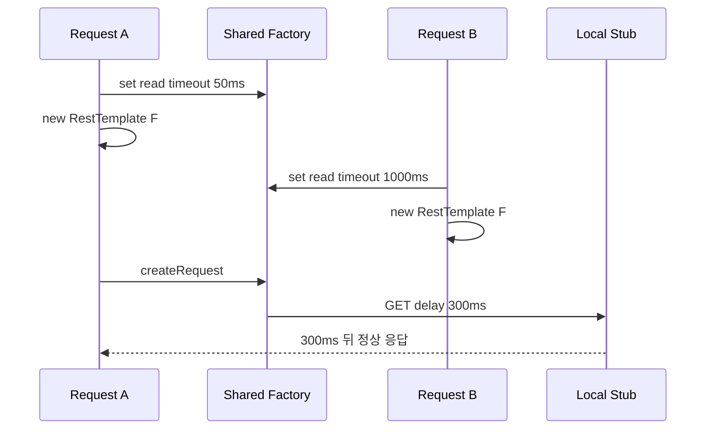

# 실험 2. 새 RestTemplate이면 timeout도 독립적인가

## 가설

`new RestTemplate(factory)`로 wrapper를 새로 만들어도 같은 mutable factory를 참조하면 timeout은 요청별 설정이 아니다. 나중에 호출된 setter가 먼저 만든 client의 동작까지 바꾼다.

## 고정한 interleaving

아래 순서는 동시 테스트의 우연한 스케줄링 대신 실제 공유 관계를 결정적으로 보여준다.

> A의 wrapper는 새 객체지만 factory는 B와 같은 객체다. A가 요청을 만들 때는 B가 마지막으로 쓴 1,000ms 설정이 사용된다.

## 관찰 결과

- 두 RestTemplate의 `getRequestFactory()`는 `isSameAs` 검증을 통과했다.
- 50ms를 의도한 client가 300ms 지연 응답을 timeout 없이 받았다.
- 테스트는 실제 Java 8·Spring 4.3.16에서 실행한다.

## Lesson Learned

1. 객체 생성 코드만 보고 설정 격리를 판단하면 안 된다. 실제로 공유되는 하위 객체까지 추적해야 한다.
2. 예외 경로에서 기본값을 복구하도록 `finally`를 추가해도 두 요청이 같은 가변 factory를 덮어쓰는 경쟁은 남는다.
3. timeout은 호출 인자에서 singleton setter로 전달하기보다 시작 시 완성한 연동처별 client 설정으로 고정하는 편이 안전하다.
4. 이 실험은 가능한 interleaving을 재현한 것이며 운영에서 오염 빈도가 몇 퍼센트였다는 측정이 아니다.
