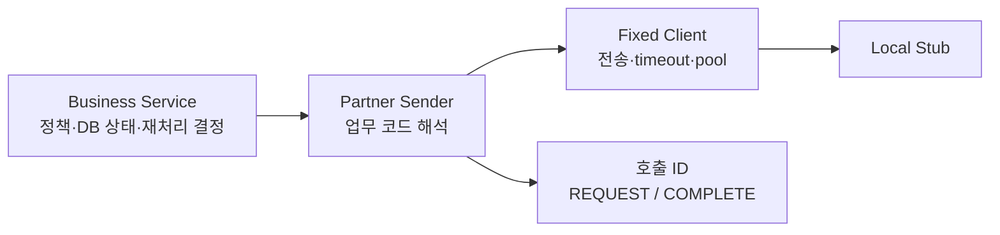

# 실험 4. timeout도 응답과 같은 규격으로 기록할 수 있을까

`CallResult`는 전송 상태와 업무 상태를 분리한다. HTTP 200은 도착한 응답의 상태이고, `SUCCESS`는 데모 계약에서 해석한 업무 상태다. read timeout 뒤에는 업무 결과를 알 수 없으므로 `UNKNOWN`으로 남긴다.

이 코드는 **후속 제안**이다. 과거 B2G 구현에 이 결과 타입이나 고정 client가 있었다고 주장하지 않는다. 실제 ATAM·Telecop 계약 전체도 복제하지 않는다. 두 데모 파트너가 같은 `resultCode`를 반환한다는 축소 계약을 사용했다.

## 실제 검증

2026-09-07 Java 8 Docker build: 10 tests, 0 failures, 0 errors, 0 skipped.

| 입력 | 전송 상태 | 업무 상태 | 로그 |
|---|---|---|---|
| 200 / SUCCESS | HTTP_RESPONSE | SUCCESS | REQUEST → COMPLETE |
| 200 / REJECTED | HTTP_RESPONSE | REJECTED | REQUEST → COMPLETE |
| HTTP 500 | HTTP_RESPONSE | UNKNOWN | REQUEST → COMPLETE |
| 200 / 깨진 JSON | HTTP_RESPONSE | UNKNOWN | REQUEST → COMPLETE |
| 300ms 응답 지연 / read 50ms | READ_TIMEOUT | UNKNOWN | REQUEST → COMPLETE |
| 로컬 미사용 포트 | CONNECTION_FAILURE | UNKNOWN | REQUEST → COMPLETE |
| 풀 1개 점유 / 대기 50ms | POOL_TIMEOUT | UNKNOWN | REQUEST → COMPLETE |

풀 테스트는 첫 요청이 연결을 빌린 상태를 확인한 다음 두 번째 요청을 보낸다. 두 번째 요청은 풀 대기 초과, 첫 번째 요청은 성공을 검증했다. connect timeout은 분류 코드를 두었지만 실제 재현하지 않았다. 로컬 연결 거절과 connect timeout은 다른 실패다.

별도 factory와 pool을 가진 50ms·1000ms client에서는 300ms 지연에 각각 timeout과 성공이 관찰됐다. 설정 필드를 외부에 노출하지 않아 요청 중 setter 호출 경로를 없앴다. Java의 불변 타입 자체로 RestTemplate의 내부까지 불변으로 만든 것은 아니다.

## 책임 경계

이 그림은 전송 결과를 해석하는 Sender와 실제 업무 상태를 갱신하는 Service를 구분한다.

> 데모 로그는 메모리 리스트다. 운영 DB 저장의 내구성이나 트랜잭션 독립성을 검증한 것이 아니다.

## Lesson Learned와 남은 한계

1. 예외를 boolean false로만 바꾸면 확인된 거절과 결과 불명을 구분할 수 없다. 재처리 정책에 필요한 정보를 결과 타입에 남긴다.
2. 동일한 callId로 시작과 종료를 묶으면 동시 호출의 로그를 섞지 않고 추적할 수 있다. 전문·개인정보는 기록하지 않는다.
3. `finally`는 JVM 강제 종료나 로그 저장 실패까지 보장하지 않는다. 메모리 로그는 누적되므로 운영 저장소로 사용할 수 없다.
4. 외부 부작용은 DB rollback으로 되돌릴 수 없다. timeout에 무조건 재시도하지 않고 상대의 멱등성 키·결과 조회·보상 계약을 확인해야 한다. 데모는 자동 재시도를 끈다.
5. 별도 풀은 자원을 격리하지만 연결 수가 늘어난다. 연동처 수와 DB 트랜잭션 동안 점유하는 자원을 함께 산정해야 한다. B2G에 `REQUIRES_NEW`가 있었다는 근거는 없다.
6. request/connect/read timeout 세 개를 더한 값이 전체 실행시간의 엄격한 상한은 아니다. DNS·TLS·읽기 패턴과 상위 요청 기한도 별도로 검토한다.

## 공식 자료

- [Spring 4.3.16 request factory](https://docs.spring.io/spring-framework/docs/4.3.16.RELEASE/javadoc-api/org/springframework/http/client/HttpComponentsClientHttpRequestFactory.html)
- [HttpClient 4.5 connection management](https://hc.apache.org/httpcomponents-client-4.5.x/current/tutorial/html/connmgmt.html)
