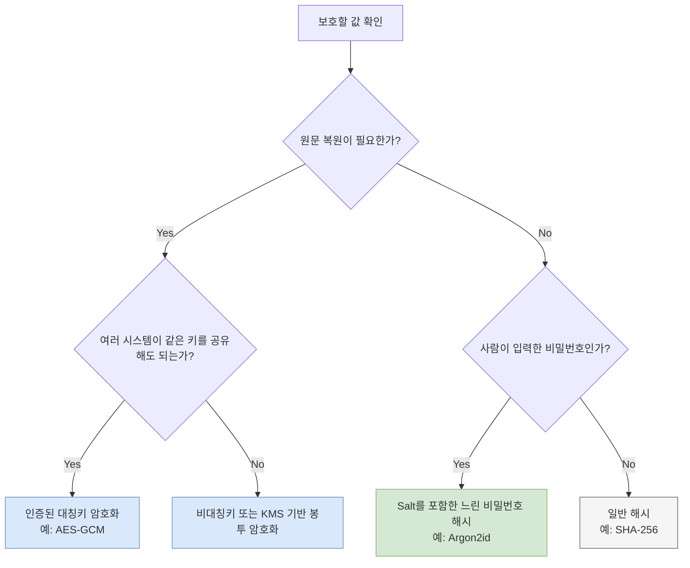

보안 기능을 구현할 때 가장 먼저 구분해야 하는 것은 **원문 복원이 필요한가**이다. 복원이 필요하면 암호화, 필요하지 않으면 해시를 검토한다. 비밀번호는 복원할 이유가 없으므로 일반 암호화가 아니라 비밀번호 전용 해시 함수로 저장한다.

## 개념 비교

| 방식 | 원문 복원 | 대표 용도 | 예시 |
|---|---|---|---|
| 대칭키 암호화 | 가능 | 개인정보, API 자격 증명 보관 | AES-GCM |
| 비대칭키 암호화 | 가능 | 키 교환, 전자서명 기반 구조 | RSA, ECC |
| 일반 해시 | 불가능 | 파일 무결성, 콘텐츠 식별 | SHA-256 |
| 비밀번호 해시 | 불가능 | 비밀번호 검증 | Argon2id, bcrypt, scrypt |

## 선택 흐름

아래 다이어그램은 저장하려는 값의 성격에 따라 방식을 고르는 기준을 보여준다.



## SHA-256만으로 비밀번호를 저장하면 안 되는 이유

SHA-256은 빠르도록 설계됐다. 파일 무결성 검증에는 장점이지만, 공격자가 유출된 해시를 대상으로 초당 매우 많은 후보를 시험할 수 있다는 뜻이기도 하다.

비밀번호 저장 함수에는 다음 특성이 필요하다.

- 사용자마다 다른 무작위 `salt`
- 반복 계산으로 CPU 비용 증가
- 가능한 경우 메모리 비용도 증가
- 서버 성능에 맞게 비용 인자를 조정할 수 있는 구조

Argon2id는 계산 시간과 메모리 사용량을 함께 조절할 수 있어 비밀번호 저장에 적합하다. 라이브러리가 생성한 해시 문자열에는 보통 알고리즘, 파라미터, salt, 결과가 함께 들어가므로 salt를 별도 비밀값처럼 관리할 필요는 없다.

```text
$argon2id$v=19$m=65536,t=3,p=1$...salt...$...hash...
```

## 구현 원칙

1. 검증된 보안 라이브러리를 사용하고 암호 알고리즘을 직접 구현하지 않는다.
2. 비밀번호 비교는 라이브러리의 `verify` API를 사용한다.
3. 비용 인자는 운영 환경에서 로그인 지연 시간을 측정해 정한다.
4. 파라미터를 높였으면 다음 로그인 성공 시 새 설정으로 다시 해시할 수 있다.
5. 암호화 키는 코드나 저장소에 넣지 않고 KMS, Vault, Secret Manager 같은 별도 시스템에서 관리한다.
6. 암호화에는 기밀성뿐 아니라 변조 감지도 제공하는 인증된 암호 모드를 사용한다.

## 흔한 실수

- SHA-256을 여러 번 반복하면 비밀번호 전용 함수와 같다고 생각한다.
- 모든 사용자에게 같은 salt를 사용한다.
- 암호화 키와 암호문을 같은 데이터베이스에 같은 권한으로 저장한다.
- AES-ECB처럼 데이터 패턴이 노출되는 모드를 사용한다.
- 비밀번호 원문이나 복호화된 개인정보를 로그에 남긴다.

핵심은 알고리즘 이름보다 **목적에 맞는 원시 기능을 선택하고 키·파라미터·로그까지 운영 가능한 형태로 관리하는 것**이다.
