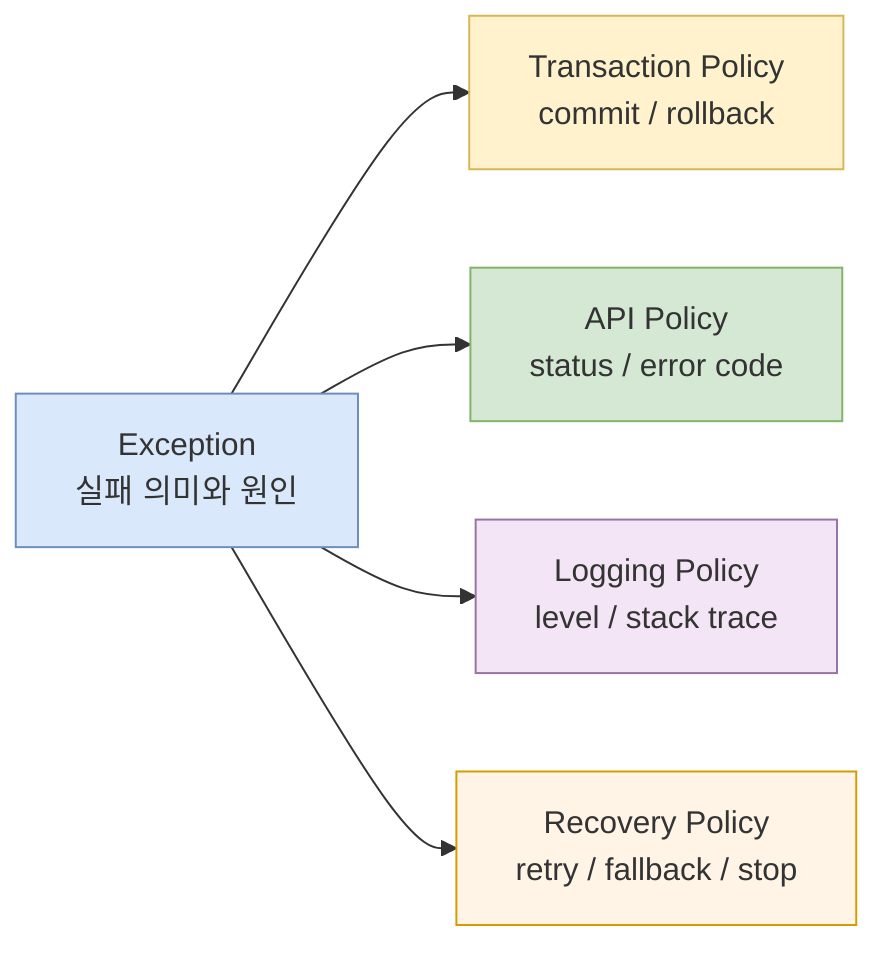
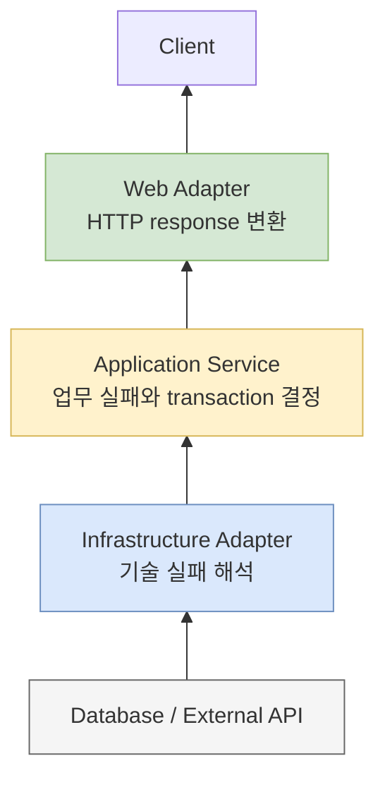

예외 처리는 `try-catch`를 많이 쓰는 기술이 아니다. **실패의 의미를 아는 경계에서 번역하고, transaction·외부 응답·로그·재시도 정책을 각각 결정하는 설계**다.

앞선 두 글에서는 Java가 Checked Exception을 API 계약으로 만든 이유와 Spring이 전통적으로 Checked Exception에 commit하는 배경을 살펴봤다.

- [Checked Exception은 왜 만들어졌고 왜 외면받았는가?](/blog/exception-01-checked-unchecked)
- [Spring은 왜 Checked Exception을 롤백하지 않는가?](/blog/exception-02-spring-transaction-rollback)

이제 논쟁을 application code의 규칙으로 바꿀 차례다. 핵심은 하나의 exception class에 너무 많은 의미를 싣지 않는 것이다.

> **Exception은 실패를 전달한다. Rollback은 데이터 변경의 완료 여부를 정하고, HTTP response는 외부 계약을 만들며, retry는 다시 실행할 조건을 정한다.**

## 예외 타입 하나가 모든 정책을 결정할 수 없는 이유

`OutOfStockException`을 예로 들어 보자.

- 예상 가능한 business failure이므로 client에는 `409 Conflict`를 보낼 수 있다.
- 같은 재고 상태에서 retry해도 성공하지 않으므로 자동 retry 대상이 아니다.
- 정상적인 요청 거절이라면 error stack trace를 매번 남길 필요가 없다.
- 주문과 재고를 이미 변경했다면 transaction은 rollback해야 한다.
- 품절 요청 이력을 저장하는 별도 transaction은 commit해야 할 수도 있다.

`RuntimeException`이라는 상속 관계만 보고 이 결정을 전부 유도할 수 없다. 반대로 HTTP 409라는 이유로 DB transaction이 commit돼야 하는 것도 아니다.



Exception hierarchy는 실패의 **의미와 추상화 수준**을 표현하고, 나머지는 각 경계에서 명시적으로 mapping한다.

## 먼저 실패를 세 종류로 분류한다

분류는 상속 구조가 아니라 운영 판단을 위한 출발점이다.

| 종류 | 예시 | 일반적인 처리 | 주의할 점 |
|---|---|---|---|
| Business failure | 재고 부족, 이미 취소된 주문, 한도 초과 | 안정적인 오류 코드로 변환 | 예상 가능하다는 이유로 무조건 commit하지 않는다 |
| Infrastructure failure | DB 연결 실패, 외부 API timeout, broker 장애 | 경계에서 번역하고 제한적 복구 | timeout은 상대 작업의 실패가 확정됐다는 뜻이 아니다 |
| Programming defect | null 접근, 잘못된 상태 전이, 깨진 invariant | 빠르게 실패하고 원인을 수정 | 넓은 catch로 정상 오류처럼 위장하지 않는다 |

같은 예외가 문맥에 따라 다른 분류가 될 수도 있다. `DataIntegrityViolationException`은 예상하지 못한 schema mismatch라면 defect에 가깝고, 동시 가입 요청의 unique constraint 충돌이라면 예상한 business race를 판정하는 재료일 수 있다.

예외의 Java class만 보지 말고 다음을 함께 결정한다.

- 실패가 의미하는 업무 상태
- 호출자가 취할 수 있는 다음 행동
- transaction에서 남겨야 할 변경
- retry 가능 여부와 멱등성 조건
- 외부에 공개할 안정적인 error code
- 운영자에게 필요한 log와 metric

## 예외는 의미를 아는 경계에서 번역한다

하위 계층의 예외를 controller까지 그대로 노출하면 상위 API가 내부 구현에 종속된다.



- infrastructure adapter는 JDBC, JPA, HTTP client와 SDK 예외를 application이 이해할 수 있는 실패로 해석한다.
- application service는 현재 use case를 중단할지, transaction을 rollback할지, 대체 흐름을 실행할지 결정한다.
- web adapter는 exception을 HTTP status와 안정적인 오류 응답으로 변환한다.

### 번역할 때 추상화 수준을 올린다

모든 예외를 `BusinessException` 하나로 감싸면 원래 의미와 대응 정책이 사라진다.

```java
// 의미를 잃는 번역
catch (SQLException e) {
    throw new BusinessException("database error");
}
```

현재 계층의 호출자가 이해할 수 있는 구체적인 의미를 더한다.

```java
final class DuplicateEmailException extends RuntimeException {
    private final String email;

    DuplicateEmailException(String email, Throwable cause) {
        super("이미 등록된 이메일입니다: " + email, cause);
        this.email = email;
    }
}
```

```java
try {
    memberRepository.save(member);
} catch (DataIntegrityViolationException e) {
    if (constraintClassifier.isEmailUniqueViolation(e)) {
        throw new DuplicateEmailException(member.email(), e);
    }
    throw e;
}
```

모든 `DataIntegrityViolationException`을 이메일 중복으로 번역해서는 안 된다. 다른 unique constraint, foreign key와 nullability violation도 같은 상위 타입으로 들어올 수 있다. 원인이 실제 업무 조건과 일치할 때만 구체적인 예외로 바꾼다.

### cause를 보존한다

```java
// 원인을 잃는다.
throw new ReceiptGenerationException(orderId);

// 업무 문맥을 더하면서 원인을 보존한다.
throw new ReceiptGenerationException(orderId, e);
```

원래 exception을 `cause`로 보존해야 stack trace, SQL state, remote response와 장애 지점을 조사할 수 있다. 외부 응답에는 이 정보를 노출하지 않되 server log와 tracing에서는 root cause까지 추적할 수 있어야 한다.

이미 application이 이해하는 `PaymentDeclinedException`을 의미 변화 없이 `OrderException`으로 다시 감싸면 stack만 길어진다. 번역은 하위 기술 의존성을 제거하거나, 상위 업무 문맥 또는 복구 판단을 추가할 때 수행한다.

## Checked와 Unchecked에 대한 팀 기본값

### Domain/Application failure는 구체적인 unchecked 타입으로 표현한다

```java
abstract class OrderException extends RuntimeException {

    OrderException(String message) {
        super(message);
    }
}
```

```java
final class OutOfStockException extends OrderException {
    private final Long productId;

    OutOfStockException(Long productId) {
        super("주문 가능한 재고가 부족합니다. productId=" + productId);
        this.productId = productId;
    }

    Long productId() {
        return productId;
    }
}
```

Unchecked를 선택해도 `RuntimeException` 하나로 뭉치지 않는다. 이름만 보고 실패의 의미를 알 수 있고 필요한 handler가 type-safe하게 분기할 수 있게 한다. Java version이나 확장 요구 때문에 sealed hierarchy가 맞지 않으면 일반적인 abstract base exception을 사용할 수 있다.

### Checked Exception은 실제 복구 계약일 때 제한적으로 사용한다

다음 조건을 만족하면 Checked Exception이 의미가 있다.

- 직접 호출자가 반드시 대안을 선택해야 한다.
- 가능한 실패 타입이 API의 안정적인 일부다.
- 대부분의 호출자가 단순히 다시 던지는 대신 서로 다른 처리를 한다.
- implementation 기술을 바꿔도 해당 failure contract가 유지된다.

반대로 controller까지 `SQLException`, `IOException`, vendor SDK exception을 전파하는 것은 피한다. 상위 호출자가 복구하지 못하고 infrastructure implementation만 노출하기 때문이다.

### 예외 signature만으로 문서화를 대신하지 않는다

Unchecked Exception도 API 문서와 테스트에 가능한 failure를 남긴다.

```java
/**
 * @throws OutOfStockException 주문 가능한 수량이 부족한 경우
 * @throws DuplicateOrderException 동일한 요청이 이미 처리된 경우
 */
Order place(OrderCommand command) {
    // ...
}
```

Compiler enforcement가 없다는 이유로 contract까지 없어지는 것은 아니다.

## Transaction 정책을 예외 계층과 분리한다

Service method가 예외로 끝났을 때 transaction에 무엇을 남길지 먼저 정한다.

```java
@Transactional
public Order placeOrder(OrderCommand command) {
    Order order = orderRepository.save(Order.create(command));
    stock.decrease(command.items());
    return order;
}
```

재고 부족으로 method가 실패하면 생성 중인 주문과 재고 변경을 모두 되돌려야 한다. `OutOfStockException`을 RuntimeException으로 만들면 Spring의 전통적인 기본값과 일치한다. 그러나 **rollback해야 해서 RuntimeException을 선택했다**고 설명하면 API 계약과 transaction 정책을 다시 결합한 셈이다.

팀 정책은 별도로 선언한다.

- Spring 6.2+이며 exception으로 끝난 application transaction을 전부 실패로 정의한다면 `RollbackOn.ALL_EXCEPTIONS`를 전역 기본값으로 둔다.
- 특정 business outcome에서 신청·거절 이력을 남겨야 하면 `noRollbackFor` 또는 별도 transaction 경계를 명시한다.
- 구버전 Spring에서는 필요한 경계에 type 기반 `rollbackFor`를 지정하거나 team composed annotation을 사용한다.
- transaction policy마다 commit/rollback integration test를 둔다.

```java
@Configuration
@EnableTransactionManagement(rollbackOn = RollbackOn.ALL_EXCEPTIONS)
class TransactionConfig {
}
```

이 설정을 사용해도 method 안에서 exception을 잡아 정상 반환하면 exception-based rollback은 동작하지 않는다. 또한 DB rollback은 외부 API, email, file과 message broker의 부수 효과를 되돌리지 않는다.

## 오류 응답은 별도의 외부 계약이다

Client가 message 문자열을 parsing하지 않도록 기계가 읽을 수 있는 code를 제공한다.

```json
{
  "code": "ORDER_OUT_OF_STOCK",
  "message": "주문 가능한 재고가 부족합니다.",
  "traceId": "4f2f6d...",
  "details": {
    "productId": 42
  }
}
```

- `code`는 client 분기와 문서화에 사용하는 안정적인 계약이다.
- `message`는 사용자 또는 개발자가 읽는 설명이며 변경될 수 있다.
- `traceId`는 client report와 server trace를 연결한다.
- `details`에는 client가 안전하게 사용할 수 있는 최소 문맥만 담는다.

내부 SQL, server path, stack trace, access token과 개인정보는 response에 포함하지 않는다.

### HTTP status는 web boundary에서 mapping한다

```java
record ApiError(
    String code,
    String message,
    String traceId,
    Map<String, Object> details
) {
}
```

```java
@RestControllerAdvice
class ApiExceptionHandler {

    @ExceptionHandler(OutOfStockException.class)
    ResponseEntity<ApiError> handle(OutOfStockException e) {
        ApiError body = new ApiError(
            "ORDER_OUT_OF_STOCK",
            "주문 가능한 재고가 부족합니다.",
            currentTraceId(),
            Map.of("productId", e.productId())
        );

        return ResponseEntity.status(HttpStatus.CONFLICT).body(body);
    }

    @ExceptionHandler(Exception.class)
    ResponseEntity<ApiError> handleUnexpected(Exception e) {
        log.error("unexpected request failure", e);

        ApiError body = new ApiError(
            "INTERNAL_ERROR",
            "요청 처리 중 오류가 발생했습니다.",
            currentTraceId(),
            Map.of()
        );

        return ResponseEntity.status(HttpStatus.INTERNAL_SERVER_ERROR).body(body);
    }
}
```

Handler는 transaction을 결정하는 장소가 아니다. 일반적으로 transactional proxy가 예외를 처리한 뒤 web layer까지 전파되고, 그 후 handler가 HTTP response로 바꾼다. Handler에서 exception을 잡는다고 이미 끝난 transaction이 commit으로 바뀌지는 않는다.

JSON parsing, type mismatch, Bean Validation failure는 input contract의 문제다. 재고 부족과 주문 상태 충돌은 유효한 요청이 현재 business state와 맞지 않는 문제다. DB 장애와 programming defect는 내부 실패다. 공통 response shape는 유지하되 error code와 운영 정책을 분리한다.

## 로깅은 어디서 한 번 남길지 정한다

예외가 계층을 통과할 때마다 log를 남기면 같은 stack trace가 여러 번 기록된다.

```java
// repository adapter
catch (SQLException e) {
    log.error("db error", e);
    throw new OrderPersistenceException(e);
}

// service
catch (OrderPersistenceException e) {
    log.error("order error", e);
    throw e;
}

// controller advice
log.error("request error", e);
```

하나의 failure가 세 개의 error log와 alarm을 만든다. 번역 계층에서는 필요한 문맥을 exception에 추가하고, **최종적으로 처리하거나 관찰하는 경계에서 한 번** 기록하는 것을 기본으로 한다.

| 상황 | 일반적인 로그 정책 |
|---|---|
| 정상적으로 예상한 client/business rejection | access log와 metric, 필요하면 `info` 또는 log 생략 |
| 복구된 일시 장애 | retry count와 최종 결과를 구조화해 기록 |
| 최종 infrastructure failure | request·resource 문맥과 stack trace를 `error`로 기록 |
| programming defect | stack trace, trace ID, 배포 version을 기록하고 alert |

모든 business exception을 `error`로 남기면 정상적인 품절 요청이 장애 알람을 오염시킨다. 반대로 예상했다는 이유로 infrastructure timeout의 최종 실패를 조용히 숨겨서는 안 된다.

구조화 로그에는 `traceId`, 안정적인 `errorCode`, 실패한 operation과 resource 식별자, retry attempt와 최종 결과를 포함한다. 개인정보와 credential은 제외한다.

## 재시도는 exception을 숨기는 기능이 아니다

재시도는 다음 조건을 함께 만족할 때만 적용한다.

1. 실패가 일시적일 가능성이 있는가?
2. 같은 operation을 다시 실행해도 안전한가?
3. 첫 시도의 결과가 불명이어도 중복 효과를 막을 수 있는가?
4. 최대 횟수와 전체 deadline이 있는가?
5. backoff와 jitter로 장애 시스템에 부하를 증폭시키지 않는가?
6. 최종 실패가 metric과 alert에 남는가?

입력값 오류, 재고 부족, 권한 없음은 같은 조건으로 즉시 retry해도 결과가 바뀌지 않는다. DB deadlock이나 일부 connection failure는 transaction 전체를 retry하면 성공할 수 있다. 네트워크 timeout은 상대 server가 처리했지만 response만 유실된 상태일 수 있으므로 idempotency key나 결과 조회가 없으면 무작정 다시 보내서는 안 된다.

Deadlock이나 serialization failure 뒤에는 실패한 SQL 하나가 아니라 transaction 전체를 처음부터 다시 실행해야 할 수 있다. rollback-only가 된 transaction 안에서 repository call만 반복해도 정상 commit할 수 없다.

```java
@Retryable(
    retryFor = TransientDataAccessException.class,
    maxAttempts = 3
)
@Transactional
public void updateInventory(InventoryCommand command) {
    // retry advice와 transaction advice의 순서가
    // 매 시도마다 새 transaction을 만드는지 검증한다.
}
```

Annotation을 추가하는 것으로 끝내지 말고 advice order, 새 transaction 생성 여부와 중복 side effect를 integration test로 확인한다.

## catch가 필요한 경우와 필요하지 않은 경우

Catch가 필요한 경우는 다음과 같다.

- 실제 fallback 또는 recovery를 수행한다.
- 현재 추상화에 맞는 exception으로 번역한다.
- 여러 실패 중 일부만 처리하고 나머지는 전파한다.
- protocol boundary에서 안정적인 result나 response로 바꾼다.

다음 상황에서는 catch하지 않는 편이 낫다.

- log만 남기고 같은 exception을 다시 던진다.
- `Exception`을 잡아 `RuntimeException`으로 의미 없이 감싼다.
- compiler error를 피하려고 Checked Exception을 삼킨다.
- transaction rollback을 기대하면서 정상 반환한다.
- 실패했는데도 빈 collection이나 `null`을 반환한다.

```java
// 실제 주문이 없는 상태와 DB를 읽지 못한 상태를 구분할 수 없다.
List<Order> findOrders() {
    try {
        return repository.findAll();
    } catch (Exception e) {
        return List.of();
    }
}
```

실패를 숨기면 상위 계층은 잘못된 정상 결과를 기반으로 다음 변경을 수행할 수 있다.

## 팀 규칙으로 고정할 여섯 가지

### 1. 예외 이름은 실패 의미를 표현한다

`BusinessException`, `ServiceException`, `CommonException`만으로 모든 오류를 표현하지 않는다. 공통 base type은 handler grouping에 사용할 수 있지만 실제 subtype은 `OutOfStockException`, `DuplicateEmailException`, `PaymentResultUnknownException`처럼 구체적으로 만든다.

### 2. 경계를 넘을 때 기술 의존성을 제거한다

Controller가 `SQLException`, AWS SDK exception, HTTP client exception을 직접 처리하지 않게 한다. Adapter가 application 의미로 번역하고 cause를 보존한다.

### 3. Transaction 기본값을 선언한다

Spring version과 언어 구성을 고려해 `RUNTIME_EXCEPTIONS` 또는 `ALL_EXCEPTIONS` 중 team default를 정한다. Spring 6.2+ application이 EJB-style commit-on-checked-exception에 의존하지 않는다면 `ALL_EXCEPTIONS`를 기본으로 권한다.

### 4. HTTP code는 web boundary에서 mapping한다

Domain exception이 Spring의 `HttpStatus`에 의존하지 않게 한다. 같은 application failure가 HTTP, batch와 message consumer에서 서로 다르게 표현될 수 있기 때문이다.

### 5. Retry 가능성은 별도 분류한다

Checked/Unchecked나 4xx/5xx만으로 retry하지 않는다. transient 여부, idempotency, deadline과 transaction 재시작 조건을 함께 확인한다.

### 6. 관찰 가능한 마지막 경계에서 한 번 기록한다

중간 계층은 문맥과 cause를 추가하고, request handler·message listener·batch step처럼 failure를 최종 처리하는 경계가 log와 metric을 책임진다.

## 테스트 전략

예외 설계는 exception class unit test보다 경계별 결과를 검증해야 한다.

### Transaction integration test

- RuntimeException, Checked Exception과 custom rollback rule별 DB 최종 상태
- 내부 catch 후 commit 또는 rollback-only 상태
- `REQUIRED` 참여 transaction의 `UnexpectedRollbackException`
- `REQUIRES_NEW`의 독립 commit과 외부 rollback

### Web contract test

- exception subtype별 HTTP status와 error code
- validation detail 형식과 빈 collection 처리
- 예상하지 못한 exception에서 내부 message와 stack trace가 노출되지 않음
- response의 `traceId`가 server log와 연결됨

### Retry and failure-injection test

- transient failure 뒤 성공과 최대 횟수 초과
- backoff 중 전체 deadline 준수
- timeout 뒤 같은 idempotency key 사용
- 매 retry가 새로운 transaction에서 시작됨
- 최종 실패가 metric과 log에 한 번 기록됨

### Architecture test 또는 code review rule

- web package 밖에서 `HttpStatus`를 참조하지 않음
- application/domain package가 vendor SDK exception에 의존하지 않음
- 넓은 `catch (Exception)`과 빈 catch block 검토
- exception 번역 시 cause 보존

## 최종 체크리스트

### Exception contract

- 예외 이름만 보고 실패 의미를 알 수 있는가?
- 직접 호출자가 실제로 복구할 수 있는가?
- Checked를 선택했다면 대부분의 호출자가 의미 있는 처리를 하는가?
- 하위 library와 vendor exception이 상위 API에 새지 않는가?
- 번역한 exception에 원래 cause가 남아 있는가?

### Transaction

- 예외가 transaction proxy 밖으로 전파되는가?
- 실패 전에 바꾼 상태 중 commit돼야 하는 것이 있는가?
- team의 Checked Exception 기본 rollback 정책이 명시됐는가?
- catch와 rollback-only, propagation의 상호작용을 테스트했는가?
- DB 밖의 부수 효과를 별도로 조정하는가?

### API and operations

- client가 message가 아닌 안정적인 error code로 분기하는가?
- 내부 stack trace와 민감정보가 response에 노출되지 않는가?
- 같은 exception을 여러 계층에서 중복 logging하지 않는가?
- retry는 transient·idempotent한 operation에만 적용되는가?
- 최종 실패를 trace, metric과 alert로 찾을 수 있는가?

## 결론

Checked Exception은 호출자에게 실패 처리를 강제하는 언어 계약이고, RuntimeException은 그 강제를 생략하는 전파 방식이다. Spring의 rollback rule은 transaction 안의 변경을 완료로 인정할지 정하는 별도 정책이다. HTTP status, error code, log level과 retry도 다시 별도의 운영 계약이다.

이들을 exception hierarchy 하나로 해결하려 하면 규칙은 간단해 보이지만 실제 실패에서 모순된다. 예상 가능한 RuntimeException도 있고, rollback해야 하는 Checked Exception도 있으며, HTTP 409로 응답하지만 error log가 필요 없는 실패도 있고, HTTP 500이지만 retry해서는 안 되는 결함도 있다.

좋은 예외 설계는 모든 실패를 하나의 base exception으로 통일하는 것이 아니다.

> **각 계층이 이해할 수 있는 의미로 실패를 번역하고, transaction·응답·로그·복구 정책을 해당 경계에서 독립적으로 결정하는 것**이다.

## 참고 자료

- [Java Language Specification §11: Exceptions](https://docs.oracle.com/javase/specs/jls/se26/html/jls-11.html)
- [Spring Framework — DAO Support](https://docs.spring.io/spring-framework/reference/data-access/dao.html)
- [Spring Framework — Rolling Back a Declarative Transaction](https://docs.spring.io/spring-framework/reference/data-access/transaction/declarative/rolling-back.html)
- [Spring Framework — `@EnableTransactionManagement`](https://docs.spring.io/spring-framework/docs/current/javadoc-api/org/springframework/transaction/annotation/EnableTransactionManagement.html)
- [Spring Framework — Transaction Propagation](https://docs.spring.io/spring-framework/reference/data-access/transaction/declarative/tx-propagation.html)
- [Spring Framework — MVC Exceptions](https://docs.spring.io/spring-framework/reference/web/webmvc/mvc-controller/ann-exceptionhandler.html)
