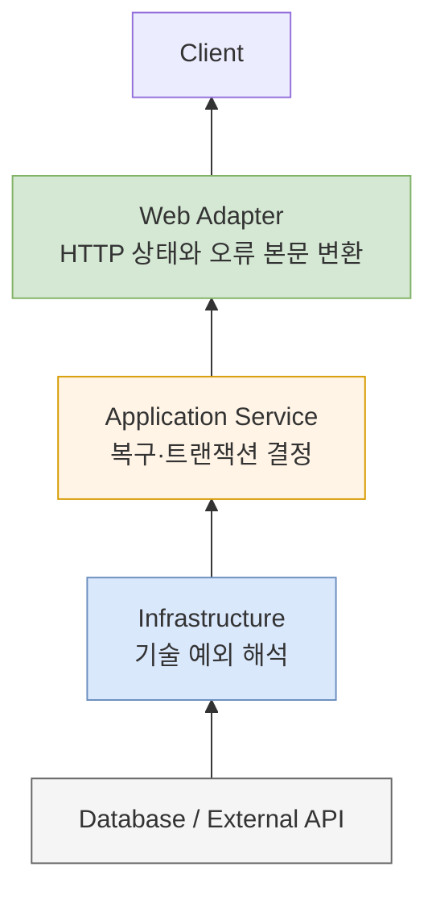

예외 처리는 `try-catch`를 많이 쓰는 기술이 아니다. **어느 계층이 실패의 의미를 알고 있으며, 어디에서 복구하거나 외부 응답으로 변환할 것인지 결정하는 설계**다.

## 예외를 세 종류로 나누기

| 종류 | 예시 | 일반적인 처리 |
|---|---|---|
| 비즈니스 예외 | 재고 부족, 이미 취소된 주문 | 명확한 오류 코드로 변환 |
| 기술 예외 | DB 연결 실패, 타임아웃 | 제한적 재시도 또는 전체 실패 |
| 프로그래밍 오류 | null 접근, 잘못된 상태 | 빠르게 실패하고 원인 수정 |

모든 예외를 하나의 `BusinessException`으로 감싸면 원래 원인과 대응 정책이 사라진다. 반대로 JDBC나 HTTP 클라이언트 예외를 컨트롤러까지 그대로 노출하면 외부 API가 내부 구현에 종속된다.

## 계층별 책임

아래 다이어그램은 하위 계층의 기술 예외가 외부 응답으로 변환되는 경계를 보여준다.



- 저장소와 외부 연동 계층은 라이브러리 예외를 애플리케이션이 이해할 수 있는 실패로 변환한다.
- 애플리케이션 서비스는 트랜잭션 롤백, 대체 경로, 재시도 가능 여부를 결정한다.
- 웹 계층은 예외를 HTTP 상태와 안정적인 오류 코드로 바꾼다.

## 오류 응답 설계

클라이언트가 메시지 문자열을 파싱하지 않도록 기계가 읽을 수 있는 코드를 제공한다.

```json
{
  "code": "ORDER_OUT_OF_STOCK",
  "message": "주문 가능한 재고가 부족합니다.",
  "traceId": "4f2f6d...",
  "details": {
    "productId": 42
  }
}
```

`message`는 사용자 또는 개발자가 읽는 설명이고, `code`는 클라이언트 분기와 문서화에 사용하는 안정적인 계약이다. 내부 SQL, 서버 경로, 스택 트레이스는 응답에 포함하지 않는다.

## Spring에서의 전역 변환

```java
@RestControllerAdvice
class ApiExceptionHandler {

    @ExceptionHandler(OutOfStockException.class)
    ResponseEntity<ApiError> handle(OutOfStockException e) {
        return ResponseEntity.status(HttpStatus.CONFLICT)
            .body(ApiError.of("ORDER_OUT_OF_STOCK", e.getMessage()));
    }

    @ExceptionHandler(Exception.class)
    ResponseEntity<ApiError> handleUnexpected(Exception e) {
        log.error("unexpected error", e);
        return ResponseEntity.status(HttpStatus.INTERNAL_SERVER_ERROR)
            .body(ApiError.of("INTERNAL_ERROR", "요청 처리 중 오류가 발생했습니다."));
    }
}
```

예상 가능한 예외는 필요한 문맥만 남기고, 예상하지 못한 예외는 스택 트레이스와 추적 ID를 포함해 서버 로그에 기록한다.

## 재시도 기준

재시도는 예외를 숨기는 기능이 아니다. 다음 조건을 모두 검토해야 한다.

- 일시적인 실패인가?
- 같은 요청을 다시 실행해도 안전한가?
- 최대 횟수와 전체 시간 제한이 있는가?
- 지수 백오프와 jitter를 적용했는가?
- 최종 실패가 메트릭과 알림에 남는가?

입력값 오류나 재고 부족은 재시도해도 결과가 바뀌지 않는다. 네트워크 타임아웃은 재시도할 수 있지만, 이전 요청이 실제로 성공했을 가능성이 있으므로 멱등성 키가 필요할 수 있다.

## 체크리스트

- 예외 이름만 보고 실패 의미와 복구 가능성을 알 수 있는가?
- 하위 라이브러리 예외가 외부 API 계약으로 새지 않는가?
- 오류 코드와 HTTP 상태의 매핑이 문서화됐는가?
- 로그에 요청 식별자와 원인이 남는가?
- 같은 예외를 여러 계층에서 중복 로깅하지 않는가?
- 재시도와 트랜잭션 경계가 충돌하지 않는가?
