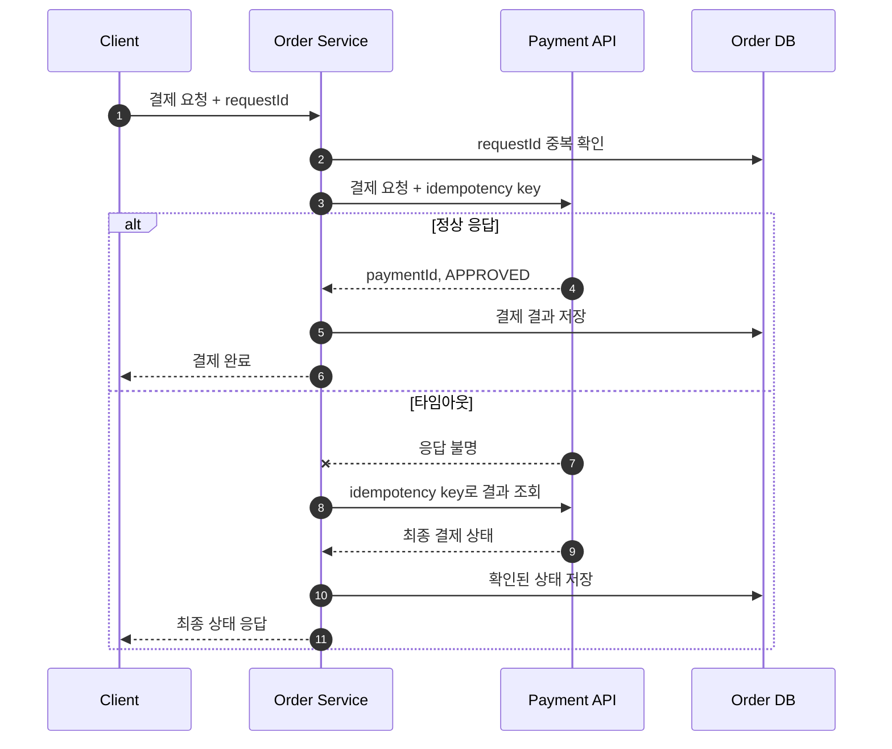

외부 API 연동은 정상 응답을 파싱하는 코드보다 **느림, 중복, 부분 성공, 계약 변경을 다루는 코드**가 더 중요하다. 외부 시스템은 우리 트랜잭션과 생명주기를 공유하지 않으므로 실패를 기본 상태로 보고 설계한다.

## 기본 호출 흐름

아래 시퀀스는 결제 요청에 타임아웃과 멱등성 키를 적용한 흐름을 보여준다.



타임아웃은 실패가 확정됐다는 뜻이 아니다. 상대 서버가 요청을 처리했지만 응답만 유실됐을 수 있다. 생성·결제 같은 변경 요청에는 멱등성 키와 결과 조회 API가 필요하다.

## 반드시 명시할 설정

| 항목 | 목적 |
|---|---|
| 연결 타임아웃 | 서버와 연결되지 않을 때 대기 제한 |
| 읽기 타임아웃 | 연결 후 응답이 늦을 때 대기 제한 |
| 전체 요청 기한 | 재시도를 포함한 총 처리 시간 제한 |
| 최대 응답 크기 | 비정상적으로 큰 응답으로부터 보호 |
| 재시도 횟수 | 일시 장애 복구와 부하 증폭 사이의 제한 |
| 동시 호출 수 | 외부 장애가 내부 스레드와 커넥션을 고갈시키는 상황 방지 |

기본값에 의존하면 특정 장애에서 요청이 수분간 쌓일 수 있다. 호출 목적과 상위 API의 응답 시간 목표를 기준으로 값을 정한다.

## 재시도해도 되는 요청

일반적으로 조회 요청은 재시도하기 쉽다. 변경 요청은 멱등성이 보장될 때만 재시도해야 한다.

- DNS 오류, 연결 거부, 일부 `5xx`, `429`는 제한적으로 재시도할 수 있다.
- 인증 실패, 입력값 오류 같은 `4xx`는 대개 재시도하지 않는다.
- `Retry-After`가 있으면 서버가 안내한 시간을 존중한다.
- 고정 간격보다 지수 백오프와 jitter를 사용한다.
- 호출 폭증을 막기 위해 최대 횟수와 전체 기한을 함께 둔다.

## 내부 모델과 외부 DTO 분리

외부 API 응답을 도메인 객체로 직접 사용하면 필드명 변경이나 nullable 정책이 내부 전체로 전파된다.

```java
record VendorPaymentResponse(
    String transaction_id,
    String result_code
) {}

PaymentResult toDomain(VendorPaymentResponse response) {
    return new PaymentResult(
        response.transaction_id(),
        mapStatus(response.result_code())
    );
}
```

연동 어댑터에서 외부 DTO를 검증하고 내부 모델로 변환한다. 알 수 없는 enum 값과 필드 누락도 이 경계에서 명시적으로 처리한다.

## 장애 격리

- Circuit Breaker로 실패 중인 시스템에 계속 요청하지 않는다.
- Bulkhead로 연동별 스레드, 커넥션, 동시 요청 수를 분리한다.
- 꼭 필요하지 않은 연동은 비동기 이벤트나 큐로 분리한다.
- 대체 데이터가 허용되면 캐시 또는 제한된 fallback을 사용한다.
- 결제처럼 정확성이 중요한 기능은 임의의 성공 fallback을 만들지 않는다.

## 관찰 가능성

연동별로 최소한 다음 지표를 남긴다.

- 요청 수, 성공률, 상태 코드
- 평균과 p95/p99 응답 시간
- 타임아웃과 재시도 횟수
- Circuit Breaker 상태
- 외부 요청 ID와 내부 trace ID

요청·응답 전문 로깅은 개인정보와 토큰을 노출할 수 있다. 필드를 allowlist 방식으로 선택하고 민감값을 마스킹한다.

## 배포 전 체크리스트

- Sandbox와 운영 URL, 자격 증명이 분리됐는가?
- API 버전과 변경 공지를 확인할 담당자가 있는가?
- 타임아웃과 동시 호출 제한이 코드 또는 설정에 명시됐는가?
- 중복 요청과 응답 유실 시나리오를 테스트했는가?
- 장애 시 내부 API가 함께 고갈되지 않는가?
- 장애 복구 후 미확정 요청을 대사할 수 있는가?
