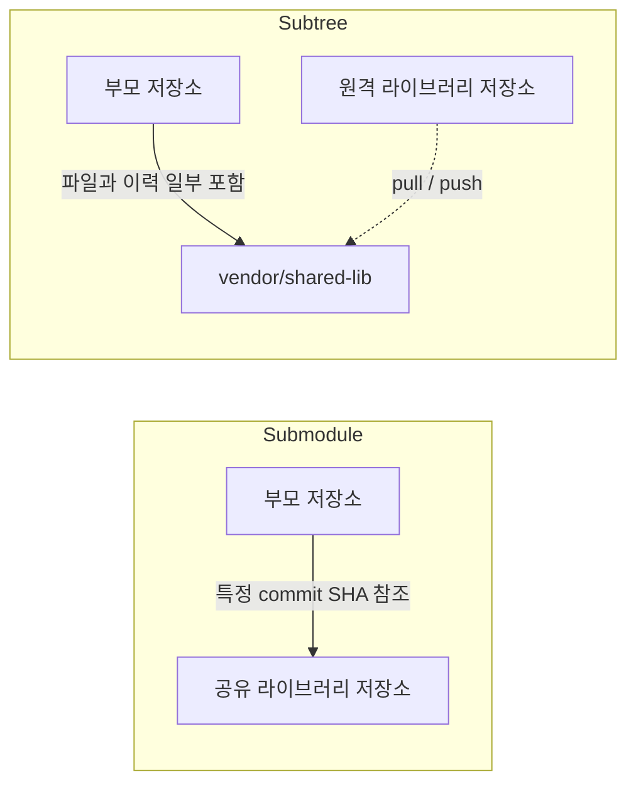

두 기능 모두 한 프로젝트에서 다른 Git 저장소의 코드를 사용하기 위한 방법이다. 차이는 **부모 저장소가 외부 저장소를 포인터로 참조하는지, 실제 파일과 커밋을 내부에 포함하는지**에 있다.

## 구조 차이

아래 다이어그램은 부모 저장소가 공유 라이브러리를 포함하는 방식을 비교한다.



## 비교

| 관점 | Submodule | Subtree |
|---|---|---|
| 부모 저장소에 저장되는 것 | 하위 저장소의 commit 포인터 | 실제 파일과 병합 이력 |
| clone 후 추가 작업 | `git submodule update` 필요 | 바로 사용 가능 |
| 저장소 경계 | 명확함 | 부모 저장소 안에 통합됨 |
| 권한 | 사용자가 두 저장소 모두 접근해야 함 | 부모 저장소 접근만으로 파일 확인 가능 |
| 업데이트 | 포인터 변경 | subtree pull로 커밋 병합 |
| 실수 가능성 | 초기화 누락, detached HEAD | 긴 이력, 복잡한 split/push |

## Submodule 사용법

```bash
git submodule add https://example.com/shared-lib.git vendor/shared-lib
git commit -m "Add shared-lib submodule"
```

저장소를 받을 때는 다음 중 하나를 사용한다.

```bash
git clone --recurse-submodules https://example.com/app.git
```

이미 clone했다면 초기화한다.

```bash
git submodule update --init --recursive
```

하위 저장소를 갱신한 뒤 부모 저장소에서 변경된 포인터를 커밋해야 한다.

```bash
cd vendor/shared-lib
git switch main
git pull
cd ../..
git add vendor/shared-lib
git commit -m "Update shared-lib revision"
```

Submodule은 하위 디렉터리에서 작업할 때 detached HEAD 상태가 되기 쉽다. 수정 사항을 올릴 계획이라면 먼저 브랜치를 명시적으로 checkout한다.

## Subtree 사용법

```bash
git subtree add \
  --prefix=vendor/shared-lib \
  https://example.com/shared-lib.git main \
  --squash
```

업데이트는 같은 prefix와 원격 브랜치를 지정한다.

```bash
git subtree pull \
  --prefix=vendor/shared-lib \
  https://example.com/shared-lib.git main \
  --squash
```

`--squash`는 외부 저장소의 여러 커밋을 부모 저장소의 하나의 병합 커밋으로 줄인다. 이력을 자세히 보존해야 한다면 생략할 수 있지만 부모 저장소 이력이 크게 늘어난다.

## 무엇을 선택할까

Submodule이 적합한 경우:

- 외부 저장소의 독립적인 버전과 권한을 유지해야 한다.
- 부모 저장소가 정확한 하위 저장소 commit을 고정해야 한다.
- 팀이 clone, checkout, CI에서 submodule 초기화 절차를 관리할 수 있다.

Subtree가 적합한 경우:

- clone 직후 추가 명령 없이 빌드돼야 한다.
- 소비자가 외부 저장소 권한이나 Git 구조를 알 필요가 없어야 한다.
- 외부 코드 변경 빈도가 높지 않고 주기적으로 가져오는 방식이면 충분하다.

공유 코드가 자주 배포되고 여러 서비스가 소비한다면 두 방식보다 패키지 저장소에 버전된 라이브러리로 배포하는 편이 운영상 단순할 수 있다.
