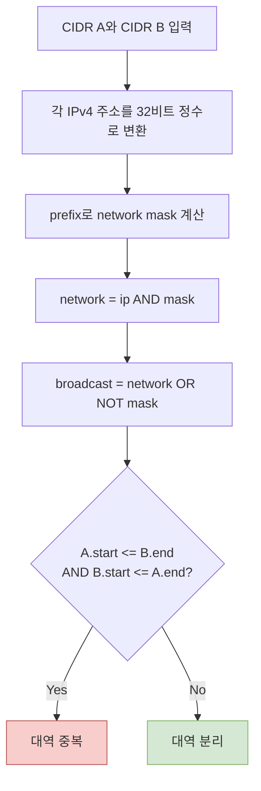

VPC, VPN, Docker 네트워크를 연결할 때 CIDR 대역이 겹치면 라우팅 대상이 모호해진다. 문자열 앞부분만 비교하지 말고 각 네트워크의 **시작 주소와 끝 주소를 숫자로 계산**해야 한다.

## CIDR 읽기

`10.20.16.0/20`에서 `/20`은 앞의 20비트가 네트워크 영역이라는 뜻이다.

- 서브넷 마스크: `255.255.240.0`
- 주소 수: `2^(32 - 20) = 4096`
- 네트워크 시작: `10.20.16.0`
- 네트워크 끝: `10.20.31.255`

따라서 `10.20.24.0/24`는 이 범위 안에 포함되지만 `10.20.32.0/24`는 겹치지 않는다.

## 중복 판정 공식

두 범위를 `[A_start, A_end]`, `[B_start, B_end]`라고 하면 다음 조건일 때 겹친다.

```text
A_start <= B_end && B_start <= A_end
```

아래 다이어그램은 CIDR 두 개를 범위로 변환해 판정하는 흐름을 보여준다.



## Java 구현 예시

```java
record IpRange(long start, long end) {
    boolean overlaps(IpRange other) {
        return start <= other.end && other.start <= end;
    }
}

static IpRange parseCidr(String cidr) {
    String[] parts = cidr.split("/");
    long ip = ipv4ToLong(parts[0]);
    int prefix = Integer.parseInt(parts[1]);

    if (prefix < 0 || prefix > 32) {
        throw new IllegalArgumentException("invalid prefix: " + prefix);
    }

    long mask = prefix == 0
        ? 0
        : (0xFFFF_FFFFL << (32 - prefix)) & 0xFFFF_FFFFL;

    long network = ip & mask;
    long broadcast = network | (~mask & 0xFFFF_FFFFL);
    return new IpRange(network, broadcast);
}

static long ipv4ToLong(String address) {
    String[] octets = address.split("\\.");
    if (octets.length != 4) {
        throw new IllegalArgumentException("invalid IPv4 address");
    }

    long result = 0;
    for (String octet : octets) {
        int value = Integer.parseInt(octet);
        if (value < 0 || value > 255) {
            throw new IllegalArgumentException("invalid IPv4 octet");
        }
        result = (result << 8) | value;
    }
    return result;
}
```

## 예시

| CIDR A | CIDR B | 결과 | 이유 |
|---|---|---|---|
| `10.20.16.0/20` | `10.20.24.0/24` | 중복 | B가 A에 포함됨 |
| `10.20.16.0/20` | `10.20.32.0/24` | 분리 | A는 `10.20.31.255`에서 끝남 |
| `192.168.0.0/16` | `192.168.10.0/24` | 중복 | 더 작은 대역이 큰 대역에 포함됨 |
| `0.0.0.0/0` | 모든 IPv4 CIDR | 중복 | 전체 IPv4 범위를 의미함 |

## 실무에서 함께 확인할 것

- 클라우드 VPC와 온프레미스 사설망
- Kubernetes Pod CIDR와 Service CIDR
- Docker bridge 네트워크
- 회사 VPN이 로컬 네트워크에 배정하는 대역
- 피어링하거나 Transit Gateway에 연결할 모든 네트워크

IPv6도 원리는 같지만 주소가 128비트이므로 `long` 하나로 처리할 수 없다. 표준 IP 주소 라이브러리나 128비트 정수를 지원하는 타입을 사용하는 편이 안전하다.
