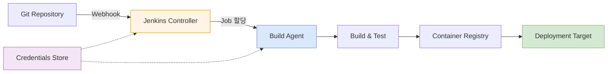

Jenkins는 빌드 명령을 실행하는 도구이면서, 실제 운영에서는 실행 이력·권한·자격 증명·Agent를 관리하는 CI/CD 시스템이다. 파이프라인 작성보다 먼저 **Controller가 빌드를 직접 수행하지 않도록 역할을 분리**하는 것이 중요하다.

## 기본 구조

아래 다이어그램은 코드 변경이 배포 결과로 이어지는 구성요소를 보여준다.



- Controller는 Job 예약, UI, 설정과 실행 이력을 관리한다.
- Agent는 checkout, 컴파일, 테스트, 이미지 빌드 같은 작업을 수행한다.
- Agent는 프로젝트 또는 신뢰 수준에 따라 라벨과 권한을 분리한다.

## Jenkinsfile 예시

파이프라인을 UI에만 저장하면 변경 이력과 코드 리뷰가 어렵다. 저장소의 `Jenkinsfile`로 관리한다.

```groovy
pipeline {
    agent { label 'java17' }

    options {
        timeout(time: 20, unit: 'MINUTES')
        disableConcurrentBuilds()
    }

    stages {
        stage('Checkout') {
            steps { checkout scm }
        }
        stage('Test') {
            steps { sh './gradlew test' }
        }
        stage('Build Image') {
            steps { sh 'docker build -t app:${BUILD_NUMBER} .' }
        }
        stage('Deploy') {
            when { branch 'main' }
            steps {
                input message: '운영 환경에 배포할까요?'
                sh './scripts/deploy.sh'
            }
        }
    }

    post {
        always {
            junit 'build/test-results/test/*.xml'
            archiveArtifacts artifacts: 'build/libs/*.jar', fingerprint: true
            deleteDir()
        }
    }
}
```

## 자격 증명 관리

- 토큰과 비밀번호를 Jenkinsfile에 직접 넣지 않는다.
- Credentials Binding을 사용하고 필요한 stage에만 주입한다.
- 콘솔 출력에 비밀값이 포함될 수 있는 `set -x` 사용을 피한다.
- Agent가 다른 Job의 작업 공간과 환경 변수에 접근하지 못하게 격리한다.
- 장기 고정 키보다 짧은 수명의 클라우드 역할이나 토큰을 선호한다.

## 안정적인 파이프라인 원칙

1. 같은 commit을 다시 빌드하면 같은 결과물이 나오게 한다.
2. 빌드한 결과물을 환경별로 다시 만들지 않고 승격한다.
3. 각 stage에 timeout을 둔다.
4. 테스트 보고서와 배포 대상 버전을 보존한다.
5. 동시 배포가 위험한 Job은 잠금 또는 동시 실행 제한을 둔다.
6. 배포 후 health check와 자동 또는 수동 rollback 절차를 둔다.

## 업데이트 절차

Jenkins core와 plugin은 서로 호환성 제약이 있다. 운영 환경에서는 바로 업데이트하지 않는다.

1. Jenkins home과 설정, credentials 관련 데이터를 백업한다.
2. 현재 core와 plugin 목록 및 버전을 기록한다.
3. LTS release note와 plugin 호환성을 확인한다.
4. 복제한 테스트 환경에서 core와 plugin을 업데이트한다.
5. 주요 Job, Agent 연결, 자격 증명, webhook을 검증한다.
6. 운영 업데이트 중지 기준과 rollback 절차를 정한다.
7. 업데이트 후 queue, 실패율, Agent 상태를 관찰한다.

특히 plugin을 무분별하게 늘리면 보안 패치와 호환성 검증 범위가 커진다. Pipeline 기본 기능이나 외부 스크립트로 단순하게 해결할 수 있는지 먼저 검토한다.

## 운영 체크리스트

- Controller에서 일반 빌드를 실행하지 않는가?
- Job과 폴더 권한이 최소 권한으로 나뉘었는가?
- Jenkinsfile 변경도 코드 리뷰를 거치는가?
- 오래 대기하는 queue와 고장 난 Agent를 감지하는가?
- 백업에서 실제 복구하는 훈련을 했는가?
- 배포한 commit, 이미지 digest, 실행자를 추적할 수 있는가?
