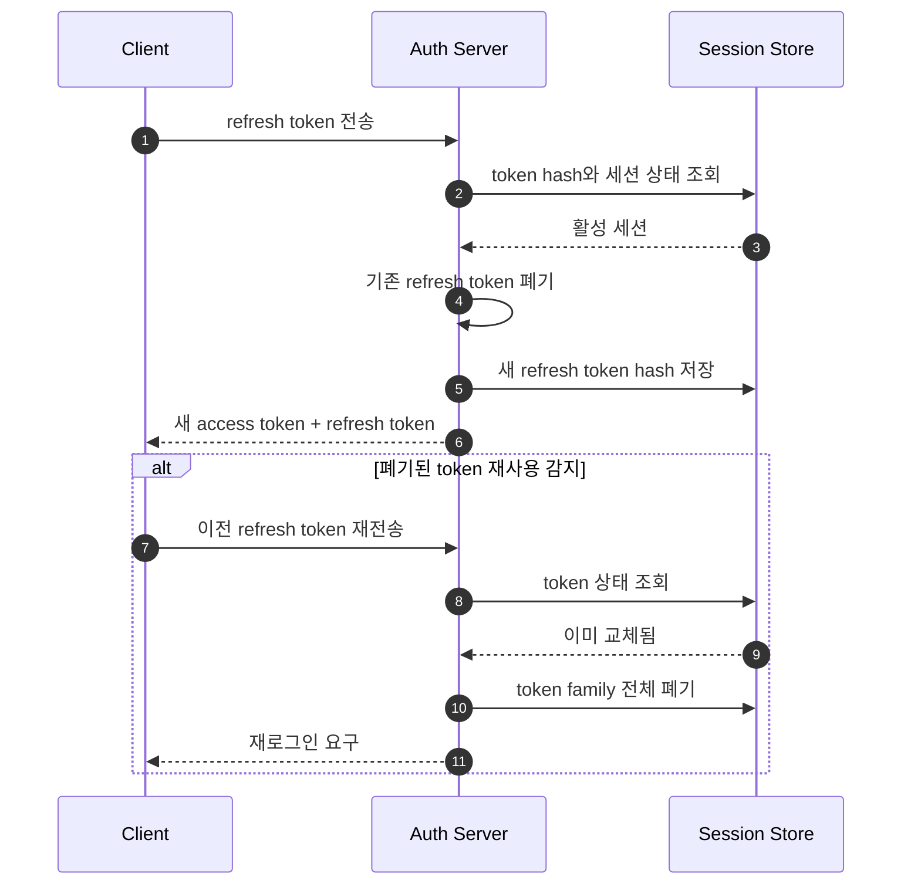

토큰은 인증 결과와 권한을 요청 사이에 전달하는 수단이다. JWT 자체가 로그인 시스템을 완성해 주는 것은 아니며, 탈취·만료·폐기·재발급 정책까지 포함해야 한다.

## 역할 분리

| 항목 | Access Token | Refresh Token |
|---|---|---|
| 목적 | API 접근 | 새 access token 발급 |
| 수명 | 짧게 | 상대적으로 길게 |
| 사용 빈도 | 대부분의 API 요청 | access token 만료 시 |
| 노출 범위 | Resource Server까지 전달 | 인증 서버에만 전달 |
| 서버 저장 | 선택 사항 | 세션 단위 저장 권장 |

Access token의 수명을 짧게 잡으면 탈취 피해 시간을 줄일 수 있다. Refresh token은 더 강하게 보호하고, 서버에서 세션별 상태를 관리해 폐기할 수 있게 한다.

## 재발급 흐름

아래 시퀀스는 refresh token rotation을 적용한 재발급 과정을 보여준다.

Rotation은 재발급할 때마다 새 refresh token을 만들고 이전 값을 폐기한다. 폐기된 값이 다시 들어오면 탈취 가능성이 있으므로 같은 로그인 세션 계열을 모두 종료할 수 있다.

## JWT에 넣을 정보

일반적인 claim은 다음과 같다.

- `sub`: 사용자 또는 주체 식별자
- `iss`: 발급자
- `aud`: 토큰을 사용할 대상
- `exp`: 만료 시각
- `iat`: 발급 시각
- `jti`: 토큰 고유 식별자
- 제한된 권한 또는 scope

비밀번호, 주민번호, 내부 비밀값은 넣지 않는다. JWT payload는 암호화된 것이 아니라 일반적으로 인코딩된 값이므로 누구나 읽을 수 있다.

검증 시에는 서명뿐 아니라 `iss`, `aud`, `exp`, 허용 알고리즘을 확인한다. 헤더의 알고리즘 값을 그대로 신뢰하지 않고 서버에서 허용 목록을 고정한다.

## 브라우저 저장 위치

- `HttpOnly`, `Secure`, 적절한 `SameSite`가 적용된 쿠키는 JavaScript 접근을 막아 토큰 탈취 위험을 줄인다.
- 쿠키를 인증에 사용하면 CSRF 방어가 필요하다.
- `localStorage`는 JavaScript에서 접근 가능하므로 XSS 발생 시 토큰이 노출될 수 있다.
- 메모리 저장은 새로고침 시 상태 복원 전략이 필요하지만 장기 저장 노출을 줄일 수 있다.

저장 위치 하나만으로 보안이 완성되지는 않는다. CSP, 입력값 처리, CSRF 토큰, CORS, 쿠키 속성을 함께 설계한다.

## 로그아웃과 권한 변경

서명된 access token은 만료 전까지 자체적으로 유효할 수 있다. 즉시 폐기가 필요한 시스템은 다음 방법을 조합한다.

- access token 수명을 짧게 유지한다.
- refresh token 세션을 서버에서 폐기한다.
- 중요 권한은 요청 시 서버 상태를 다시 확인한다.
- 높은 위험의 경우 `jti` denylist 또는 사용자 token version을 사용한다.

모든 access token을 서버 저장소에서 조회하면 즉시 폐기는 쉬워지지만 JWT의 독립 검증 장점은 줄어든다. 보안 요구와 트래픽 비용을 기준으로 선택한다.

## 체크리스트

- Access token과 refresh token의 수명과 용도가 분리됐는가?
- Refresh token 원문 대신 해시를 저장하는가?
- Rotation과 재사용 탐지가 있는가?
- 서명 키 교체와 `kid` 운용 절차가 있는가?
- 로그와 URL에 토큰이 남지 않는가?
- 사용자 로그아웃, 비밀번호 변경, 계정 차단 시 세션을 폐기할 수 있는가?
