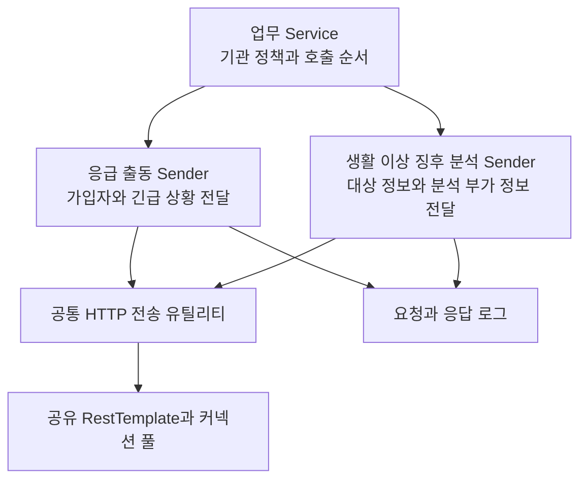

기관형 돌봄 서비스는 같은 이용자 정보를 여러 목적으로 외부에 보낸다. 응급 출동사에는 가입자와 긴급 상황을 전달하고, 생활 이상 징후 분석 시스템에는 돌봄 대상 정보와 분석에 필요한 부가 정보를 전달한다. 호출 대상과 성공 조건이 다른데도 업무 Service가 요청 조립과 HTTP 전송까지 맡으면 기관 정책을 바꾸는 수정과 외부 계약을 바꾸는 수정이 한곳에 모인다.

내가 참여한 개선은 이 두 호출의 변경 지점을 분리하는 작업이었다. 응급 출동 연동용 Sender를 만들고 업무 호출부에 적용했으며, 생활 이상 징후 분석 요청과 응답의 로그 저장을 공통 호출 경로로 옮겼다. 과거 이력서의 “공통 Sender와 RestTemplate으로 통합하고 로그와 예외 규격을 표준화”라는 표현보다 이 설명이 실제 범위에 가깝다. 하나의 Sender로 합치거나 모든 예외를 같은 결과로 만든 작업은 아니었다.

## 근거와 담당 범위를 어떻게 구분했나

비공개 B2G 저장소의 지정 이력과 종료점 코드를 확인했다. 당시 환경은 Java 8, Spring Boot 1.5.12, Spring Framework 4.3.16, Apache HttpClient 4.5.5였다. B2C의 Spring Boot 2.7 동작을 이 코드에 소급하지 않았다.

응급 출동 Sender 생성과 적용, 생활 이상 징후 분석 호출의 로그 경로 이동은 author가 확인되는 직접 변경이다. 반면 분석 Sender의 최초 생성, 공통 HTTP 유틸리티 생성과 후속 로그 보완은 팀 변경이다. 커넥션 풀 Bean도 이 작업 전부터 있었다. 이 구분 때문에 “커넥션 풀을 도입했다”거나 “두 연동 전체를 혼자 설계했다”고 설명하지 않는다.

## Service와 Sender의 변경 이유가 달랐다

기존 발신 코드는 업무 Service, 발신 보조 클래스와 HTTP 유틸리티에 걸쳐 있었다. 다음은 실제 데이터와 인증 정보를 제거하고 책임 관계만 남긴 의사 코드다.

```java
void updateCareRecipient() {
    updateLocalState();
    Map<String, Object> request = createExternalRequest();
    sender.send(request);
}
```

`updateLocalState`와 외부 호출의 순서는 업무 정책이다. 어느 기관과 상품이 호출 대상인지, 일부 단계가 실패했을 때 다음 단계를 계속할지도 업무 결정이다. 반면 필드 이름, 인증 방식, 암호화 규약과 응답 코드 해석은 외부 계약에 가깝다. Sender를 둔 목적은 모든 코드를 공통화하는 것이 아니라 서로 다른 변경 이유를 찾을 위치를 만드는 것이었다.

종료점의 책임 관계는 다음과 같았다.



> 화살표는 호출 관계다. 외부 호출과 로컬 DB가 하나의 원자적 트랜잭션이라는 뜻은 아니다.

## 같은 HTTP 200도 같은 업무 성공이 아니었다

응급 출동 연동은 주로 HTTP 상태를 성공 판단에 사용했고, 생활 이상 징후 분석 연동은 응답 본문의 업무 코드를 추가로 해석했다. 일부 호출자는 boolean 결과를 검사했지만 다른 호출 경로는 결과를 사용하지 않았고, 일부 public 메서드는 반환값이 없었다. 분석 Sender 안에는 부가 정보 DB 갱신도 남아 있었다.

따라서 당시 구조를 순수 HTTP 어댑터나 통일된 실패 계약으로 설명할 수 없다. HTTP 200은 HTTP 계층의 성공 응답이며 가입이나 정보 반영 같은 공급자 업무의 승인 여부는 별도로 해석해야 한다. 외부 반영 뒤 로컬 DB 저장이 실패하면 DB rollback으로 원격 변경을 되돌릴 수도 없다.

회고용 Java 8 데모는 이 차이를 같은 합성 응답으로 비교한다. 클래스 이름은 원본의 업무명을 공개하지 않기 위해 별칭을 사용했지만, 한 클라이언트는 HTTP 상태만 보고 다른 클라이언트는 본문의 업무 결과까지 읽는 구조를 보존했다.

```java
boolean transportOnly = "200".equals(result.get("statusCode"));

boolean transportAndBusiness = "200".equals(result.get("statusCode"))
        && "SUCCESS".equals(body.path("resultCode").asText());
```

스텁이 HTTP 200과 업무 거절을 함께 반환하면 첫 식은 `true`, 두 번째 식은 `false`다. 실제 응급 출동사가 같은 본문 필드를 쓴다는 의미가 아니라 성공 판정 전략의 차이를 드러내기 위한 실험이다.

## 무엇을 공통화하고 무엇을 남겨야 하나

| 변경되는 요구 | 우선 검토할 위치 | 이유 |
|---|---|---|
| 특정 기관이나 상품의 호출 여부 | 업무 Service 또는 정책 객체 | 호출 필요성은 업무 의미다 |
| 외부 요청 필드와 인증 규약 | 연동별 Sender | 공급자 계약 변화다 |
| HTTP 연결과 읽기 제한 시간 | HTTP client 구성 | 통신 자원과 대기 정책이다 |
| 원격 성공 뒤 로컬 저장 실패 | 업무 상태와 보상 처리 | 이미 생긴 외부 부작용을 조정해야 한다 |
| 민감 정보 마스킹과 호출 추적 | 공통 관찰 경로와 Sender | 공통 추적 정보와 연동별 민감 필드를 함께 봐야 한다 |

공통 HTTP 유틸리티가 모든 업무 코드를 해석하면 연동처가 늘 때마다 공급자별 분기가 쌓인다. 전송의 반복은 공유하되 서로 다른 성공 계약은 각 Sender에 남기는 편이 변경 이유에 맞다.

## 실패 시나리오로 경계를 검증하기

Sender 단위 테스트만 mock으로 작성하면 실제 HTTP 오류와 timeout이 어떤 예외로 돌아오는지 놓칠 수 있다. 반대로 HTTP 유틸리티만 검사하면 200 본문의 업무 거절을 놓친다. 데모는 로컬 HTTP 서버를 띄워 Sender와 공통 유틸리티를 함께 통과시키며 다음 세 가지를 확인했다.

- HTTP 500을 결과로 바꾸는가, 예외로 전파하는가
- 응답 지연 뒤 호출자는 실패와 결과 불명을 구분할 수 있는가
- HTTP 200인 업무 거절을 성공으로 오인하지 않는가

로그 저장 실패가 원래 호출 결과를 덮어쓰는지는 별도의 실패 주입 테스트가 필요한 후속 검증 항목이다.

당시 운영 구현이 이 항목을 모두 해결했다는 뜻은 아니다. 데모도 응급 출동 Sender의 바깥 catch와 분석 Sender의 DB 갱신 전체를 복제하지 않았다. 검증 결과는 회고 시점의 학습이고 직접 구현 범위와 분리해 설명한다.

## 다시 설계한다면 결과 계약부터 고정한다

boolean 하나로는 “호출 대상 아님”, “상대의 업무 거절”, “timeout으로 결과를 모름”을 구분하기 어렵다. 먼저 전송 단계, HTTP 상태, 업무 결과와 추적 식별자를 담은 명시적 결과를 정의하겠다. 그다음 호출자가 상태별로 재시도, 조회, 보상 중 무엇을 할지 정하고 계약 테스트로 고정하겠다. 이는 당시 구현 사실이 아니라 회고를 통해 정리한 개선안이다.

면접에서는 다음처럼 범위를 설명할 수 있다.

> 기관형 돌봄 서비스에서 응급 출동사와 생활 이상 징후 분석 시스템의 외부 호출 경계를 정리했습니다. 응급 출동 Sender를 만들고 호출부에 적용했으며, 이상 징후 분석 요청과 응답 로그를 공통 호출 경로로 옮겼습니다. 전송 코드는 공유하되 서로 다른 업무 성공 판정은 연동별 경계에 남겼습니다. 다만 모든 예외와 트랜잭션 문제를 해결한 것으로 넓히지 않고, 회고 데모에서 HTTP 성공과 업무 성공, timeout의 결과 불명을 따로 검증했습니다.

확인할 수 있는 운영 성능이나 장애율 개선 수치는 없다. 확인된 성과는 공급자 계약과 업무 호출 순서를 수정할 위치가 분명해졌다는 구조적 변화다.

## 재현 가능한 공개 근거

아래 공개 자료는 이 글을 보강하기 전 기준 커밋에 고정했다. 데모 클래스의 별칭은 익명화를 위한 이름이다.

| 자료 | 확인할 내용 |
|---|---|
| [HTTP 상태 판정 데모](https://github.com/inchangson/inchangson.github.io/blob/3a4919b7d5f361dfe71d1a8358ba80b8252d9b3a/lab/b2g-resttemplate-lab/src/main/java/com/example/b2glab/legacy/LegacyPartnerASender.java) | HTTP 상태 기반 판정 |
| [업무 결과 판정 데모](https://github.com/inchangson/inchangson.github.io/blob/3a4919b7d5f361dfe71d1a8358ba80b8252d9b3a/lab/b2g-resttemplate-lab/src/main/java/com/example/b2glab/legacy/LegacyPartnerBSender.java) | 본문 업무 결과의 추가 해석 |
| [동작 비교 테스트](https://github.com/inchangson/inchangson.github.io/blob/3a4919b7d5f361dfe71d1a8358ba80b8252d9b3a/lab/b2g-resttemplate-lab/src/test/java/com/example/b2glab/LegacyBehaviorTest.java) | HTTP 성공과 업무 거절 비교 |
| [변경 이력](https://github.com/inchangson/inchangson.github.io/blob/3a4919b7d5f361dfe71d1a8358ba80b8252d9b3a/docs/b2g-resttemplate-retrospective/history.md) | 직접 구현과 팀 변경 구분 |
| [원본과 데모 대응표](https://github.com/inchangson/inchangson.github.io/blob/3a4919b7d5f361dfe71d1a8358ba80b8252d9b3a/docs/b2g-resttemplate-retrospective/source-map.md) | 복제한 흐름과 생략한 경계 |

[다음: 새 RestTemplate이면 timeout도 독립적인가](/blog/b2g-external-api-02-shared-factory)

## 참고

- [Spring Boot 1.5.12 의존성 표](https://docs.spring.io/spring-boot/docs/1.5.12.RELEASE/reference/html/appendix-dependency-versions.html)
