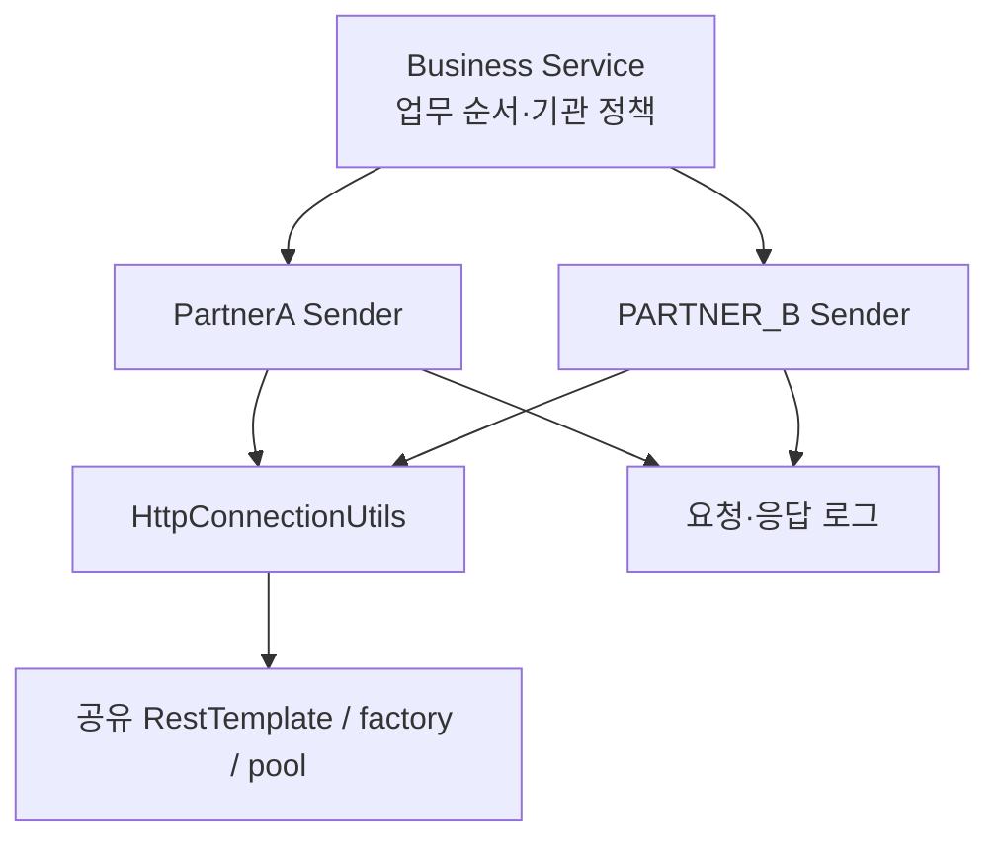

기관형 돌봄 서비스에서는 시니어 정보 변경과 응급 이벤트를 외부 시스템으로 전달한다. 이때 업무 로직은 “이 기관이 연동 대상인가, 언제 호출해야 하는가”를 결정하고, 발신 코드는 “어떤 규약으로 요청하고 결과를 어떻게 읽는가”를 처리한다. 내가 참여했던 개선은 이 두 책임을 찾기 쉬운 위치로 옮기는 작업이었다.

이력서에는 “공통 Sender와 RestTemplate으로 통합하고 로그·예외 규격을 표준화”했다고 썼다. 과거 코드를 다시 보니 더 정확한 표현은 **연동처별 Sender 분리와 공통 HTTP 전송·로그 경로 정리**였다. 하나의 Sender로 합친 것도, 모든 예외를 같은 결과로 만든 것도 아니었다.

## 어떤 코드를 근거로 삼았나

legacy-service의 비공개 분석 구간와 종료점 blob을 조사했다. 시작 SHA가 종료 SHA의 조상은 아니므로 이 범위는 Git의 도달 가능성 차집합이다. 당시 빌드 기준은 Java 8, Boot 1.5.12, Spring 4.3.16, HttpClient 4.5.5다. B2C의 Boot 2.7 동작을 소급하지 않았다.

상세 이력 (`docs/b2g-resttemplate-retrospective/history.md`)에 핵심 파일을 변경한 비병합 커밋 25개를 남겼다. 이 수는 개인 커밋 수나 C1 전체 변경 수가 아니다. 내 author와 정확히 일치하는 변경만 직접 구현으로 분류했다.

## As-Is: 규약 변경을 어디서 고쳐야 했는가

기존 발신 코드는 업무 Service, PushSender, HTTP utility에 걸쳐 있었다. 다음 코드는 책임 관계만 보존한 의사 코드다. 실제 payload와 업무·인증 데이터는 생략했다.

```java
void changeSenior() {
    updateLocalState();
    Map<String, Object> payload = createPartnerPayload();
    pushSender.sendPartner(payload);
}
```

파라미터를 만드는 책임과 발신 시점이 붙어 있으면, 공급자 규약을 바꿀 때 업무 분기까지 읽어야 한다. 다만 메서드를 다른 클래스로 옮기는 것만으로 결과 확인이나 부분 성공 문제가 해결되지는 않는다.

## 변경은 한 번에 끝나지 않았다

내 변경은 PartnerA Sender 생성, 필수값·호출 시점 보완, 공통 함수 적용, 대상 검사로 이어졌다. PARTNER_B의 요청·응답 로그를 공통 함수로 옮긴 비공개 이력도 직접 변경에 해당한다.

PARTNER_B Sender 초기 생성, 공통 HTTP utility 생성과 후속 처리 로그 보완은 팀 변경이다. 풀 Bean도 C1 이전부터 있었다. 내 구현과 팀에서 배운 내용을 구분해야 설명이 정확해진다.

PartnerC Sender는 중간에 생성됐다가 호출이 기존 Service로 돌아가고 삭제됐다. 모든 외부 시스템을 동일한 Sender 계층으로 완성했다고 설명할 수 없는 이유다. 철회 당시의 판단은 코드만으로 확정하지 않았다.

아래 그림은 종료점의 책임과 공유 지점을 보여준다.



> 화살표는 호출 관계다. 별도 트랜잭션이나 실패 격리를 뜻하지 않는다.

## 결과를 받아도 업무는 끝나지 않는다

PartnerA은 주로 HTTP 200을 성공으로 판단했고, PARTNER_B은 응답의 업무 코드를 추가로 해석했다. 단말 수정 호출자는 PartnerA의 boolean을 검사하지만 다른 호출자는 검사하지 않는 경로도 있었다. PARTNER_B의 일부 public 메서드는 void다.

PARTNER_B Sender에는 부가정보 DB 갱신도 남아 있었다. 따라서 당시 구조를 순수 HTTP adapter나 엄격한 DTO 경계로 표현하지 않는다. 외부 성공 후 로컬 DB 실패가 발생하면 원격 변경은 DB rollback으로 되돌릴 수 없다.

## 데모에서 확인한 것과 생략한 것

Java 8 Lab (`lab/b2g-resttemplate-lab/README.md`)은 실제 제어 흐름을 축소하고 주소·데이터를 로컬 스텁으로 교체했다. 같은 200 업무 거절 응답에 PartnerA 데모는 true, PARTNER_B 데모는 false를 반환했다.

비교용 데모는 원본 Sender 전체를 복제하지 않았다. PartnerA 바깥 catch와 PARTNER_B의 void·DB 처리 경계는 생략했다. 특히 데모의 예외 전파를 운영 API까지의 전파로 읽으면 안 된다.

## Service와 Sender 사이에 남겨야 할 판단

예를 들어 시니어 정보를 수정한다고 하자. 이 작업에는 로컬 정보 변경, 기관별 연동 대상 판정, 파트너별 등록·수정 타입 결정, HTTP 요청, 업무 결과 확인이 들어갈 수 있다. 이들을 한 메서드에서 처리하면 파트너 필드 하나를 바꾸는 수정과 업무 순서를 바꾸는 수정이 같은 코드를 건드린다.

Sender를 분리할 때 먼저 정할 것은 클래스 이름보다 변경 이유다. 기관 정책에 따른 실행 여부와 부분 실패 후 처리 정책은 업무의 의미다. 외부 필드 이름, 인증·암호화 규약, 업무 응답 코드의 해석은 공급자 계약에 가깝다. 실제 B2G에서는 대상 판정 일부가 Sender 안으로 이동했고 PARTNER_B 부가정보 저장도 남아 있으므로, 다음 표는 **회고 시점에 제안하는 경계**로 읽는다.

| 바뀌는 요구 | 우선 검토할 위치 | 이유 |
|---|---|---|
| 특정 기관에 연동을 적용할지 변경 | Business Service·정책 객체 | 어떤 업무에 외부 호출이 필요한지 결정 |
| 외부 요청의 필드·등록 타입 변경 | 파트너 Sender | 공급자의 계약 변화 |
| timeout과 연결 수 변경 | HTTP client 구성 | 통신 자원·대기 정책 |
| 원격 성공 뒤 DB 실패의 재처리 | 업무 처리·상태 관리 | 이미 생긴 부작용을 조정 |
| 인증 값 마스킹·호출 추적 | 공통 관찰 경로와 Sender | 통신 공통 항목과 공급자별 민감 필드를 함께 처리 |

여기서 공통 HTTP utility가 파트너의 모든 업무 코드를 해석하게 만들면 새로운 문제가 생긴다. 파트너마다 성공 코드와 오류 형식이 다를 때 utility가 공급자 이름으로 분기해야 한다. 공통화할 것은 전송의 반복이고, 서로 다른 계약까지 억지로 동일하게 만들 필요는 없다.

## 작은 데모로 책임 차이를 읽기

두 Sender는 같은 로컬 응답을 받아도 다르게 판단한다. 아래는 현재 Demo의 핵심 반환식이다. 생성자와 로그 호출만 생략했다.

```java
// LegacyPartnerASender.send()
return "200".equals(result.get("statusCode"));

// LegacyPartnerBSender.send()
return "200".equals(result.get("statusCode"))
        && "SUCCESS".equals(body.path("resultCode").asText());
```

스텁이 HTTP 200과 `{"resultCode":"REJECTED"}`를 반환하면 첫 식은 true, 두 번째는 false다. “HTTP가 성공했다”와 “상대가 업무를 승인했다”를 어느 계층에서 구분하는지가 반환값에 드러난다. 이것은 실제 PartnerA이 같은 응답 필드를 사용했다는 뜻이 아니다. **같은 합성 입력을 넣어 판정 전략의 차이를 비교한 실험**이다.

HTTP utility만 테스트하면 이 차이를 놓친다. 반대로 Sender만 mock으로 바꾸면 실제 HTTP 오류·timeout이 어느 예외로 돌아오는지 놓친다. 그래서 이 Lab은 로컬 HTTP 서버를 켜고 Sender와 공통 utility를 함께 통과시킨다.

### 이 저장소에서 열어볼 근거

아래 경로는 블로그 저장소 기준이다. 링크는 실험 당시 커밋으로 고정해, 이후 파일이 바뀌어도 이 글의 근거를 다시 볼 수 있게 했다.

| 경로 | 확인할 부분 |
|---|---|
| [LegacyPartnerASender.java](https://github.com/inchangson/inchangson.github.io/blob/master/lab/b2g-resttemplate-lab/src/main/java/com/example/b2glab/legacy/LegacyPartnerASender.java) | `send`의 요청 로그 → HTTP → 응답 로그 → 200 판정 |
| [LegacyPartnerBSender.java](https://github.com/inchangson/inchangson.github.io/blob/master/lab/b2g-resttemplate-lab/src/main/java/com/example/b2glab/legacy/LegacyPartnerBSender.java) | `resultCode`를 추가 해석하는 위치 |
| [LegacyBehaviorTest.java](https://github.com/inchangson/inchangson.github.io/blob/master/lab/b2g-resttemplate-lab/src/test/java/com/example/b2glab/LegacyBehaviorTest.java) | `http200BusinessFailureHasDifferentPartnerMeaning` |
| [history.md](https://github.com/inchangson/inchangson.github.io/blob/master/docs/b2g-resttemplate-retrospective/history.md) | 실제 legacy-service 변경 순서와 직접·팀 기여 |
| [source-map.md](https://github.com/inchangson/inchangson.github.io/blob/master/docs/b2g-resttemplate-retrospective/source-map.md) | 데모에 남긴 구조와 생략한 원본 경계 |

Java 파일의 공통 디렉터리는 `lab/b2g-resttemplate-lab/src/main/java/com/example/b2glab/`이고, 테스트는 `lab/b2g-resttemplate-lab/src/test/java/com/example/b2glab/`에 있다. legacy-service 원본이 없어도 여기서 실험을 다시 실행할 수 있다.

```bash
# inchangson.github.io 저장소 루트에서 시작
cd lab/b2g-resttemplate-lab
docker compose build
docker run --rm --network none --entrypoint mvn b2g-resttemplate-lab-lab \
  -o -Dtest=LegacyBehaviorTest test
```

이미지를 빌드할 때 의존성을 내려받고, 위 테스트 실행은 외부 네트워크가 없는 컨테이너에서 한다. 기대 결과는 4개 테스트 통과다. 실제 요청 목적지는 컨테이너 내부 스텁이다.

## 면접에서 이어질 질문

### “클래스를 나눈 것 말고 어떤 효과가 있었나요?”

“외부 규약을 수정할 위치와 업무 호출 순서를 검토할 위치를 구분했습니다. PartnerA 발신 함수 적용과 PARTNER_B 요청·응답 로그 공통화가 직접 변경 근거입니다. 다만 수정 시간이나 장애율 감소는 측정하지 않아 숫자로 말하지 않습니다. 구조적 효과는 공급자별 규약과 반복 전송 코드를 찾는 경계가 생긴 것입니다.”

### “공통 Sender 하나로 만들지 않은 이유는 무엇인가요?”

“HTTP 전송은 같아도 파트너의 파라미터와 성공 코드가 다릅니다. 전송 구현은 공유하되 계약 해석은 파트너별로 유지하는 편이 변경 이유와 맞습니다. 공통 인터페이스를 두는 것과 하나의 클래스에서 모든 파트너 규약을 분기하는 것은 다른 선택입니다.”

### “다시 구현한다면 무엇부터 고치겠어요?”

“먼저 호출자가 어떤 결과를 받아야 하는지와 실패 시 업무 정책을 고정하겠습니다. false가 대상 아님, 업무 거절, 응답 불명 중 무엇인지 구분돼야 합니다. 그다음 성공·실패 경로의 계약 테스트를 만들고 공유 factory의 요청 중 변경을 없애겠습니다. 모두 회고 제안이며 과거에 구현한 범위와 구분합니다.”

## 회고와 면접 표현

책임을 옮겨 공통화할 위치를 만든 것은 구현 사실이다. timeout 격리·모든 실패 로그·멱등성까지 확보했다는 주장은 후속 검증이 필요하다. 다음 글에서는 그중 공유 factory를 직접 실험한다.

이력서에는 “PARTNER_B·PartnerA 발신 로직을 연동처별 Sender로 분리하고 공통 RestTemplate 기반 전송과 요청·응답 로그 경로를 정리했다”라고 쓰는 편이 코드에 가깝다.

[다음: 새 RestTemplate이면 timeout도 독립적인가](/blog/b2g-external-api-02-shared-factory)

## 참고

- [Spring Boot 1.5.12 의존성 표](https://docs.spring.io/spring-boot/docs/1.5.12.RELEASE/reference/html/appendix-dependency-versions.html)
- 프로덕션 근거 지도 (`docs/b2g-resttemplate-retrospective/source-map.md`)
