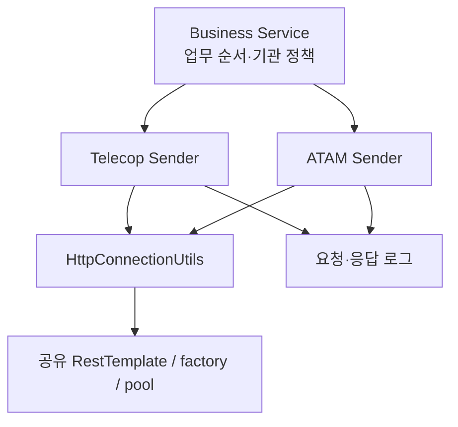

기관형 돌봄 서비스에서는 시니어 정보 변경과 응급 이벤트를 외부 시스템으로 전달한다. 이때 업무 로직은 “이 기관이 연동 대상인가, 언제 호출해야 하는가”를 결정하고, 발신 코드는 “어떤 규약으로 요청하고 결과를 어떻게 읽는가”를 처리한다. 내가 참여했던 개선은 이 두 책임을 찾기 쉬운 위치로 옮기는 작업이었다.

이력서에는 “공통 Sender와 RestTemplate으로 통합하고 로그·예외 규격을 표준화”했다고 썼다. 과거 코드를 다시 보니 더 정확한 표현은 **연동처별 Sender 분리와 공통 HTTP 전송·로그 경로 정리**였다. 하나의 Sender로 합친 것도, 모든 예외를 같은 결과로 만든 것도 아니었다.

## 어떤 코드를 근거로 삼았나

SA01의 `092eea1..9a55c9c`와 종료점 blob을 조사했다. 시작 SHA가 종료 SHA의 조상은 아니므로 이 범위는 Git의 도달 가능성 차집합이다. 당시 빌드 기준은 Java 8, Boot 1.5.12, Spring 4.3.16, HttpClient 4.5.5다. B2C의 Boot 2.7 동작을 소급하지 않았다.

상세 이력 (`docs/b2g-resttemplate-retrospective/history.md`)에 핵심 파일을 변경한 비병합 커밋 25개를 남겼다. 이 수는 개인 커밋 수나 C1 전체 변경 수가 아니다. 내 author와 정확히 일치하는 변경만 직접 구현으로 분류했다.

## As-Is: 규약 변경을 어디서 고쳐야 했는가

기존 발신 코드는 업무 Service, PushSender, HTTP utility에 걸쳐 있었다. 다음 코드는 책임 관계만 보존한 의사 코드다. 실제 payload와 업무·인증 데이터는 생략했다.

```java
void changeSenior() {
    updateLocalState();
    Map<String, Object> payload = createPartnerPayload();
    pushSender.sendPartner(payload);
}
```

파라미터를 만드는 책임과 발신 시점이 붙어 있으면, 공급자 규약을 바꿀 때 업무 분기까지 읽어야 한다. 다만 메서드를 다른 클래스로 옮기는 것만으로 결과 확인이나 부분 성공 문제가 해결되지는 않는다.

## 변경은 한 번에 끝나지 않았다

내 변경은 Telecop Sender 생성(`4117d3f`), 필수값·호출 시점 보완(`456ccb4`, `272bce5`), 공통 함수 적용(`d37a496`, `80e8b75`), 대상 검사(`86f4ecd`)로 이어졌다. ATAM의 요청·응답 로그를 공통 함수로 옮긴 `aac611b`도 직접 변경에 해당한다.

ATAM Sender 초기 생성, 공통 HTTP utility 생성과 후속 처리 로그 보완은 팀 변경이다. 풀 Bean도 C1 이전부터 있었다. 내 구현과 팀에서 배운 내용을 구분해야 설명이 정확해진다.

Gserver Sender는 중간에 생성됐다가 호출이 기존 Service로 돌아가고 삭제됐다. 모든 외부 시스템을 동일한 Sender 계층으로 완성했다고 설명할 수 없는 이유다. 철회 당시의 판단은 코드만으로 확정하지 않았다.

아래 그림은 종료점의 책임과 공유 지점을 보여준다.



> 화살표는 호출 관계다. 별도 트랜잭션이나 실패 격리를 뜻하지 않는다.

## 결과를 받아도 업무는 끝나지 않는다

Telecop은 주로 HTTP 200을 성공으로 판단했고, ATAM은 응답의 업무 코드를 추가로 해석했다. 단말 수정 호출자는 Telecop의 boolean을 검사하지만 다른 호출자는 검사하지 않는 경로도 있었다. ATAM의 일부 public 메서드는 void다.

ATAM Sender에는 부가정보 DB 갱신도 남아 있었다. 따라서 당시 구조를 순수 HTTP adapter나 엄격한 DTO 경계로 표현하지 않는다. 외부 성공 후 로컬 DB 실패가 발생하면 원격 변경은 DB rollback으로 되돌릴 수 없다.

## 데모에서 확인한 것과 생략한 것

Java 8 Lab (`lab/b2g-resttemplate-lab/README.md`)은 실제 제어 흐름을 축소하고 주소·데이터를 로컬 스텁으로 교체했다. 같은 200 업무 거절 응답에 Telecop 데모는 true, ATAM 데모는 false를 반환했다.

비교용 데모는 원본 Sender 전체를 복제하지 않았다. Telecop 바깥 catch와 ATAM의 void·DB 처리 경계는 생략했다. 특히 데모의 예외 전파를 운영 API까지의 전파로 읽으면 안 된다.

## 회고와 면접 표현

책임을 옮겨 공통화할 위치를 만든 것은 구현 사실이다. timeout 격리·모든 실패 로그·멱등성까지 확보했다는 주장은 후속 검증이 필요하다. 다음 글에서는 그중 공유 factory를 직접 실험한다.

이력서에는 “ATAM·Telecop 발신 로직을 연동처별 Sender로 분리하고 공통 RestTemplate 기반 전송과 요청·응답 로그 경로를 정리했다”라고 쓰는 편이 코드에 가깝다.

[다음: 새 RestTemplate이면 timeout도 독립적인가](/blog/b2g-external-api-02-shared-factory)

## 참고

- [Spring Boot 1.5.12 의존성 표](https://docs.spring.io/spring-boot/docs/1.5.12.RELEASE/reference/html/appendix-dependency-versions.html)
- 프로덕션 근거 지도 (`docs/b2g-resttemplate-retrospective/source-map.md`)
