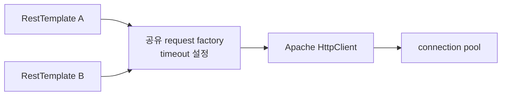

새 RestTemplate 객체가 곧 독립된 HTTP 설정을 뜻하지는 않는다. 생성자에 넘긴 request factory가 같은 객체이면 요청을 만드는 순간에 그 객체의 설정을 함께 읽는다. B2G 공통 HTTP utility를 회고하며 확인한 핵심이었다.

## RestTemplate, factory, pool의 역할

RestTemplate은 객체를 HTTP 요청으로 변환하고 응답을 읽는 Spring API다. request factory는 실제 요청 객체를 만든다. 이 실험의 HttpComponents factory는 Apache HttpClient를 사용하며, HttpClient는 풀에서 연결을 빌린다.

세 객체의 책임을 구분하면 어디의 상태를 바꾸고 있는지 보인다.



> A와 B는 달라도 F는 동일한 객체다.

## 당시 코드가 바꾼 것은 wrapper만이었다

SA01 `9a55c9c`의 사용자 지정 timeout 분기는 주입된 RestTemplate에서 factory를 꺼내 setter를 호출한다. 다음은 해당 관계만 보존한 의사 코드다.

```java
HttpComponentsClientHttpRequestFactory factory = sharedFactory;
factory.setReadTimeout(customTimeout);
RestTemplate client = new RestTemplate(factory);
client.exchange(url, method, entity, String.class);
factory.setReadTimeout(defaultTimeout);
```

실제 코드는 connect timeout도 변경한다. 마지막 복구는 정상 반환 뒤에만 실행된다. HTTP 예외나 read timeout이면 해당 복구를 건너뛸 수 있다. 기본 timeout 분기는 곧바로 공유 RestTemplate을 호출하므로 상수 30,000만 보고 모든 요청에 30초 제한이 걸렸다고 말할 수도 없다.

## 순서를 고정해 확인했다

무작위 동시 부하 대신 다음 순서를 테스트로 고정했다.

1. factory를 50ms로 설정하고 A를 만든다.
2. 같은 factory를 1000ms로 설정하고 B를 만든다.
3. A가 300ms 지연 스텁을 호출한다.

`SharedFactoryTimeoutTest`는 두 wrapper의 factory 참조가 동일함을 검증한다. 이어 A가 예외 없이 응답을 받고 경과 시간이 250ms 이상임을 확인했다. Java 8u452, Spring 4.3.16에서 통과했다.

50ms를 의도했던 A가 300ms 지연을 기다린 것은 “나중 setter가 먼저 만든 wrapper에도 영향을 준다”는 재현이다. 운영 경쟁 발생 빈도나 모든 스케줄링을 검증한 결과는 아니다.

## finally만 넣으면 충분할까

finally 복구는 예외 뒤 값이 남는 문제를 줄일 수 있지만 공유 상태의 경쟁은 남는다. A 요청이 만들어지기 전에 B가 값을 바꾸거나, A가 기본값을 복구한 뒤 B가 요청을 만들 수 있기 때문이다.

후속 개선 실험에서는 client마다 별도 factory와 pool을 만들고 시작 시 설정을 완료했다. setter를 요청 처리 경로에 노출하지 않는다. 50ms client는 300ms 응답에 timeout, 1000ms client는 성공했다. RestTemplate 내부가 언어 수준의 불변 객체가 됐다는 뜻은 아니다.

| 설정 | 제한하는 대기 |
|---|---|
| connectionRequestTimeout | 풀에서 연결을 빌리는 시간 |
| connectTimeout | 새 연결을 수립하는 시간 |
| readTimeout | 연결에서 데이터를 읽는 대기 |

이 세 값이 전체 요청의 엄격한 deadline은 아니다. DNS·TLS·여러 번의 읽기와 상위 요청 예산도 검토해야 한다.

## Java의 참조 공유를 요청 생성 시점까지 따라가기

`new`는 생성한 객체 하나를 새로 만든다. 생성자 인자로 전달한 객체까지 자동으로 깊은 복사하지는 않는다. A와 B가 같은 factory를 받으면 A의 필드와 B의 필드는 같은 대상을 가리킨다.

중요한 시점은 A를 생성한 순간과 A가 요청을 만드는 순간이 다르다는 것이다. Spring 4.3.16의 factory는 요청을 생성하면서 적용할 `RequestConfig`를 구성한다. 따라서 다른 호출이 그 전에 factory의 설정을 바꾸면 뒤의 요청 생성에 반영될 수 있다. 이미 실행 중인 모든 소켓의 timeout이 setter 한 번으로 즉시 바뀐다는 주장은 이 실험으로 할 수 없다.

공식 소스에서 읽을 순서는 `setReadTimeout` → `createRequest` → `createRequestConfig` / `mergeRequestConfig`다. [Spring 4.3.16 factory 소스](https://github.com/spring-projects/spring-framework/blob/v4.3.16.RELEASE/spring-web/src/main/java/org/springframework/http/client/HttpComponentsClientHttpRequestFactory.java)에서 설정 저장과 실제 요청에 적용하는 경계를 구분해 볼 수 있다.

### 테스트가 재현한 순서

아래 코드는 `SharedFactoryTimeoutTest`의 핵심이다. 경과 시간 측정 부분만 생략했다.

```java
RestTemplate intended50ms = http.dynamicTemplateForExperiment(50);
RestTemplate intended1000ms = http.dynamicTemplateForExperiment(1_000);

assertThat(intended50ms.getRequestFactory())
        .isSameAs(intended1000ms.getRequestFactory());

intended50ms.exchange(
        stub.url("delay-300"), HttpMethod.GET, null, String.class);
```

B는 HTTP 호출을 실행하지 않아도 된다. 생성 도우미가 공유 factory에 setter를 호출한 것만으로 A의 다음 요청 생성 조건이 바뀐다. 그래서 이 테스트는 두 스레드를 띄워 우연히 간섭하기를 기다리지 않는다. 실제 동시 처리에서 가능할 순서를 한 스레드에 배열해 공유 상태를 드러낸다.

이 결과는 “RestTemplate을 singleton Bean으로 쓰면 안 된다”는 결론이 아니다. 미리 구성해 공유하는 객체와, 요청마다 공유 객체의 설정을 바꾸는 사용법을 구분해야 한다. 문제가 된 것은 객체의 수보다 **언제 누가 설정을 바꾸는지**였다.

## 후속 개선은 설정의 생명주기를 바꾸는 일이다

`FixedPartnerClient`는 생성자에서 pool, HttpClient, factory, RestTemplate을 차례로 구성한다. 아래는 실제 생성자의 timeout 설정 부분이다.

```java
HttpComponentsClientHttpRequestFactory factory =
        new HttpComponentsClientHttpRequestFactory(client);
factory.setConnectionRequestTimeout(poolWaitMs);
factory.setConnectTimeout(connectMs);
factory.setReadTimeout(readMs);
template = new RestTemplate(factory);
```

이후 `post` 메서드는 목적지 검사와 전송만 수행한다. 요청 인자에 따라 singleton setter를 호출하지 않는다. 데모는 격리를 분명히 보여주기 위해 pool까지 독립시켰지만, timeout 격리에 반드시 별도 pool이 필요한 것은 아니다. 서로 다른 factory와 요청 설정을 사용하면서 같은 HttpClient/pool을 공유하는 구성을 검토할 수도 있다. 그 경우 설정은 나뉘어도 연결 용량과 장애 영향은 공유된다.

| 선택 | 해결하는 범위 | 남는 비용·조건 |
|---|---|---|
| setter와 요청 전체를 같은 lock으로 묶기 | 같은 lock을 쓰는 호출 사이 설정 경쟁 방지 | 원격 대기 동안 호출을 직렬화하며 우회 호출까지 통제해야 함 |
| 구성 완료한 client/factory 선택 | 요청 중 공유 setter 제거 | 설정 종류와 객체 생명주기 관리 |
| 독립 pool까지 구성 | 파트너별 연결 용량 구분 | 전체 연결 수·종료 처리 증가 |
| 요청별 context/config 사용 | 전송 구현에 맞는 요청 단위 설정 | factory 확장과 해당 버전 동작 검증 필요; 이 Lab에서는 미구현 |

read timeout은 보통 소켓 읽기 대기의 제한이므로, 상대가 제한 시간 안에 데이터를 조금씩 계속 보내는 상황에서 전체 요청 시간이 그 값보다 길 수 있다. 전체 기한을 설계하려면 “읽기 한 번의 대기”와 “업무 호출 전체에 허용한 시간”을 나눠야 한다.

## Demo 경로와 재현

| 저장소 내 파일 | 읽을 메서드 |
|---|---|
| [LegacyHttpConnectionUtils.java](https://github.com/inchangson/inchangson.github.io/blob/6fe3c578d608df417f3f2f4eb144323e8edc079c/lab/b2g-resttemplate-lab/src/main/java/com/example/b2glab/legacy/LegacyHttpConnectionUtils.java) | `dynamicTemplateForExperiment`, `restoreDefaultTimeout` |
| [SharedFactoryTimeoutTest.java](https://github.com/inchangson/inchangson.github.io/blob/6fe3c578d608df417f3f2f4eb144323e8edc079c/lab/b2g-resttemplate-lab/src/test/java/com/example/b2glab/SharedFactoryTimeoutTest.java) | `laterClientCreationOverwritesEarlierClientTimeout` |
| [FixedPartnerClient.java](https://github.com/inchangson/inchangson.github.io/blob/6fe3c578d608df417f3f2f4eb144323e8edc079c/lab/b2g-resttemplate-lab/src/main/java/com/example/b2glab/improved/FixedPartnerClient.java) | 생성자와 `post` 비교 |
| [ImprovedBehaviorTest.java](https://github.com/inchangson/inchangson.github.io/blob/6fe3c578d608df417f3f2f4eb144323e8edc079c/lab/b2g-resttemplate-lab/src/test/java/com/example/b2glab/ImprovedBehaviorTest.java) | `independentlyConfiguredClientsKeepTheirTimeouts` |

메인 코드는 `lab/b2g-resttemplate-lab/src/main/java/com/example/b2glab/`, 테스트는 같은 Lab의 `src/test/java/com/example/b2glab/`에 있다.

```bash
# 저장소 루트에서 시작; 첫 실행은 docker compose build 필요
cd lab/b2g-resttemplate-lab
docker run --rm --network none --entrypoint mvn b2g-resttemplate-lab-lab \
  -o -Dtest=SharedFactoryTimeoutTest,ImprovedBehaviorTest test
```

현재 테스트 구성에서 총 5개가 선택된다. 공유 factory 실험과 독립 설정 실험뿐 아니라 개선군의 다른 실패 경로도 함께 포함한다. 과거 결과는 2026-09-07 Java 8 실행 기록이며, 이 글의 설명 보강을 새 부하 측정으로 세지는 않는다.

## 면접에서 이어질 질문

### “finally에서 복구하면 되는 것 아닌가요?”

“예외 뒤 값이 남는 문제와 두 요청이 값을 덮어쓰는 문제는 다릅니다. finally는 전자를 보완하지만 A가 값을 복구하는 순간 B가 요청을 만들면 B도 영향을 받을 수 있습니다. 요청 중 공유 설정 변경을 없애는 방향이 필요합니다.”

### “왜 멀티스레드 테스트를 안 했나요?”

“이번 주장은 공유 객체와 특정 실행 순서가 만드는 간섭입니다. 참조 동일성을 검증하고, 50ms 설정 뒤 1000ms로 덮어쓴 다음 첫 wrapper로 300ms 응답을 받는 순서를 고정했습니다. 부하에서의 빈도나 실제 스케줄링 분포는 별도 테스트 대상입니다.”

### “pool을 공유하면 timeout도 반드시 공유되나요?”

“pool은 연결 자원의 관리 대상이고 factory·request config는 요청 설정의 적용 경계입니다. 같은 pool을 쓰더라도 요청 설정을 독립적으로 적용할 수 있습니다. 다만 pool 용량을 공유하므로 한 파트너의 지연이 다른 요청의 pool 대기에 영향을 줄 수 있습니다.”

## 적용 조건과 회고

연동처별 독립 풀은 장애 자원을 나누지만 전체 연결 수가 늘어난다. 설정 종류가 많다면 설정별 client를 재사용하는 경계를 정해야 한다. 매 요청마다 풀까지 새로 만들면 재사용 목적이 사라진다.

면접에서는 “공통화 뒤 공유 하위 객체의 가변 설정이 남는다는 점을 회고 실험으로 확인했고, 용도별로 구성한 client를 선택하는 개선안을 검증했다”고 설명할 수 있다. 당시 운영에서 동시성 버그를 해결했다고 소급하지 않는다.

[이전: Sender 책임](/blog/b2g-external-api-01-sender-boundary) · [다음: 풀과 close 헤더](/blog/b2g-external-api-03-pool-reuse)

## 근거와 재현

- 실험 2 코드·결과 (`lab/b2g-resttemplate-lab/lessons/02-shared-request-factory-timeout.md`)
- 개선군 결과 (`lab/b2g-resttemplate-lab/lessons/04-explicit-result-and-log.md`)
- [Spring 4.3.16 HttpComponentsClientHttpRequestFactory](https://docs.spring.io/spring-framework/docs/4.3.16.RELEASE/javadoc-api/org/springframework/http/client/HttpComponentsClientHttpRequestFactory.html)
