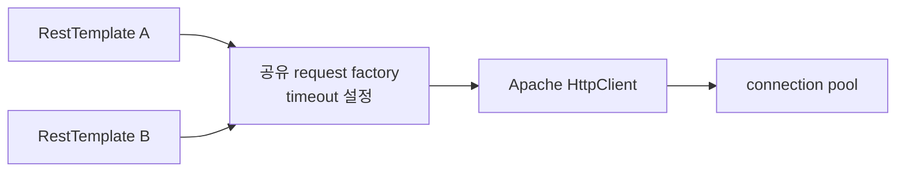

새 RestTemplate 객체가 곧 독립된 HTTP 설정을 뜻하지는 않는다. 생성자에 넘긴 request factory가 같은 객체이면 요청을 만드는 순간에 그 객체의 설정을 함께 읽는다. B2G 공통 HTTP utility를 회고하며 확인한 핵심이었다.

## RestTemplate, factory, pool의 역할

RestTemplate은 객체를 HTTP 요청으로 변환하고 응답을 읽는 Spring API다. request factory는 실제 요청 객체를 만든다. 이 실험의 HttpComponents factory는 Apache HttpClient를 사용하며, HttpClient는 풀에서 연결을 빌린다.

세 객체의 책임을 구분하면 어디의 상태를 바꾸고 있는지 보인다.



> A와 B는 달라도 F는 동일한 객체다.

## 당시 코드가 바꾼 것은 wrapper만이었다

SA01 `9a55c9c`의 사용자 지정 timeout 분기는 주입된 RestTemplate에서 factory를 꺼내 setter를 호출한다. 다음은 해당 관계만 보존한 의사 코드다.

```java
HttpComponentsClientHttpRequestFactory factory = sharedFactory;
factory.setReadTimeout(customTimeout);
RestTemplate client = new RestTemplate(factory);
client.exchange(url, method, entity, String.class);
factory.setReadTimeout(defaultTimeout);
```

실제 코드는 connect timeout도 변경한다. 마지막 복구는 정상 반환 뒤에만 실행된다. HTTP 예외나 read timeout이면 해당 복구를 건너뛸 수 있다. 기본 timeout 분기는 곧바로 공유 RestTemplate을 호출하므로 상수 30,000만 보고 모든 요청에 30초 제한이 걸렸다고 말할 수도 없다.

## 순서를 고정해 확인했다

무작위 동시 부하 대신 다음 순서를 테스트로 고정했다.

1. factory를 50ms로 설정하고 A를 만든다.
2. 같은 factory를 1000ms로 설정하고 B를 만든다.
3. A가 300ms 지연 스텁을 호출한다.

`SharedFactoryTimeoutTest`는 두 wrapper의 factory 참조가 동일함을 검증한다. 이어 A가 예외 없이 응답을 받고 경과 시간이 250ms 이상임을 확인했다. Java 8u452, Spring 4.3.16에서 통과했다.

50ms를 의도했던 A가 300ms 지연을 기다린 것은 “나중 setter가 먼저 만든 wrapper에도 영향을 준다”는 재현이다. 운영 경쟁 발생 빈도나 모든 스케줄링을 검증한 결과는 아니다.

## finally만 넣으면 충분할까

finally 복구는 예외 뒤 값이 남는 문제를 줄일 수 있지만 공유 상태의 경쟁은 남는다. A 요청이 만들어지기 전에 B가 값을 바꾸거나, A가 기본값을 복구한 뒤 B가 요청을 만들 수 있기 때문이다.

후속 개선 실험에서는 client마다 별도 factory와 pool을 만들고 시작 시 설정을 완료했다. setter를 요청 처리 경로에 노출하지 않는다. 50ms client는 300ms 응답에 timeout, 1000ms client는 성공했다. RestTemplate 내부가 언어 수준의 불변 객체가 됐다는 뜻은 아니다.

| 설정 | 제한하는 대기 |
|---|---|
| connectionRequestTimeout | 풀에서 연결을 빌리는 시간 |
| connectTimeout | 새 연결을 수립하는 시간 |
| readTimeout | 연결에서 데이터를 읽는 대기 |

이 세 값이 전체 요청의 엄격한 deadline은 아니다. DNS·TLS·여러 번의 읽기와 상위 요청 예산도 검토해야 한다.

## 적용 조건과 회고

연동처별 독립 풀은 장애 자원을 나누지만 전체 연결 수가 늘어난다. 설정 종류가 많다면 설정별 client를 재사용하는 경계를 정해야 한다. 매 요청마다 풀까지 새로 만들면 재사용 목적이 사라진다.

면접에서는 “공통화 뒤 공유 하위 객체의 가변 설정이 남는다는 점을 회고 실험으로 확인했고, 용도별로 구성한 client를 선택하는 개선안을 검증했다”고 설명할 수 있다. 당시 운영에서 동시성 버그를 해결했다고 소급하지 않는다.

[이전: Sender 책임](/blog/b2g-external-api-01-sender-boundary) · [다음: 풀과 close 헤더](/blog/b2g-external-api-03-pool-reuse)

## 근거와 재현

- 실험 2 코드·결과 (`lab/b2g-resttemplate-lab/lessons/02-shared-request-factory-timeout.md`)
- 개선군 결과 (`lab/b2g-resttemplate-lab/lessons/04-explicit-result-and-log.md`)
- [Spring 4.3.16 HttpComponentsClientHttpRequestFactory](https://docs.spring.io/spring-framework/docs/4.3.16.RELEASE/javadoc-api/org/springframework/http/client/HttpComponentsClientHttpRequestFactory.html)
