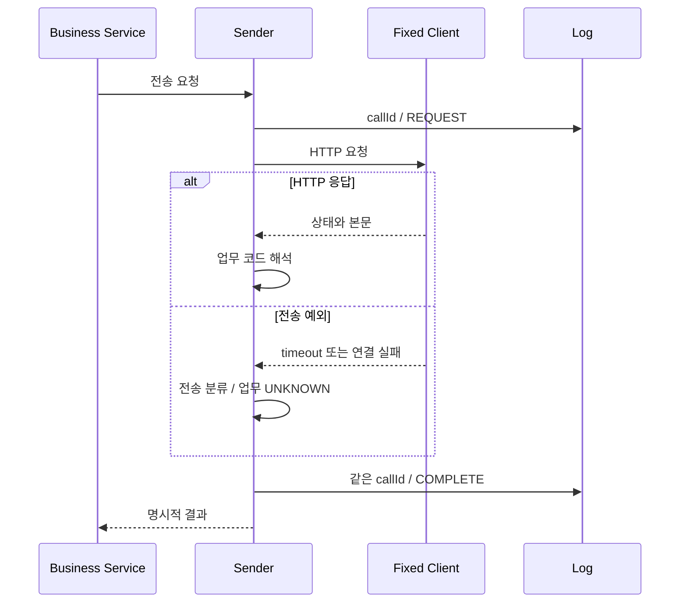

read timeout은 상대가 업무를 거절했다는 응답이 아니다. 상대가 처리한 뒤 응답만 늦었을 수도 있다. 따라서 업무 거절과 결과 불명을 모두 false로 반환하면 재처리 판단에 필요한 정보를 잃는다.

## 당시 공통화가 남긴 경계

B2G `HttpConnectionUtils`는 HTTP 오류 상태의 `HttpStatusCodeException`을 Map으로 변환했다. 연결·읽기 실패는 같은 Map으로 바뀌지 않았다.

PartnerA 내부 공통 함수는 요청 로그 → HTTP 호출 → 응답 로그 순서다. 전송 예외가 발생하면 응답 DB 로그를 건너뛰고 public Sender의 catch에서 서버 로그 후 false로 반환하는 경로가 있었다. PARTNER_B은 전송·파싱 예외를 내부 코드로 바꾼 뒤 응답 로그를 작성하지만, 요청 로그 자체의 실패는 다른 경계에 있다.

로그를 한 함수로 모았다는 사실과 모든 실패를 같은 규격으로 관찰한다는 주장은 다르다. 이것이 회고에서 이력서의 “예외 규격 표준화”를 좁혀 읽은 이유다.

## 후속 실험: 두 결과를 나눈다

다음은 이번 데모의 개선안이며 2023년 운영 구현이 아니다.

```java
enum Transport {
    HTTP_RESPONSE, READ_TIMEOUT, CONNECT_TIMEOUT,
    POOL_TIMEOUT, CONNECTION_FAILURE, IO_FAILURE
}
enum Business { SUCCESS, REJECTED, UNKNOWN }
```

결과에는 callId, HTTP 상태, 전송 결과와 업무 결과를 함께 둔다. HTTP 500이면 응답은 받았지만 업무 성공을 확인하지 못한 상태다. read timeout이면 HTTP 상태 자체가 없다. 성공한 200 응답도 업무 코드가 거절이면 REJECTED다.

실제 공급자별 코드 해석은 Sender 책임이다. 데모는 비교를 위해 두 파트너가 같은 `resultCode`를 반환하는 축소 계약을 사용했다.

## 실행한 실패 경로

| 입력 | 전송 결과 | 업무 결과 |
|---|---|---|
| 200 / SUCCESS | HTTP_RESPONSE | SUCCESS |
| 200 / REJECTED | HTTP_RESPONSE | REJECTED |
| HTTP 500 | HTTP_RESPONSE | UNKNOWN |
| 깨진 JSON | HTTP_RESPONSE | UNKNOWN |
| read 50ms / 응답 300ms | READ_TIMEOUT | UNKNOWN |
| 로컬 연결 거절 | CONNECTION_FAILURE | UNKNOWN |
| 풀 1개 점유 / 대기 50ms | POOL_TIMEOUT | UNKNOWN |

이 경로와 기존 비교를 합친 Java 8 테스트 10개가 통과했다. connect timeout 분류 코드는 있지만 실제 재현하지 않았다. 연결 거절과 연결 시간 초과는 서로 다른 실패다.

풀 테스트는 첫 요청이 연결을 빌렸음을 확인한 뒤 두 번째 요청을 보냈다. 두 번째가 대기 한도를 넘는 동안 첫 번째는 정상 응답을 받는다. 풀 고갈과 socket read 지연을 구분할 수 있다.

## 호출 ID와 완료 로그

아래는 예외 여부와 관계없이 완료 이벤트를 남기는 데모의 책임 경계다.



> 데모의 L은 메모리 리스트다. 운영 DB 저장이나 별도 트랜잭션을 뜻하지 않는다.

finally에서 완료 로그를 쓰더라도 프로세스 강제 종료나 로그 저장 실패까지 보장하지 않는다. 메모리 리스트는 누적되므로 운영 로그 저장소가 될 수 없다. 전문·인증 정보·개인정보를 넣지 않고 추적에 필요한 최소 항목만 기록한다.

## 재시도와 트랜잭션은 별도 결정이다

HTTP 호출 성공은 DB rollback으로 취소되지 않는다. timeout 뒤 재전송은 멱등성 키, 상대 결과 조회, 보상 정책을 확인한 뒤 결정해야 한다. 이번 개선군에는 자동 재시도를 넣지 않았다.

요청·응답 로그를 별도 트랜잭션으로 남기는 설계도 자원을 사용한다. 바깥 트랜잭션의 DB 연결과 HTTP 풀 연결을 오래 잡는지 따져야 한다. B2G 종료점에는 REQUIRES_NEW·self proxy가 없으며, B2C의 팀 구현을 이번 개인 성과로 소급하지 않는다.

면접에서는 “공통 호출과 로그 경로를 정리했지만 실패 규격에는 차이가 남았다. 회고 데모에서 결과 불명과 확인된 거절을 나누고 timeout·풀 고갈의 로그 경로를 검증했다”고 설명할 수 있다.

[이전: 커넥션 재사용](/blog/b2g-external-api-03-pool-reuse)

## 근거와 재현

- 결과·로그 실험과 한계 (`lab/b2g-resttemplate-lab/lessons/04-explicit-result-and-log.md`)
- 상세 변경 이력 (`docs/b2g-resttemplate-retrospective/history.md`)
- [Spring 4.3.16 request factory](https://docs.spring.io/spring-framework/docs/4.3.16.RELEASE/javadoc-api/org/springframework/http/client/HttpComponentsClientHttpRequestFactory.html)
