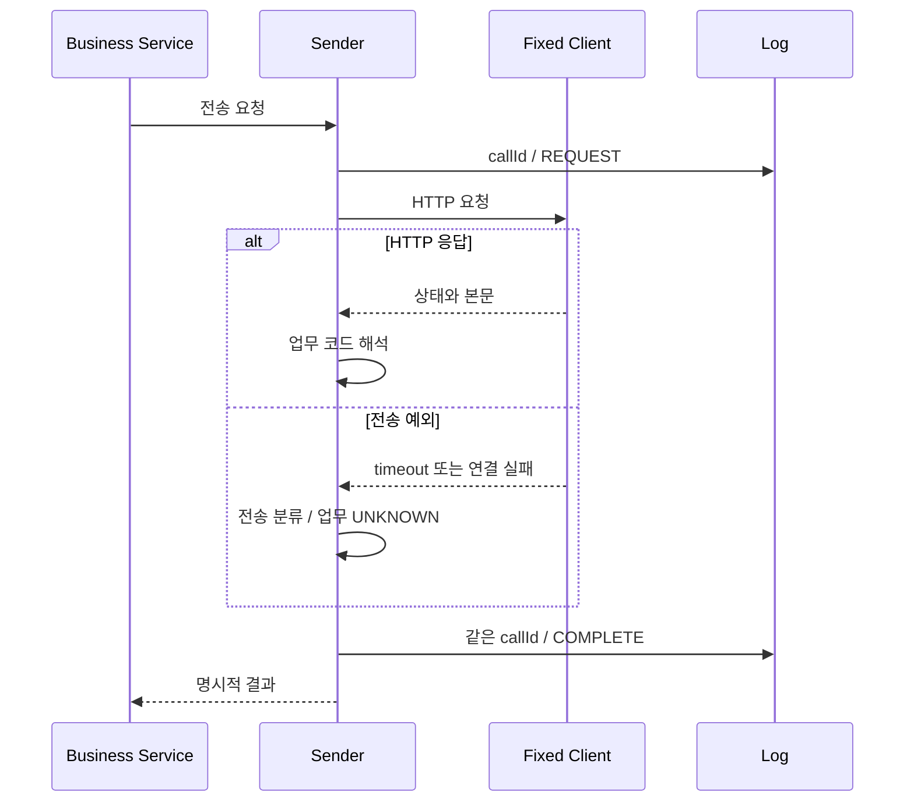

read timeout은 상대가 업무를 거절했다는 응답이 아니다. 상대가 처리한 뒤 응답만 늦었을 수도 있다. 따라서 업무 거절과 결과 불명을 모두 false로 반환하면 재처리 판단에 필요한 정보를 잃는다.

## 당시 공통화가 남긴 경계

B2G `HttpConnectionUtils`는 HTTP 오류 상태의 `HttpStatusCodeException`을 Map으로 변환했다. 연결·읽기 실패는 같은 Map으로 바뀌지 않았다.

PartnerA 내부 공통 함수는 요청 로그 → HTTP 호출 → 응답 로그 순서다. 전송 예외가 발생하면 응답 DB 로그를 건너뛰고 public Sender의 catch에서 서버 로그 후 false로 반환하는 경로가 있었다. PARTNER_B은 전송·파싱 예외를 내부 코드로 바꾼 뒤 응답 로그를 작성하지만, 요청 로그 자체의 실패는 다른 경계에 있다.

로그를 한 함수로 모았다는 사실과 모든 실패를 같은 규격으로 관찰한다는 주장은 다르다. 이것이 회고에서 이력서의 “예외 규격 표준화”를 좁혀 읽은 이유다.

## 후속 실험: 두 결과를 나눈다

다음은 이번 데모의 개선안이며 2023년 운영 구현이 아니다.

```java
enum Transport {
    HTTP_RESPONSE, READ_TIMEOUT, CONNECT_TIMEOUT,
    POOL_TIMEOUT, CONNECTION_FAILURE, IO_FAILURE
}
enum Business { SUCCESS, REJECTED, UNKNOWN }
```

결과에는 callId, HTTP 상태, 전송 결과와 업무 결과를 함께 둔다. HTTP 500이면 응답은 받았지만 업무 성공을 확인하지 못한 상태다. read timeout이면 HTTP 상태 자체가 없다. 성공한 200 응답도 업무 코드가 거절이면 REJECTED다.

실제 공급자별 코드 해석은 Sender 책임이다. 데모는 비교를 위해 두 파트너가 같은 `resultCode`를 반환하는 축소 계약을 사용했다.

## 실행한 실패 경로

| 입력 | 전송 결과 | 업무 결과 |
|---|---|---|
| 200 / SUCCESS | HTTP_RESPONSE | SUCCESS |
| 200 / REJECTED | HTTP_RESPONSE | REJECTED |
| HTTP 500 | HTTP_RESPONSE | UNKNOWN |
| 깨진 JSON | HTTP_RESPONSE | UNKNOWN |
| read 50ms / 응답 300ms | READ_TIMEOUT | UNKNOWN |
| 로컬 연결 거절 | CONNECTION_FAILURE | UNKNOWN |
| 풀 1개 점유 / 대기 50ms | POOL_TIMEOUT | UNKNOWN |

이 경로와 기존 비교를 합친 Java 8 테스트 10개가 통과했다. connect timeout 분류 코드는 있지만 실제 재현하지 않았다. 연결 거절과 연결 시간 초과는 서로 다른 실패다.

풀 테스트는 첫 요청이 연결을 빌렸음을 확인한 뒤 두 번째 요청을 보냈다. 두 번째가 대기 한도를 넘는 동안 첫 번째는 정상 응답을 받는다. 풀 고갈과 socket read 지연을 구분할 수 있다.

## 호출 ID와 완료 로그

아래는 예외 여부와 관계없이 완료 이벤트를 남기는 데모의 책임 경계다.



> 데모의 L은 메모리 리스트다. 운영 DB 저장이나 별도 트랜잭션을 뜻하지 않는다.

finally에서 완료 로그를 쓰더라도 프로세스 강제 종료나 로그 저장 실패까지 보장하지 않는다. 메모리 리스트는 누적되므로 운영 로그 저장소가 될 수 없다. 전문·인증 정보·개인정보를 넣지 않고 추적에 필요한 최소 항목만 기록한다.

## 예외를 어디서 바꾸느냐가 로그 경로를 바꾼다

Spring의 기본 오류 처리 경로에서는 HTTP 4xx·5xx 응답이 상태를 가진 예외로 처리된다. 응답 자체를 받지 못한 I/O 실패는 `ResourceAccessException`으로 감싸질 수 있다. 이 Lab은 오류 처리기를 교체하지 않았다. HTTP 오류 상태와 응답 없는 예외를 하나의 catch가 모두 처리한다고 가정하면 안 된다.

레거시 utility는 상태 예외만 Map으로 바꾼다. 그 결과 HTTP 500은 utility에서 정상 반환된 뒤 Sender의 응답 로그 코드로 이어진다. read timeout은 utility 밖으로 나가므로 같은 위치의 응답 로그가 실행되지 않는다. 실제 PartnerA public Sender에는 그 바깥의 catch가 있지만, 이미 건너뛴 응답 로그를 대신 작성해 주는 것은 아니다.

개선 데모의 변환 지점은 다음과 같다. 실제 코드에서 생성자 인자와 상세 분류 일부만 생략한 의사 코드다.

```java
try {
    response = client.post(url);
    result = interpretPartnerResponse(response);
} catch (HttpStatusCodeException e) {
    result = httpResponseWithUnknownBusiness(e.getStatusCode());
} catch (ResourceAccessException e) {
    result = transportFailureWithUnknownBusiness(e);
} finally {
    recordCompletion(callId, result);
}
```

`finally`와 명시적 결과 타입은 역할이 다르다. finally는 실행이 블록을 빠져나가는 경로에 완료 기록을 배치하고, 결과 타입은 그 완료가 무엇을 뜻하는지 표현한다. 실제 `ObservedPartnerSender`는 result가 아직 없으면 `UNEXPECTED_EXCEPTION`을 기록하고 예외는 계속 전파한다. 모든 예외를 성공적인 결과 반환으로 덮는 구현은 아니다.

## UNKNOWN도 전송 단계에 따라 의미가 다르다

업무 결과 UNKNOWN만 보고 똑같이 재시도하면 정보를 다시 버리게 된다. pool 대기 초과는 이 시도의 HTTP 요청이 아직 전송되지 않은 상태로 볼 수 있지만, read timeout은 요청을 보낸 뒤 응답을 확인하지 못한 상태일 수 있다. 두 결과의 업무 필드는 같아도 전송 필드를 함께 봐야 판단이 가능하다.

| 결과 조합 | 이 시도에서 확인한 것 | 후속 판단 |
|---|---|---|
| HTTP_RESPONSE / REJECTED | 데모 계약상 업무 거절 응답 | 원인·입력 수정 없이 즉시 반복하지 않음 |
| HTTP_RESPONSE / UNKNOWN | 응답은 받았으나 업무 결과 미확정 | 상태·본문 계약과 결과 조회 가능성 확인 |
| POOL_TIMEOUT / UNKNOWN | 연결을 빌리지 못함 | 상위 요청 예산·부하·이전 시도 여부 확인 |
| READ_TIMEOUT / UNKNOWN | 응답 확인 실패 | 상대 처리 완료 가능성을 고려해 조회·멱등성 확인 |

여기서 `callId`는 로그를 묶는 값이고 업무의 멱등성 키는 아니다. 데모는 send 호출마다 UUID를 새로 생성한다. 같은 업무를 다시 보내도 callId가 달라지므로 그 값만으로 원격 중복 처리를 막을 수 없다. 실제 멱등성 설계라면 재시도 사이에 유지되는 업무 식별자와 상대 시스템의 중복 처리 계약이 필요하다.

## 로그를 남기는 것도 실패할 수 있다

현재 Demo의 로그는 메모리 리스트이고 원본의 DB 로그는 저장 작업이다. 둘 사이에는 내구성·트랜잭션·저장 실패라는 차이가 있다. 정상 응답을 받은 뒤 DB 로그 저장만 실패했을 때 “파트너 실패”로 반환하면 재시도가 원격 부작용을 중복시킬 수 있다. 로그 실패를 무시하면 업무는 진행되지만 감사·복구 자료가 빠질 수 있다.

따라서 전송 결과와 관찰 자료 저장 결과를 별도로 기록하는 정책이 필요하다. 감사 요구에 따라 전송 전 요청 기록을 반드시 저장할 수도 있고, 운영 지표는 보조 경로로 처리할 수도 있다. 무엇을 택하든 실제 요구를 확인해야 하며, 메모리 리스트 테스트만으로 정책이 정해졌다고 할 수 없다.

수신 서버를 멈추거나 잘못된 JSON을 보내는 실험은 여기서 유용하다. 기대한 업무 오류만 테스트하면 “응답을 읽을 수 없는 경우”와 “기록 자체가 실패하는 경우”의 차이를 보지 못하기 때문이다. 현재 자동화 범위에는 malformed 응답과 전송 예외가 포함되지만 로그 저장 장애나 JVM 강제 종료는 포함되지 않는다.

## Demo 코드에서 확인할 순서

| 파일 | 읽을 이유 |
|---|---|
| [CallResult.java](https://github.com/inchangson/inchangson.github.io/blob/master/lab/b2g-resttemplate-lab/src/main/java/com/example/b2glab/improved/CallResult.java) | status가 null인 결과와 전송·업무 enum 구분 |
| [ObservedPartnerSender.java](https://github.com/inchangson/inchangson.github.io/blob/master/lab/b2g-resttemplate-lab/src/main/java/com/example/b2glab/improved/ObservedPartnerSender.java) | `send`의 catch/finally와 `classify` |
| [FixedPartnerClient.java](https://github.com/inchangson/inchangson.github.io/blob/master/lab/b2g-resttemplate-lab/src/main/java/com/example/b2glab/improved/FixedPartnerClient.java) | 고정 timeout, retry 비활성화, 목적지 검사 |
| [ImprovedBehaviorTest.java](https://github.com/inchangson/inchangson.github.io/blob/master/lab/b2g-resttemplate-lab/src/test/java/com/example/b2glab/ImprovedBehaviorTest.java) | 응답 행렬·연결 거절·pool 고갈·timeout 격리 |
| [LegacyBehaviorTest.java](https://github.com/inchangson/inchangson.github.io/blob/master/lab/b2g-resttemplate-lab/src/test/java/com/example/b2glab/LegacyBehaviorTest.java) | 개선 전 응답 로그 누락과 비교 |

로컬 경로는 `lab/b2g-resttemplate-lab/src/main/java/com/example/b2glab/improved/`와 `lab/b2g-resttemplate-lab/src/test/java/com/example/b2glab/`다.

```bash
# 저장소 루트에서 시작; 첫 실행은 docker compose build 필요
cd lab/b2g-resttemplate-lab
docker run --rm --network none --entrypoint mvn b2g-resttemplate-lab-lab \
  -o -Dtest=LegacyBehaviorTest,ImprovedBehaviorTest test
```

이 명령은 두 클래스의 테스트 8개를 선택한다. 전체 10개와 개별 시나리오 수를 혼동하지 않는다. 한 테스트 메서드가 여러 입력을 검증하기도 한다.

## 면접에서 이어질 질문

### “예외를 공통 타입으로 바꾸면 예외를 숨기는 것 아닌가요?”

“호출자가 처리해야 할 예상 가능한 외부 결과를 명시적으로 표현하는 목적입니다. HTTP 상태·전송 단계·업무 판정을 잃지 않게 하고, 예상하지 못한 코드 오류는 무조건 false로 삼키지 않습니다. 현재 Demo도 모든 RuntimeException을 결과로 바꾸지는 않습니다.”

### “왜 read timeout을 실패가 아니라 UNKNOWN이라고 하나요?”

“클라이언트가 확인하지 못한 것은 응답입니다. 서버의 업무 처리까지 취소됐다는 확인은 없습니다. 조회나 멱등성 계약 없이 같은 변경 요청을 바로 다시 보내면 중복 처리가 될 수 있어, 확인된 거절과 구분합니다.”

### “REQUIRES_NEW를 쓰면 해결되나요?”

“로그가 바깥 DB rollback과 함께 사라지는 문제를 분리하는 데 사용할 수 있지만 원격 요청을 되돌리거나 원격·DB 원자성을 보장하지는 않습니다. 별도 DB 연결과 전파 경계도 봐야 합니다. 이 B2G 종료점에 해당 구조가 있었다고 설명하지 않습니다.”

## 재시도와 트랜잭션은 별도 결정이다

HTTP 호출 성공은 DB rollback으로 취소되지 않는다. timeout 뒤 재전송은 멱등성 키, 상대 결과 조회, 보상 정책을 확인한 뒤 결정해야 한다. 이번 개선군에는 자동 재시도를 넣지 않았다.

요청·응답 로그를 별도 트랜잭션으로 남기는 설계도 자원을 사용한다. 바깥 트랜잭션의 DB 연결과 HTTP 풀 연결을 오래 잡는지 따져야 한다. B2G 종료점에는 REQUIRES_NEW·self proxy가 없으며, B2C의 팀 구현을 이번 개인 성과로 소급하지 않는다.

면접에서는 “공통 호출과 로그 경로를 정리했지만 실패 규격에는 차이가 남았다. 회고 데모에서 결과 불명과 확인된 거절을 나누고 timeout·풀 고갈의 로그 경로를 검증했다”고 설명할 수 있다.

[이전: 커넥션 재사용](/blog/b2g-external-api-03-pool-reuse)

## 근거와 재현

- 결과·로그 실험과 한계 (`lab/b2g-resttemplate-lab/lessons/04-explicit-result-and-log.md`)
- 상세 변경 이력 (`docs/b2g-resttemplate-retrospective/history.md`)
- [Spring 4.3.16 request factory](https://docs.spring.io/spring-framework/docs/4.3.16.RELEASE/javadoc-api/org/springframework/http/client/HttpComponentsClientHttpRequestFactory.html)
