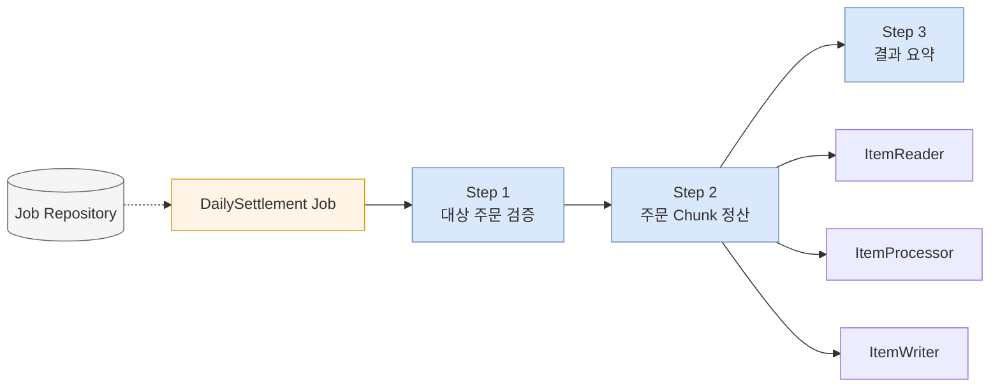
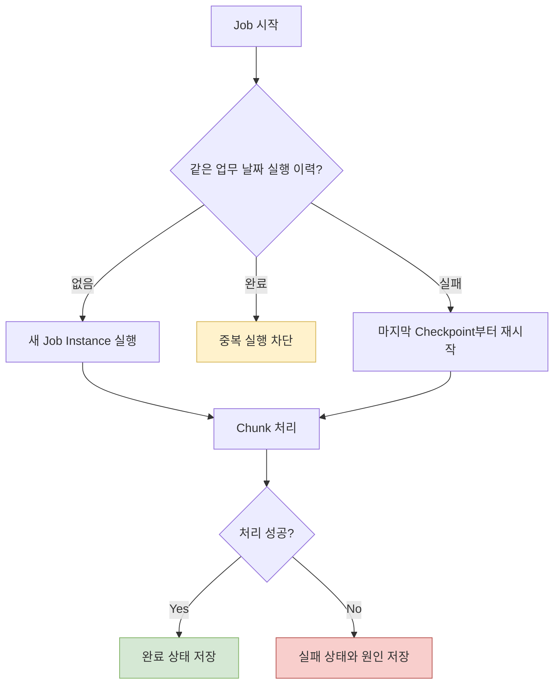

## 1. Batch를 한 문장으로 설명하기

배치 처리는 **많은 데이터를 정해진 시점이나 조건에 따라 묶어서, 관찰 가능하고 재시작 가능한 작업으로 처리하는 방식**이다.

API 요청과 비교하면 배치는 즉시 응답보다 처리량, 재시작, 실행 이력, 부분 실패 관리가 중요하다.

| 관점 | 온라인 API | Batch |
|---|---|---|
| 시작 | 사용자 요청 | 스케줄 또는 운영 명령 |
| 응답 시간 | 짧아야 함 | 수분~수시간 가능 |
| 데이터 양 | 비교적 작음 | 수천~수백만 건 |
| 실패 처리 | 요청 단위 응답 | 재시작, Skip, Retry |
| 상태 | 요청 중심 | Job 실행 이력 중심 |

## 2. Spring Batch의 기본 구조

아래 다이어그램은 일별 주문 정산 Job의 실행 단위를 보여준다.



- **Job**: 하나의 배치 업무 전체
- **Step**: Job 안의 실행 단계
- **ItemReader**: 입력 데이터 읽기
- **ItemProcessor**: 검증과 변환
- **ItemWriter**: 결과 저장
- **JobRepository**: 실행 상태와 재시작 정보를 저장

## 3. Chunk 이해하기

Chunk 크기가 100이면 일반적으로 100건을 읽고 처리한 뒤 한 번에 쓰고 커밋한다.

```text
read 100 -> process 100 -> write 100 -> commit
read 100 -> process 100 -> write 100 -> commit
```

Chunk가 너무 작으면 커밋과 I/O 횟수가 늘고, 너무 크면 실패 시 롤백 범위와 메모리 사용량이 커진다. 처음에는 100~1000 사이에서 측정하며 조정한다.

## 4. 정산 규칙 만들기

예제 규칙:

- 완료된 주문만 정산한다.
- 판매 금액의 3%를 수수료로 계산한다.
- 정산액은 `판매 금액 - 수수료`다.
- 주문 하나는 한 번만 정산한다.

```java
public Settlement process(Order order) {
    long fee = Math.round(order.totalAmount() * 0.03);
    return new Settlement(
        order.id(),
        fee,
        order.totalAmount() - fee
    );
}
```

돈 계산에는 `double`보다 최소 화폐 단위의 정수 또는 `BigDecimal`을 사용하고 반올림 규칙을 명시한다.

## 5. Job Parameter와 동일 실행

`settlementDate=2026-06-18` 같은 Job Parameter는 실행 대상을 결정하고 Job Instance를 식별하는 데 사용한다.

좋은 Parameter의 조건:

- 같은 업무 실행은 같은 식별 값을 갖는다.
- 재실행 시각처럼 매번 바뀌는 값을 무분별하게 식별자에 넣지 않는다.
- 업무 날짜와 시스템 실행 시각을 구분한다.

## 6. 재시작과 멱등성

재시작 가능하다는 것은 단순히 다시 실행 버튼이 있다는 뜻이 아니다. 이미 완료한 Chunk와 미완료 데이터를 구분하고, 같은 데이터를 다시 만나도 결과가 중복되지 않아야 한다.

아래 흐름은 실패한 정산 Job의 재시작 판단 과정을 보여준다.



멱등성을 확보하는 방법:

- `order_id`에 unique constraint를 둔다.
- Writer를 upsert로 구현한다.
- 원본 주문에 정산 완료 상태와 버전을 기록한다.
- 외부 API 호출에는 idempotency key를 사용한다.

## 7. Skip과 Retry

| 상황 | 선택 | 이유 |
|---|---|---|
| 일시적 네트워크 오류 | Retry | 다시 성공할 가능성이 있음 |
| 필수 필드가 없는 한 건 | Skip 또는 전체 실패 | 업무 정책에 따라 결정 |
| DB 접속 불가 | 전체 실패 | 계속해도 대부분 실패 |
| 이미 정산된 주문 | 필터 또는 멱등 처리 | 정상적인 중복 가능성 |

Skip 한도를 무제한으로 두면 Job은 성공처럼 보이지만 실제 결과가 비어 있을 수 있다. Skip 건수, 원인, 대상 ID를 반드시 기록한다.

## 8. 단계별 실습

### 실습 A: 파일 정산

1. CSV에서 주문 100건을 읽는다.
2. 완료 주문만 통과시킨다.
3. 수수료와 정산액을 계산한다.
4. 결과 CSV를 생성한다.

### 실습 B: DB 정산

1. PostgreSQL에서 대상 주문을 페이지 단위로 읽는다.
2. 정산 결과를 `settlements` 테이블에 쓴다.
3. `order_id` unique constraint를 추가한다.
4. 같은 날짜 Job을 다시 실행해 중복이 없는지 확인한다.

### 실습 C: 실패 후 재시작

1. 501번째 데이터에서 의도적으로 예외를 발생시킨다.
2. 실패 상태와 마지막 커밋 지점을 확인한다.
3. 원인을 수정하고 같은 Parameter로 재시작한다.
4. 처음부터 중복 처리되지 않는지 검증한다.

## 9. 연습문제

### 문제 1

10만 건을 Chunk 크기 1로 처리할 때와 10만으로 처리할 때 각각 어떤 문제가 생길 수 있는가?

### 문제 2

배치가 70% 처리된 시점에 실패했다. 재실행했더니 정산 결과가 중복 생성되었다. 설계에서 빠진 요소를 세 가지 적어보자.

### 문제 3

잘못된 전화번호 한 건과 DB 전체 접속 실패를 각각 Skip, Retry, Job 실패 중 무엇으로 처리할지 결정하고 이유를 적어보자.

### 문제 4

매일 00시에 전날 주문을 정산한다. 서버가 이틀 동안 중단되었다가 재기동되었다. 누락 없이 실행하기 위한 Parameter와 스케줄 복구 전략을 설계하자.

<details>
<summary>정답과 해설</summary>

1. 크기 1은 트랜잭션과 I/O 비용이 크다. 크기 10만은 메모리와 롤백 범위가 지나치게 커진다.
2. Checkpoint와 재시작 설정, 결과의 unique constraint 또는 upsert, 처리 완료 표시나 멱등성 키가 필요하다.
3. 잘못된 전화번호는 업무상 허용 범위에 따라 Skip할 수 있다. DB 전체 접속 실패는 제한된 Retry 후 Job 실패가 적합하다.
4. `settlementDate`를 업무 날짜로 사용하고, 마지막 성공 날짜부터 오늘 이전 날짜까지 미실행 Job을 순차 생성한다.

</details>

## 10. 완료 체크

- [ ] Job과 Step의 경계를 설명할 수 있다.
- [ ] Chunk 크기의 trade-off를 설명할 수 있다.
- [ ] Job Parameter로 업무 실행을 식별했다.
- [ ] 중간 실패를 만들고 재시작했다.
- [ ] 같은 데이터를 다시 처리해도 결과가 중복되지 않는다.
- [ ] Skip과 Retry 정책을 코드와 로그로 확인했다.
- [ ] 처리 건수, 실패 건수, 실행 시간을 관찰할 수 있다.
