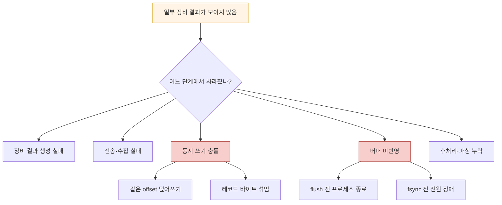
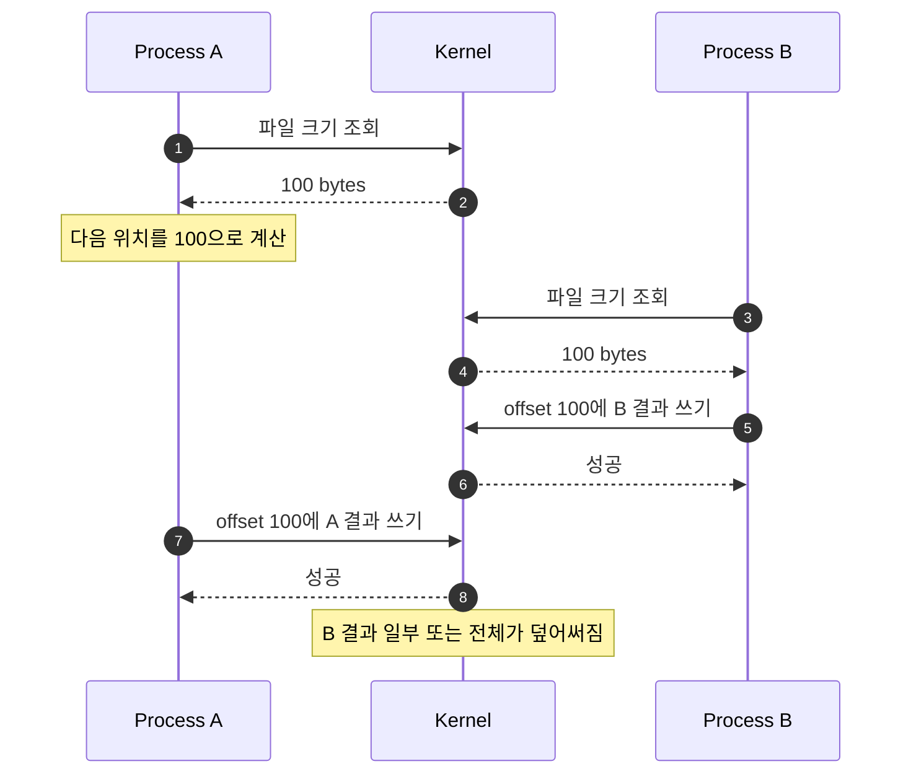
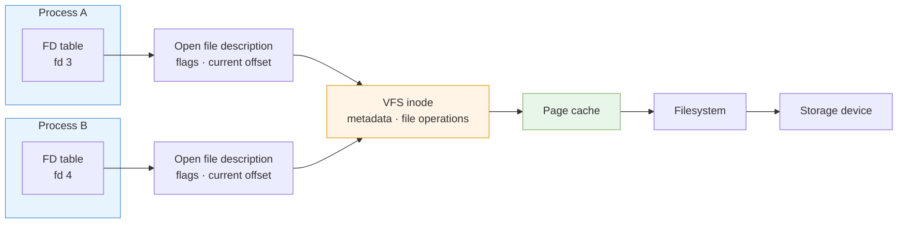
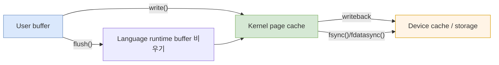
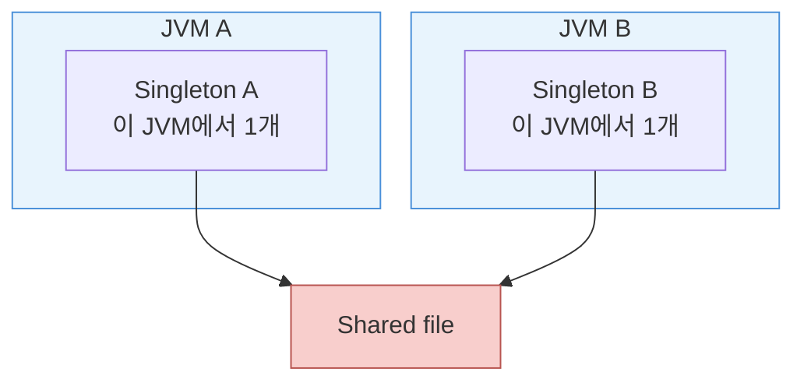
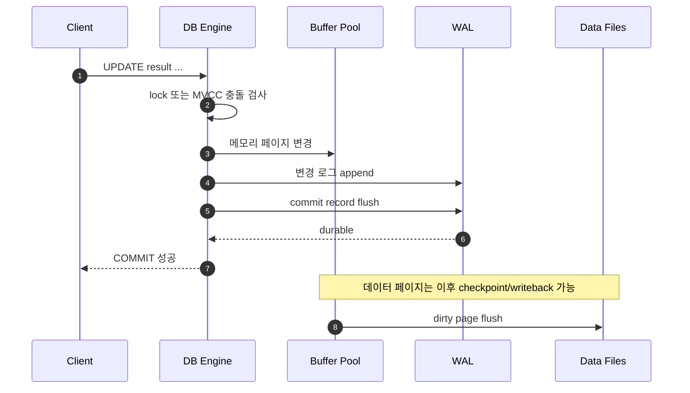
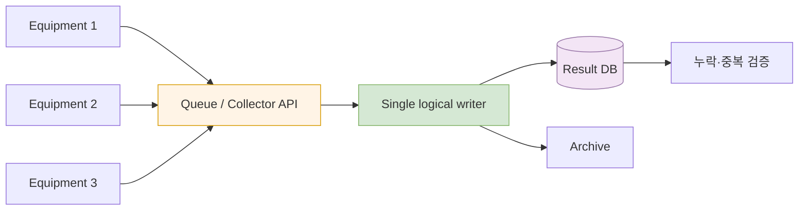

## 1. 문제를 정확히 다시 정의하기

여러 장비의 수행 결과를 한 파일로 모았는데 일부 결과가 없다면 곧바로 “동시성 문제”라고 단정하면 안 된다. 다음 원인이 모두 가능하다.

- 여러 실행 주체가 같은 위치를 덮어쓴 **Lost Update**
- 파일을 `write` 모드로 다시 열어 기존 내용을 잘라낸 **Truncation**
- 한 번의 논리적 레코드가 여러 번의 `write()`로 나뉘어 섞인 **Interleaving**
- 프로그램 버퍼나 커널 페이지 캐시가 저장 장치에 반영되기 전에 종료된 **Durability 문제**
- 네트워크, 권한, 타임아웃, 장비 식별 오류로 애초에 수집되지 않은 **수집 실패**
- 여러 PC가 네트워크 공유 폴더에 접근하면서 로컬 파일시스템과 다른 보장을 받은 경우

따라서 첫 질문은 “어떤 락을 걸까?”가 아니라 다음 네 가지다.

1. 누가 쓰는가: 한 프로세스의 여러 스레드인가, 여러 프로세스인가, 여러 PC인가?
2. 어디에 쓰는가: 로컬 디스크인가, NFS·SMB 같은 공유 스토리지인가?
3. 어떻게 쓰는가: 덮어쓰기인가, append인가, 임시 파일 뒤 rename인가?
4. 성공의 기준은 무엇인가: 함수 반환, 커널 수신, 디스크 반영, 중앙 수집 확인 중 어디인가?

아래 다이어그램은 같은 “파일 누락” 증상이 서로 다른 계층에서 생길 수 있음을 보여준다.



> 같은 증상이라도 원인이 다르면 해결책도 달라진다. 로그에 장비 ID, 시도 시각, 성공 여부, 결과 크기와 오류를 남겨야 원인을 분리할 수 있다.

## 2. 왜 `if`문만으로 막을 수 없는가

동시성의 핵심 문제는 조건문이 약해서가 아니라 **검사와 변경 사이에 다른 실행 주체가 들어올 수 있다는 것**이다.

```text
if (file_is_available()) {
    write_result();
}
```

두 프로세스가 거의 동시에 실행하면 둘 다 `file_is_available()`에서 참을 볼 수 있다. 검사 시점과 사용 시점 사이에 상태가 바뀌는 TOCTOU(Time Of Check to Time Of Use) 경쟁이다.

아래 시퀀스는 두 실행 주체가 같은 파일 끝을 계산해 덮어쓰는 전형적인 Lost Update를 보여준다.



`if` 자체가 항상 쓸모없는 것은 아니다. **검사와 상태 변경 전체를 같은 동기화 경계 안에 넣어야** 한다.

```text
lock()
try:
    if condition:
        change_state()
finally:
    unlock()
```

이때 `lock()`은 참여자 모두가 공유하는 범위에서 동작해야 한다.

| 실행 범위 | 대표 수단 |
|---|---|
| 한 프로세스의 여러 스레드 | mutex, synchronized, monitor |
| 같은 OS의 여러 프로세스 | `flock`, `fcntl`, semaphore, IPC |
| 여러 서버 | DB transaction, distributed lock, queue, 단일 writer |

프로세스 내부 mutex로 다른 PC의 스크립트를 막을 수는 없다. 동기화 수단의 범위가 경쟁 참여자의 범위보다 좁으면 보호가 성립하지 않는다.

## 3. CPU에서 원자성은 어떻게 만들어지는가

고수준 언어의 `count++`는 보통 다음과 같은 읽기-계산-쓰기 단계로 나뉜다.

```text
load count
add 1
store count
```

스레드 A와 B가 같은 값을 읽으면 두 번 증가시켜도 최종 값은 한 번만 증가할 수 있다. 운영체제의 컨텍스트 스위칭뿐 아니라 멀티코어에서 두 코어가 실제로 동시에 실행하는 상황도 고려해야 한다.

CPU는 Compare-And-Swap, Test-And-Set 같은 원자적 Read-Modify-Write 명령과 메모리 순서 보장 수단을 제공한다. JVM과 운영체제는 이를 바탕으로 mutex, monitor, semaphore 같은 더 높은 수준의 동기화 도구를 구현한다.

다만 현대 CPU가 매번 시스템 전체의 버스를 잠그는 것으로 이해하면 지나치게 단순하다. 일반적으로는 캐시 일관성 프로토콜을 통해 해당 캐시 라인의 독점 소유권을 얻어 연산을 원자적으로 수행하고, 특수한 경우에 더 강한 잠금이 필요할 수 있다.

원자성은 세 수준을 구분해야 한다.

- **언어 수준 원자성**: 다른 스레드가 중간 상태를 관찰할 수 있는가?
- **시스템 콜 수준 원자성**: 여러 프로세스의 파일 연산이 하나의 단위로 처리되는가?
- **업무 수준 원자성**: “결과 저장 + 수집 완료 표시” 전체가 함께 성공하거나 실패하는가?

CPU의 CAS 하나로 네트워크를 건너는 업무 트랜잭션 전체가 자동으로 원자화되지는 않는다.

## 4. 파일을 열면 커널에서 생기는 것

Linux에서 `open()`은 단순히 파일 이름을 기억하는 함수가 아니다. 대략 다음 구조가 연결된다.



- **File descriptor**: 프로세스가 사용하는 작은 정수 핸들
- **Open file description**: 파일 상태 플래그와 현재 offset 등을 보관하는 커널 객체
- **Inode**: 파일 크기, 권한, 블록 위치 등 파일 메타데이터를 표현
- **Page cache**: 파일 데이터를 메모리에 캐시하는 커널 영역

각 프로세스가 파일을 따로 `open()`하면 일반적으로 서로 다른 open file description과 offset을 가진다. 반대로 `fork()`나 `dup()`로 descriptor를 공유하면 같은 open file description을 가리킬 수 있다.

`write()`가 성공했다는 것은 보통 커널이 데이터를 받아 페이지 캐시에 반영했다는 뜻이지, 정전에도 견디도록 저장 장치에 영구 기록됐다는 뜻은 아니다.

아래 흐름은 애플리케이션의 쓰기가 저장 장치까지 내려가는 경계를 보여준다.



> `flush()`와 `fsync()`는 다르다. `flush()`는 언어 런타임 버퍼를 커널로 보내는 동작일 수 있고, `fsync()`는 커널에 영구 저장을 요청하는 시스템 콜이다. 저장 장치와 파일시스템 설정에 따라 실제 장애 보장 범위도 확인해야 한다.

## 5. `O_APPEND`, `PIPE_BUF`, 파일 락의 정확한 의미

### `O_APPEND`

파일을 `O_APPEND`로 열면 각 `write()` 전에 파일 offset을 끝으로 이동하고 쓰는 동작을 하나의 원자적 단계로 처리하도록 요청한다. 여러 프로세스가 직접 계산한 “현재 파일 끝”을 사용하는 것보다 안전하다.

그러나 다음 한계가 있다.

- 한 레코드를 여러 `write()` 호출로 나누면 호출 사이에 다른 프로세스의 데이터가 들어올 수 있다.
- 언어의 buffered writer가 실제 `write()` 경계를 바꿀 수 있다.
- NFS 같은 일부 네트워크 파일시스템에서는 append가 서버 측에서 완전히 원자적으로 제공되지 않아 경쟁이 생길 수 있다.
- append 원자성과 전원 장애 후 내구성은 별개다.

### `PIPE_BUF`

`PIPE_BUF` 이하 쓰기의 비혼합 보장은 **pipe와 FIFO에 관한 규칙**이다. 일반 파일의 append 안전성을 설명하는 기준으로 사용하면 안 된다. 일반 파일에 4KB 이하를 쓰면 무조건 레코드가 안 섞인다는 보장은 여기서 나오지 않는다.

### `flock`과 `fcntl`

파일 락은 같은 파일에 접근하는 프로세스 사이의 임계 구역을 만들 수 있다. 하지만 Unix 계열의 일반적인 파일 락은 **advisory lock**이다. 참여 프로그램이 모두 락 규칙을 지킬 때만 효과가 있다.

```bash
(
  flock -x 9
  printf '%s\n' "$result" >> total_result.txt
) 9>total_result.lock
```

이 예시는 Bash 계열에서 별도 lock file의 exclusive lock을 잡고 한 레코드를 append한다. 실제 환경에서는 OS, 셸, 네트워크 파일시스템의 락 지원을 확인해야 한다.

| 수단 | 막아 주는 것 | 막지 못하는 것 |
|---|---|---|
| `O_APPEND` | 같은 위치 계산으로 인한 일반적인 덮어쓰기 | 여러 `write()`로 분리된 레코드, 내구성 |
| `flock`/`fcntl` | 규칙을 따르는 프로세스 간 동시 진입 | 락을 무시하는 프로그램, 모든 분산 환경 |
| `fsync` | 커널에 영구 반영 요청 | 중복, 논리적 원자성, 잘못된 데이터 |
| 임시 파일 + `rename` | 독자가 완성 전 파일을 보는 문제 | 여러 writer의 동일 이름 충돌 |

## 6. Java Singleton과 파일 동시성은 같은 문제인가

공통점은 공유 상태에 대한 경쟁이라는 점이다. 그러나 보호 범위가 다르다.

Java의 enum singleton은 직렬화와 리플렉션을 포함해 JVM 안에서 singleton을 간결하게 구현하는 강력한 방법이지만, “완벽한 방법은 enum뿐”이라고 말할 수는 없다.

다음 방식도 Java Memory Model에 맞게 구현할 수 있다.

- 클래스 초기화 보장을 이용한 `static final`
- Initialization-on-demand holder idiom
- `volatile`과 올바른 double-checked locking
- DI container가 관리하는 singleton scope

그리고 JVM singleton은 **한 JVM 내부에서 하나**라는 뜻이다. 프로세스가 두 개면 singleton도 두 개다. 여러 장비가 공유 파일에 쓰는 문제를 Java singleton으로 해결할 수 없는 이유다.



> 언어가 제공하는 안전한 초기화 규칙과 운영체제가 제공하는 프로세스 간 파일 동기화는 서로 다른 계층의 보장이다.

## 7. DB도 파일인데 왜 더 안전해 보이는가

DB도 동시성 버그, deadlock, lost update, torn page, 장애 복구 문제를 겪는다. 차이는 문제가 없다는 것이 아니라 **동시성 제어와 복구를 전담하는 계층을 갖고 있다는 것**이다.

대표적인 구성요소는 다음과 같다.

- 트랜잭션과 격리 수준
- row/page/table lock 또는 MVCC
- buffer pool과 내부 latch
- WAL(Write-Ahead Log)
- checkpoint와 crash recovery
- checksum, replication, backup
- unique constraint와 조건부 update

아래 시퀀스는 단순화한 WAL 기반 commit 흐름이다.



WAL의 핵심은 변경된 데이터 페이지보다 복구에 필요한 로그를 먼저 영구 기록하는 것이다. 장애 후 DB는 로그를 재생하거나 취소해 일관된 상태로 복구한다.

DB가 모든 쓰기를 무조건 단일 스레드로 처리해서 안전한 것은 아니다. 여러 트랜잭션이 병렬로 실행되며, lock·MVCC·latch·로그 순서와 복구 규칙으로 충돌을 조정한다. DB 제품마다 내부 구조도 다르다.

DB를 사용해도 다음 코드는 lost update를 만들 수 있다.

```text
value = SELECT count FROM result_summary WHERE id = 1
UPDATE result_summary SET count = value + 1 WHERE id = 1
```

대신 DB가 하나의 원자적 statement로 처리하게 할 수 있다.

```sql
UPDATE result_summary
SET count = count + 1
WHERE id = 1;
```

중복 수집을 막으려면 업무 키와 제약 조건도 필요하다.

```sql
CREATE TABLE equipment_result (
    equipment_id text NOT NULL,
    run_id text NOT NULL,
    payload jsonb NOT NULL,
    collected_at timestamptz NOT NULL DEFAULT now(),
    PRIMARY KEY (equipment_id, run_id)
);
```

DB의 락만 믿는 것이 아니라 `(equipment_id, run_id)`가 한 번만 들어가야 한다는 업무 규칙을 schema에 선언한 것이다.

## 8. 현장에서 가장 안전한 수집 구조

비개발자가 운영하는 장비 스크립트라면 공유 파일의 정교한 잠금보다 **writer를 분리하고 중앙에서 병합하는 구조**가 이해와 복구 측면에서 유리하다.

### 권장안 A: 장비별 고유 파일

```text
incoming/
  EQ-001/2026-06-18T101500_run-77.json
  EQ-002/2026-06-18T101502_run-31.json
  EQ-003/2026-06-18T101505_run-92.json
```

한 장비가 임시 파일에 완전히 쓴 뒤 같은 파일시스템 안에서 최종 이름으로 rename한다.

```text
write result.tmp
flush
fsync if required
rename result.tmp -> result.json
```

수집기는 최종 확장자의 파일만 읽고, 처리한 파일을 archive로 이동한다. 파일 이름에는 최소한 장비 ID와 실행 ID를 넣고, 시간만으로 유일성을 가정하지 않는다.

### 권장안 B: 중앙 단일 writer

장비는 직접 공유 파일에 쓰지 않고 중앙 수집 프로세스에 결과를 전달한다. 중앙 writer만 최종 파일이나 DB를 수정한다.



“단일 writer”는 반드시 한 스레드라는 뜻이 아니다. 최종 반영을 한 서비스나 DB 트랜잭션 경계에서 통제한다는 의미다.

### 권장안 C: 공유 파일 append

환경 제약으로 한 파일만 사용할 수 있을 때의 차선책이다.

1. 모든 writer가 동일한 lock 규칙을 사용한다.
2. 한 레코드를 가능한 한 한 번의 write로 전달한다.
3. 각 레코드에 장비 ID, 실행 ID, 길이 또는 명확한 구분자를 넣는다.
4. write 반환값을 확인하고 short write를 처리한다.
5. 필요한 내구성 수준에 따라 flush와 fsync 정책을 정한다.
6. 네트워크 공유 폴더라면 append와 lock의 실제 보장을 별도로 시험한다.

## 9. 누락과 중복을 검출하는 설계

동시성 제어만으로 운영 신뢰성이 완성되지는 않는다. 수집 대상과 수집 결과를 대조할 수 있어야 한다.

| 필드 | 목적 |
|---|---|
| `equipment_id` | 어느 장비의 결과인지 식별 |
| `run_id` | 장비 실행 한 건을 유일하게 식별 |
| `started_at`, `finished_at` | 지연과 타임아웃 분석 |
| `sequence` | 순서와 중간 누락 검출 |
| `payload_size` | 빈 파일·잘림 검출 |
| `checksum` | 전송·저장 중 손상 검출 |
| `attempt` | 재시도 횟수 확인 |
| `status`, `error_code` | 생성 실패와 수집 실패 구분 |

예상 장비 실행 목록과 실제 수집 목록의 차이를 주기적으로 계산한다.

```text
missing = expected_runs - collected_runs
duplicate = collected_runs grouped by (equipment_id, run_id) having count > 1
```

재시도는 중복을 만들 수 있으므로 수집기는 같은 `run_id`를 다시 받아도 결과가 변하지 않는 멱등성을 가져야 한다.

## 10. 진단 순서

실제 스크립트를 받으면 다음 순서로 확인한다.

1. 파일을 `w`, `a`, `r+` 중 어떤 모드로 여는지 찾는다.
2. 파일을 여는 주체가 하나인지 여러 개인지 확인한다.
3. 한 레코드가 몇 번의 write로 나가는지 확인한다.
4. write·flush·close의 오류와 반환값을 기록하는지 확인한다.
5. 로컬 파일인지 NFS·SMB 공유 폴더인지 확인한다.
6. 장비별 생성 건수와 최종 파일의 고유 `run_id` 개수를 비교한다.
7. 강제 동시 실행, 프로세스 kill, 네트워크 단절, 디스크 부족을 재현한다.

관찰할 수 없는 시스템은 안전한지 검증할 수 없다. 먼저 결과마다 고유 ID를 넣고 입력 건수와 출력 건수를 자동 대조해야 한다.

## 11. 단계별 실습

### 실습 A: Lost Update 재현

1. 두 프로세스가 파일 크기를 읽는다.
2. 의도적으로 sleep을 넣는다.
3. 두 프로세스가 같은 offset에 `pwrite()`한다.
4. 최종 파일에서 한 결과가 덮인 것을 확인한다.

### 실습 B: Append와 레코드 경계

1. 여러 프로세스가 같은 파일을 append 모드로 연다.
2. 한 레코드를 한 번의 write로 쓰는 버전과 여러 write로 나누는 버전을 비교한다.
3. 장비 ID와 sequence로 누락·혼합 여부를 검사한다.
4. 로컬 파일시스템과 공유 폴더 결과를 비교한다.

### 실습 C: Lock

1. lock 없이 병렬 append한다.
2. 모든 writer가 `flock`을 사용하도록 바꾼다.
3. 한 writer만 lock을 무시하게 만들어 advisory lock의 한계를 확인한다.
4. lock 대기 시간과 전체 처리량을 측정한다.

### 실습 D: 장애와 내구성

1. buffered write 뒤 flush 없이 프로세스를 종료한다.
2. flush만 한 경우와 fsync까지 한 경우를 구분한다.
3. 성공 응답 시점을 각각 어디로 둘지 결정한다.
4. 장애 후 예상 건수와 실제 건수를 대조한다.

### 실습 E: DB 수집기

1. `(equipment_id, run_id)`를 primary key로 만든다.
2. 동일 결과를 동시에 여러 번 insert한다.
3. unique violation 또는 upsert로 중복을 제어한다.
4. 수집 완료 표시와 결과 저장을 한 transaction으로 묶는다.

## 12. 연습문제

### 문제 1

프로세스 내부의 `synchronized`로 여러 PC가 NFS 파일에 동시에 쓰는 문제를 막을 수 없는 이유를 설명하라.

### 문제 2

`O_APPEND`를 사용했는데도 한 줄의 JSON이 다른 JSON 사이에 끼어들었다. 가능한 원인을 두 가지 적어라.

### 문제 3

`write()`가 성공한 직후 서버 전원이 꺼졌다. 재부팅 후 결과가 없을 수 있는 이유와 필요한 추가 조치를 설명하라.

### 문제 4

DB에서 값을 읽고 Java에서 1을 더한 뒤 update하는 코드가 lost update를 만드는 과정을 설명하고, 원자적 SQL로 바꿔라.

### 문제 5

장비 100대가 매시간 한 번씩 결과를 만든다. 파일 분리 방식으로 누락·중복·손상을 검출할 파일 이름과 메타데이터를 설계하라.

<details>
<summary>정답과 해설</summary>

1. `synchronized`의 monitor는 한 JVM 안에서만 공유된다. 다른 프로세스나 다른 PC는 별도의 monitor를 가지므로 공통 임계 구역이 되지 않는다.
2. 한 JSON을 여러 번의 write로 나눴거나, 언어 런타임 버퍼가 예상과 다른 write 경계를 만들었을 수 있다. 네트워크 파일시스템의 append 보장이 로컬과 다를 가능성도 확인한다.
3. write 성공은 페이지 캐시 반영만 뜻할 수 있다. 요구 내구성에 맞춰 flush, fsync 또는 fdatasync를 사용하고 성공 응답 시점을 정해야 한다.
4. 두 transaction이 같은 이전 값을 읽고 같은 새 값을 쓰면 한 증가가 사라진다. `UPDATE table SET count = count + 1 WHERE id = ?`처럼 DB가 한 statement로 처리하게 한다.
5. 파일 이름에 `equipment_id`, `run_id`를 넣고 내용에 sequence, 시작·종료 시각, payload size, checksum, schema version을 기록한다. 예상 실행 목록과 `(equipment_id, run_id)` 집합을 대조한다.

</details>

## 13. 완료 체크

- [ ] 누락을 동시성 문제라고 단정하기 전에 수집 파이프라인의 각 단계를 구분했다.
- [ ] `if`와 원자적 check-and-set의 차이를 설명할 수 있다.
- [ ] file descriptor, open file description, inode, page cache의 관계를 설명할 수 있다.
- [ ] `O_APPEND`, `PIPE_BUF`, advisory lock의 보장 범위를 구분할 수 있다.
- [ ] flush, fsync, atomicity, durability의 차이를 설명할 수 있다.
- [ ] JVM singleton이 프로세스 간 락이 아닌 이유를 설명할 수 있다.
- [ ] DB의 WAL, lock·MVCC, unique constraint가 맡는 역할을 구분할 수 있다.
- [ ] 장비별 파일 또는 중앙 writer 구조를 설계했다.
- [ ] 고유 실행 ID로 누락과 중복을 자동 검출한다.
- [ ] 동시 실행과 장애 주입 테스트로 보장을 검증했다.

## 14. 한 문장 결론

동시성은 `if`문을 더 정교하게 쓰는 문제가 아니라, **경쟁하는 모든 실행 주체가 공유하는 계층에서 원자성·순서·내구성·멱등성을 각각 보장하고 검증하는 문제**다.
