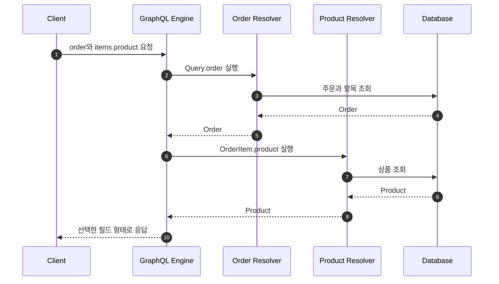

## 1. GraphQL을 한 문장으로 설명하기

GraphQL은 **클라이언트가 스키마 안에서 필요한 필드를 선언하고, 서버가 그 요청 형태에 맞는 데이터를 반환하는 API 질의 언어와 실행 규약**이다.

GraphQL의 핵심은 엔드포인트 수가 아니라 타입 시스템과 필드 선택이다.

```graphql
query {
  order(id: "order-1") {
    id
    status
    customer {
      name
    }
    items {
      quantity
      product {
        name
      }
    }
  }
}
```

## 2. REST와 비교하기

| 관점 | REST | GraphQL |
|---|---|---|
| 요청 단위 | 리소스 URL | 스키마의 필드 |
| 응답 형태 | 서버가 고정 | 클라이언트가 선택 |
| 여러 데이터 조합 | 여러 요청이 필요할 수 있음 | 한 Query로 조합 가능 |
| 캐시 | HTTP 캐시 활용이 쉬움 | 별도 전략이 필요할 수 있음 |
| 오류 | HTTP 상태 코드 중심 | `data`와 `errors`가 함께 올 수 있음 |
| 복잡도 통제 | 엔드포인트별 통제 | Query depth와 cost 통제 필요 |

GraphQL이 REST의 상위 호환은 아니다. 화면별 데이터 조합이 자주 바뀌거나 여러 리소스를 한 번에 탐색해야 할 때 특히 유용하다.

## 3. 첫 Schema 작성

```graphql
type Query {
  order(id: ID!): Order
  orders(first: Int!, after: String): OrderConnection!
}

type Mutation {
  createOrder(input: CreateOrderInput!): CreateOrderPayload!
}

type Order {
  id: ID!
  status: OrderStatus!
  customer: Customer!
  items: [OrderItem!]!
  totalAmount: Int!
}

input CreateOrderInput {
  requestId: ID!
  customerId: ID!
  items: [OrderItemInput!]!
}

type CreateOrderPayload {
  order: Order
  error: OrderError
}

enum OrderStatus {
  CREATED
  PAID
  COMPLETED
  CANCELLED
}
```

`!`는 null이 아님을 뜻한다. 무조건 붙이면 이후 호환성 변경이 어려워질 수 있으므로 실제 보장 가능한 필드에만 사용한다.

## 4. Resolver 실행 이해하기

아래 흐름은 하나의 Query가 여러 Resolver를 거쳐 응답으로 조립되는 과정을 보여준다.



Resolver는 필드를 반환하는 함수다. Resolver 안에 모든 비즈니스 로직을 넣지 말고 애플리케이션 서비스에 위임한다.

## 5. N+1 문제

주문 10개를 조회한 뒤 각 주문의 상품을 별도 SQL로 조회하면 최초 1회 + 추가 N회의 쿼리가 발생한다.

```text
SELECT * FROM orders LIMIT 10;          -- 1회
SELECT * FROM products WHERE id = ?;    -- 최대 N회
```

해결 방법:

- 필요한 관계를 한 번에 조회하는 join 또는 fetch 전략
- 여러 키를 모아 한 번에 조회하는 DataLoader
- 요청 범위 캐시

DataLoader의 핵심은 `productId` 요청을 모아 `WHERE id IN (...)` 한 번으로 바꾸는 것이다.

## 6. Pagination

데이터가 늘어날 가능성이 있다면 목록 필드에 페이지네이션을 둔다.

```graphql
type OrderConnection {
  edges: [OrderEdge!]!
  pageInfo: PageInfo!
}

type OrderEdge {
  cursor: String!
  node: Order!
}

type PageInfo {
  hasNextPage: Boolean!
  endCursor: String
}
```

Offset 방식은 단순하지만 데이터가 삽입되거나 삭제될 때 중복과 누락이 생길 수 있다. Cursor 방식은 정렬 기준이 안정적일 때 다음 위치를 더 일관되게 표현한다.

## 7. 오류와 보안

GraphQL은 HTTP 200 응답 안에 `data`와 `errors`가 함께 존재할 수 있다. 사용자에게 보여줄 도메인 오류와 서버 결함을 구분한다.

```json
{
  "data": {
    "createOrder": {
      "order": null,
      "error": {
        "code": "OUT_OF_STOCK",
        "message": "재고가 부족합니다."
      }
    }
  }
}
```

반드시 고려할 방어:

- Query depth 제한
- Query complexity 또는 cost 제한
- 페이지 크기 상한
- 필드 단위 인가
- Introspection 공개 범위
- 민감 정보가 오류에 노출되지 않도록 처리

## 8. 단계별 실습

### 실습 A: 주문 조회

1. `Order`, `OrderItem`, `Product` 타입을 작성한다.
2. `order(id)` Query를 구현한다.
3. 클라이언트가 필드를 다르게 선택했을 때 응답 모양이 바뀌는지 확인한다.
4. 없는 주문은 nullable 결과로 반환한다.

### 실습 B: 주문 생성

1. `CreateOrderInput`과 Mutation을 작성한다.
2. 빈 항목, 0 이하 수량을 검증한다.
3. 재고 부족은 도메인 오류 코드로 반환한다.
4. `requestId`로 중복 주문을 막는다.

### 실습 C: N+1 재현과 해결

1. 주문 20개와 각 주문의 상품을 조회한다.
2. SQL 로그에서 쿼리 횟수를 센다.
3. DataLoader를 적용한다.
4. 적용 전후 쿼리 수를 테스트로 고정한다.

## 9. 연습문제

### 문제 1

`orders: [Order!]!`에서 바깥쪽과 안쪽의 `!`가 각각 보장하는 것을 설명하자.

### 문제 2

주문 목록 화면에 주문자 이름, 최근 결제 상태, 상품 대표 이미지가 필요하다. GraphQL이 유리한 이유와 여전히 주의할 점을 적어보자.

### 문제 3

관리자만 볼 수 있는 `Order.costPrice` 필드가 있다. Query 진입점에서만 관리자 여부를 검사하면 왜 부족한가?

### 문제 4

다음 중 Schema에 넣을 것과 서비스 내부 구현으로 숨길 것을 구분하자.

- 주문 상태
- DB 테이블 이름
- 페이지 Cursor
- 재고 서비스의 IP 주소
- 사용자에게 보여줄 오류 코드

<details>
<summary>정답과 해설</summary>

1. 바깥쪽 `!`는 목록 자체가 null이 아님을, 안쪽 `!`는 목록 원소가 null이 아님을 보장한다.
2. 필요한 필드를 한 요청에서 조합할 수 있다. 반면 N+1, Query 비용, 필드별 인가를 주의해야 한다.
3. 다른 Query 경로로 같은 필드에 접근할 수 있으므로 민감 필드 Resolver 자체에서 인가해야 한다.
4. 주문 상태, Cursor, 공개 오류 코드는 Schema에 둘 수 있다. 테이블 이름과 서비스 IP는 내부 구현이다.

</details>

## 10. 완료 체크

- [ ] Schema와 Resolver의 역할을 구분한다.
- [ ] nullability를 의도적으로 설계했다.
- [ ] Query와 Mutation을 각각 구현했다.
- [ ] N+1 문제를 SQL 로그로 재현했다.
- [ ] DataLoader 적용 전후를 비교했다.
- [ ] 페이지 크기와 Query 복잡도를 제한했다.
- [ ] 필드 단위 인가가 필요한 이유를 설명할 수 있다.
