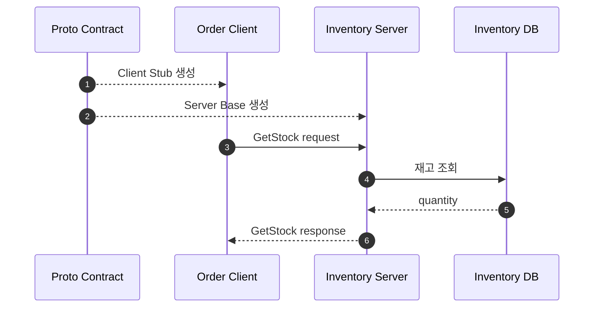
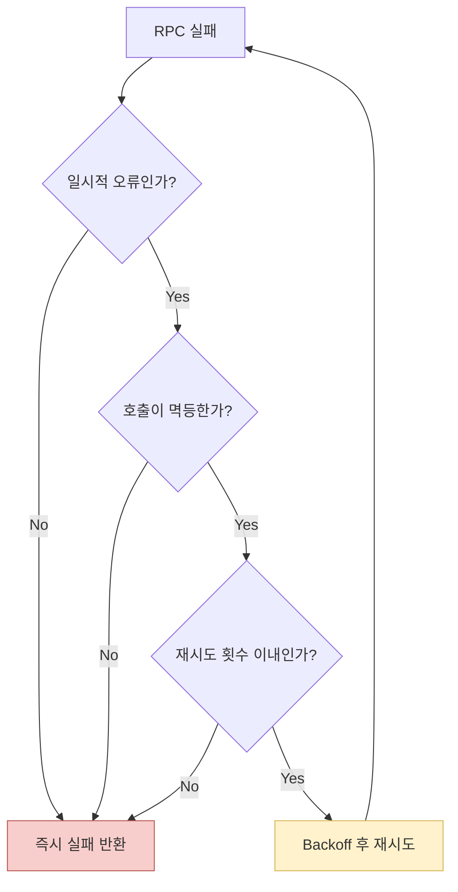

## 1. gRPC를 한 문장으로 설명하기

gRPC는 **서비스 계약을 Proto 파일로 정의하고, 생성된 클라이언트와 서버 코드를 이용해 원격 함수를 호출하는 RPC 프레임워크**다.

REST가 주로 HTTP 리소스와 JSON을 중심으로 설계된다면, gRPC는 메서드와 강한 타입의 메시지를 중심으로 설계된다.

| 구분 | REST + JSON | gRPC + Protobuf |
|---|---|---|
| 계약 | OpenAPI를 별도로 둘 수 있음 | `.proto`가 계약의 중심 |
| 전송 | 주로 HTTP/1.1 또는 HTTP/2 | HTTP/2 |
| 데이터 | 사람이 읽기 쉬운 JSON | 작고 빠른 바이너리 |
| 호출 방식 | URL + HTTP method | 생성된 Stub의 메서드 |
| 스트리밍 | 별도 기술 필요 | 기본 지원 |
| 브라우저 | 직접 사용하기 쉬움 | gRPC-Web 등 보완 필요 |

## 2. 호출 흐름

아래 다이어그램은 Proto 계약이 서버와 클라이언트를 연결하는 과정을 보여준다.



핵심은 클라이언트와 서버가 같은 `.proto` 계약에서 코드를 생성한다는 점이다.

## 3. 첫 Proto 작성

```proto
syntax = "proto3";

package inventory.v1;

option java_multiple_files = true;
option java_package = "com.example.inventory.v1";

service InventoryService {
  rpc GetStock(GetStockRequest) returns (GetStockResponse);
  rpc ReserveStock(ReserveStockRequest) returns (ReserveStockResponse);
}

message GetStockRequest {
  int64 product_id = 1;
}

message GetStockResponse {
  int64 product_id = 1;
  int32 quantity = 2;
}

message ReserveStockRequest {
  string request_id = 1;
  int64 product_id = 2;
  int32 quantity = 3;
}

message ReserveStockResponse {
  string reservation_id = 1;
  int32 remaining_quantity = 2;
}
```

### 반드시 이해할 규칙

- 필드 번호는 직렬화 형식의 일부이므로 기존 번호의 의미를 바꾸지 않는다.
- 삭제한 필드 번호와 이름은 `reserved`로 남기는 편이 안전하다.
- 메시지 이름은 의미를 드러내고, 범용 `Data`나 `Result`는 피한다.
- 하위 호환성을 위해 새 필드는 추가하되 기존 필드를 재해석하지 않는다.

삭제한 필드는 다음처럼 보호한다.

```proto
message GetStockResponse {
  reserved 3;
  reserved "warehouse_name";

  int64 product_id = 1;
  int32 quantity = 2;
}
```

## 4. 네 가지 RPC 방식

| 방식 | 요청 | 응답 | 예시 |
|---|---:|---:|---|
| Unary | 1 | 1 | 상품 하나의 재고 조회 |
| Server streaming | 1 | N | 재고 변동 내역 구독 |
| Client streaming | N | 1 | 여러 센서 값 집계 |
| Bidirectional streaming | N | N | 실시간 채팅 |

처음에는 Unary를 정확히 익힌 뒤 실제 요구가 있을 때 스트리밍으로 확장한다.

## 5. 실패를 API 계약으로 만들기

재고가 부족할 때 일반 예외를 그대로 노출하지 말고 gRPC 상태 코드로 변환한다.

```java
if (stock < request.getQuantity()) {
    responseObserver.onError(
        Status.FAILED_PRECONDITION
            .withDescription("insufficient stock")
            .asRuntimeException()
    );
    return;
}
```

자주 사용하는 상태 코드는 다음과 같다.

| 상태 | 의미 | 예시 |
|---|---|---|
| `INVALID_ARGUMENT` | 요청 형식 또는 값이 잘못됨 | 수량이 0 이하 |
| `NOT_FOUND` | 대상 없음 | 상품 ID 없음 |
| `ALREADY_EXISTS` | 이미 생성됨 | 예약 ID 중복 |
| `FAILED_PRECONDITION` | 현재 상태에서 처리 불가 | 재고 부족 |
| `UNAVAILABLE` | 일시적 서버 장애 | 서버 또는 네트워크 장애 |
| `DEADLINE_EXCEEDED` | 제한 시간 초과 | 응답 지연 |

## 6. Deadline, Retry, 멱등성

클라이언트는 무한정 기다리지 않도록 deadline을 설정해야 한다.

```java
var response = inventoryStub
    .withDeadlineAfter(500, TimeUnit.MILLISECONDS)
    .reserveStock(request);
```

재시도는 모든 오류에 적용하지 않는다.

아래 흐름은 안전한 재시도 판단 순서를 보여준다.



재고 예약은 상태를 바꾸므로 요청에 `request_id`를 포함하고, 서버가 이미 처리한 ID인지 확인해야 한다.

## 7. 단계별 실습

### 실습 A: 재고 조회

1. `GetStock` Proto를 작성한다.
2. 서버에서 인메모리 Map의 재고를 반환한다.
3. 클라이언트에서 상품 ID 1을 조회한다.
4. 없는 ID는 `NOT_FOUND`로 반환한다.

완료 조건:

- 정상 응답과 오류 응답을 모두 확인했다.
- 생성 코드와 직접 작성한 코드를 구분할 수 있다.

### 실습 B: 재고 예약

1. `ReserveStock`을 구현한다.
2. 수량이 0 이하면 `INVALID_ARGUMENT`를 반환한다.
3. 재고가 부족하면 `FAILED_PRECONDITION`을 반환한다.
4. 같은 `request_id`를 두 번 보내도 한 번만 차감한다.

### 실습 C: 장애 관찰

1. 서버 응답을 1초 지연시킨다.
2. 클라이언트 deadline을 300ms로 설정한다.
3. `DEADLINE_EXCEEDED`를 확인한다.
4. 조회 RPC에만 최대 2회 재시도를 적용한다.

## 8. 연습문제

### 문제 1

Proto에서 `quantity = 2` 필드를 삭제한 뒤 새로운 `warehouse_id`에 같은 번호 2를 사용하면 왜 위험한가?

### 문제 2

다음 기능에 적합한 RPC 방식을 고르자.

- 상품 하나의 현재 재고 조회
- 한 창고의 재고 변동을 실시간 구독
- 클라이언트가 로그 여러 개를 전송하고 서버가 요약 결과 하나를 반환

### 문제 3

`ReserveStock` 호출이 deadline을 넘겼다. 클라이언트는 서버가 실제로 예약했는지 모른다. 중복 차감을 막는 설계를 적어보자.

### 문제 4

gRPC를 외부 공개 웹 API보다 내부 서비스 통신에 우선 고려하는 이유와 단점을 각각 두 가지 적어보자.

<details>
<summary>정답과 해설</summary>

1. 이전 클라이언트는 필드 2를 여전히 수량으로 해석할 수 있다. 삭제한 번호는 `reserved` 처리한다.
2. 순서대로 Unary, Server streaming, Client streaming이다.
3. 클라이언트가 고유 `request_id`를 보내고 서버가 처리 결과를 저장한다. 같은 ID가 오면 이전 결과를 반환한다.
4. 장점은 강한 계약, 생성 코드, 작은 메시지, 스트리밍이다. 단점은 브라우저 직접 지원, 디버깅 가독성, 계약 배포 관리 비용이다.

</details>

## 9. 완료 체크

- [ ] `.proto`가 왜 계약의 중심인지 설명할 수 있다.
- [ ] 네 가지 RPC 유형을 구분할 수 있다.
- [ ] 상태 코드를 도메인 실패와 연결했다.
- [ ] deadline을 직접 발생시켰다.
- [ ] 상태 변경 RPC에 멱등성 키를 적용했다.
- [ ] Retry가 실패를 증폭할 수 있는 이유를 설명할 수 있다.
