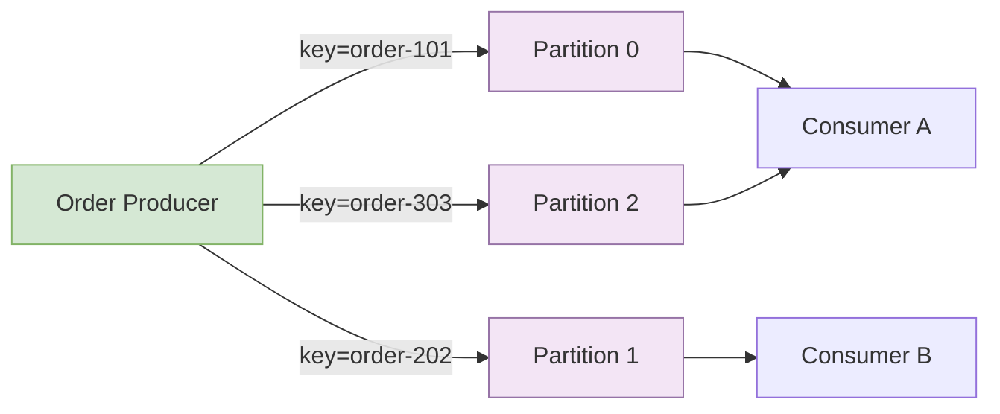
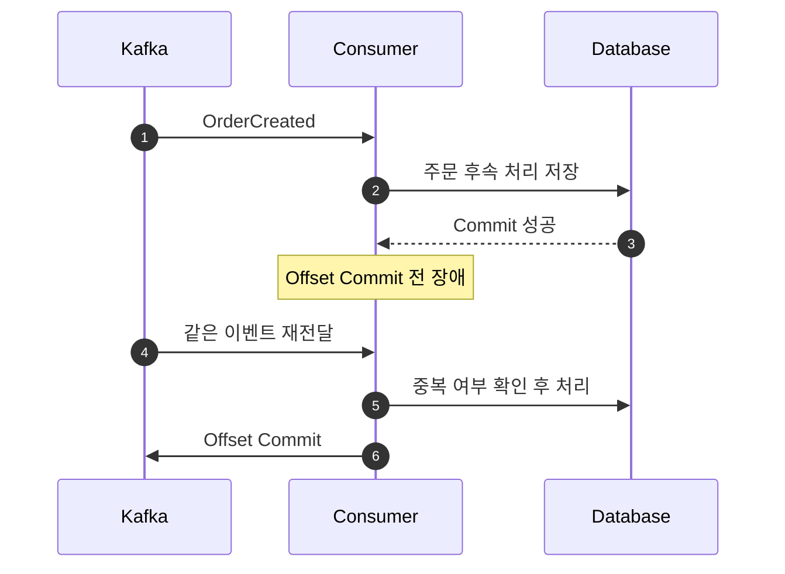

## 1. Kafka를 한 문장으로 설명하기

Kafka는 **이벤트를 토픽의 파티션에 순서대로 기록하고, 여러 Consumer가 각자의 Offset을 기준으로 다시 읽을 수 있게 하는 분산 로그 시스템**이다.

메시지를 한 번 전달하고 지우는 단순 Queue로만 이해하면 보존 기간, 재처리, 파티션 순서, Consumer Group의 의미를 놓치기 쉽다.

## 2. 핵심 구성요소

| 용어 | 역할 |
|---|---|
| Broker | 이벤트를 저장하고 요청을 처리하는 서버 |
| Topic | 같은 종류의 이벤트를 모은 논리적 이름 |
| Partition | Topic을 나눈 실제 순서 보장 단위 |
| Record | Key, Value, Header, Timestamp를 가진 이벤트 |
| Producer | Record를 Topic에 발행 |
| Consumer | Partition의 Record를 읽음 |
| Consumer Group | Partition을 나눠 처리하는 Consumer 집합 |
| Offset | Partition 안에서 Record의 위치 |

아래 다이어그램은 주문 ID를 Key로 발행했을 때 같은 주문 이벤트가 같은 Partition으로 가는 흐름을 보여준다.



> 하나의 Consumer Group 안에서 한 Partition은 동시에 한 Consumer에게만 할당된다.

## 3. Partition과 순서

Kafka가 보장하는 순서는 Topic 전체가 아니라 **Partition 내부 순서**다.

주문 상태 이벤트의 Key를 `orderId`로 잡으면 같은 주문의 `CREATED → PAID → COMPLETED`가 같은 Partition에 기록된다. Key가 없으면 이벤트가 여러 Partition에 분산되어 같은 주문의 처리 순서가 달라질 수 있다.

Partition 수를 늘릴 때 고려할 점:

- 병렬 처리량의 상한이 늘어난다.
- 파일, 네트워크, 메타데이터 관리 비용도 늘어난다.
- 기존 Key가 매핑되는 Partition이 달라질 수 있다.
- Consumer 수가 Partition 수보다 많으면 남는 Consumer가 생긴다.
- 줄이는 작업은 단순하지 않으므로 처음부터 과도하게 만들지 않는다.

## 4. Producer의 성공 기준

`acks`는 Producer가 성공으로 판단하기 전에 필요한 확인 범위를 정한다.

| 설정 | 의미 | 특징 |
|---|---|---|
| `acks=0` | 확인을 기다리지 않음 | 빠르지만 유실을 감지하기 어려움 |
| `acks=1` | Leader 기록 확인 | Leader 장애 시 일부 유실 가능성 |
| `acks=all` | 필요한 Replica 기록 확인 | 내구성이 높고 지연이 늘 수 있음 |

중요 이벤트는 일반적으로 idempotent producer, 적절한 replication, `acks=all`을 함께 검토한다. 설정 하나만으로 end-to-end exactly-once가 완성되지는 않는다.

## 5. Kafka 압축 방식

Kafka Producer는 Record 하나씩이 아니라 **Record Batch 단위로 압축**한다. 같은 Partition으로 가는 메시지가 충분히 모일수록 압축 효율이 좋아진다. Broker는 압축된 Batch를 저장하고 Consumer가 풀어서 읽는다.

대표 `compression.type` 선택지는 다음과 같다.

| 방식 | 압축률 | CPU 비용 | 일반적 특징 |
|---|---|---|---|
| `none` | 없음 | 가장 낮음 | 작은 트래픽의 기준선 |
| `gzip` | 높음 | 높음 | 네트워크 절감 우선, CPU 여유 필요 |
| `snappy` | 보통 | 낮음 | 속도와 압축률의 균형 |
| `lz4` | 보통 | 매우 낮음 | 낮은 지연과 높은 처리량에 유리 |
| `zstd` | 높음 | 중간 | 높은 압축률과 처리량의 균형 |

무조건 가장 압축률이 높은 방식을 고르지 않는다. 메시지 크기, 초당 건수, Producer CPU, Broker 디스크와 네트워크, Consumer 해제 비용을 함께 측정한다.

### 압축과 함께 보는 Producer 설정

- `batch.size`: 한 Partition에 모을 Batch 크기
- `linger.ms`: Batch를 모으기 위해 기다릴 최대 시간
- `compression.type`: 압축 Codec
- `max.request.size`: 한 요청의 최대 크기

`linger.ms`를 늘리면 Batch가 잘 모여 처리량과 압축률이 좋아질 수 있지만 개별 메시지 지연은 늘어난다.

### 압축 비교 실습

동일한 주문 이벤트 10만 건을 `none`, `gzip`, `snappy`, `lz4`, `zstd`로 각각 발행하고 기록한다.

| 측정값 | 질문 |
|---|---|
| 전체 전송 바이트 | 네트워크가 얼마나 줄었는가? |
| Producer 처리 시간 | 압축 CPU 비용은 얼마인가? |
| 초당 Record 수 | 처리량이 어떻게 달라졌는가? |
| p95 발행 지연 | Batch 대기와 압축이 지연에 미친 영향은? |
| Consumer CPU와 시간 | 압축 해제 비용은 얼마인가? |

텍스트 JSON은 반복 문자열이 많아 압축 효과가 큰 편이고, 이미 압축된 이미지나 암호화된 Payload는 효과가 작을 수 있다.

## 6. Offset과 전달 의미

Consumer가 처리 전에 Offset을 Commit하고 죽으면 메시지를 놓칠 수 있다. 처리 후 Commit하면 장애 시 같은 메시지를 다시 처리할 수 있다.

아래 다이어그램은 at-least-once 처리에서 중복이 생기는 지점을 보여준다.



실무에서는 at-least-once 전달과 Consumer 멱등성을 함께 설계하는 경우가 많다.

## 7. Consumer 멱등성과 재처리

주문 이벤트에 `eventId`를 넣고 DB에 처리 이력을 저장한다.

```text
processed_events
- event_id unique
- consumer_name
- processed_at
```

이벤트 처리 결과와 처리 이력 저장을 같은 DB 트랜잭션에 두면 중복 방지 기준이 명확해진다.

실패 처리 선택지:

- 일시적 오류: 제한된 Retry와 Backoff
- 데이터 오류: Dead Letter Topic으로 이동
- 시스템 장애: Consumer 중단 또는 Circuit Breaker
- 수정 후 재처리: DLT 또는 원본 Offset에서 Replay

DLT를 만들었다고 끝이 아니다. 원인, 재처리 명령, 중복 방지, 보존 기간, 알림을 함께 설계한다.

## 8. Schema 변경

이벤트는 Producer와 Consumer가 서로 다른 시점에 배포되므로 하위 호환성이 중요하다.

- 새 필드는 Consumer가 없어도 처리 가능한 기본값을 갖게 한다.
- 필드 의미를 바꾸지 않는다.
- 삭제보다 단계적 폐기를 택한다.
- 이벤트 타입과 Schema 버전을 명시한다.
- JSON, Avro, Protobuf 중 조직의 Schema 관리 방식에 맞춰 선택한다.

## 9. 단계별 실습

### 실습 A: 첫 이벤트

1. `order.created` Topic을 만든다.
2. 주문 생성 후 `OrderCreated`를 발행한다.
3. Consumer가 이벤트를 로그로 출력한다.
4. 주문 ID를 Key로 설정하고 Partition을 확인한다.

### 실습 B: Consumer Group

1. Partition 3개, Consumer 1개로 시작한다.
2. Consumer를 2개, 3개, 4개로 늘린다.
3. Partition 할당과 처리량을 기록한다.
4. Consumer 하나를 종료해 Rebalance를 관찰한다.

### 실습 C: 압축 Benchmark

1. 같은 Payload와 설정으로 Codec만 변경한다.
2. Warm-up 후 3회 이상 실행한다.
3. 평균뿐 아니라 p95 지연과 전송량을 기록한다.
4. 선택한 Codec과 이유를 README에 적는다.

### 실습 D: 중복과 DLT

1. DB 저장 뒤 Offset Commit 전에 의도적으로 종료한다.
2. 재시작 후 중복 이벤트를 확인한다.
3. `eventId` unique constraint로 멱등 처리한다.
4. 유효하지 않은 이벤트를 DLT로 보내고 수정 후 재처리한다.

## 10. 연습문제

### 문제 1

주문 ID가 같은 이벤트의 순서를 지키려면 Message Key를 어떻게 정해야 하는가? Topic 전체 순서가 필요한 경우의 비용도 적어보자.

### 문제 2

Producer가 `gzip`으로 바꾼 뒤 네트워크는 줄었지만 p99 지연과 CPU가 크게 늘었다. 어떤 설정과 Codec을 비교해야 하는가?

### 문제 3

Partition 6개인 Topic에 같은 Group의 Consumer가 10개 있다. 동시에 실제 Record를 처리할 수 있는 Consumer는 최대 몇 개인가?

### 문제 4

Consumer가 DB 반영에는 성공했지만 Offset Commit 전에 죽었다. 왜 중복이 발생하며 어떻게 막는가?

### 문제 5

DLT에 쌓인 이벤트를 원본 Topic으로 그대로 재발행할 때 생길 수 있는 문제를 세 가지 적어보자.

<details>
<summary>정답과 해설</summary>

1. `orderId`를 Key로 사용한다. Topic 전체 순서는 Partition 하나로 만들 수 있지만 병렬 처리량과 확장성이 제한된다.
2. `batch.size`, `linger.ms`, Payload 크기를 고정해 `lz4`, `snappy`, `zstd`와 비교한다. 평균뿐 아니라 p95/p99와 Consumer 비용도 본다.
3. 최대 6개다. 나머지 4개는 Partition을 할당받지 못한다.
4. Commit되지 않은 Offset부터 다시 읽기 때문이다. `eventId`와 DB unique constraint를 이용해 처리 결과를 멱등하게 만든다.
5. 무한 실패 반복, 이미 처리된 결과의 중복, 이벤트 순서 역전이 생길 수 있다. 재처리 횟수와 원인, 대상 범위를 통제해야 한다.

</details>

## 11. 완료 체크

- [ ] Topic, Partition, Offset, Consumer Group을 설명할 수 있다.
- [ ] Message Key와 순서 보장 범위를 연결할 수 있다.
- [ ] `acks`와 idempotent producer의 목적을 설명할 수 있다.
- [ ] 다섯 압축 설정을 동일 조건에서 비교했다.
- [ ] Consumer 중복을 직접 만들고 멱등 처리했다.
- [ ] Rebalance와 Consumer Lag을 관찰했다.
- [ ] DLT 이벤트를 안전하게 재처리했다.

