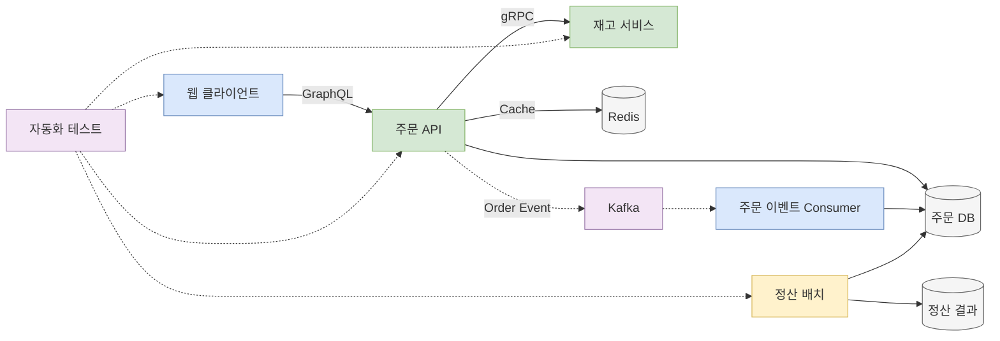
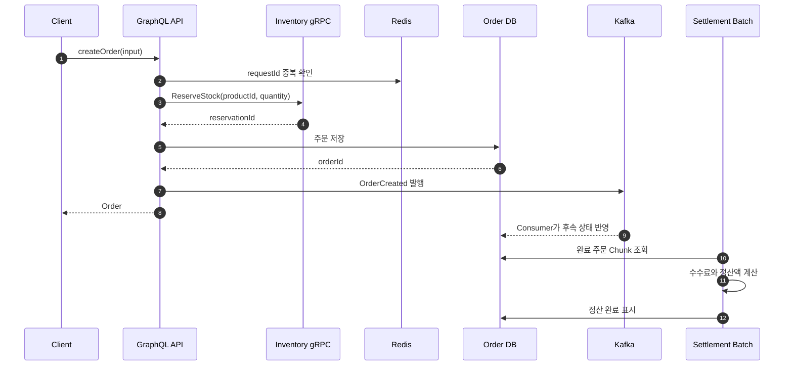

## 이 과정의 목표

이 과정은 용어를 외우는 데서 끝나지 않는다. 8주가 끝나면 아래 질문에 코드와 근거로 답할 수 있어야 한다.

- REST 대신 gRPC 또는 GraphQL을 선택할 이유는 무엇인가?
- Kafka의 파티션, 컨슈머 그룹, 압축 방식을 어떻게 선택할 것인가?
- Redis를 캐시, 중복 방지, 분산 조정에 사용할 때 무엇이 달라지는가?
- 대량 작업을 API 요청 한 번으로 처리하지 않고 배치로 분리하는 이유는 무엇인가?
- 단위 테스트, 통합 테스트, 인수 테스트는 각각 어떤 실패를 잡아야 하는가?
- 네 기술을 함께 사용할 때 경계와 책임을 어떻게 나눌 것인가?

모든 실습은 작은 **주문 처리 시스템**을 확장하는 방식으로 진행한다.

아래 다이어그램은 과정 전체에서 만들 시스템과 각 기술의 역할을 보여준다.



> 실선은 실제 데이터 흐름, 점선은 테스트 대상을 뜻한다.

## 권장 환경

- Java 17 이상
- Spring Boot 3.x
- Gradle
- Docker와 Docker Compose
- PostgreSQL
- IDE의 HTTP Client 또는 Postman

처음부터 모든 도구를 설치할 필요는 없다. 각 주차 실습을 시작할 때 필요한 도구만 준비한다.

## 시작 전 확인할 기초

다음 항목 중 세 개 이상이 낯설다면 2~3일 정도 먼저 복습한다.

- HTTP 요청과 응답, 상태 코드
- JSON 직렬화와 역직렬화
- 인터페이스와 의존성 주입
- SQL의 `SELECT`, `INSERT`, `UPDATE`, `JOIN`
- 트랜잭션의 커밋과 롤백
- Gradle로 테스트 실행하기

## 8주 커리큘럼

| 주차 | 핵심 주제 | 학습 결과물 | 완료 기준 |
|---|---|---|---|
| 0주차 | API와 테스트 공통 기초 | 주문 도메인 모델 | 요청, 서비스, 저장소의 책임을 설명한다 |
| 1주차 | gRPC | 재고 조회 서비스 | Proto에서 서버와 클라이언트 코드를 생성한다 |
| 2주차 | GraphQL | 주문 조회 API | Query, Mutation, N+1 문제를 설명한다 |
| 3주차 | Kafka | 주문 이벤트 파이프라인 | 파티션, Consumer Group, Offset과 압축을 설명한다 |
| 4주차 | Redis | 상품 캐시와 중복 방지 | TTL, Cache Aside, 분산 락의 한계를 설명한다 |
| 5주차 | Batch | 일별 정산 Job | Chunk, 재시작, 멱등성을 구현한다 |
| 6주차 | Test | 테스트 포트폴리오 | 단위, 슬라이스, 통합 테스트를 구분한다 |
| 7주차 | 통합 프로젝트 | 주문 처리 시스템 | 여섯 기술을 연결하고 실패 시나리오를 검증한다 |

주제별 워크북은 아래 순서로 진행한다.

1. [gRPC 기초부터 실전까지](/blog/backend-grpc-workbook)
2. [GraphQL 기초부터 실전까지](/blog/backend-graphql-workbook)
3. [Kafka 기초부터 실전까지](/blog/backend-kafka-workbook)
4. [Redis 기초부터 실전까지](/blog/backend-redis-workbook)
5. [Batch 기초부터 실전까지](/blog/backend-batch-workbook)
6. [Backend Test 기초부터 실전까지](/blog/backend-test-workbook)

## 매일 공부하는 방법

하루 60~90분을 기준으로 한다.

1. **15분: 개념 읽기**  
   오늘 배울 개념을 한 문장으로 다시 적는다.
2. **30분: 최소 예제 구현**  
   복사보다 직접 타이핑하고, 입력값 하나를 바꿔 결과를 확인한다.
3. **20분: 연습문제**  
   먼저 답을 적은 뒤 힌트와 해설을 확인한다.
4. **10분: 회고**  
   “언제 쓰는가”, “언제 쓰지 않는가”, “실패하면 어떻게 되는가”를 기록한다.

## 0주차: 공통 프로젝트 준비

먼저 아래 도메인만 평범한 Spring 애플리케이션으로 구현한다.

```text
Customer 1 --- N Order 1 --- N OrderItem N --- 1 Product
Product  1 --- 1 Inventory
```

필수 유스케이스는 세 개다.

- 상품과 재고를 조회한다.
- 주문을 생성하고 재고를 차감한다.
- 완료된 주문을 날짜별로 정산한다.

처음에는 컨트롤러 없이 서비스 클래스와 인메모리 저장소만 만든다. 이후 각 워크북에서 통신 방식과 저장 방식을 하나씩 추가한다.

## 7주차: 통합 프로젝트

아래 순서로 최종 시나리오를 완성한다.

아래 시퀀스 다이어그램은 주문 생성부터 정산까지의 정상 흐름을 보여준다.



### 필수 요구사항

- GraphQL Mutation으로 주문을 생성한다.
- 주문 API가 재고 서비스에 gRPC로 재고 예약을 요청한다.
- 같은 주문 요청이 두 번 와도 재고가 중복 차감되지 않는다.
- 상품 조회에는 Redis Cache Aside와 TTL을 적용한다.
- 주문 생성 이벤트는 Kafka에 발행하고 같은 주문의 순서를 유지한다.
- Producer 압축 방식별 메시지 크기와 처리 시간을 비교한다.
- 매일 완료 주문을 읽어 판매자별 정산 결과를 생성한다.
- 배치가 중간에 실패해도 재실행할 수 있다.
- 핵심 도메인은 단위 테스트, 외부 경계는 통합 테스트로 검증한다.

### 실패 시나리오

- 재고 부족
- gRPC 데드라인 초과
- 주문 저장 실패
- GraphQL 입력값 검증 실패
- Kafka Consumer 재처리와 중복 이벤트
- Redis 장애 또는 Cache Stampede
- 정산 중 특정 주문의 데이터 오류
- 같은 날짜의 배치 중복 실행

## 최종 연습문제

### 문제 1

웹 클라이언트가 재고 서비스에 직접 gRPC로 접속하지 않고 GraphQL API를 거치게 한 이유를 두 가지 적어보자.

### 문제 2

주문 100만 건을 정산하는 기능을 GraphQL Mutation 하나로 구현할 때 생길 문제를 세 가지 적어보자.

### 문제 3

`재고 예약 성공 → 주문 DB 저장 실패` 상황에서 데이터 일관성을 회복하는 방법을 설계해보자.

### 문제 4

다음 테스트를 단위, 통합, 인수 테스트 중 어디에 둘지 분류해보자.

- 수수료가 3%로 계산되는가?
- 실제 PostgreSQL에서 완료 주문만 읽는가?
- GraphQL 주문 생성 요청 후 재고가 줄고 주문이 조회되는가?

### 문제 5

Kafka Consumer가 같은 주문 이벤트를 두 번 받았을 때 결과 중복을 막는 방법과, Redis만으로 이를 막을 때의 위험을 적어보자.

<details>
<summary>정답과 해설</summary>

1. 브라우저의 gRPC 지원 제약을 숨기고, 인증·인가와 화면용 데이터 조합을 API 계층에 모을 수 있다.
2. 요청 시간 초과, 메모리 급증, 부분 실패 후 재시작 곤란, 진행률 관찰 곤란 등이 있다.
3. 재고 예약 취소 gRPC를 호출하는 보상 트랜잭션, 예약 만료 시간, 주문 요청 ID 기반 멱등성을 함께 고려한다.
4. 수수료 계산은 단위 테스트, PostgreSQL 조회는 통합 테스트, 전체 주문 흐름은 인수 테스트가 적합하다.
5. DB의 처리 이벤트 테이블과 unique constraint를 기준으로 멱등 처리한다. Redis 키만 사용하면 만료, eviction, 장애, 데이터 유실 뒤 중복 처리가 가능하다.

</details>

## 수료 체크리스트

- [ ] 네 기술의 목적을 각각 한 문장으로 설명할 수 있다.
- [ ] gRPC의 데드라인과 상태 코드를 처리했다.
- [ ] GraphQL의 N+1 문제를 재현하고 해결했다.
- [ ] Kafka 파티션 키와 압축 방식을 측정 후 선택했다.
- [ ] Redis 캐시 미스와 장애 시 동작을 검증했다.
- [ ] 실패한 배치를 수정 후 재시작했다.
- [ ] 테스트 대역을 무조건 사용하지 않고 경계에 맞게 선택했다.
- [ ] 정상 흐름보다 실패 흐름 테스트를 최소 세 개 작성했다.
- [ ] 기술 선택의 장점뿐 아니라 비용도 README에 기록했다.
