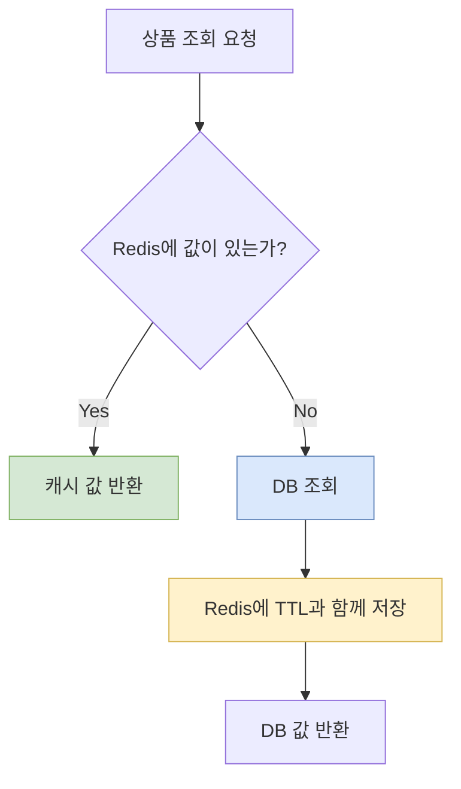

## 1. Redis를 한 문장으로 설명하기

Redis는 **문자열뿐 아니라 여러 자료구조를 메모리에서 빠르게 다루며, 만료·원자 연산·영속화·복제를 제공하는 데이터 저장소**다.

빠르다는 이유만으로 모든 데이터를 Redis에 두면 안 된다. 원본 데이터의 책임, 장애 시 동작, 메모리 상한, 유실 허용 범위를 먼저 정한다.

## 2. 자료구조 선택

| 자료구조 | 적합한 예 |
|---|---|
| String | 상품 JSON 캐시, 카운터, 토큰 |
| Hash | 사용자나 상품의 필드 묶음 |
| List | 단순 작업 목록, 최근 항목 |
| Set | 중복 없는 태그, 참여자 집합 |
| Sorted Set | 점수 기반 랭킹, 시간순 예약 |
| Stream | 소비 이력이 필요한 이벤트 흐름 |
| Bitmap | 일별 출석 여부 |
| HyperLogLog | 정확도 손실을 허용하는 방문자 추정 |

자료구조 선택은 명령의 시간 복잡도와 메모리 사용량까지 함께 본다. 큰 Hash나 Set 전체를 한 번에 조회하는 명령은 서버를 오래 점유할 수 있다.

## 3. Cache Aside

상품 조회에는 가장 기본적인 Cache Aside 패턴을 적용한다.

아래 다이어그램은 Cache Hit와 Cache Miss의 흐름을 보여준다.



```java
Product findProduct(long id) {
    var key = "product:v1:" + id;
    var cached = redis.get(key);
    if (cached != null) {
        return deserialize(cached);
    }

    var product = repository.findById(id);
    redis.set(key, serialize(product), Duration.ofMinutes(10));
    return product;
}
```

Key에는 도메인, 버전, 식별자를 드러낸다. 예: `product:v1:123`.

## 4. TTL과 캐시 무효화

TTL은 오래된 값이 영원히 남는 것을 막지만, TTL이 짧다고 항상 정합성이 좋아지는 것은 아니다. DB 부하와 허용 가능한 stale time 사이의 선택이다.

업데이트 전략:

- DB 업데이트 후 캐시 삭제
- DB 업데이트 후 캐시 갱신
- 변경 이벤트를 발행해 관련 캐시 삭제
- 짧은 TTL로 최종 회복 보장

DB와 Redis를 하나의 로컬 트랜잭션으로 묶을 수 없으므로 실패 순서를 생각해야 한다. 일반적인 Cache Aside에서는 DB를 먼저 수정하고 캐시를 삭제하며, 삭제 실패를 복구할 이벤트나 짧은 TTL을 둔다.

## 5. Cache Stampede와 Penetration

### Cache Stampede

인기 Key가 만료되는 순간 많은 요청이 동시에 DB로 몰리는 현상이다.

대응:

- TTL에 작은 무작위 값 추가
- 한 요청만 원본을 갱신하도록 Lock
- 만료 전에 비동기로 갱신
- stale 값을 짧게 허용하며 백그라운드 갱신

### Cache Penetration

존재하지 않는 ID를 계속 조회해 매번 DB까지 가는 현상이다.

대응:

- 짧은 TTL의 Null 결과 캐시
- 입력 검증
- 대규모 존재 여부에는 Bloom Filter 검토

## 6. 원자 연산과 중복 요청 방지

`SET key value NX EX seconds`는 Key가 없을 때만 값을 저장하고 만료를 함께 설정한다.

```text
SET order-request:req-123 processing NX EX 60
```

이 패턴은 짧은 중복 억제에는 유용하지만 Redis가 최종 업무 기록은 아니다.

- TTL이 끝난 뒤 같은 요청이 다시 올 수 있다.
- eviction으로 Key가 사라질 수 있다.
- 장애 전환이나 유실 정책에 따라 값이 없어질 수 있다.
- 처리 성공 여부와 Key 상태가 어긋날 수 있다.

주문 생성의 최종 멱등성은 DB의 `request_id` unique constraint로 보장하고 Redis는 빠른 1차 방어로 사용한다.

## 7. 분산 락

단일 Redis에서 기본 락은 고유 Token과 TTL을 사용한다.

```text
SET lock:product:123 random-token NX PX 3000
```

해제할 때는 내가 얻은 Token과 같은지 확인한 뒤 삭제하는 Lua Script를 사용한다. 단순 `DEL`은 락 만료 후 다른 클라이언트가 얻은 새 락을 지울 수 있다.

분산 락의 한계:

- 작업 시간이 TTL보다 길 수 있다.
- 네트워크 지연과 Process pause가 있다.
- Lock 획득 성공이 DB 작업 순서를 완전히 보장하지 않는다.
- 정확성이 매우 중요하면 DB Lock, optimistic locking, fencing token을 함께 검토한다.

## 8. 메모리와 Eviction

`maxmemory`에 도달하면 `maxmemory-policy`에 따라 쓰기 실패 또는 Key 제거가 발생한다.

| 정책 계열 | 의미 |
|---|---|
| `noeviction` | Key를 제거하지 않고 쓰기 오류 |
| `allkeys-*` | 모든 Key가 제거 후보 |
| `volatile-*` | TTL이 있는 Key만 제거 후보 |
| `*-lru` | 최근 사용이 적은 Key 우선 |
| `*-lfu` | 사용 빈도가 낮은 Key 우선 |
| `*-random` | 무작위 제거 |
| `volatile-ttl` | 만료가 가까운 Key 우선 |

세션이나 Lock처럼 사라지면 의미가 달라지는 Key와 단순 캐시를 같은 Instance와 정책에 섞을 때 특히 주의한다.

Big Key도 점검한다. 하나의 Key가 지나치게 크면 네트워크, 삭제, 복제, 만료 시 지연을 만든다.

## 9. 영속화와 고가용성

| 방식 | 특징 |
|---|---|
| RDB | 특정 시점 Snapshot, 복구가 빠르지만 최근 데이터 유실 가능 |
| AOF | 쓰기 명령 로그, 설정에 따라 유실 범위를 줄일 수 있으나 비용 증가 |
| RDB + AOF | 두 방식의 장점을 조합 |

Replica는 읽기 확장과 장애 대응에 도움을 주지만 비동기 복제 지연이 있을 수 있다. Sentinel 또는 Cluster를 사용해도 애플리케이션이 timeout, retry, stale read를 처리해야 한다.

캐시라면 Redis 전체 장애 시 DB로 우회할 수 있어야 하지만, 모든 요청이 동시에 DB로 몰리지 않도록 rate limit과 circuit breaker도 고려한다.

## 10. 단계별 실습

### 실습 A: 상품 캐시

1. 상품 조회에 Cache Aside를 적용한다.
2. Cache Hit와 Miss 횟수를 기록한다.
3. TTL 10초 후 DB 재조회를 확인한다.
4. 상품 수정 후 캐시를 삭제한다.

### 실습 B: Stampede 재현

1. 같은 인기 상품에 동시 요청 100개를 보낸다.
2. 캐시 만료 순간 DB 조회 횟수를 센다.
3. TTL jitter와 단일 갱신 Lock을 각각 적용한다.
4. 처리 시간과 DB 호출 수를 비교한다.

### 실습 C: 주문 중복 방지

1. 같은 `requestId` 요청을 동시에 10개 보낸다.
2. Redis `SET NX`만 적용한 결과를 확인한다.
3. DB unique constraint를 추가한다.
4. Redis를 중단해도 주문이 하나만 생기는지 검증한다.

### 실습 D: 메모리 정책

1. 낮은 `maxmemory`를 설정한다.
2. `noeviction`, `allkeys-lru`, `allkeys-lfu`를 비교한다.
3. 쓰기 오류와 제거된 Key를 관찰한다.
4. 캐시 Hit Ratio와 DB 부하 변화를 기록한다.

## 11. 연습문제

### 문제 1

상품 가격이 수정된 직후에도 10분 동안 이전 가격이 보였다. 현재 Cache Aside 흐름에서 빠진 처리를 적어보자.

### 문제 2

TTL을 모두 정확히 10분으로 설정했더니 매 10분마다 DB 부하가 급증했다. 원인과 해결책을 적어보자.

### 문제 3

Redis `SET NX`만으로 결제 요청 중복을 막는 것이 위험한 이유를 세 가지 적어보자.

### 문제 4

Leaderboard, 로그인 세션, 상품 캐시, 고유 방문자 추정에 적합한 자료구조를 각각 고르자.

### 문제 5

분산 락의 TTL이 3초인데 작업은 5초 걸렸다. 어떤 경쟁 상황이 생길 수 있으며 무엇을 보완해야 하는가?

<details>
<summary>정답과 해설</summary>

1. DB 수정 성공 뒤 상품 캐시를 삭제하거나 갱신해야 한다. 실패 복구와 TTL도 함께 둔다.
2. 동시에 만료되어 Stampede가 생긴다. TTL jitter, 선제 갱신, 단일 갱신 Lock 등을 적용한다.
3. TTL 만료, eviction, 장애·복제 과정의 유실, 업무 성공과 Key 상태 불일치가 가능하다. 최종 보장은 DB unique constraint가 맡는다.
4. 순서대로 Sorted Set, String 또는 Hash, String 또는 Hash, HyperLogLog가 적합하다.
5. 첫 작업이 끝나기 전에 다른 작업이 락을 얻어 동시에 실행될 수 있다. TTL 연장, fencing token, DB의 version 또는 lock을 검토한다.

</details>

## 12. 완료 체크

- [ ] 주요 자료구조를 사용 목적에 맞게 고를 수 있다.
- [ ] Cache Aside의 Hit, Miss, 무효화 흐름을 구현했다.
- [ ] Stampede를 재현하고 완화했다.
- [ ] Redis 장애 중에도 원본 DB의 정확성을 유지했다.
- [ ] `SET NX`와 DB unique constraint의 역할을 구분한다.
- [ ] 분산 락 해제를 Token 비교로 구현했다.
- [ ] eviction, Big Key, Hit Ratio를 관찰했다.
- [ ] RDB와 AOF의 trade-off를 설명할 수 있다.
