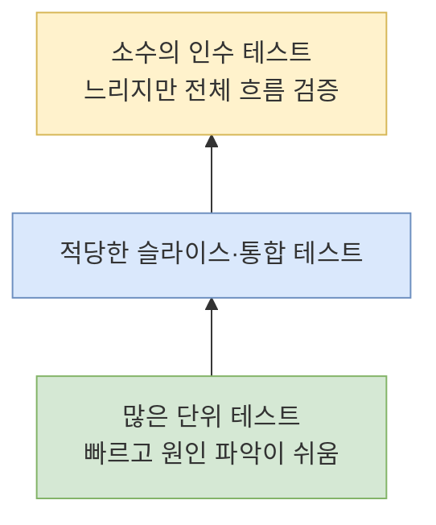
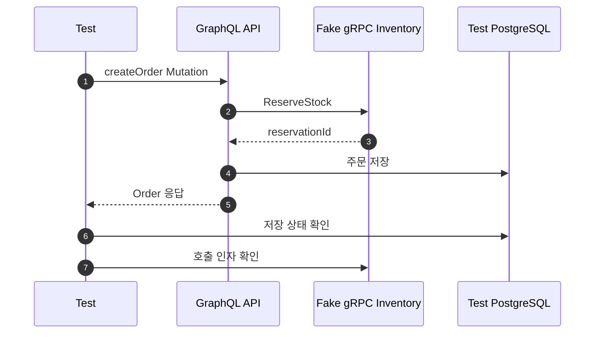

## 1. 테스트를 한 문장으로 설명하기

자동화 테스트는 **시스템이 지켜야 할 동작을 실행 가능한 예제로 기록하고, 변경 후에도 그 동작이 유지되는지 빠르게 확인하는 코드**다.

테스트의 목적은 메서드 개수를 채우는 것이 아니라 중요한 실패를 배포 전에 발견하는 것이다.

## 2. 테스트 수준 구분하기

| 수준 | 범위 | 속도 | 주로 잡는 문제 |
|---|---|---|---|
| 단위 테스트 | 함수, 클래스, 도메인 규칙 | 매우 빠름 | 계산과 분기 오류 |
| 슬라이스 테스트 | 웹, JPA 등 일부 계층 | 빠름 | 직렬화, 매핑, 쿼리 |
| 통합 테스트 | DB, 메시지, 여러 계층 | 보통 | 설정과 경계 연동 오류 |
| 인수/E2E 테스트 | 사용자 시나리오 전체 | 느림 | 실제 흐름의 계약 오류 |

아래 다이어그램은 테스트 수와 실행 비용의 일반적인 균형을 보여준다.



비율 자체보다 같은 동작을 비싼 테스트에서 반복하지 않는 것이 중요하다.

## 3. 좋은 테스트의 구조

Given-When-Then으로 준비, 실행, 검증을 구분한다.

```java
@Test
void 재고보다_많이_주문하면_실패한다() {
    // given
    var product = new Product(1L, 3);

    // when
    var exception = assertThrows(
        OutOfStockException.class,
        () -> product.reserve(4)
    );

    // then
    assertThat(exception.getProductId()).isEqualTo(1L);
    assertThat(product.getStock()).isEqualTo(3);
}
```

좋은 테스트는 실패했을 때 무엇이 깨졌는지 이름과 검증값으로 알려준다.

## 4. 무엇을 Mock할 것인가

Mock은 빠르고 특정 상호작용을 검증하기 좋지만, 실제 시스템과 다른 가정을 만들 수 있다.

### Mock이 잘 맞는 경계

- 결제사, 메일, 외부 API
- 현재 시각을 제공하는 Clock
- 느리거나 결과를 통제하기 어려운 외부 시스템

### 실제 구현을 우선할 대상

- 값 객체와 도메인 계산
- 단순 컬렉션
- SQL 동작이 중요한 Repository 통합 테스트
- 직렬화 계약이 중요한 API 테스트

구현 세부 호출 횟수만 검증하면 리팩터링 때 불필요하게 테스트가 깨진다. 가능하면 최종 상태나 반환값을 검증한다.

## 5. 테스트 더블 구분

| 종류 | 역할 | 예시 |
|---|---|---|
| Stub | 정해진 값을 반환 | 환율 API가 1300 반환 |
| Mock | 호출 여부와 인자를 검증 | 메일 발송 1회 |
| Fake | 단순하지만 동작하는 구현 | 인메모리 저장소 |
| Spy | 실제 구현을 감싸 일부를 관찰 | 실제 객체의 특정 호출 확인 |

이름을 외우는 것보다 왜 그 대역이 필요한지 설명할 수 있어야 한다.

## 6. 통합 테스트와 Testcontainers

H2에서 통과한 쿼리가 PostgreSQL에서 실패할 수 있다. 운영 DB의 SQL 문법, 인덱스, 제약조건이 중요하면 실제 PostgreSQL 컨테이너로 검증한다.

통합 테스트에서 확인할 항목:

- Schema migration이 성공하는가?
- unique constraint가 중복을 막는가?
- 트랜잭션 롤백이 의도대로 동작하는가?
- 실제 쿼리가 필요한 행만 읽는가?
- 날짜와 시간대가 올바르게 저장되는가?

## 7. 비동기와 외부 통신 테스트

gRPC 클라이언트는 테스트 서버를 띄우거나 in-process transport로 계약을 검증한다. GraphQL은 실제 Query 문자열을 보내 응답의 `data`, `errors`, nullability를 확인한다.

아래 흐름은 주문 생성 인수 테스트가 확인할 경계를 보여준다.



## 8. 단계별 실습

### 실습 A: 도메인 단위 테스트

다음 규칙을 테스트한다.

- 수량은 1 이상이어야 한다.
- 재고보다 많이 예약할 수 없다.
- 같은 요청 ID는 재고를 다시 차감하지 않는다.
- 취소된 주문은 완료할 수 없다.
- 수수료 반올림 규칙이 경계값에서도 유지된다.

### 실습 B: GraphQL 테스트

1. 정상 주문 생성 Mutation을 실행한다.
2. 필수 입력 누락을 검증한다.
3. 재고 부족 시 오류 코드를 검증한다.
4. 관리자 전용 필드의 인가를 검증한다.
5. 목록 페이지 크기 상한을 검증한다.

### 실습 C: gRPC 테스트

1. 존재하는 상품의 재고 응답을 검증한다.
2. 없는 상품의 `NOT_FOUND`를 검증한다.
3. deadline 초과를 검증한다.
4. 같은 `request_id`를 두 번 보내 재고가 한 번만 줄었는지 확인한다.

### 실습 D: Batch 테스트

1. 완료 주문만 읽는 Reader를 검증한다.
2. 수수료 Processor를 단위 테스트한다.
3. 501번째 데이터 실패 후 재시작을 검증한다.
4. 같은 날짜 재실행 시 중복 정산이 없는지 검증한다.

## 9. 연습문제

### 문제 1

다음 테스트가 깨지기 쉬운 이유를 설명하고 개선하자.

```java
verify(orderRepository, times(1)).save(any());
verify(inventoryClient, times(1)).reserve(any());
verify(eventPublisher, times(1)).publish(any());
```

### 문제 2

Repository 테스트를 전부 Mock으로 작성했더니 운영에서 unique constraint 오류가 발생했다. 어떤 테스트를 추가해야 하는가?

### 문제 3

`Thread.sleep(3000)`으로 비동기 처리를 기다리는 테스트의 문제와 대안을 적어보자.

### 문제 4

100% line coverage인데도 재고가 음수가 되는 버그가 발생했다. Coverage가 보장하지 못한 것을 설명하고 추가할 테스트를 적어보자.

<details>
<summary>정답과 해설</summary>

1. 내부 구현 순서와 호출 횟수에 강하게 결합되어 있다. 주문 결과, 저장 상태, 외부로 나간 핵심 계약처럼 관찰 가능한 동작을 우선 검증한다.
2. 실제 PostgreSQL을 사용하는 통합 테스트로 migration, unique constraint, 트랜잭션을 검증한다.
3. 느리고 환경에 따라 불안정하다. 상태가 만족될 때까지 제한 시간 안에서 polling하거나 완료 이벤트와 latch를 사용한다.
4. Coverage는 코드가 실행됐다는 뜻이지 경계값과 동시성이 올바르다는 뜻이 아니다. 재고 0, 정확히 같은 수량, 초과 수량, 동시 예약 테스트를 추가한다.

</details>

## 10. 최종 테스트 포트폴리오

최소 구성을 다음처럼 잡아보자.

- 도메인 단위 테스트 15개 이상
- GraphQL 슬라이스 테스트 5개 이상
- gRPC 서버 테스트 5개 이상
- PostgreSQL Repository 통합 테스트 5개 이상
- Batch Job 테스트 3개 이상
- 주문 생성 인수 테스트 2개 이상

개수보다 아래 질문에 답하는지가 중요하다.

- 가장 비싼 장애를 만드는 규칙이 테스트됐는가?
- 외부 시스템 실패가 테스트됐는가?
- 재시도와 중복 요청이 테스트됐는가?
- 시간, 경계값, 동시성 중 필요한 항목을 다뤘는가?
- 테스트 실패 원인을 빠르게 찾을 수 있는가?

## 11. 완료 체크

- [ ] 단위, 통합, 인수 테스트를 목적에 따라 구분한다.
- [ ] Mock과 Fake를 선택한 이유를 설명할 수 있다.
- [ ] PostgreSQL 컨테이너로 Repository를 검증했다.
- [ ] GraphQL과 gRPC의 실제 계약을 테스트했다.
- [ ] Batch 실패 후 재시작을 자동 검증했다.
- [ ] Coverage 수치보다 위험 기반 시나리오를 우선했다.
- [ ] 테스트 전체를 한 명령으로 반복 실행할 수 있다.

