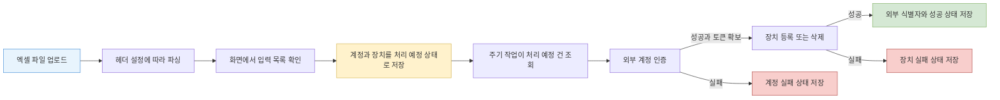
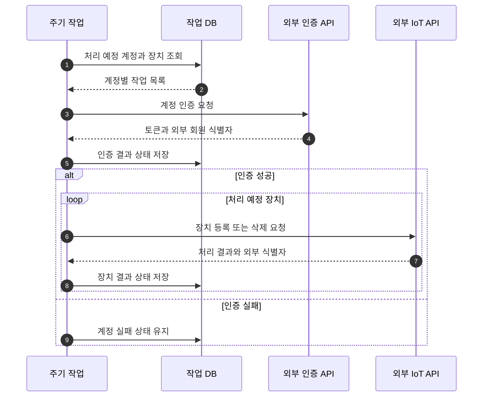

공공기관의 돌봄 서비스에 가입 기능을 개발하면서 여러 대상자의 계정과 장치 정보를 한꺼번에 등록하는 흐름을 구현했다. 이력서에는 엑셀 업로드부터 음성 단말 플랫폼과 홈 IoT 등록까지의 가입 흐름을 맡았다고 기록되어 있다. 다만 이번에 확인한 소스에서 직접 추적할 수 있는 범위는 엑셀로 계정과 장치 정보를 받아 홈 IoT 계정 인증, 장치 등록과 삭제를 수행하는 사전 작업이다. 음성 단말 플랫폼 등록은 현재 제공된 소스만으로 세부 구현과 단계 순서를 확인할 수 없어 이 글의 구현 설명에서 제외한다.

내가 맡은 역할은 이 가입 기능의 구현이다. 아래 내용은 소스와 변경 이력에서 확인한 동작을 중심으로 설명한다. 당시의 요구사항 문서나 의사결정 기록은 제공된 자료에서 확인하지 못했으므로 대안을 비교하는 부분은 현재 시점의 회고다.

## 파일 업로드와 외부 API 호출 사이에 있던 문제

엑셀 한 행을 읽어 곧바로 외부 API를 호출하는 방식은 단순하다. 현재 시점에서 구현을 비교하면, 이 방식은 계정 인증이 먼저 성공해야 장치 등록에 사용할 토큰과 외부 식별자를 얻는 순서와 외부 호출 실패를 요청 안에서 모두 처리해야 한다. 장치에는 등록과 삭제라는 서로 다른 작업도 있다. 입력 파일, 내부 DB, 외부 시스템의 상태가 한 번에 바뀌지 않기 때문에 한 행 전체를 단일 DB 트랜잭션으로 보기도 어렵다.

확인한 구현은 입력과 실행을 분리했다. 엑셀 업로드 API는 파일을 파싱해 화면에 확인 가능한 목록을 반환한다. 사용자가 등록을 요청하면 유효한 필드를 가진 계정과 장치만 DB에 저장한다. 이때 외부 처리를 끝낸 상태가 아니라 로그인 예정, 장치 등록 예정, 장치 삭제 예정 같은 작업 상태를 기록한다. 주기적으로 실행되는 작업이 이 상태를 조회해 외부 API를 호출하고 결과를 성공 또는 실패 상태로 바꾼다.

아래 다이어그램은 파일 입력이 외부 등록 결과로 바뀌는 확인된 범위를 보여준다.

DB의 상태가 입력 API와 주기 작업 사이의 인계점이다. 파일 처리 요청은 외부 시스템의 응답을 기다리지 않고 대상 작업을 남기며, 주기 작업은 조회한 상태를 기준으로 다음 단계를 선택한다.

## 엑셀을 도메인 입력으로 바꾸는 경계

계정 파일과 장치 파일은 별도의 API로 받는다. 컬럼 위치와 필드 이름은 코드에 고정된 배열이 아니라 공통 코드 설정에서 읽어 헤더 맵을 구성한다. 같은 엑셀 파서가 헤더 맵을 받아 첫 번째 시트를 읽고, 파싱 결과와 전체 행 수를 반환한다. 계정은 내부 계정 ID와 서비스 코드가 있어야 저장하고, 장치는 계정 ID, 전화번호, 장치 주소가 모두 있어야 저장한다.

이 구조에는 두 개의 검증 단계가 있다. 파일 파싱 단계는 업로드한 내용을 화면에서 확인할 형태로 만든다. 저장 단계는 외부 처리에 필요한 핵심 필드가 비어 있는 행을 거른다. 제공된 소스에는 잘못된 행을 별도 오류 목록으로 돌려주는 상세 검증은 확인되지 않는다. 따라서 “모든 입력 오류를 사전에 설명했다”거나 “업로드만으로 등록이 완료됐다”고 말할 수는 없다.

계정 저장은 같은 내부 계정 ID가 이미 있으면 새 행을 추가하지 않는다. 장치 저장은 조금 다르다. 같은 계정에 이미 성공한 장치나 삭제 실패 장치가 있으면 기존 장치를 삭제 예정으로 바꾸고 새 장치를 등록 예정으로 추가한다. 과거 등록 실패 장치는 비활성화한 뒤 새 행을 추가한다. 중복 입력을 모두 무시하는 것이 아니라 기존 외부 장치의 정리 여부를 상태로 남기는 방식이다.

## 처리 순서를 상태로 표현한 이유

구현에서 확인되는 핵심 순서는 계정 인증 뒤 장치 작업이다. 주기 작업은 처리 예정 계정을 조회하고 다음과 같이 진행한다.

1. 계정이 로그인 예정이거나 저장된 토큰이 만료됐다면 외부 인증 API를 호출한다.
2. 인증 응답에서 토큰과 회원 식별자를 얻었을 때만 계정을 성공 상태로 바꾼다.
3. 계정이 성공 상태이고 토큰이 있을 때 장치 목록을 순회한다.
4. 삭제 예정 장치는 외부 장치와 대상 식별자가 있을 때 삭제를 요청한다.
5. 등록 예정 장치는 전화번호와 장치 주소가 있을 때 등록을 요청한다.
6. 각 호출 직후 외부 식별자와 성공 또는 실패 상태를 DB에 반영한다.

아래 시퀀스는 계정 인증이 장치 등록의 선행 조건이 되는 관계를 보여준다.

외부 호출용 서비스는 계정 인증, 장치 등록, 장치 삭제마다 요청을 만들고 공통 전송 컴포넌트를 호출한다. 장치 등록은 장치와 대상 식별자가 모두 있어야 성공이다. 인증도 토큰과 외부 회원 식별자가 비어 있는지를 검사해 성공 여부를 정하려는 구조지만, 현재 구현에는 경계 오류가 있다. JSON에 키가 없을 때 값을 문자열로 변환하면 실제 `null`이 아니라 `"null"` 문자열이 되고, 빈 문자열 검사에서 걸러지지 않을 수 있다. 따라서 응답 필드가 누락돼도 인증 성공으로 잘못 분류될 가능성이 있다. 예외가 발생하면 값이 설정되지 않아 실패 상태로 저장되지만, 필드 누락까지 실패로 보장한다고 말할 수는 없다.

이 방식은 외부 API가 성공했는지 내부 상태로 다시 확인할 수 있게 한다. 반면 외부 호출과 DB 갱신은 하나의 원자적 트랜잭션이 아니다. 외부 등록이 성공한 직후 프로세스가 중단되고 DB 갱신이 되지 않으면 같은 작업이 다시 선택될 가능성이 있다. 외부 API의 멱등성 키나 외부 조회를 통한 조정 로직은 제공된 소스에서 확인되지 않는다.

## 지금 돌아보며 비교하는 대안

당시 검토 문서는 확인하지 못했으므로 아래 표는 구현을 다시 설계할 때의 대안 비교다.

| 대안 | 장점 | 비용과 위험 |
|---|---|---|
| 업로드 요청에서 동기 처리 | 흐름이 짧고 즉시 결과를 반환하기 쉬움 | 파일 크기와 외부 지연에 요청 시간이 묶이고 중간 실패 복구가 어려움 |
| DB 상태와 주기 작업 | 입력과 외부 실행을 분리하고 실패 건을 조회 가능 | 상태 전이와 재실행 조건을 명확히 설계해야 함 |
| 메시지 큐 기반 작업 | 작업 단위 재시도와 소비자 확장에 유리 | 발행과 DB 저장의 원자성, 순서, 중복 소비를 추가로 다뤄야 함 |
| 워크플로 엔진 | 단계, 재시도, 보상 흐름을 명시적으로 관리 가능 | 당시 규모를 확인하지 못한 상황에서는 운영 복잡도가 커질 수 있음 |

확인된 구현은 DB를 작업 큐처럼 사용한다. 이미 관리 화면과 MyBatis 기반 저장소가 있는 시스템에서 상태를 조회하고 결과를 보여주기 쉬운 선택이다. 하지만 이 선택이 당시 다른 대안과 비교해 채택됐다는 기록은 없다. 현재라면 처리량, 실패 빈도, 운영자가 필요한 재처리 단위부터 확인한 뒤 DB 폴링과 메시지 큐 중 하나를 고르겠다.

## 검증할 때 봐야 했던 경계

제공된 소스에서 이 기능을 직접 다루는 자동화 테스트는 찾지 못했다. 이번 회고에서는 컨트롤러, 서비스, 매퍼 SQL, DTO의 상태 변경 메서드와 관련 변경 이력을 연결해 정상 경로와 실패 경로를 추적했다. 구현 당시의 실제 테스트 수행 범위나 운영 결과는 이 근거만으로 단정하지 않는다.

이 흐름을 지금 검증한다면 행 수보다 상태 전이를 중심으로 테스트하겠다.

- 필수 필드가 없는 행이 작업 대상에 들어가지 않는지 확인한다.
- 같은 계정을 다시 올렸을 때 계정 행이 중복 생성되지 않는지 확인한다.
- 기존 장치 상태에 따라 삭제 예정 전환과 비활성화가 맞게 적용되는지 확인한다.
- 계정 인증 실패 뒤 장치 API가 호출되지 않는지 확인한다.
- 토큰 만료 시 인증을 갱신한 뒤 장치 작업을 계속하는지 확인한다.
- 외부 인증 응답에 필수 키가 없거나 값이 `null`일 때 문자열 `"null"`을 성공 값으로 받아들이지 않는지 확인한다.
- 장치 등록 응답에 필수 식별자가 없을 때 실패 상태가 저장되는지 확인한다.
- 외부 성공 뒤 DB 반영 전에 중단된 경우 재실행이 어떤 결과를 만드는지 확인한다.

마지막 항목이 중요하다. 내부 상태만으로 재처리를 결정하는 시스템에서는 외부 성공과 내부 실패 사이의 빈틈을 없애기 어렵다. 요청마다 안정된 멱등성 키를 보내거나, 외부 식별자로 현재 상태를 조회한 뒤 등록 여부를 조정하거나, 중복 응답을 성공으로 해석할 수 있는 계약이 필요하다.

## 결과와 회고

확인할 수 있는 결과는 엑셀 입력을 계정과 장치의 처리 예정 상태로 저장하고, 계정 인증 성공 뒤 홈 IoT 장치 등록 또는 삭제를 실행하며, 외부 응답의 식별자와 성공 또는 실패 상태를 DB에 남기는 흐름을 구현했다는 것이다. 파일 입력과 외부 호출을 분리했기 때문에 관리 화면의 요청 수명에 전체 외부 처리를 묶지 않고 단계별 진행 상태를 표현할 수 있었다.

이 구현을 설명할 때 “엑셀 가입 자동화”라는 한 문장만으로는 중요한 경계가 사라진다. 핵심은 계정 인증이 선행되는 외부 연동을 상태 전이로 나누고, 외부 호출 결과를 다음 실행의 판단 근거로 저장한 데 있다. 동시에 외부 성공과 DB 갱신 사이의 원자성, 상세 입력 오류, 자동화 테스트에 대해서는 제공된 근거가 말해 주는 범위가 제한적이다. 이 한계를 함께 설명해야 구현 경험과 이후의 설계 판단을 구분할 수 있다.
