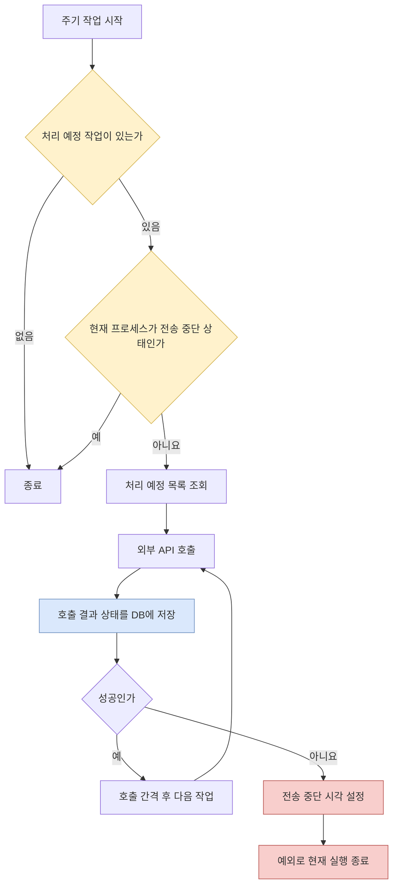

돌봄 서비스의 대량 가입 사전 작업은 주기 실행 코드에서 외부 계정 인증과 홈 IoT 장치 등록을 수행한다. 저장소의 커밋된 버전에는 10분 주기 설정이 활성화돼 있고, 제공된 로컬 작업본에서는 이 설정 한 줄이 주석 처리돼 있다. 따라서 아래 설명은 커밋된 구현의 주기 실행을 기준으로 하며, 현재 로컬 환경에서도 실제 실행 중이라고 주장하지 않는다.

이력서의 기존 문구에는 “배치 중복 실행 방지”가 포함돼 있다. 코드를 다시 확인해 보니 이 표현은 그대로 사용하기 어렵다. 구현에는 실행 예정 작업이 있을 때 관리자의 장치 변경을 막는 검사와 외부 요청 실패 뒤 일정 시간 호출을 쉬는 프로세스 메모리 상태가 있다. 하지만 여러 실행 주체 중 하나만 작업을 획득하게 만드는 원자적 잠금은 확인되지 않았다.

이 글에서는 실제 구현한 실패 처리와 실행 제어를 먼저 정리하고, 중복 실행을 확실히 막으려면 무엇이 더 필요했는지를 현재 시점에서 검토한다. 가입 기능의 구현 역할은 이력서에서 확인되지만, 당시 장애 수치나 운영 효과, 설계 의사결정의 소유권은 확인할 자료가 없어 주장하지 않는다.

## 하나의 큰 트랜잭션이 맞지 않았던 이유

주기 작업은 계정 인증과 여러 장치 작업을 순서대로 실행한다. 외부 요청이 성공하면 호출 간격을 두고 다음 작업으로 넘어간다. 실패하면 해당 계정 또는 장치의 실패 상태를 저장하고 예외를 발생시켜 현재 실행을 끝낸다. 이후 일정 시간 동안 같은 프로세스의 외부 전송을 막는다.

변경 이력에는 스케줄러와 배치 서비스에서 클래스 수준 트랜잭션을 제거한 커밋이 있다. 커밋 제목은 배치 트랜잭션 수정이며, 코드 변경으로 확인되는 사실은 두 클래스의 트랜잭션 선언이 삭제됐다는 것이다. 왜 이 결정을 내렸는지 설명한 문서는 없지만, 결과적으로 각 매퍼 갱신은 배치 전체를 감싼 하나의 서비스 트랜잭션 밖에서 실행된다.

이 경계는 실패 상태를 남기는 코드와 맞물린다. 외부 호출 서비스는 예외나 불완전한 응답을 실패 상태로 바꾸어 반환하고, 배치 서비스는 그 상태를 DB에 갱신한 다음 전송 중단 상태를 설정하고 예외를 던진다. 배치 전체에 하나의 트랜잭션이 유지됐다면 마지막 예외가 앞서 기록한 결과까지 롤백할 가능성을 검토해야 한다. 실제 데이터소스와 트랜잭션 설정 전체를 검증하지 않았으므로 과거에 반드시 롤백됐다고 단정할 수는 없다. 다만 선언을 제거한 변경과 현재 호출 순서는 외부 결과를 실행 단위별로 남기려는 구조로 읽을 수 있다.

아래 다이어그램은 현재 코드에서 확인되는 성공과 실패 경로를 보여준다.

성공 시 대기와 실패 시 중단은 외부 시스템에 연속 요청을 보내는 속도를 조절한다. 실패 뒤 중단 상태는 애플리케이션 컴포넌트의 시각 값 하나로 관리되며, 공통 외부 전송 컴포넌트도 이 값을 검사한다. 배치 진입뿐 아니라 같은 프로세스에서 이 전송 컴포넌트를 사용하는 요청도 중단 시간 동안 차단되는 범위다.

## 구현된 세 가지 가드의 정확한 의미

비슷해 보이는 검사가 세 곳에 있지만 막는 대상은 서로 다르다.

| 가드 | 확인하는 것 | 막는 것 | 보장하지 않는 것 |
|---|---|---|---|
| 작업 설정 확인 | 해당 주기 작업이 활성 상태로 등록됐는지 | 비활성화된 작업 실행 | 다른 실행 주체의 동시 진입 |
| 처리 예정 건 확인 | 로그인, 등록 또는 삭제 예정 상태가 존재하는지 | 할 일이 없을 때 실행, 작업 대기 중 관리자의 장치 변경 | 조회 직후 상태 변화, 작업의 단독 소유권 |
| 전송 중단 시각 확인 | 현재 시각이 실패 뒤 설정한 시각 이전인지 | 같은 프로세스의 후속 외부 호출 | 여러 인스턴스 간 공유, 동시에 통과한 요청의 직렬화 |

주기 작업의 시작과 종료 결과도 DB에 기록하지만, 이 이력 행을 잠금으로 사용하지는 않는다. 실행 전 활성 설정을 조회하는 SQL도 작업 존재 여부만 반환한다. 처리 예정 건 확인 역시 `COUNT` 결과를 읽은 다음 별도 단계에서 목록을 조회하고 처리한다. 두 실행이 같은 순간에 검사하면 둘 다 같은 작업을 볼 수 있다.

전송 중단 컴포넌트의 이름에는 lock이 들어 있지만 구현은 mutex가 아니다. 현재 프로세스의 메모리에 “언제까지 보내지 않을지”를 저장한 cooldown이다. 검사와 시각 갱신이 작업 획득 연산으로 묶이지 않고, 인스턴스끼리 값을 공유하지 않는다. 따라서 이 기능의 성과를 “배치 중복 실행 방지”나 “분산 락 구현”이라고 표현하면 구현보다 강한 주장이다. 확인 가능한 설명은 “외부 요청 실패 후 같은 인스턴스의 후속 전송을 일정 시간 중단했다”이다.

## 중복 실행 시 어떤 문제가 생기는가

두 실행이 같은 처리 예정 목록을 가져오면 같은 계정 인증이나 장치 등록을 외부 시스템에 보낼 수 있다. 내부 DB 갱신은 마지막 결과로 덮어쓸 수 있고, 외부 시스템에는 중복 자원이 만들어질 수 있다. 외부 API가 동일 요청을 멱등하게 처리하는지는 제공된 자료에서 확인되지 않는다.

또 다른 경합은 관리 API와 주기 작업 사이에 있다. 구현은 처리 예정 작업이 하나라도 있으면 장치 저장, 수정, 삭제를 거부한다. 작업 목록을 처리하는 동안 관리자가 대상을 바꾸는 상황을 줄이는 가드다. 하지만 예정 건 개수를 읽는 것과 변경 SQL 사이가 하나의 조건부 갱신이나 잠금으로 묶여 있지는 않다. 두 관리 요청이 모두 예정 건이 없다는 결과를 읽은 뒤 각각 변경을 실행하거나, 두 스케줄 실행이 같은 예정 행을 조회할 수 있으므로 엄밀한 동시성 제어로 보기는 어렵다.

목록 조회 자체에도 주의할 점이 있다. 계정과 장치를 조인한 결과에 제한을 적용한 뒤 MyBatis가 계정별 장치 목록으로 묶는다. 그래서 코드의 조회 제한 숫자를 곧바로 “한 번에 처리하는 계정 수”라고 해석할 수 없다. 이 글에서는 확인되지 않은 처리량이나 실행 시간을 성과로 사용하지 않는다.

## 지금 선택한다면 작업 획득을 원자적으로 만든다

아래 선택지는 당시 실제로 검토했다는 기록이 아니라 현재 시점의 설계 대안이다.

| 대안 | 적합한 조건 | 장점 | 주의할 점 |
|---|---|---|---|
| 단일 인스턴스와 단일 스케줄러 스레드 | 배포 구조가 고정되고 수평 확장이 없음 | 구현이 가장 단순함 | 운영 구성에 보장이 숨어 있고 재기동 및 확장 시 깨지기 쉬움 |
| DB 행 잠금과 건너뛰기 조회 | PostgreSQL을 공유하고 여러 작업자가 병렬 처리함 | 작업 행 획득과 제외를 DB에서 원자적으로 처리 | 긴 외부 호출 동안 DB 잠금을 잡지 않도록 짧은 획득 트랜잭션이 필요함 |
| 조건부 상태 갱신 | 작업마다 처리 중 상태와 버전을 둘 수 있음 | 잠금 보유 시간을 줄이고 소유자를 명시 가능 | 임대 만료, 실패 복구, 오래된 작업 회수 정책이 필요함 |
| PostgreSQL advisory lock | 배치 전체를 한 인스턴스만 실행하면 됨 | 기존 테이블 변경 없이 실행 단위 배제 가능 | 세션과 트랜잭션 수명, 잠금 해제를 정확히 관리해야 함 |
| 외부 분산 락 | 이미 신뢰할 공유 저장소와 운영 체계가 있음 | 애플리케이션 전반의 잠금 방식을 통일 가능 | 네트워크 분할과 임대 만료 시 안전성을 별도로 설계해야 함 |

이 기능처럼 외부 API 호출이 길고 작업별 상태가 이미 DB에 있다면, 나는 처리 예정 행을 짧은 트랜잭션에서 처리 중으로 조건부 전환하고 소유자와 임대 만료 시각을 기록하는 방식을 먼저 검토하겠다. 외부 호출 동안 DB 트랜잭션을 열어 두지 않고도 다른 실행이 같은 행을 가져가지 못하게 할 수 있기 때문이다.

흐름은 다음과 같다.

1. 처리 예정 행을 조회하면서 처리 중 전환에 성공한 건만 획득한다.
2. 트랜잭션을 끝낸 뒤 외부 API를 호출한다.
3. 외부 결과를 성공 또는 실패로 저장할 때 현재 소유자와 버전을 조건에 포함한다.
4. 프로세스가 중단되면 임대 만료 뒤 재처리하되, 외부 멱등성 키나 조정 조회로 중복 부작용을 막는다.
5. 배치 전체를 하나만 실행해야 한다면 별도의 실행 잠금을 추가하되, 작업 행의 소유권과 역할을 섞지 않는다.

## 실패 정책은 메모리 cooldown과 분리한다

실패 뒤 일정 시간 전송을 멈추는 정책은 외부 시스템을 계속 두드리지 않는다는 점에서 의미가 있다. 그러나 cooldown이 끝난다는 사실과 실패한 항목이 재시도된다는 사실은 다르다. 목록 조회는 로그인 예정, 장치 등록 예정, 장치 삭제 예정 상태를 대상으로 하며 일반적인 실패 상태를 자동 재시도 대상으로 삼지 않는다. 계정이 실패 상태여도 처리 예정 장치 때문에 함께 조회될 수 있지만, 계정 인증 조건은 로그인 예정 또는 토큰 만료이므로 실패 계정을 곧바로 다시 인증한다고 보장할 수도 없다. cooldown 뒤에는 남아 있는 처리 예정 작업이 다시 진행될 수 있을 뿐, 실패한 항목의 재시도 정책은 별도로 확인되지 않는다.

또한 프로세스 메모리만 사용하면 재시작할 때 중단 상태가 사라지고, 여러 인스턴스가 각자 다른 중단 시각을 가진다. 모든 외부 호출을 같은 기준으로 막아야 한다면 공유 저장소에 외부 연동별 `blocked_until`과 실패 원인을 기록하고, 조건부 갱신으로 최신 상태를 관리하는 편이 명확하다.

반대로 인스턴스별 일시적인 속도 제한이면 로컬 cooldown도 선택지가 된다. 이 경우 이름과 문서에서 범위를 분명히 해야 한다. `LocalCooldown`처럼 역할을 드러내고, 스레드 간 가시성을 보장하는 타입이나 동기화를 사용하며, 애플리케이션 재시작 시 초기화된다는 사실을 운영자가 알아야 한다.

재시도 정책도 실패를 하나로 묶어서는 안 된다. 연결 시간 초과와 일시적인 서버 오류는 backoff 뒤 재시도할 수 있지만, 인증 거부나 잘못된 장치 데이터는 입력 또는 자격 정보를 수정하기 전까지 반복해도 성공하기 어렵다. 현재 구현은 필요한 응답 값이 없거나 예외가 나면 공통 실패 상태로 바꾸고 동일한 중단 정책을 적용한다. 지금 개선한다면 오류를 재시도 가능, 수정 필요, 결과 불명으로 나누고 결과 불명은 외부 상태를 조회한 뒤 결정하겠다.

## 동시성과 실패를 검증하는 방법

제공된 소스에서 이 기능의 자동화 테스트는 찾지 못했다. 주기 작업이 겹치지 않았다는 운영 지표나 장애 감소 수치도 확인되지 않는다. 따라서 검증 결과를 과거 성과로 만들기보다, 현재 구현을 재검증할 때 필요한 시나리오로 정리한다.

- 두 작업자가 같은 처리 예정 행을 동시에 획득할 때 하나만 성공하는지 확인한다.
- 첫 작업자가 외부 호출 중 중단됐을 때 임대 만료 후 다른 작업자가 회수하는지 확인한다.
- 외부 호출은 성공했지만 DB 결과 저장이 실패했을 때 같은 멱등성 키로 안전하게 재시도되는지 확인한다.
- 한 인스턴스가 전송 중단 상태를 설정했을 때 다른 인스턴스도 같은 정책을 보는지 확인한다.
- 실패 상태 저장 뒤 예외가 발생해도 결과가 롤백되지 않는지 실제 트랜잭션 설정으로 확인한다.
- 예약 주기보다 실행 시간이 길어질 때 같은 스케줄이 겹칠 수 있는지 실제 스케줄러 구성으로 확인한다.
- 관리 API의 상태 검사와 주기 작업의 작업 획득이 경합할 때 변경이 잘못 허용되지 않는지 확인한다.

테스트는 스레드 두 개를 동시에 시작하는 것만으로 끝나지 않는다. 둘 다 조회를 마친 시점, 한쪽이 처리 중 상태로 바뀐 시점, 외부 성공 뒤 DB 저장 전 시점을 barrier나 제어 가능한 fake client로 재현해야 한다. 그래야 우연히 순차 실행된 테스트가 동시성 보장을 증명하는 일을 피할 수 있다.

## 결과와 회고

확인된 구현은 외부 호출 결과를 계정 또는 장치 상태로 저장하고, 성공한 요청 사이에 간격을 두며, 실패하면 현재 배치를 끝낸 뒤 같은 프로세스의 후속 전송을 일정 시간 중단한다. 스케줄 실행 결과도 성공과 실패로 기록한다. 배치와 스케줄러의 클래스 수준 트랜잭션을 제거한 변경 이력도 확인된다.

반면 작업 활성 여부, 처리 예정 건, 로컬 cooldown은 어느 것도 원자적인 작업 획득이나 분산 상호 배제를 제공하지 않는다. 이 경험을 지금 정확히 설명한다면 “중복 실행을 방지했다”보다 “대기 상태를 기준으로 관리 변경을 제한하고, 외부 요청 실패 상태를 보존하며 후속 전송을 중단했다”가 맞다. 그리고 개선안으로 DB의 조건부 상태 전환, 작업 소유권과 임대, 외부 요청 멱등성을 제시할 수 있다.

가장 큰 회고는 이름이나 사전 검사보다 보장의 범위를 먼저 증명해야 한다는 것이다. 동시성 제어는 검사 코드가 있다는 사실이 아니라 두 실행이 같은 작업을 동시에 소유할 수 없는지로 판단해야 한다. 실패 처리도 예외를 잡는 데서 끝나지 않고, 외부 부작용과 내부 상태 사이의 빈틈을 재실행이 어떻게 메우는지까지 설명해야 한다.
