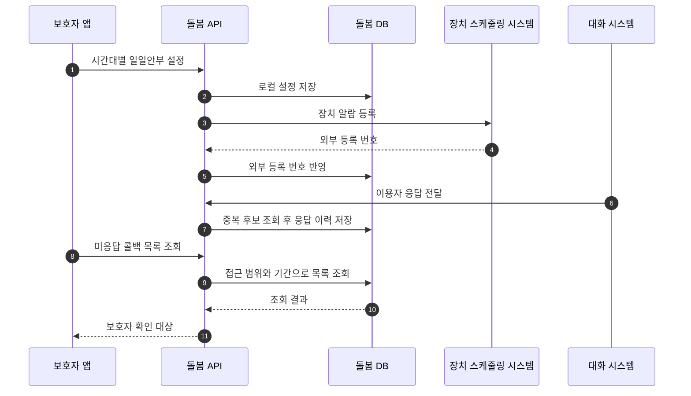
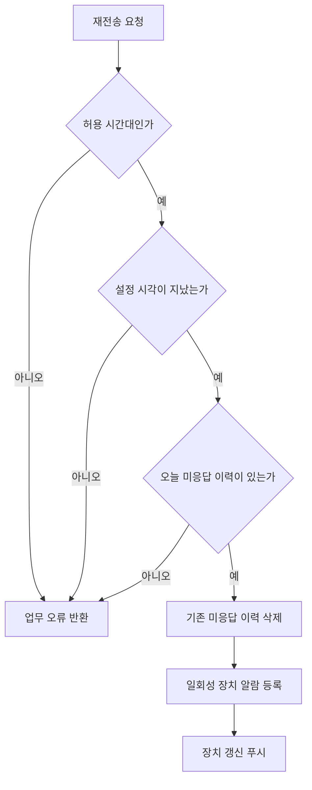

개인 고객용 돌봄 서비스의 일일안부는 정해진 시간에 질문을 내보내고 답을 저장하는 기능처럼 보인다. 실제 API에는 보호자가 시간을 설정하는 경로, 장치 스케줄링 시스템에 알람을 등록하는 경로, 대화 응답을 받는 경로, 미응답을 콜백 목록으로 보여 주는 경로가 함께 있었다. 재전송은 이 네 상태를 다시 맞추는 업무였다.

공개 이력서에 기록한 담당 범위는 일일안부 응답과 미응답 보호자 콜백 구현이다. 별도로 소스 이력에서는 일일안부 시간 설정과 방어 로직, 재전송 기능, 재전송 알람 누락 수정에 대한 직접 변경을 확인했다. 초기 기능과 후속 수정에는 팀 변경도 섞여 있으므로 전체 설계를 개인 작업으로 넓히지 않는다.

## 응답, 조회와 장치 스케줄은 서로 다른 상태다

보호자가 아침, 점심, 저녁의 알람 시간을 저장하면 API 서버는 로컬 설정뿐 아니라 장치 스케줄링 시스템의 등록 번호도 관리한다. 대화 시스템이 전달한 답변은 이용자와 장치를 찾은 뒤 시간대로 분류되어 이력에 저장된다. 콜백 화면은 저장된 호출 이력을 조회해 보호자가 확인할 목록으로 투영한다.

아래 흐름은 한 번의 안부가 여러 저장소와 외부 시스템을 통과하는 이유를 보여 준다.

> 실선은 API 코드에서 확인된 호출 또는 저장 흐름을 단순화한 것이다. 장치가 알람을 실행해 대화 응답으로 이어지는 내부 과정과 DB 함수 내부 구현은 공개 소스에서 확인하지 않았다.

## 재전송 전에 업무 상태를 먼저 검사했다

재전송 요청은 현재 시각만 보고 새 알람을 만드는 기능이 아니었다. 구현은 다음 조건을 순서대로 확인했다.

1. 현재 시각이 아침, 점심, 저녁 중 허용된 구간에 속하는지 확인한다.
2. 해당 시간대에 저장된 설정이 있고 원래 알람 시각이 지났는지 확인한다.
3. 오늘, 대상 이용자, 해당 시간대에 미응답 이력이 실제로 있는지 확인한다.
4. 기존 미응답 이력을 삭제하고 가까운 시각의 일회성 알람을 외부 시스템에 등록한다.
5. 장치가 새 설정을 읽도록 푸시를 요청한다.

재전송의 입력은 요청 body만이 아니라 현재 저장 상태다. 오전에 저녁 안부를 미리 재전송하거나 이미 답한 질문을 다시 울리게 하면 보호자 화면과 실제 장치 동작이 어긋난다. 그래서 “허용 시간대이며, 설정 시각이 지났고, 미응답 이력이 존재한다”는 조건을 업무 전제조건으로 사용했다.

## 중복 확인은 멱등성 보장과 다르다

대화 응답 저장 경로는 최신 장치, 날짜와 시간대 기준으로 기존 이력을 조회하고 중복 후보가 없을 때 이력을 추가한다. 이 검사는 정상적인 순차 중복 요청을 줄이는 데 도움이 된다. 하지만 조회와 삽입이 하나의 원자적 조건부 쓰기인지, DB에 유일성 제약이 있는지는 확인한 Java와 Mapper만으로 알 수 없다.

동시에 같은 응답이 두 번 들어오면 두 요청이 모두 “기존 이력 없음”을 읽은 뒤 삽입할 가능성이 남는다. 따라서 이 구현을 멱등성 보장으로 표현하지 않는다. 다시 만든다면 외부 transaction id나 장치와 질문 실행 식별자를 멱등키로 삼고 DB의 unique 제약과 충돌 처리로 원자성을 확보하겠다. 이것은 회고 시점의 개선 제안이다.

## 외부 호출을 DB 트랜잭션 안에서 해도 원자적이지 않다

Service 클래스의 트랜잭션 안에서 로컬 이력을 지운 뒤 장치 스케줄링 시스템을 호출하면 Java 예외가 전파될 때 로컬 변경은 rollback될 수 있다. 그러나 상대 시스템이 알람을 등록한 직후 응답이 끊겼다면 로컬 rollback이 원격 등록까지 취소하지는 못한다.

| 실패 시점 | 관찰 가능한 상태 | 추가로 필요한 설계 |
|---|---|---|
| 외부 요청 전 로컬 오류 | 장치 알람은 생성되지 않음 | 일반적인 DB rollback 검증 |
| 호출 중 연결 오류로 전송 단계 불명 | 원격 반영 여부를 단정할 수 없음 | timeout 단계 기록과 재조회 |
| 원격 등록 뒤 응답 유실 | 로컬은 실패, 원격은 성공일 수 있음 | 멱등키, 결과 조회 또는 보상 삭제 |
| 원격 번호 파싱이나 로컬 반영 실패 | 장치 등록 번호를 잃을 수 있음 | 원문 추적 식별자와 재조정 작업 |
| 푸시 요청 실패 | 설정은 있으나 장치가 즉시 갱신하지 못할 수 있음 | 푸시 재시도 상태와 운영 조회 |

당시 구현에서 이 보상 체계가 모두 있었다는 근거는 없다. “트랜잭션으로 외부 호출까지 보장했다”는 표현을 피하고 상태 불일치를 만들 수 있는 경계를 구분한다.

## 보호자 콜백 조회는 접근 범위와 개인정보 문제이기도 했다

콜백 목록은 로그인 정보로 접근 가능한 이용자 범위를 DB 조회 함수에 전달하고 조회 기간을 적용했으며, 별도 마스킹 허용 여부에 따라 이름 표시를 바꿨다. 다만 함수 내부의 권한 검사는 저장소에서 확인할 수 없고, 마지막 글자를 가리는 처리를 완전한 비식별화라고 할 수도 없다. 목록과 개수 쿼리는 같은 조건을 사용해야 페이지의 총건수와 실제 내용이 어긋나지 않는다.

## 어떻게 검증할 것인가

원본에는 외부 시스템 없이 전체 흐름을 재현할 테스트 환경이 확인되지 않았다. 이 글에서 테스트 통과를 주장하지 않는다. 현재 다시 검증한다면 다음 계약을 우선 고정한다.

- 오전 허용 구간의 시작과 끝에서 1초 전후를 입력해 경계 밖 요청은 거절되고 경계 안 요청만 다음 검사로 가는지 확인한다.
- 설정 없음, 원래 알람 시각 전, 당일 미응답 없음의 세 상태에서 외부 호출이 0회인지 확인한다.
- 같은 응답을 두 worker가 기존 이력 조회 직후 barrier에서 기다렸다 동시에 삽입하게 해 이력이 한 건만 남는지 확인한다.
- 외부 등록 성공 뒤 응답 유실 또는 로컬 저장 실패
- 콜백 목록과 총건수의 필터 일치, 권한별 이름 표시
- 재전송 뒤 장치 갱신 푸시가 빠지지 않는지

실제 이력에서도 재전송 후 알람이 울리지 않는 문제를 수정하며 장치가 소비하는 추가 데이터를 보완했다. 외부 API가 성공했다는 사실과 사용자가 실제 질문을 들었다는 결과 사이에 한 단계가 더 있다는 점을 보여 준다.

## 결과와 회고

일일안부의 성과를 “API 세 개 개발”이라고만 쓰면 중요한 판단이 사라진다. 더 정확한 설명은 응답 이력, 미응답 조회와 장치 알람의 상태를 연결하고 재전송 전제조건을 코드로 제한했다는 것이다. 확인할 수 있는 운영 개선 수치는 없어 제시하지 않는다.

> 개인 고객 돌봄 API에서 일일안부 응답과 미응답 보호자 콜백, 재전송 흐름을 구현했습니다. 재전송은 현재 시간대, 기존 설정 시각과 당일 미응답 이력을 확인한 뒤 일회성 장치 알람과 갱신 푸시를 요청하도록 구성했습니다. 응답 저장의 중복 조회는 확인했지만 DB 유일성까지 검증되지 않아 멱등성 보장으로 표현하지 않습니다. 외부 알람 등록과 DB 상태가 한 트랜잭션이 될 수 없다는 한계도 구분해 설명합니다.

[다음: TV 이상 징후 API는 어디까지 탐지를 담당했나](/blog/care-b2c-tv-anomaly-policy)
