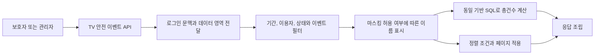
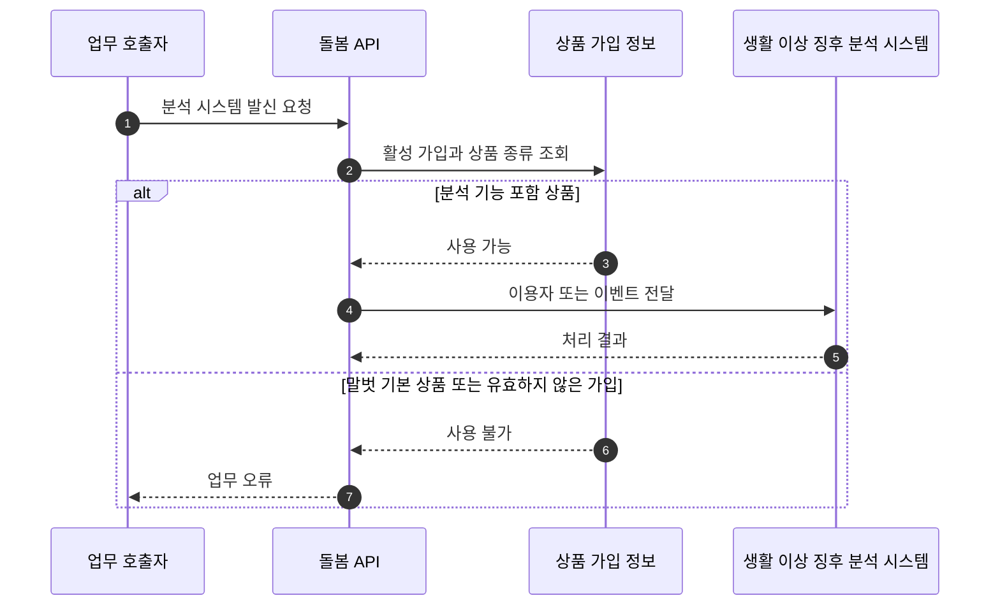

“TV 시청 패턴의 이상 징후 처리”라는 이력서 문장은 API 서버가 시청 데이터를 분석해 이상을 탐지한 것처럼 들릴 수 있다. 확인한 구현의 책임은 더 구체적이다. 별도 분석 시스템이 생성해 저장한 안전 이벤트를 보호자와 관리자가 조회할 수 있게 만들고, 화면에 노출할 이벤트 종류와 검색 조건, 정렬과 이름 표시 정책을 적용했다. 말벗 기본 상품 이용자는 분석 연동 대상이 아니므로 외부 호출 입구에서 제외했다.

TV 이력 API와 노출 정책 변경, 검색 및 정렬 조건, 말벗 상품의 분석 연동 제외는 author가 확인되는 직접 변경이다. 분석 알고리즘이나 이벤트 생성기의 구현은 이 저장소에 없으므로 개인 성과로 주장하지 않는다.

## 조회 API에도 업무 정책이 들어간다

API는 요청 DTO를 검색 조건으로 변환한 뒤 로그인 주체와 연결된 데이터 영역을 DB 조회 함수에 전달했다. 별도 마스킹 허용 여부에 따라 이용자와 담당자 이름 표시를 바꾸고, 기간, 이용자, 처리 상태와 이벤트 종류를 조건으로 목록을 만들었다. 개수와 내용은 같은 기반 SQL을 재사용했다.

이 흐름에서 “이상 징후 처리”는 이벤트를 새로 판정하는 일이 아니라 이미 기록된 이벤트에 조회 정책을 적용해 사용자가 확인할 목록으로 제공하는 일이다. DB 조회 함수 내부의 접근 제어는 공개 소스에서 확인할 수 없으므로, 로그인 문맥 전달만으로 권한 보안을 입증했다고 말하지 않는다. 이름의 마지막 글자를 가리는 처리도 완전한 익명화가 아니라 화면 표시 정책이다.

## 화면 노출 대상을 활성 공통 코드로 결정했다

초기 조회는 이벤트 생성 주체 조건으로 대상을 제한했다. 후속 변경은 이벤트 종류를 공통 코드와 조인하고 활성 상태인 코드만 결과에 포함하도록 바꿨다. 커밋 설명에는 채널을 지나치게 많이 또는 적게 바꾼 이벤트와 채널 변경이 없는 이벤트를 제외했다고 기록돼 있다. 그러나 DB의 당시 공통 코드 값은 저장소에서 확인할 수 없어 어떤 코드가 비활성화됐는지 blob만으로 재현할 수는 없다.

저장 원본을 삭제하지 않고 활성 공통 코드로 조회 투영을 바꾸면 화면 노출 정책을 데이터로 조정할 수 있다. 동시에 공통 코드의 생명주기와 화면 노출 여부가 결합된다. 새 이벤트 코드를 등록하지 않거나 활성 값을 잘못 바꾸면 저장된 이벤트가 목록에서 조용히 빠질 수 있다.

| 검토할 선택 | 장점 | 비용과 위험 |
|---|---|---|
| 활성 공통 코드와 조인 | 배포 없이 코드 활성 상태를 바꿀 수 있음 | 코드 누락과 잘못된 비활성화가 조회 누락으로 이어질 수 있음 |
| 별도 화면 노출 속성 사용 | 코드의 사용 여부와 화면 정책을 구분 | 설정 항목과 무결성 검사가 늘어남 |
| 애플리케이션 정책 객체에서 허용 | 변경 이력과 테스트가 명시적 | 정책 변경에 배포가 필요함 |

첫 번째가 확인된 구현이고 나머지는 현재 시점의 개선 대안이다. 활성 코드 목록과 실제 이벤트 종류의 차집합을 점검하는 운영 검사를 함께 두면 조용한 누락을 찾는 데 도움이 된다.

## 정렬 요청만으로 안정적인 페이지가 되지는 않는다

구현은 정렬 방향을 받아 내부 조회에 생성 시각 정렬을 적용하고 바깥 조회에서 페이지 제한을 걸었다. 하지만 최종 SELECT에 명시적 `ORDER BY`가 없고 같은 시각의 tie-breaker도 없다. 따라서 페이지 순서가 안정적이라고 단정할 수 없다.

다시 만든다면 최종 조회에 생성 시각과 고유 식별자의 복합 정렬을 명시하고, 개수 쿼리에는 불필요한 정렬을 제거하겠다. 첫 페이지의 마지막 항목과 다음 페이지의 첫 항목이 중복되거나 빠지지 않는지 같은 시각 데이터를 넣어 검증할 수 있다. 이는 확인된 구현을 넘어선 회고 제안이다.

## 말벗 상품 권한은 응답 필터보다 호출 전 검증이 필요했다

말벗 기본 상품은 생활 이상 징후 분석 기능을 사용하지 않는 상품이었다. 구현은 가입 정보를 조회해 활성 상태와 상품 종류를 확인했다. 분석 시스템으로 이용자 정보를 보내거나 부가 정보를 요청하는 발신 경로는 대상 상품일 때만 계속됐다. 분석 시스템에서 안전 이벤트를 받는 수신 경로에도 같은 상품 검사가 있었지만, 호출 방향과 후속 처리가 다르므로 아래 그림과는 분리해 봐야 한다.

> 분기는 여러 API 입구에 적용된 검사를 한 흐름으로 단순화했다.

외부 호출 뒤 응답만 버리면 대상이 아닌 이용자 정보나 이벤트가 이미 전달된다. 호출 전에 상품 권한을 확인한 이유는 결과 표시가 아니라 부작용 자체를 막아야 했기 때문이다.

## 실패와 변경 경계에서 남은 질문

가입 정보가 없거나 필수 값이 비어 있으면 구현은 분석 미사용으로 판단했다. 저장소에서 확인되는 것은 이 결과 분기까지다. 가입 조회 과정의 장애와 실제 미가입이 같은 예외 경로로 보이는지는 실행 검증이 필요하다. 다시 설계한다면 확정된 비대상과 판정 불가를 결과 모델에서 구분하는 방안을 검토하겠다.

같은 상품 검사가 여러 Sender 메서드와 수신 Service에 반복된 점도 보인다. 누락 방지에는 도움이 되지만 정책 변경 시 수정 지점이 늘어난다. 다시 설계한다면 다음을 검토하겠다.

- 상품 권한을 `ELIGIBLE`, `NOT_ELIGIBLE`, `UNKNOWN`처럼 구분해 조회 장애를 숨기지 않는다.
- 외부 호출 직전의 공통 정책 경계에서 권한을 검사하되 API별 추가 조건은 각 업무 Service에 둔다.
- 미사용 상품이 모든 분석 관련 호출을 차단하는지 계약 테스트로 고정한다.
- 조회 화면의 이벤트 노출 코드는 설정 또는 명시적 정책 객체로 관리하고 허용 목록 방식도 비교한다.

## 검증 시나리오

원본 저장소의 현재 테스트 파일은 기존 사용자 작업이 섞여 있어 실행 근거로 사용하지 않았다. 소스와 커밋 이력으로 구현을 검토했고, 다시 테스트한다면 다음 입력과 결과를 고정하겠다.

| 입력 조건 | 기대 결과 |
|---|---|
| 같은 필터로 count와 content 조회 | 총건수와 내용이 같은 대상 집합을 사용 |
| 생성 시각이 같은 이벤트를 페이지 경계에 배치 | 항목 중복과 누락 없이 고정된 순서 유지 |
| 마스킹 허용과 비허용 설정 | 각 설정에 맞는 이름 표시, 원문 노출 범위 확인 |
| 비활성 또는 미등록 공통 코드 이벤트 | API 결과 제외와 운영 검사 알림을 함께 확인 |
| 말벗 기본 상품으로 각 발신 API 호출 | 외부 HTTP 호출 0회, 명시적 비대상 결과 |
| 가입 저장소 예외와 실제 미가입 | 판정 불가와 비대상을 구분하는 것은 개선안으로 검증 |

## 결과와 면접 표현

확인된 성과는 TV 이상 징후 이벤트의 조회 API를 만들고 노출 정책, 검색과 정렬을 반영했으며 상품 권한에 따라 생활 이상 징후 분석 연동을 호출 전에 제한한 것이다. 탐지 정확도나 운영 효과 수치는 근거가 없어 제시하지 않는다.

> TV 시청 패턴에서 생성된 안전 이벤트를 보호자와 관리자가 조회하는 API를 개발했습니다. 로그인 문맥, 이름 표시, 이벤트 노출 정책과 검색 및 정렬 조건을 한 조회 흐름에 적용했습니다. 또한 말벗 기본 상품은 생활 이상 징후 분석 대상이 아니어서 활성 가입과 상품 종류를 외부 호출 전에 검증했습니다. 분석 알고리즘 개발과 API의 조회 및 연동 정책을 구분해 설명합니다.

[이전: 일일안부 재전송은 왜 단순한 API 재호출이 아니었나](/blog/care-b2c-daily-regard-workflow)
