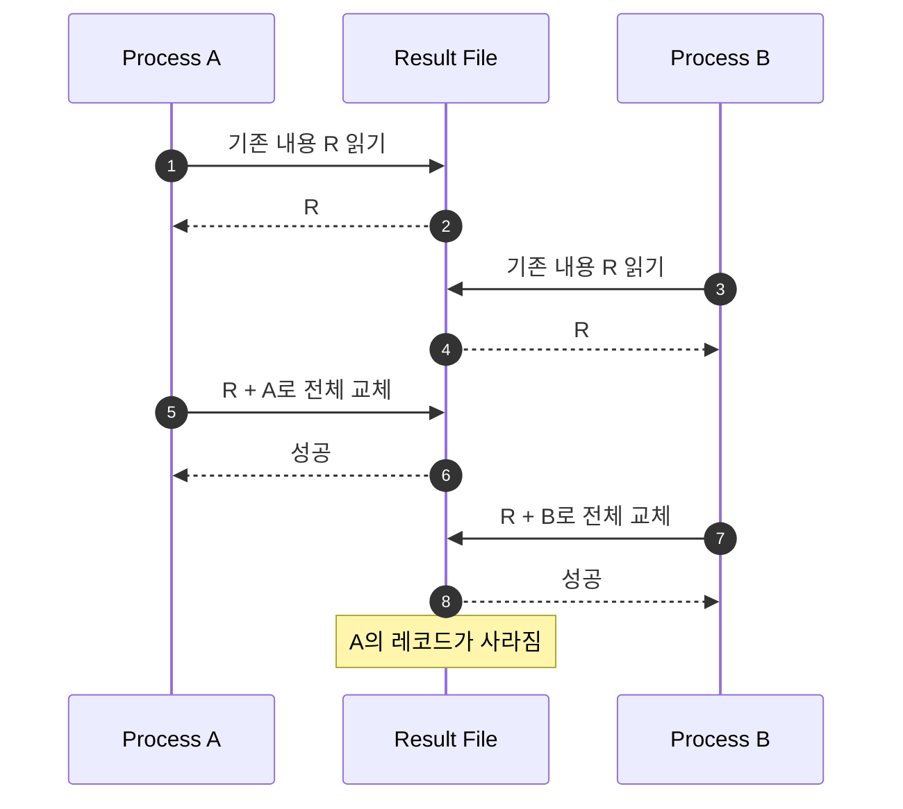

> **동시성에서 원자성까지 1편** · [시리즈 전체 보기](/blog/concurrency-atomicity-series) · 다음 글: [JVM 안의 원자성: ConcurrentHashMap](/blog/concurrency-02-jvm-concurrent-hash-map)

여러 프로세스가 결과를 한 파일에 추가한다. 각 프로세스의 로그에는 성공이 찍혔는데 결과 파일에는 레코드가 빠지거나, 두 줄이 한 줄처럼 섞여 있다. 이때 “파일 락을 걸면 된다”는 답은 절반만 맞다. 락이 누구에게 보이는지, 모든 writer가 같은 규약을 따르는지, 한 레코드가 실제로 몇 번의 쓰기로 내려가는지를 먼저 정해야 한다.

이 글은 파일에서 출발해 **원자성이란 협력 참여자 사이에서 정한 상태 전이를 더 작은 성공 단위로 나눌 수 없게 만드는 성질**임을 확인한다. 진행 중 상태의 관찰을 막는 격리와, 완성된 파일만 보이게 하는 공개 원자성은 별도 축이다. 파일 누락 원인의 전체 분류, 커널의 open file description과 page cache, WAL까지 한 번에 훑고 싶다면 기존 [파일 동시성 기초부터 커널·DB까지 워크북](/blog/backend-file-concurrency-workbook)을 먼저 참고하자. 여기서는 중복을 줄이고 락의 계약과 Java 코드, 실패 검증에 집중한다.

## 1. 원자성은 무엇을 한 덩어리로 볼 것인가

“write가 원자적이다”라는 문장만으로는 부족하다. 아래 단위는 서로 다르다.

- 파일 끝으로 offset을 옮기고 바이트를 쓰는 **시스템 콜 단위**
- 길이, 본문, 체크섬을 함께 남기는 **레코드 단위**
- 파일 기록과 처리 완료 표시를 함께 바꾸는 **업무 단위**
- 프로세스가 죽어도 기록이 남는 **내구성 단위**

원자성은 동시 관찰의 문제이고 내구성은 장애 뒤 보존의 문제다. `write()`가 다른 writer와 섞이지 않았더라도 커널 page cache에만 남은 데이터는 전원 장애로 사라질 수 있다. 반대로 `force()`로 저장 장치에 밀어냈더라도 “파일 기록 성공, 완료 마커 갱신 실패” 같은 두 자원 사이의 부분 성공은 해결되지 않는다.

다음 그림은 파일 쓰기에서 서로 다른 보장을 한 문장으로 섞으면 안 되는 이유를 보여준다.


> 왼쪽 수단이 오른쪽 보장을 자동으로 포함하지 않는다. 특히 파일 락은 DB 트랜잭션이나 장애 복구의 대체품이 아니다.

## 2. 락의 범위가 경쟁자의 범위보다 넓어야 한다

| 경쟁자 | 적합한 기본 수단 | 놓치기 쉬운 경계 |
|---|---|---|
| 한 JVM의 여러 스레드 | `synchronized`, `ReentrantLock` | Java `FileLock`은 JVM 내부 스레드용 락이 아님 |
| 한 호스트의 여러 프로세스 | `flock`, `fcntl`, Java `FileChannel.lock()` | 락을 무시하고 쓰는 프로세스는 막지 못할 수 있음 |
| 여러 호스트의 공유 파일 | 파일시스템·프로토콜이 제공하는 분산 락 | NFS/SMB 버전, mount 옵션, 서버 구현에 따라 의미가 달라짐 |
| 여러 서비스와 저장소 | DB transaction, 단일 writer, 검증된 분산 조정 | 파일 락 하나로 업무 단위를 묶을 수 없음 |

Java 공식 문서에 따르면 `FileLock`은 **JVM 전체를 대신해 보유**된다. 같은 JVM에서 겹치는 영역을 다시 잠그면 기다리는 대신 `OverlappingFileLockException`이 발생할 수 있으므로, JVM 내부 스레드에는 별도의 메모리 락을 사용해야 한다. 반면 다른 프로세스와의 조정에는 `FileLock`이 OS의 네이티브 파일 락으로 매핑된다.

### `flock`과 `fcntl`은 같은 이름의 락이 아니다

- Linux `flock()`은 기본적으로 파일 전체를 잠그며 open file description에 연결된다. `dup()`나 `fork()`로 같은 description을 공유하면 락도 공유하고, 이를 가리키는 descriptor가 모두 닫히면 해제된다.
- POSIX `fcntl()`의 전통적인 process-owned record lock은 바이트 범위를 잠근다. 그 프로세스가 같은 파일을 가리키는 descriptor 하나라도 닫으면 해당 파일의 process-owned lock이 모두 풀릴 수 있어 descriptor 생명주기에 특히 주의해야 한다.
- Linux의 `flock`과 `fcntl`이 상호작용하는지는 로컬 파일시스템, NFS, SMB에서 같지 않다. 구현이 다르다는 사실을 전제로 한 종류와 규약을 통일해야 한다.
- 둘 다 로컬 Unix 파일시스템에서는 보통 **advisory lock**이다. 권한이 있는 다른 프로그램이 락 없이 `write()`하면 보호막을 우회할 수 있다.

Java API는 운영체제가 어떤 네이티브 방식을 쓰는지 추상화한다. 따라서 애플리케이션 계약은 “이 경로를 쓰는 모든 writer가 동일한 lock file과 동일한 잠금 범위를 사용한다”처럼 언어 밖에서도 명시해야 한다.

## 3. TOCTOU: 확인한 사실은 사용하는 순간 이미 과거다

다음 코드는 기존 내용을 읽고 새 레코드를 붙인 뒤 전체 파일을 다시 쓴다.

```java
String current = Files.exists(resultPath)
        ? Files.readString(resultPath)
        : "";

// 이 사이에 다른 프로세스도 같은 current를 읽을 수 있다.
String next = current + record + System.lineSeparator();
Files.writeString(resultPath, next,
        StandardOpenOption.CREATE,
        StandardOpenOption.TRUNCATE_EXISTING);
```

프로세스 A와 B가 같은 `current`를 읽으면 마지막 writer가 다른 결과를 덮어쓴다. `Files.exists()`와 `readString()` 사이에는 파일이 교체될 수도 있다. 이것이 **Time Of Check To Time Of Use**, 즉 검사 시점과 사용 시점 사이의 경쟁이다.

아래 시퀀스는 두 writer 모두 검사에 성공해도 최종 결과에서는 한 레코드가 사라지는 과정을 보여준다.



> 두 API 호출이 각각 안전하더라도 이들을 합친 읽기-수정-쓰기 전체는 원자적이지 않다.

파일 존재 여부를 검사한 뒤 lock file을 만드는 패턴도 같은 문제가 있다. 소유권 표식이 필요하면 `CREATE_NEW`처럼 “없음 확인 + 생성”을 한 연산으로 제공하는 API를 사용해야 한다. 다만 프로세스가 죽고 남긴 stale lock file의 회수 문제는 별도로 설계해야 하므로, 프로세스 생명주기에 따라 커널이 해제하는 파일 락이 보통 더 다루기 쉽다.

## 4. `O_APPEND`는 강력하지만 레코드 트랜잭션은 아니다

Linux에서 `O_APPEND`로 연 파일의 각 `write()`는 파일 끝으로 offset을 옮기는 작업과 쓰기를 하나의 원자적 단계로 수행한다. 직접 `size()`를 읽고 `position(size)`로 이동하는 것보다 안전하다.

하지만 “append면 여러 프로세스가 아무렇게나 써도 된다”로 일반화하면 안 된다.

1. 한 논리 레코드를 헤더, 본문, 개행의 여러 `write()`로 나누면 호출 사이에 다른 writer가 들어올 수 있다.
2. `write()`는 요청한 바이트보다 적게 쓰고 반환할 수 있다. 완료될 때까지 반복해야 한다.
3. Java `FileChannel` 문서는 `APPEND`의 위치 이동과 쓰기가 한 원자 동작인지를 시스템 의존으로 둔다.
4. Linux `open(2)` 문서는 NFS에 네이티브 append가 없어 client가 흉내 내는 과정에서 여러 append가 경쟁할 수 있다고 경고한다.
5. append 원자성과 `force()`/`fsync()`가 다루는 내구성은 별개다.

`PIPE_BUF` 이하라면 안전하다는 설명도 일반 파일에는 적용할 수 없다. `PIPE_BUF`는 pipe와 FIFO에서 여러 writer의 데이터가 섞이지 않는 최대 쓰기 크기를 설명하는 규칙이다. 일반 파일의 JSON Line이나 CSV 레코드 경계를 보장하는 만능 숫자가 아니다.

락 없이 append해야 하는 제한된 상황이라면 최소한 레코드 전체를 먼저 하나의 `byte[]`로 직렬화하고 가능한 한 한 번의 채널 쓰기로 전달한다. 그러나 부분 쓰기와 파일시스템별 차이까지 제거하려면 여전히 협력 락, 단일 writer, 또는 로그 시스템이 더 명시적인 선택이다.

## 5. Java에서 안전한 협력 락 패턴

다음 구현은 모든 프로세스가 동일한 `.lock` 파일을 잠근다는 계약 아래 JSON Lines 레코드 하나를 추가한다. 데이터 파일이 아니라 고정된 lock file을 잠그므로 데이터 파일을 교체하는 작업과 락 inode의 생명주기가 엇갈리는 위험도 줄인다.

```java
import java.io.IOException;
import java.nio.ByteBuffer;
import java.nio.channels.FileChannel;
import java.nio.channels.FileLock;
import java.nio.charset.StandardCharsets;
import java.nio.file.Path;

import static java.nio.file.StandardOpenOption.APPEND;
import static java.nio.file.StandardOpenOption.CREATE;
import static java.nio.file.StandardOpenOption.WRITE;

public final class LockedJsonLineAppender {
    private final Path dataPath;
    private final Path lockPath;

    public LockedJsonLineAppender(Path dataPath) {
        this.dataPath = dataPath;
        this.lockPath = dataPath.resolveSibling(dataPath.getFileName() + ".lock");
    }

    public void append(String json) throws IOException {
        byte[] record = (json + "\n").getBytes(StandardCharsets.UTF_8);

        try (FileChannel lockChannel = FileChannel.open(lockPath, CREATE, WRITE);
             FileLock ignored = lockChannel.lock();
             FileChannel dataChannel = FileChannel.open(dataPath, CREATE, WRITE, APPEND)) {

            writeFully(dataChannel, ByteBuffer.wrap(record));

            // 로컬 저장 장치에서 함수 반환 전 내용의 내구성이 필요할 때만 사용한다.
            // 처리량과 지연 비용이 크므로 배치 정책과 함께 결정해야 한다.
            dataChannel.force(false);
        }
    }

    private static void writeFully(FileChannel channel, ByteBuffer buffer)
            throws IOException {
        while (buffer.hasRemaining()) {
            channel.write(buffer);
        }
    }
}
```

이 코드에서 중요한 것은 API 이름보다 생명주기다.

- try-with-resources는 역순으로 `dataChannel`, `FileLock`, `lockChannel`을 닫는다. 데이터 쓰기와 `force()`가 끝나기 전에는 락이 유지된다.
- 락 획득, 쓰기, `force()` 중 `IOException`이 나도 자원이 정리되고 락이 해제된다. 오류를 성공으로 삼키지 말고 호출자에게 전달해 재시도·격리 정책을 적용한다.
- `.lock` 파일을 정상 운영 중 삭제하거나 교체하지 않는다. 프로세스마다 서로 다른 inode를 잠그면 같은 이름처럼 보여도 상호 배제가 깨질 수 있다.
- `force(false)`는 파일 내용에 대한 요청이다. Java는 로컬 장치에서는 저장 장치 반영을 보장하지만 네트워크 파일에는 같은 보장을 하지 않는다. 파일 생성·rename까지 포함한 복구 계약에는 디렉터리 동기화 등 더 넓은 설계가 필요하다.
- 여러 스레드가 같은 JVM에서 이 객체를 호출할 수 있다면 별도의 `ReentrantLock` 등으로 먼저 직렬화한다. `FileLock`의 겹치는 JVM 내부 요청은 스레드 mutex처럼 대기하지 않을 수 있다.

### 기다림에 상한이 필요할 때

`lock()`은 획득할 때까지 막힌다. 응답 시간 제한이 있는 서버라면 `tryLock()`과 짧은 backoff, 명시적인 deadline을 조합할 수 있다. `tryLock()`은 다른 프로그램이 잡고 있으면 `null`을 반환하지만, 같은 JVM의 겹치는 락에는 `OverlappingFileLockException`이 발생할 수 있다. 타임아웃 뒤에는 레코드를 버리지 말고 재시도 큐나 실패 저장소로 넘겨야 한다.

## 6. NFS와 SMB에서는 로컬 실험 결과를 믿지 않는다

공유 디렉터리가 여러 호스트에 mount되어 있으면 락의 경계는 커널 하나를 넘어선다.

- **NFS**: Linux는 버전과 설정에 따라 `flock`을 `fcntl` byte-range lock으로 에뮬레이션한다. `nolock`, `local_lock` 같은 mount 설정은 원격 조정 범위를 바꿀 수 있다. `O_APPEND` 자체도 서버가 직접 제공하지 않아 경쟁 가능성이 있다.
- **SMB/CIFS**: Linux의 `flock(2)` 문서에는 SMB byte-range lock으로 에뮬레이션될 때 락이 advisory가 아니라 다른 descriptor의 I/O를 `EACCES`로 실패시키는 효과가 생길 수 있다고 설명한다. 실제 의미는 SMB 버전, mount 옵션, 서버 종류에 따라 달라진다.
- **공통 원칙**: “lock API가 성공했다”와 “모든 호스트가 같은 락을 관찰한다”를 같다고 보지 않는다. 운영과 같은 client/server 버전, mount 옵션, 장애 조건에서 교차 호스트 테스트를 해야 한다.

호스트가 늘어나거나 파일시스템 조합을 통제할 수 없다면, 파일을 공유 상태로 쓰기보다 각 producer가 고유 파일에 쓰고 중앙의 단일 writer가 병합하거나, Kafka·DBMS처럼 조정과 복구 계약이 명시된 시스템으로 경계를 옮기는 편이 낫다.

## 7. 장애 테스트로 보장 범위를 증명하기

정상 실행 한 번으로는 동시성 코드를 검증할 수 없다. 다음 실험은 각각 다른 실패를 드러낸다.

### 실험 구성

1. 별도 JVM 프로세스 20개를 띄우고 프로세스마다 고유한 `writerId`와 증가하는 `sequence`를 가진 레코드 10,000개를 쓴다.
2. 레코드는 `writerId`, `sequence`, payload 길이, checksum을 포함한다.
3. 실행 중 일부 프로세스에 `SIGKILL`을 보내 락 보유 중 종료와 write 직후 종료를 반복한다.
4. 종료 뒤 완전한 레코드 수, 고유 키 수, checksum, writer별 연속성을 검사한다.
5. 같은 테스트를 로컬 파일시스템과 실제 NFS/SMB mount에서 각각 수행한다.

### 반드시 넣을 대조군

| 대조군 | 드러내려는 문제 | 기대 관찰 |
|---|---|---|
| 읽기-수정-전체 쓰기, 락 없음 | Lost Update와 TOCTOU | 성공 로그보다 고유 레코드가 적음 |
| `APPEND`, 레코드를 여러 write로 분할 | 레코드 interleaving | checksum 또는 파싱 실패 가능 |
| writer 하나만 락을 우회 | advisory lock의 한계 | 잠긴 writer와 우회 writer가 동시에 변경 |
| 락 사용, `force()` 없음, 강제 전원 장애 환경 | 원자성과 내구성의 차이 | 형식은 맞아도 마지막 레코드 유실 가능 |
| 동일 코드, NFS/SMB | 네트워크 파일시스템의 의미 차이 | mount·서버 설정별 결과 차이 가능 |

Linux에서는 `/proc/locks`로 현재 락을 관찰하고 `strace`로 `fcntl`, `flock`, `write`, `fsync` 계열 호출을 추적할 수 있다. 다만 관찰 도구의 출력은 증거의 일부일 뿐이다. 테스트의 합격 조건은 “예외가 없었다”가 아니라 다음처럼 데이터 불변식으로 둔다.

```text
성공 응답을 받은 ID 집합은 파싱 가능한 ID 집합의 부분집합이다.
파싱 가능한 (writerId, sequence)는 중복되지 않는다.
파싱 가능한 모든 레코드의 checksum이 일치한다.
응답을 받지 못한 시도는 파일에 있거나 없을 수 있다.
```

마지막 경우는 write는 끝났지만 성공 응답이나 로그를 남기기 전에 프로세스가 죽는 **결과 불명확성**이다. 호출자는 같은 idempotency key로 재시도하고, writer는 이미 존재하는 레코드를 같은 성공 결과로 처리해 두 상태를 수렴시켜야 한다.

`SIGKILL` 뒤 커널이 락을 회수한다는 사실은 교착 방지에는 도움이 되지만, 쓰던 레코드를 자동 복구해 주지는 않는다. 길이 + payload + checksum 같은 프레이밍, 재시도 시 중복을 판별할 idempotency key, 시작 시 꼬리의 불완전 레코드를 검사하는 복구 절차가 필요하다. 여기서부터 파일은 작은 로그 저장소가 되고, 이후 시리즈에서 다룰 Kafka와 DBMS의 원자성·복구 설계로 자연스럽게 이어진다.

## 8. 선택 기준

- 한 JVM의 스레드만 경쟁한다면 메모리 락으로 임계 구역을 만든다.
- 같은 호스트의 협력 프로세스가 짧은 레코드를 추가한다면 고정 lock file + `FileChannel.lock()` + 완전 쓰기가 단순한 출발점이다.
- 락 없는 append 최적화는 대상 OS와 파일시스템에서 한 레코드의 실제 write 경계를 검증한 뒤 제한적으로 사용한다.
- NFS/SMB라면 운영 mount와 서버에서 다중 호스트 장애 테스트를 통과하기 전까지 로컬 파일과 같은 보장을 가정하지 않는다.
- 원자적 변경이 파일 하나를 넘거나, 재처리·중복 제거·복구가 핵심 요구사항이면 단일 writer, 메시지 로그, DBMS로 책임을 올린다.

파일 락은 원자성을 배우기 좋은 첫 사례다. 동시에 “락을 잡았다”가 끝이 아니라 **관찰자, 자원, 장애 모델을 어디까지 한 경계로 묶을지**가 진짜 설계 문제임을 가장 빠르게 보여준다.

---

이전: [동시성에서 원자성까지 — 시리즈 안내](/blog/concurrency-atomicity-series) · 다음: [JVM 안의 원자성: ConcurrentHashMap](/blog/concurrency-02-jvm-concurrent-hash-map)

## 참고 자료

- [Linux `open(2)` — `O_APPEND`와 NFS 주의사항](https://man7.org/linux/man-pages/man2/open.2.html)
- [Linux `flock(2)` — advisory lock, NFS와 CIFS 동작](https://man7.org/linux/man-pages/man2/flock.2.html)
- [Linux `fcntl_locking(2)` — POSIX record lock과 OFD lock](https://man7.org/linux/man-pages/man2/fcntl_locking.2.html)
- [POSIX.1-2024 `open()` — `O_APPEND`, `O_CREAT | O_EXCL`](https://pubs.opengroup.org/onlinepubs/9799919799/functions/open.html)
- [POSIX `write()` — regular file과 pipe/FIFO의 원자성 경계](https://pubs.opengroup.org/onlinepubs/9699919799/functions/write.html)
- [Java SE 21 `FileChannel` — append, lock, force의 보장](https://docs.oracle.com/en/java/javase/21/docs/api/java.base/java/nio/channels/FileChannel.html)
- [Java SE 21 `FileLock` — JVM 범위와 플랫폼 의존성](https://docs.oracle.com/en/java/javase/21/docs/api/java.base/java/nio/channels/FileLock.html)
