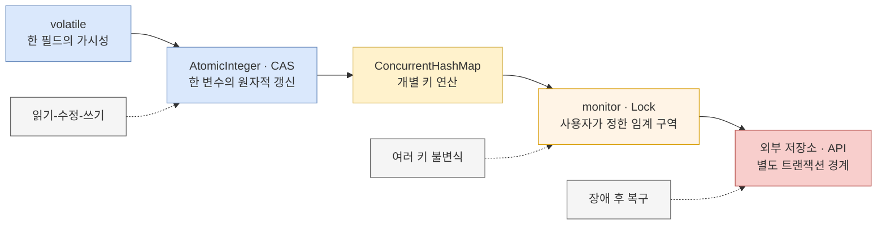
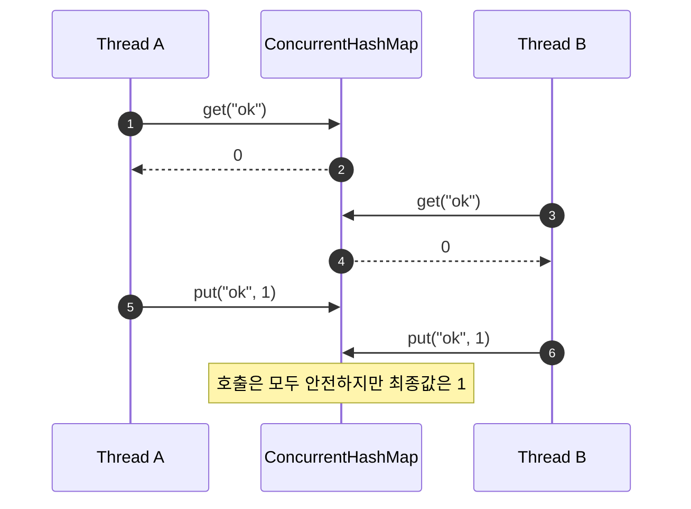

1편에서는 여러 프로세스가 같은 파일에 들어가지 못하도록 임계 구역을 만들었다. 이번에는 경쟁 범위를 한 JVM의 스레드로 좁힌다. 그러면 파일 락 대신 `synchronized`, `Lock`, atomic 변수, 동시성 컬렉션을 사용할 수 있다. 하지만 도구가 정교해져도 질문은 같다.

> **어느 관찰자에게, 어떤 상태 변경이, 정확히 어디까지 한 덩어리인가?**

`ConcurrentHashMap`을 쓴다는 사실만으로 주문 처리 전체가 원자적이 되지는 않는다. `get`과 `put`은 각각 안전하지만 그 사이에 다른 스레드가 들어올 수 있다. `compute`는 한 키의 갱신을 원자적으로 수행하지만 여러 키의 불변식이나 HTTP 호출까지 트랜잭션으로 묶지 않는다. 이 경계를 코드로 확인해 보자.

## 1. 먼저 가시성, 원자성, 상호 배제를 분리한다

세 용어는 자주 함께 등장하지만 같은 보장이 아니다.

| 보장 | 답하는 질문 | 대표 수단 | 자동으로 얻지 못하는 것 |
|---|---|---|---|
| 가시성 | 한 스레드의 쓰기를 다른 스레드가 관찰하는가? | `volatile`, monitor, `Lock`, 동시성 유틸리티 | 읽기-수정-쓰기 전체의 원자성 |
| 연산 원자성 | 한 메서드나 임계 구역의 상태 전이가 더 작은 성공 단위로 끼어들거나 나뉘지 않는가? | monitor 임계 구역, CAS, `compute`, `merge` | 여러 호출·자원과 외부 부수 효과의 트랜잭션 |
| 상호 배제 | 같은 임계 구역에 한 번에 한 스레드만 들어가는가? | `synchronized`, `ReentrantLock` | 프로세스 종료 뒤 복구와 내구성 |

아래 그림은 JVM 도구마다 자연스럽게 보호하는 범위가 다름을 보여준다.



> 실선은 흔한 확장 방향이고 점선은 그 수단이 필요한 대표 이유다. 오른쪽 도구가 왼쪽 도구보다 항상 빠르거나 우월하다는 뜻은 아니다.

## 2. `synchronized`와 `Lock`: 가장 명시적인 경계

`synchronized` 블록을 빠져나가는 monitor unlock은 같은 monitor의 이후 lock보다 happens-before다. 따라서 먼저 락을 잡았던 스레드의 임계 구역 안 쓰기는 나중에 같은 락을 잡은 스레드에게 보인다. 동시에 같은 monitor에는 한 스레드만 진입하므로 가시성과 상호 배제를 함께 얻는다.

```java
final class Counter {
    private int value;

    synchronized int incrementAndGet() {
        return ++value;
    }

    synchronized int get() {
        return value;
    }
}
```

중요한 조건은 **공유 상태에 접근하는 모든 코드가 같은 monitor 규약을 지키는 것**이다. `get()` 하나만 동기화하고 다른 메서드가 `value`를 락 없이 읽으면 계약이 깨진다.

`ReentrantLock`도 `lock()`과 `unlock()` 사이를 임계 구역으로 만든다. `tryLock`, interruptible lock 획득, 여러 `Condition`처럼 더 세밀한 제어가 필요할 때 유용하다. 반드시 `finally`에서 해제한다.

```java
lock.lock();
try {
    updateSharedState();
} finally {
    lock.unlock();
}
```

단순하고 경합이 낮은 코드에서 `synchronized`는 좋은 기준 구현이다. `ConcurrentHashMap`으로 바꾸면 항상 빨라진다는 식의 결론은 위험하다. 한 키만 자주 갱신하는지, 여러 키를 묶어야 하는지, 임계 구역에 I/O가 있는지에 따라 결과가 달라지므로 보호할 불변식을 먼저 정하고 운영 부하로 측정해야 한다.

## 3. `volatile`: 보이게 하지만 `++`를 한 덩어리로 만들지 않는다

한 `volatile` 필드에 대한 쓰기는 다른 스레드가 그 필드를 이후에 읽는 것보다 happens-before다. 종료 플래그나 새 immutable 설정 객체의 공개처럼 **한 번 쓴 값을 다른 스레드가 보게 하는 용도**에 잘 맞는다.

```java
final class Worker {
    private volatile boolean running = true;

    void stop() {
        running = false;
    }

    void runLoop() {
        while (running) {
            doOneTask();
        }
    }
}
```

반면 다음 카운터는 안전하지 않다.

```java
final class BrokenCounter {
    private volatile int value;

    int incrementAndGet() {
        return ++value; // volatile read + 덧셈 + volatile write
    }
}
```

두 스레드가 모두 `0`을 읽고 각각 `1`을 쓰면 증가 한 번이 사라진다. `volatile`은 읽기와 쓰기의 가시성을 제공하지만 이 세 단계를 상호 배제하지 않는다.

## 4. `AtomicInteger`와 CAS: 한 변수의 읽기-수정-쓰기

단일 숫자의 원자적 증감이라면 `AtomicInteger`가 의도를 정확히 드러낸다.

```java
private final AtomicInteger sequence = new AtomicInteger();

int nextSequence() {
    return sequence.incrementAndGet();
}
```

조건부 변경은 compare-and-set(CAS) 반복으로 표현할 수 있다. 현재 값이 예상값과 같을 때만 새 값을 넣고, 다른 스레드가 먼저 바꿨다면 최신 값을 다시 읽어 계산한다.

```java
private final AtomicInteger stock = new AtomicInteger(10);

boolean reserveOne() {
    while (true) {
        int current = stock.get();
        if (current == 0) {
            return false;
        }
        if (stock.compareAndSet(current, current - 1)) {
            return true;
        }
    }
}
```

CAS도 보호 범위는 이 atomic 변수 하나다. 재고 감소와 주문 객체 추가가 서로 다른 변수에 있다면 CAS 성공만으로 둘이 all-or-nothing이 되지 않는다. 재시도되는 CAS 계산 안에는 네트워크 호출이나 결제처럼 반복하면 안 되는 부수 효과를 넣지 않는다.

## 5. `HashMap + synchronized`의 진짜 문제는 “느리다”가 아니다

평범한 `HashMap`은 동시 접근을 지원하지 않는다. 그러나 모든 접근을 같은 락 아래 두면 올바르게 사용할 수 있고, 여러 키를 함께 바꾸는 임계 구역도 직접 정의할 수 있다.

```java
final class LockedInventory {
    private final Map<String, Integer> quantities = new HashMap<>();

    synchronized void move(String from, String to, int amount) {
        int source = quantities.getOrDefault(from, 0);
        if (source < amount) {
            throw new IllegalStateException("insufficient stock");
        }
        quantities.put(from, source - amount);
        quantities.merge(to, amount, Integer::sum);
    }
}
```

이 구현은 한 객체의 monitor가 두 키를 포함한 불변식을 보호한다. 경합이 심하면 직렬화 비용이 커질 수 있지만, 그것은 측정할 특성이지 코드가 틀렸다는 뜻은 아니다.

오히려 흔한 실패는 `Collections.synchronizedMap`의 메서드별 동기화를 복합 연산 전체의 동기화로 오해하는 것이다.

```java
Map<String, Integer> counts = Collections.synchronizedMap(new HashMap<>());

// get과 put은 각각 동기화되지만 둘을 합친 증가는 원자적이지 않다.
int current = counts.getOrDefault("ok", 0);
counts.put("ok", current + 1);
```

이 경우 `synchronized (counts) { ... }`로 읽기-수정-쓰기 전체를 묶어야 한다. 모든 접근자가 같은 규약을 지킬 수 없거나 주로 독립된 키를 갱신한다면 `ConcurrentHashMap`의 원자 메서드가 계약을 더 잘 드러낼 수 있다.

## 6. `ConcurrentHashMap`: 메서드 안전성과 조합 안전성은 다르다

`ConcurrentHashMap`의 조회는 일반적으로 update와 겹쳐 실행될 수 있고, `get(key)`이 어떤 갱신값을 반환했다면 그 키의 해당 update는 그 조회보다 happens-before다. 즉 안전하게 공개된 매핑은 관찰할 수 있다. 그러나 map 전체에 대한 한 시점의 스냅샷을 뜻하지는 않는다. 동시 갱신 중 `size`, 순회, bulk operation은 서로 다른 시점의 원소를 조합해 볼 수 있다.

### 실패: 안전한 `get`과 `put` 사이의 Lost Update

```java
ConcurrentHashMap<String, Integer> counts = new ConcurrentHashMap<>();
counts.put("ok", 0);

// 두 메서드는 각각 thread-safe다. 이 조합은 원자적이지 않다.
int current = counts.get("ok");
counts.put("ok", current + 1);
```

아래 시퀀스는 메서드별 안전성만으로 복합 연산을 지킬 수 없는 이유를 보여준다.



> 각 화살표 한 개가 map이 제공하는 연산 경계다. 두 화살표를 애플리케이션이 이어 붙였다고 하나의 경계가 되지는 않는다.

### 안전: 의도에 맞는 원자 메서드를 고른다

```java
counts.merge("ok", 1, Integer::sum);

cache.putIfAbsent(key, prebuiltValue);

limits.compute(userId, (id, oldValue) ->
        oldValue == null ? initialLimit : oldValue.consumeOne());
```

`putIfAbsent`는 “없으면 넣기”, `replace(key, old, new)`는 조건부 교체, `compute`와 `merge`는 현재 매핑을 바탕으로 한 갱신을 메서드 호출 하나로 수행한다. 이 보장은 **대상 키와 그 메서드 호출의 범위**에 집중되어 있다.

### `computeIfAbsent` 함수는 짧고 단순해야 한다

캐시 초기화의 안전한 기본 형태는 다음과 같다.

```java
ConcurrentHashMap<String, Parser> parsers = new ConcurrentHashMap<>();

Parser parser = parsers.computeIfAbsent(format, Parser::new);
```

Java API는 키가 없을 때 `computeIfAbsent` 호출 전체를 원자적으로 수행하고, 그 호출에서 mapping function을 정확히 한 번 실행한다고 명시한다. 그동안 다른 update 일부가 막힐 수 있으므로 함수는 짧고 단순해야 하며, 계산 중 이 map을 수정해서는 안 된다. 끝나지 않을 재귀적 update를 구현이 탐지하면 `IllegalStateException`이 날 수 있다.

```java
// 실패하기 쉬운 설계: 느린 I/O와 같은 map 수정이 mapping function 안에 있다.
users.computeIfAbsent(userId, id -> {
    User user = remoteClient.fetch(id); // 오래 막히거나 외부 효과가 생길 수 있음
    users.put("last-loaded", user);     // 이 map 수정: API 계약 위반
    return user;
});
```

mapping function이 예외를 던지면 매핑은 만들어지지 않는다. 하지만 함수 안의 HTTP 요청, 파일 쓰기, 알림 발송까지 되돌려 주지는 않는다. 이후 호출자가 재시도하면 외부 효과가 반복될 수도 있다. 원자 함수 안에서는 순수 계산과 짧은 객체 생성만 하고, 느리거나 재시도에 민감한 작업은 별도 수명 주기와 멱등성 정책으로 분리한다.

### map은 값 객체 내부까지 보호하지 않는다

```java
ConcurrentHashMap<String, ArrayList<Event>> events = new ConcurrentHashMap<>();

// ArrayList.add 자체는 thread-safe하지 않다.
events.computeIfAbsent(userId, ignored -> new ArrayList<>()).add(event);
```

매핑의 설치가 안전하다는 것과 저장된 `ArrayList`의 변경이 안전하다는 것은 별개다. 값으로 immutable 객체를 사용해 `compute`에서 통째로 교체하거나, 요구사항에 맞는 동시성 컬렉션을 값으로 사용한다.

## 7. 한 키를 넘으면 다시 불변식의 락을 설계한다

다음 코드는 각 `compute`가 원자적이어도 계좌 이체 전체는 원자적이지 않다.

```java
balances.compute(from, (id, balance) -> {
    if (balance < amount) throw new IllegalStateException("insufficient funds");
    return balance - amount;
});

auditClient.recordTransfer(from, to, amount); // 실패하거나 오래 걸릴 수 있음

balances.merge(to, amount, Long::sum);
```

첫 번째 키를 차감한 뒤 외부 호출이나 두 번째 갱신이 실패하면 총액 불변식이 깨진다. `ConcurrentHashMap`은 여러 키와 외부 API를 아우르는 트랜잭션을 제공하지 않는다.

- 한 JVM 안의 작은 상태라면 모든 관련 키를 포함하는 하나의 lock으로 임계 구역을 정의한다.
- 경합을 줄이려고 키별 lock을 여러 개 잡는다면 전역 lock 순서를 정해 데드락을 방지한다.
- 상태 전체를 immutable 객체 하나로 만들 수 있다면 `AtomicReference<State>` CAS로 교체하는 방법도 있다. 그래도 외부 효과는 같은 CAS에 포함되지 않는다.
- 여러 프로세스·서버가 참여하거나 복구가 필요하면 DB transaction, 멱등성 키, Outbox 같은 더 넓은 경계로 책임을 옮긴다.

한 JVM의 lock 안에서 원격 I/O를 호출하면 정확성 문제가 사라지는 것도 아니다. 다른 스레드를 오래 막고, 프로세스가 죽으면 외부 호출과 메모리 상태 사이를 복구할 방법이 없다. 이 지점이 이후 DBMS의 트랜잭션과 로그 복구가 필요한 이유다.

## 8. `LongAdder`: 높은 처리량의 통계이지 정확한 순간값은 아니다

키별 빈도처럼 쓰기가 매우 많고 읽기는 통계용이라면 공식 API가 제시하는 다음 패턴이 잘 맞는다.

```java
ConcurrentHashMap<String, LongAdder> frequencies = new ConcurrentHashMap<>();

frequencies.computeIfAbsent(word, ignored -> new LongAdder()).increment();
long approximateNow = frequencies.get(word).sum();
```

`LongAdder`는 경합할 때 내부 합계를 여러 변수로 분산해 `AtomicLong`보다 높은 처리량을 기대하도록 설계됐다. 대신 `sum()`은 동시 update에 대한 원자적 snapshot이 아니다. 합산 도중 발생한 update가 결과에 포함되지 않을 수 있고, `sumThenReset()`도 동시 update가 있으면 reset 직전의 정확한 최종값을 보장하지 않는다.

따라서 요청 수, 관측용 빈도, 주기적 metrics에는 적합하지만 다음 용도에는 맞지 않는다.

- 잔액이나 재고처럼 읽은 값으로 즉시 허용 여부를 결정하는 상태
- “정확히 1,000건이 되면 단 한 번 실행” 같은 선형화 가능한 임계점
- 감사 원장, 청구 금액, 중복 방지처럼 정확한 snapshot이 필요한 값

여기서 **선형화 가능하다**는 것은 각 연산이 호출과 반환 사이의 한 시점에 일어난 것처럼 전체 순서를 설명할 수 있다는 뜻이다. `LongAdder.sum()`은 동시 update 중 그런 단일 관찰 시점을 약속하지 않는다.

## 9. `CountDownLatch`로 실패 순서를 재현한다

동시성 테스트는 “운 좋게 겹치기”를 기다리지 말고 실패 창을 의도적으로 연다. 다음 JUnit 테스트는 두 스레드가 모두 같은 값을 읽은 뒤에만 `put`하도록 만들어 Lost Update를 재현한다.

```java
import static org.junit.jupiter.api.Assertions.assertEquals;

import java.util.concurrent.ConcurrentHashMap;
import java.util.concurrent.CountDownLatch;
import org.junit.jupiter.api.Test;

class ConcurrentMapTest {
    @Test
    void getThenPutLosesOneIncrement() throws Exception {
        var counts = new ConcurrentHashMap<String, Integer>();
        counts.put("ok", 0);

        var start = new CountDownLatch(1);
        var bothRead = new CountDownLatch(2);

        Runnable increment = () -> {
            try {
                start.await();
                int before = counts.get("ok");
                bothRead.countDown();
                bothRead.await();
                counts.put("ok", before + 1);
            } catch (InterruptedException e) {
                Thread.currentThread().interrupt();
                throw new RuntimeException(e);
            }
        };

        Thread first = new Thread(increment);
        Thread second = new Thread(increment);
        first.start();
        second.start();
        start.countDown();
        first.join();
        second.join();

        assertEquals(1, counts.get("ok")); // 두 번 실행했지만 한 번 유실
    }

    @Test
    void mergeKeepsEveryIncrement() throws Exception {
        var counts = new ConcurrentHashMap<String, Integer>();
        int threadCount = 8;
        int incrementsPerThread = 100_000;
        var start = new CountDownLatch(1);
        var done = new CountDownLatch(threadCount);

        for (int t = 0; t < threadCount; t++) {
            new Thread(() -> {
                try {
                    start.await();
                    for (int i = 0; i < incrementsPerThread; i++) {
                        counts.merge("ok", 1, Integer::sum);
                    }
                } catch (InterruptedException e) {
                    Thread.currentThread().interrupt();
                } finally {
                    done.countDown();
                }
            }).start();
        }

        start.countDown();
        done.await();

        assertEquals(threadCount * incrementsPerThread, counts.get("ok"));
    }
}
```

`countDown()` 이전 동작은 다른 스레드에서 대응하는 `await()`가 성공적으로 반환한 이후 동작보다 happens-before다. 첫 테스트의 latch는 두 read의 완료를 확인할 뿐, 그 뒤 두 `put`을 하나로 직렬화하지 않는다. `join()` 이후 assertion은 작업 스레드의 결과를 안전하게 관찰한다.

반복 부하 테스트는 회귀를 찾는 데 유용하지만 테스트가 통과했다고 모든 가능한 interleaving을 증명하지는 않는다. 코드 리뷰에서는 API 명세와 불변식을 확인하고, 테스트에서는 latch·barrier로 알려진 실패 순서를 고정하며, 중요한 알고리즘은 jcstress 같은 전용 검증도 고려한다.

## 10. 요구사항으로 선택한다

| 요구사항 | 우선 검토할 수단 | 원자적 경계 | 주의점 |
|---|---|---|---|
| 종료 플래그, immutable 설정 공개 | `volatile` | 한 필드의 읽기·쓰기와 가시성 | `++`, check-then-act는 복합 연산 |
| 단일 숫자·참조의 조건부 갱신 | `AtomicInteger`, `AtomicReference` | atomic 변수 하나 | 여러 변수·외부 효과는 포함하지 않음 |
| 여러 필드·키의 불변식 | `synchronized`, `ReentrantLock` | 사용자가 정한 임계 구역 | 같은 락 규약, deadlock, 긴 I/O 점검 |
| 독립 키의 조회와 조건부 갱신 | `ConcurrentHashMap`의 `putIfAbsent`, `compute`, `merge` | 해당 키의 메서드 호출 | 조합한 호출과 map 전체 snapshot은 별도 |
| 경합이 큰 관측용 카운터 | `LongAdder` | 분산된 update | `sum()`은 동시 갱신 중 원자 snapshot 아님 |
| 여러 서버·영속 상태·장애 복구 | DBMS 등 외부 조정 시스템 | 문서화된 transaction·로그 경계 | 격리 수준, 재시도, 외부 시스템 경계 필요 |

선택 순서는 “가장 동시성이 높아 보이는 도구”가 아니다. 먼저 지켜야 할 불변식을 문장으로 쓰고, 그 불변식 전체를 감싸는 가장 단순한 원자 연산이나 임계 구역을 고른다. 이후 측정에서 실제 경합이 확인되면 키 분할, immutable state, atomic 연산처럼 경계를 더 작게 최적화한다.

`ConcurrentHashMap`의 핵심 교훈은 thread-safe 컬렉션을 사용했다는 사실이 아니라 **API가 제공하는 원자 연산과 내가 조합한 업무 연산은 다르다**는 것이다. 다음 브리지 편에서는 이 map에 네트워크, 직렬화, WAL, 복제와 질의 기능을 하나씩 붙이는 사고 실험으로 KV·NoSQL·RDBMS의 공통 뿌리와 다른 계약을 구분한다.

CAS, cache coherence, OS scheduler와 Java Memory Model 자체를 더 깊게 보고 싶다면 별도 [HW에서 가상 스레드까지 동시성·병렬성 시리즈](/blog/concurrency-parallelism-series)로 이어간다.

---


## 참고 자료

- [Java SE 26 `ConcurrentHashMap` API](https://docs.oracle.com/en/java/javase/26/docs/api/java.base/java/util/concurrent/ConcurrentHashMap.html)
- [Java SE 26 `ConcurrentMap` API — memory consistency와 atomic 메서드](https://docs.oracle.com/en/java/javase/26/docs/api/java.base/java/util/concurrent/ConcurrentMap.html)
- [Java Language Specification 26, Chapter 17 — Threads and Locks](https://docs.oracle.com/javase/specs/jls/se26/html/jls-17.html)
- [Java SE 26 `java.util.concurrent` — Memory Consistency Properties](https://docs.oracle.com/en/java/javase/26/docs/api/java.base/java/util/concurrent/package-summary.html#MemoryConsistency)
- [Java SE 26 atomic package — CAS와 atomic update](https://docs.oracle.com/en/java/javase/26/docs/api/java.base/java/util/concurrent/atomic/package-summary.html)
- [Java SE 26 `LongAdder` API — 비원자적 `sum()` snapshot](https://docs.oracle.com/en/java/javase/26/docs/api/java.base/java/util/concurrent/atomic/LongAdder.html)
- [Java SE 26 `CountDownLatch` API](https://docs.oracle.com/en/java/javase/26/docs/api/java.base/java/util/concurrent/CountDownLatch.html)
- [Java SE 26 `Collections.synchronizedMap` API](https://docs.oracle.com/en/java/javase/26/docs/api/java.base/java/util/Collections.html#synchronizedMap(java.util.Map))
