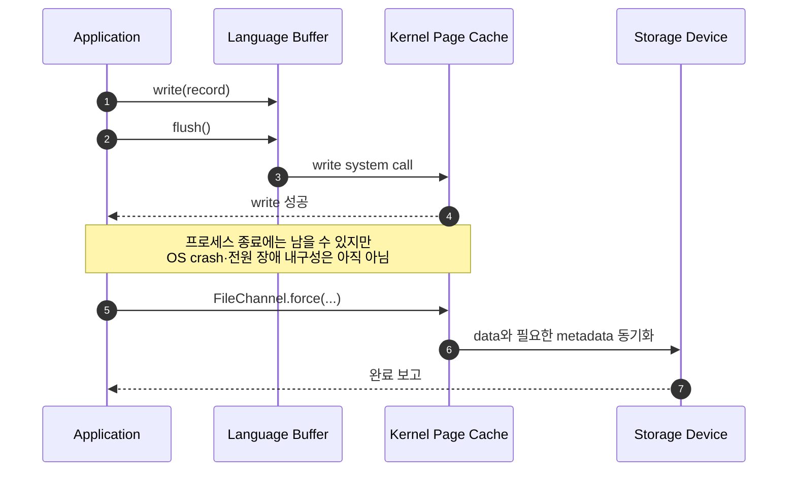
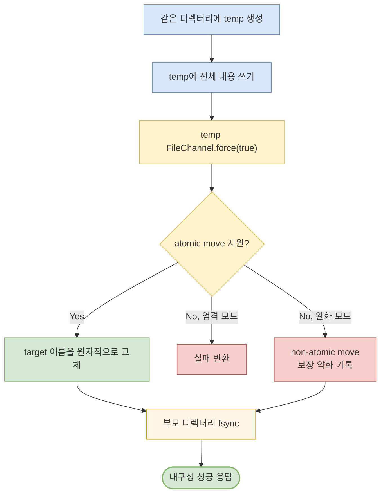

> **동시성에서 원자성까지 3편** · 이전 글: [ConcurrentHashMap에 네트워크를 붙이면 DB가 될까?](/blog/concurrency-map-nosql-rdb-bridge) · [시리즈 전체 보기](/blog/concurrency-atomicity-series) · 다음 글: [Kafka 로그의 원자성](/blog/concurrency-04-kafka-log-atomicity)

설정 파일을 새 버전으로 저장하는 API가 `write()` 성공 직후 200 응답을 보냈다고 하자. 다른 프로세스가 반쪽짜리 JSON을 읽지 않았다는 뜻일까? 그 직후 서버 전원이 끊겨도 새 파일이 남는다는 뜻일까? 둘 다 자동으로 따라오지 않는다.

파일 I/O에서 흔히 말하는 “원자적 쓰기”에는 적어도 세 질문이 섞여 있다.

1. 여러 writer의 바이트가 한 레코드 안에서 섞이지 않는가?
2. reader가 기존 파일 또는 완성된 새 파일만 보는가?
3. 성공 응답 뒤 OS crash나 전원 장애가 나도 그 이름과 내용이 남는가?

이 글은 이 셋을 각각 **레코드 무결성**, **공개 원자성**, **내구성**으로 나누고, Java NIO로 단일 파일을 교체할 때 어디까지 보장할 수 있는지 코드와 장애 테스트로 확인한다.

## 1. 먼저 보장 단위를 분리한다

| 보장 | 질문 | 대표 수단 | 여전히 보장하지 않는 것 |
|---|---|---|---|
| 쓰기 완료 | 요청한 바이트가 모두 커널에 전달됐는가? | short write 반복 처리 | 다른 writer와의 혼합, 저장 장치 반영 |
| 레코드 무결성 | 길이·본문·체크섬이 한 논리 레코드로 남는가? | 단일 직렬화, 프레이밍, 협력 락·단일 writer | 여러 레코드의 트랜잭션, 전원 장애 내구성 |
| 공개 원자성 | reader가 기존 버전 또는 새 버전만 보는가? | 같은 파일시스템의 atomic rename | 새 이름과 내용의 영구 보존 |
| 내구성 | 성공 뒤 시스템 장애가 나도 복구 가능한가? | 파일 `fsync`/`force`, rename, 부모 디렉터리 `fsync` | 두 파일의 all-or-nothing, 잘못된 데이터의 롤백 |

`atomic`이라는 단어를 쓰기 전에 **무엇을 한 단위로 묶는지**와 **어떤 장애까지 포함하는지**를 함께 적어야 한다. rename의 원자성은 이름을 바꾸는 관찰 단위이고, DB 트랜잭션의 원자성은 여러 변경을 전부 반영하거나 전혀 반영하지 않는 업무 단위다.

## 2. `write()` 성공은 “전부 썼다”도 “디스크에 남았다”도 아니다

Linux `write(2)`는 요청한 `count`보다 적은 바이트를 쓰고 성공할 수 있다. 저장 공간 부족, 파일 크기 제한, 시그널 같은 조건이 원인이 될 수 있다. Java의 `FileChannel.write(ByteBuffer)`도 쓴 바이트 수를 반환하므로 버퍼가 빌 때까지 반복해야 한다.

```java
private static void writeFully(FileChannel channel, ByteBuffer buffer)
        throws IOException {
    while (buffer.hasRemaining()) {
        channel.write(buffer);
    }
}
```

하지만 이 반복문은 **전달 완료**만 해결한다. 첫 번째 `write()`와 short write 뒤의 두 번째 `write()` 사이에 다른 writer가 끼어들 수 있다면 레코드 전체의 원자성은 얻지 못한다. 한 레코드를 먼저 하나의 `byte[]`로 직렬화하는 것은 호출 수를 줄이는 좋은 출발점이지만, 일반 파일에 대해 “이 크기 이하면 언제나 레코드 단위로 원자적”이라는 이식 가능한 상수는 없다. 엄격한 레코드 경계가 필요하면 모든 writer가 따르는 락이나 단일 writer를 둔다.

### `O_APPEND`와 호출 경계

Linux에서 `O_APPEND`로 연 파일의 각 `write()`는 파일 offset을 끝으로 옮기는 일과 실제 쓰기를 한 원자적 단계로 수행한다. 직접 `size()`를 읽고 그 위치로 이동하는 경쟁은 피할 수 있다. 그러나 헤더, 본문, 개행을 세 번 호출하면 원자적 단계도 세 개다. 다른 writer의 호출이 그 사이에 들어올 수 있다.

Java `FileChannel`의 `APPEND`는 더 보수적으로 읽어야 한다. 공식 문서는 위치 이동과 쓰기가 하나의 원자 동작인지 시스템 의존이며 명세하지 않는다고 밝힌다. NFS에서는 Linux조차 native append를 제공하지 못해 client가 흉내 내는 과정에 경쟁이 생길 수 있다. 따라서 로컬 ext4에서 통과한 append 테스트를 NFS·SMB와 다른 provider의 계약으로 일반화하지 않는다.

다음 코드는 레코드 경계도, 교체 원자성도, 내구성도 만들지 못하는 전형적인 예다.

```java
// 잘못된 예: reader는 truncate 직후의 빈 파일이나 중간 JSON을 볼 수 있다.
try (BufferedWriter writer = Files.newBufferedWriter(
        target,
        StandardCharsets.UTF_8,
        StandardOpenOption.CREATE,
        StandardOpenOption.TRUNCATE_EXISTING)) {
    writer.write("{\"version\":");
    writer.flush();              // Java 버퍼를 비울 뿐, 저장 장치 반영이 아니다.
    writer.write("42}");
}
// close가 성공해도 부모 디렉터리 엔트리의 장애 후 보존은 별도 문제다.
```

## 3. `flush`, page cache, `fsync`는 서로 다른 경계다

`BufferedWriter.flush()` 같은 언어·라이브러리 수준의 flush는 사용자 공간 버퍼의 데이터를 아래 출력 대상으로 전달한다. 그 아래가 파일이면 보통 커널 page cache까지 도달하지만, 저장 장치에 영구 반영됐다는 계약은 아니다. `FileChannel`은 그 자체로 `BufferedWriter` 같은 사용자 공간 문자 버퍼를 두지 않지만, `write()`가 끝난 데이터 역시 page cache에 머물 수 있다.

아래 시퀀스는 코드가 성공을 관찰하는 시점과 장애 후 보존되는 시점 사이의 층을 보여준다.



> `flush()`는 사용자 공간 버퍼, `write()` 성공은 주로 커널 page cache, `force()`는 로컬 저장 장치 반영 요청의 경계다. 장치가 flush를 정직하게 구현한다는 전제와 파일시스템별 장애 계약은 별도로 확인한다.

Linux의 두 시스템 콜도 범위가 다르다.

- `fsync(fd)`는 수정된 파일 데이터와 연결된 metadata를 저장 장치에 동기화한다.
- `fdatasync(fd)`는 이후 데이터를 올바르게 읽는 데 필요하지 않은 metadata를 생략할 수 있다. 파일 크기처럼 읽기에 필요한 metadata는 포함된다.
- 둘 다 **그 파일을 가리키는 디렉터리 엔트리**의 영속성을 자동 보장하지 않는다.

Java에서는 `FileChannel.force(false)`가 내용 변경을, `force(true)`가 내용과 metadata 변경을 저장 장치에 강제하도록 요청한다. 다만 `true`의 실제 추가 효과는 OS 의존적이다. 공식 보장은 로컬 저장 장치의 파일에 한정되며, 네트워크 장치에는 같은 보장을 하지 않는다.

## 4. 파일 전체 교체는 temp → force → rename → directory fsync 순서다

reader에게 완성된 스냅샷 하나를 공개하려면 대상 파일을 직접 truncate하지 않는다. 대상과 **같은 디렉터리**에 임시 파일을 완성하고, 그 파일을 동기화한 뒤 atomic move로 이름을 교체한다. 마지막으로 부모 디렉터리를 동기화해야 rename으로 바뀐 이름이 장애 뒤에도 남는다는 계약을 세울 수 있다.

아래 흐름은 각 단계에서 crash가 났을 때 기대할 수 있는 관찰 결과를 보여준다.



> 엄격 모드는 atomic move나 디렉터리 동기화를 지원하지 않으면 성공을 반환하지 않는다. 완화 모드는 가용성을 택하는 대신 reader가 중간 상태를 볼 가능성과 실패 후 상태 불확실성을 운영 계약에 명시해야 한다.

### Java NIO 구현

다음 구현은 fallback을 호출자가 명시적으로 선택하게 한다. 임시 파일을 대상과 같은 디렉터리에 만들기 때문에 cross-filesystem move를 피하고, move가 끝난 직후 부모 디렉터리까지 동기화한다.

```java
import java.io.IOException;
import java.nio.ByteBuffer;
import java.nio.channels.FileChannel;
import java.nio.file.AtomicMoveNotSupportedException;
import java.nio.file.FileSystemException;
import java.nio.file.Files;
import java.nio.file.Path;
import java.util.Objects;

import static java.nio.file.StandardCopyOption.ATOMIC_MOVE;
import static java.nio.file.StandardCopyOption.REPLACE_EXISTING;
import static java.nio.file.StandardOpenOption.READ;
import static java.nio.file.StandardOpenOption.TRUNCATE_EXISTING;
import static java.nio.file.StandardOpenOption.WRITE;

public final class DurableFileReplacer {
    public enum AtomicMoveFallback {
        REJECT,
        ALLOW_NON_ATOMIC
    }

    public static void replace(
            Path target,
            byte[] content,
            AtomicMoveFallback fallback) throws IOException {

        Objects.requireNonNull(content, "content");
        Objects.requireNonNull(fallback, "fallback");
        Path absoluteTarget = target.toAbsolutePath().normalize();
        Path parent = absoluteTarget.getParent();
        if (parent == null || !Files.isDirectory(parent)) {
            throw new IOException("Target parent directory does not exist: " + parent);
        }

        Path temp = Files.createTempFile(
                parent,
                "." + absoluteTarget.getFileName() + ".",
                ".tmp");
        boolean moved = false;

        try {
            try (FileChannel file = FileChannel.open(temp, WRITE, TRUNCATE_EXISTING)) {
                writeFully(file, ByteBuffer.wrap(content));
                file.force(true);
            }

            try {
                Files.move(temp, absoluteTarget, ATOMIC_MOVE, REPLACE_EXISTING);
            } catch (AtomicMoveNotSupportedException unsupported) {
                if (fallback == AtomicMoveFallback.REJECT) {
                    throw unsupported;
                }
                // 공개 원자성이 약해진다는 정책 결정을 한 경우에만 허용한다.
                Files.move(temp, absoluteTarget, REPLACE_EXISTING);
            }
            moved = true;

            // rename된 디렉터리 엔트리의 내구성까지 성공 조건에 포함한다.
            forceDirectory(parent);
        } finally {
            if (!moved) {
                Files.deleteIfExists(temp);
            }
        }
    }

    private static void writeFully(FileChannel channel, ByteBuffer buffer)
            throws IOException {
        while (buffer.hasRemaining()) {
            channel.write(buffer);
        }
    }

    private static void forceDirectory(Path directory) throws IOException {
        try (FileChannel channel = FileChannel.open(directory, READ)) {
            channel.force(true);
        } catch (UnsupportedOperationException | FileSystemException e) {
            // 지원되지 않는데도 durable하다고 응답하지 않는다.
            throw new IOException(
                    "Directory fsync is unavailable on this platform/provider", e);
        }
    }
}
```

이 예제에도 이식성 경계가 있다.

- Java에는 모든 OS와 `FileSystemProvider`에서 디렉터리 `fsync`를 보장하는 전용 표준 API가 없다. `FileChannel.open(directory, READ)` 후 `force(true)`는 Unix 계열에서 사용할 수 있지만 Windows나 다른 provider에서는 열기부터 실패할 수 있다. 디렉터리 내구성이 필수라면 지원 플랫폼을 제한하고 통합 테스트하거나, 검증된 native/JNI 계층을 사용해야 한다.
- `Files.move(..., ATOMIC_MOVE, REPLACE_EXISTING)`에서 Java 명세상 `ATOMIC_MOVE`를 지정하면 다른 옵션은 무시된다. 대상이 이미 있을 때 교체할지 실패할지도 구현 의존적이다. 따라서 배포 대상 provider에서 **기존 파일 교체**까지 시험해야 한다.
- `AtomicMoveNotSupportedException`이 아닌 일반 `IOException`은 저장 공간 부족이나 I/O 오류일 수 있다. 이를 무조건 non-atomic move로 재시도하면 원인을 숨기고 상태를 더 바꿀 수 있으므로 그대로 실패시킨다.
- non-atomic move가 도중에 실패하면 source와 target이 모두 존재하거나, target이 불완전할 수 있다고 Java 문서가 경고한다. fallback은 단순한 성능 저하가 아니라 보장 약화다.
- 같은 디렉터리 temp는 cross-filesystem 이동 가능성을 구조적으로 줄인다. 임시 파일을 시스템 공용 temp 디렉터리에 만들면 다른 `FileStore`로의 이동이 되어 atomic move가 불가능할 수 있다.
- move는 성공했지만 부모 디렉터리 동기화가 실패할 수도 있다. 이때 새 target이 이미 공개됐을 수 있으므로 “예외 = 자동 롤백”으로 해석하지 말고, `generation`을 확인해 멱등적으로 재시도하거나 복구해야 한다.

## 5. `force`와 rename을 조합했을 때의 보장표

| 구현 | 동시 reader의 관찰 | 프로세스 종료 | OS crash·전원 장애 | 주요 빈틈 |
|---|---|---|---|---|
| target 직접 truncate 후 write | 빈 파일·중간 내용 가능 | page cache 내용은 보통 OS에 남음 | 마지막 내용 유실·부분 상태 가능 | 공개 원자성 없음 |
| `BufferedWriter.flush()`만 호출 | 중간 내용 가능 | 사용자 버퍼는 비움 | 저장 장치 반영 보장 없음 | flush 층을 혼동 |
| temp 작성 후 atomic move | 기존 또는 새 파일 | 새 이름 관찰 가능 | 새 내용·이름의 보존은 별도 | durability 없음 |
| temp `force` 후 atomic move | 기존 또는 완성된 새 파일 | 새 이름 관찰 가능 | 파일 내용은 준비됐지만 rename이 유실될 수 있음 | 부모 디렉터리 미동기화 |
| temp `force` → atomic move → 부모 dir `fsync` | 기존 또는 완성된 새 파일 | 새 이름 관찰 가능 | 지원되는 로컬 스택의 계약 안에서 새 이름과 내용 보존 | 하드웨어·FS·provider 계약 필요 |
| temp `force` → non-atomic fallback | 중간 상태 가능 | 실패 시 상태 확인 필요 | 실패 시 source·target 상태 불명확 가능 | 공개 원자성 약화 |

여기서 “전원 장애 내구성”은 모든 저장 장치에서의 우주적 보장이 아니다. OS, 파일시스템, mount 옵션, 장치의 flush 구현이 문서화된 계약을 지킨다는 전제다. 네트워크 파일시스템과 클라우드 마운트는 client의 `force()`가 서버·복제본·물리 매체 어디까지 도달했는지 구현 문서와 장애 시험으로 확인해야 한다.

## 6. 단일 파일 원자 교체는 다중 파일 트랜잭션이 아니다

`users.json`과 `index.json`을 각각 안전하게 교체해도 둘을 한 번에 공개할 수는 없다.

```text
users.json 교체 성공
<여기서 crash>
index.json 교체 전
```

각 move가 원자적이어도 두 move를 합친 업무 연산은 원자적이지 않다. 가능한 설계는 요구사항에 따라 달라진다.

- 새 버전의 여러 파일을 변경 불가능한 디렉터리에 쓰고, 마지막에 단일 manifest 또는 `current` 포인터 파일만 원자 교체한다. reader는 포인터가 가리키는 한 버전만 읽는다.
- append-only journal에 의도와 완료 상태를 남기고 재시작 시 복구한다. 이 순간부터 checksum, 재실행 멱등성, compaction까지 직접 설계해야 한다.
- 여러 레코드·인덱스·외부 효과의 all-or-nothing과 자동 복구가 핵심이면 DBMS 같은 트랜잭션 시스템으로 책임을 올린다.

manifest 패턴도 여러 파일의 물리적 생성 자체를 하나의 트랜잭션으로 만들지는 않는다. 다만 **공개 지점**을 포인터 파일 하나로 좁힌다. 참조되지 않은 버전의 정리, 포인터와 버전 디렉터리의 동기화 순서, 시작 시 검증은 여전히 필요하다.

## 7. crash test와 fault injection으로 계약을 검증한다

정상 종료 테스트는 page cache 덕분에 거의 항상 통과한다. 필요한 것은 각 내구성 경계에서 프로세스와 시스템을 끊는 실험이다.

### 주입 지점

1. temp 파일을 일부 쓴 직후
2. `writeFully` 직후, `force(true)` 직전
3. temp `force(true)` 직후, move 직전
4. move 직후, 부모 디렉터리 동기화 직전
5. 부모 디렉터리 동기화 직후, 성공 응답 직전

각 지점에 테스트 전용 hook을 두고 자식 JVM을 `SIGKILL`한다. 이것은 프로세스 crash와 자원 정리는 검증하지만, 커널 page cache가 사라지는 전원 장애는 재현하지 못한다. OS crash·전원 장애 계약은 disposable VM의 강제 reset이나 저장 계층 fault-injection 환경에서 별도로 검증한다.

### 합격 불변식

대상 파일에는 `generation`, payload 길이, checksum을 넣고 재시작 뒤 다음을 검사한다.

```text
엄격 atomic move 모드:
  target은 이전 세대 또는 새 세대 중 하나다.
  어떤 세대든 길이와 checksum이 완전하다.
  성공 응답을 기록한 세대는 재부팅 뒤 존재한다.

non-atomic fallback 모드:
  실패 뒤 source와 target의 존재 여부를 모두 조사한다.
  checksum 실패 파일을 정상 버전으로 공개하지 않는다.
  자동 복구 규칙과 운영 경보가 동작한다.
```

short write는 테스트용 `WritableByteChannel`이 한 번에 몇 바이트만 받도록 감싸 반복 처리 코드를 단위 테스트한다. 저장 공간 부족, 권한 변경, I/O 오류도 별도로 주입해 실패를 성공으로 삼키지 않는지 확인한다. Linux에서는 `strace`로 `write`, `fsync`, `rename` 호출 순서를 관찰할 수 있지만, 시스템 콜이 보였다는 사실보다 재부팅 뒤 불변식이 유지되는지가 최종 판정 기준이다.

## 8. 운영 체크리스트

- 레코드 append인가, 파일 전체 스냅샷 교체인가?
- 한 논리 레코드가 몇 번의 실제 `write()` 호출로 나뉘는가?
- short write와 지연된 I/O 오류를 처리하는가?
- 성공 응답 시점은 사용자 버퍼, page cache, 로컬 저장 장치 중 어디인가?
- 임시 파일은 target과 같은 디렉터리·`FileStore`에 있는가?
- atomic move 미지원 시 실패할지, 약한 fallback을 허용할지 명시했는가?
- 파일 `force` 뒤 rename하고, 부모 디렉터리까지 동기화하는가?
- 배포 OS와 provider에서 기존 target 교체 및 디렉터리 동기화를 시험했는가?
- NFS·SMB·클라우드 마운트의 server-side 내구성 계약을 따로 확인했는가?
- 변경 단위가 파일 하나를 넘는다면 manifest, journal, DBMS 중 적합한 경계를 선택했는가?

파일시스템은 완성된 단일 파일을 안전하게 공개하는 강력한 재료를 제공한다. 하지만 `write`, `flush`, `force`, rename은 각자 다른 층의 작은 계약이다. 이 계약을 올바른 순서로 조합하고 crash test로 검증해야 비로소 “원자적으로 저장했다”는 말을 운영 가능한 문장으로 바꿀 수 있다.

---

이전: [ConcurrentHashMap에 네트워크를 붙이면 DB가 될까?](/blog/concurrency-map-nosql-rdb-bridge) · 목록: [파일 락에서 DBMS 복구까지](/blog/concurrency-atomicity-series) · 다음: [Kafka 로그의 원자성](/blog/concurrency-04-kafka-log-atomicity)

## 참고 자료

- [Linux `write(2)` — short write와 성공 반환의 내구성 한계](https://man7.org/linux/man-pages/man2/write.2.html)
- [Linux `open(2)` — `O_APPEND`, `O_SYNC`, NFS append 주의사항](https://man7.org/linux/man-pages/man2/open.2.html)
- [Linux `fsync(2)` — `fsync`, `fdatasync`, 부모 디렉터리 동기화](https://man7.org/linux/man-pages/man2/fsync.2.html)
- [Linux `rename(2)` — 기존 경로의 원자적 교체](https://man7.org/linux/man-pages/man2/rename.2.html)
- [Java SE 21 `FileChannel` — `write`, append, `force`의 보장](https://docs.oracle.com/en/java/javase/21/docs/api/java.base/java/nio/channels/FileChannel.html)
- [Java SE 21 `Files.move` — `ATOMIC_MOVE`, `REPLACE_EXISTING`, 실패 상태](https://docs.oracle.com/en/java/javase/21/docs/api/java.base/java/nio/file/Files.html#move(java.nio.file.Path,java.nio.file.Path,java.nio.file.CopyOption...))
- [Java SE 21 `StandardCopyOption` — 표준 이동 옵션](https://docs.oracle.com/en/java/javase/21/docs/api/java.base/java/nio/file/StandardCopyOption.html)
