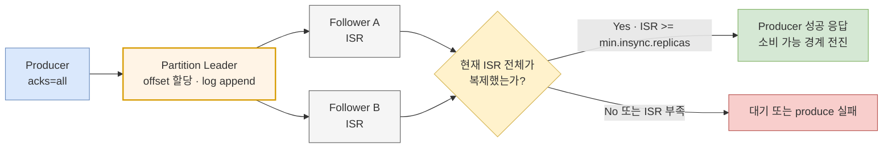
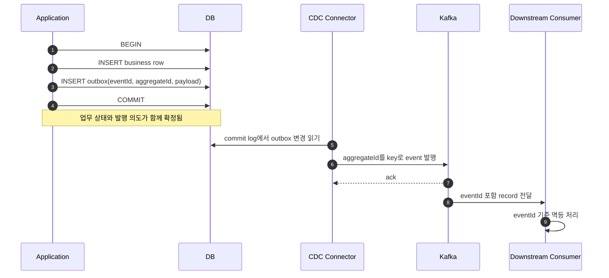

파일에 레코드를 append하면 곧 원장이 될 것 같지만, 운영에 필요한 질문은 금세 파일 하나를 넘어선다. writer가 죽으면 누가 이어 쓰는가? 저장 장치가 사라지면 복제본은 어디에 있는가? 응답만 유실되어 재시도할 때 같은 레코드가 두 번 생기지 않는가? 여러 로그와 처리 위치를 한 번에 확정할 수 있는가?

Kafka는 이 질문에 **파티션별 단일 순서, 복제된 로그, 멱등적 전송, 트랜잭션 공개 제어**로 답한다. 그러나 Kafka의 트랜잭션도 외부 DB와 HTTP 호출까지 마법처럼 묶지는 않는다. 이 글의 목표는 “Kafka면 exactly-once”라는 문장을 보장 단위와 실패 경계로 다시 쓰는 것이다.

> 이 글의 설정 기본값은 별도 표기가 없으면 **Apache Kafka 4.3.x** 공식 문서 기준이다. 클라이언트·브로커 버전과 관리형 서비스 정책에 따라 기본값과 허용 설정이 다를 수 있으므로 실제 클러스터의 effective config를 확인해야 한다.

## 1. 파일 한 줄은 파티션의 레코드가 된다

Kafka의 topic은 여러 partition으로 나뉘고, 각 partition은 leader가 순서를 정하는 append-only log다. broker는 partition에 들어온 record에 증가하는 offset을 붙인다. 이때 보장의 첫 경계가 정해진다.

- **순서는 partition 안에서만** 정의된다. 서로 다른 partition의 offset 10끼리는 선후 관계가 없다.
- 같은 key가 같은 partition으로 라우팅되어야 그 key의 이벤트 순서를 한 로그에서 관찰할 수 있다. partition 수 변경이나 partitioner 변경은 key와 partition의 대응을 바꿀 수 있다.
- offset은 업무 ID가 아니라 partition 안의 위치다. transaction marker, aborted record, compaction으로 소비자가 보는 offset에는 빈 구간이 생길 수 있다.
- retention과 compaction이 있으므로 Kafka offset을 영구적인 업무 식별자로 쓰지 않는다. 이벤트에는 별도의 `eventId`를 둔다.

파일에서 한 번의 append 호출이 레코드 경계였다면 Kafka에서는 `ProducerRecord`와 record batch가 append 단위가 된다. 여기에 여러 broker의 복제가 더해지지만 **모든 topic을 아우르는 전역 순서**가 생기는 것은 아니다.

### 서로 다른 세 가지 `commit`

Kafka 문맥에서 “커밋됐다”는 말은 최소 세 가지 뜻으로 쓰인다. 장애 분석 전에 어느 뜻인지 먼저 고정해야 한다.

| 표현 | 뜻 | 결정 주체 | 보장하지 않는 것 |
|---|---|---|---|
| 복제 로그에 committed | partition의 현재 ISR 전체가 record를 복제해 소비 가능 경계가 전진함 | partition leader와 replica | 업무 처리가 끝났다는 뜻 |
| transaction committed | 여러 Kafka partition의 record와 선택적으로 consumer offset을 한 transaction으로 공개함 | transaction coordinator와 producer | 외부 DB·HTTP 부수 효과 |
| consumer offset committed | 재시작 시 이 consumer group이 다시 읽을 위치를 저장함 | consumer group coordinator | 그 전에 수행한 외부 효과의 원자성 |

consumer의 현재 `position`도 committed offset과 다르다. `poll()`이 record를 반환하면 position은 전진하지만, 장애 후 복구 위치는 마지막 committed offset이다.

## 2. `acks=all`만으로는 복제 내구성을 설명할 수 없다

아래 그림은 leader가 정한 record 순서가 ISR에 복제되고, 성공 응답과 소비 가능 경계가 정해지는 흐름을 보여준다.



> `acks=all`의 `all`은 partition에 배치된 모든 replica가 아니라 **현재 ISR에 남아 있는 모든 replica**다. `min.insync.replicas`가 ISR의 최소 크기를 제한한다.

### 세 설정은 함께 읽는다

예를 들어 replication factor 3, `min.insync.replicas=2`, producer `acks=all`이면 정상 시 현재 ISR 전체가 record를 복제해야 성공한다. ISR이 1로 줄면 가용성을 희생하고 produce를 실패시켜 단일 replica에만 성공 응답하는 일을 막는다.

| 설정 | 역할 | 4.3.x 기본값 | 운영에서 놓치기 쉬운 점 |
|---|---|---:|---|
| topic replication factor | partition replica의 배치 수 | topic 생성 정책에 따름 | 값 3이라고 매 순간 3개가 ISR이라는 뜻은 아님 |
| producer `acks` | producer가 성공으로 인정할 복제 확인 수준 | `all` | `all`은 현재 ISR 전체이며 `min.insync.replicas=1`이면 ISR 1개에서도 성공 가능 |
| topic `min.insync.replicas` | `acks=all` write가 성공할 최소 ISR 수 | `1` | 내구성 우선이면 topic별로 명시해야 함 |
| cluster feature `eligible.leader.replicas.version` | KRaft controller가 ELR을 추적하는 feature level (`1` = 활성) | Kafka 4.1+ 새 cluster에서 기본 활성 | `kafka-features.sh --describe`로 확인하고 업그레이드 cluster는 공식 절차로 level 1 전환 |
| broker `unclean.leader.election.enable` | ISR·ELR 같은 안전 후보가 없을 때 뒤처진 replica의 leader 승격 허용 | `false` | 켜면 가용성을 얻는 대신 committed record도 잃을 수 있음 |

`acks=0`은 broker 수신 여부도 확인하지 않고, `acks=1`은 leader의 local log 기록만 확인한 뒤 follower 복제를 기다리지 않는다. leader가 응답 직후 죽으면 `acks=1` record는 유실될 수 있다. 가장 강한 `acks=all`도 replica 수, ISR 크기, leader election 정책과 함께 설정하지 않으면 의도한 내구성이 되지 않는다.

Kafka 4.3 공식 topic 설정 문서는 **Eligible Leader Replicas(ELR)** 기능을 사용하는 경우 `min.insync.replicas`의 의미가 달라진다고 명시한다. ELR을 활성화한 클러스터라면 기존 ISR만 전제로 계산하지 말고 해당 클러스터의 ELR 설정과 election 동작을 함께 검증해야 한다.

또 하나의 중요한 경계가 있다. Kafka의 복제 프로토콜은 각 write마다 모든 replica 디스크에 `fsync`를 완료하는 방식이 아니다. OS page cache를 활용하고 replica가 ISR에 재합류하기 전에 다시 동기화되도록 설계한다. 따라서 “서로 다른 broker 장애를 견디는 복제 내구성”과 “동시에 모든 장비의 휘발성 cache까지 사라지는 전원·스토리지 장애”를 같은 말로 취급하지 않는다. rack 분산, 전원 장애 모델, 스토리지 보장, 백업·원격 복제 요구를 별도로 결정해야 한다.

## 3. ELR과 unclean leader election을 구분한다

leader 선출은 안전 후보를 다음 순서로 찾는다. **ISR → unfenced ELR → unfenced LastKnownLeader**다. ISR 구성원과 ELR은 committed record 보존을 위한 후보이고, LastKnownLeader는 앞선 두 집합이 비었을 때의 공식 fallback이다.

Kafka 4.1 이후 새 cluster에서 기본 활성화된 **Eligible Leader Replicas(ELR)**는 ISR에서 빠졌더라도 committed record를 모두 가진 replica를 별도의 안전 후보로 추적한다. 따라서 ISR 후보가 없어도 ELR이 있다면 그 replica를 leader로 선출해 committed data를 보존할 수 있다. 기존 cluster를 업그레이드했거나 관리형 서비스를 사용한다면 ELR feature와 metadata version의 실제 상태를 확인해야 한다.

이 세 후보로도 leader를 선출하지 못하는 경우에만 unclean election 정책이 문제 된다.

- `unclean.leader.election.enable=false`이면 안전 후보가 돌아올 때까지 partition을 사용할 수 없다. 일관성을 위해 가용성을 포기한다.
- `true`이면 안전 후보가 아닌 뒤처진 replica까지 leader로 올릴 수 있다. 서비스는 빨리 재개될 수 있지만, 그 replica에 없던 record는 새 로그에서 사라질 수 있다.

즉 unclean election은 단순 복구 속도 옵션이 아니다. **어떤 로그를 원장의 새 진실로 인정할 것인가**를 바꾸는 데이터 유실 정책이다. 4.3.x broker 기본값은 `false`지만, cluster default와 topic override를 실제로 조회하고 변경 이력도 감시해야 한다.

## 4. 멱등적 producer가 막는 중복의 정확한 범위

producer가 broker에 record를 보냈고 broker는 append했지만 성공 응답이 네트워크에서 사라질 수 있다. 일반 재전송이면 같은 record가 한 번 더 append된다. 멱등적 producer는 producer ID와 partition별 sequence를 사용해 **클라이언트 내부 retry가 같은 batch를 다시 보낼 때** broker가 중복 append를 제거한다.

Kafka 4.3.x에서는 충돌하는 설정이 없을 때 `enable.idempotence=true`가 기본이고, 이를 사용하려면 `acks=all`, `retries>0`, `max.in.flight.requests.per.connection<=5`가 필요하다. 명시적으로 켠 상태에서 충돌 설정을 주면 `ConfigException`이 발생한다. 기본값을 믿기보다 요구사항을 설정과 테스트로 고정하는 편이 안전하다.

그러나 이 보장은 다음 경계 밖으로 나가지 않는다.

- 애플리케이션이 timeout 뒤 새 `send()`를 호출해 업무 이벤트를 다시 만든 것은 내부 retry가 아니다. 별도 send의 의미상 중복은 제거하지 못한다.
- producer session 밖의 임의 재발행까지 일반적인 event ID 기준으로 dedupe하지 않는다. `transactional.id` 없이 멱등성만 쓰면 공식 Java API가 설명하는 보장도 한 producer session 범위다.
- record key가 같다고 중복이 제거되지 않는다. compacted topic도 즉시 중복을 숨기지 않으며, 소비자는 중간의 모든 update를 볼 수 있다.
- 두 번의 `send()`나 서로 다른 partition의 record를 all-or-nothing으로 묶지 않는다. 그 경계에는 Kafka transaction이 필요하다.
- 소비자가 DB에 만든 중복 row, 두 번 보낸 email, 두 번 호출한 결제 HTTP API는 producer 멱등성의 범위가 아니다.

따라서 producer 멱등성은 **전송 프로토콜의 재시도 중복 방지**이지 업무 요청 전체의 멱등성이 아니다.

## 5. Kafka transaction은 여러 partition과 consumer offset을 묶는다

producer에 안정적이고 인스턴스별로 고유한 `transactional.id`를 설정하면 transaction API를 사용할 수 있다. 같은 ID로 재시작한 새 producer는 이전 session의 미완료 transaction을 정리하고 오래된 producer를 fencing한다.

한 transaction에는 다음을 함께 넣을 수 있다.

- 서로 다른 Kafka topic과 partition으로 보내는 여러 record
- consume-transform-produce 흐름에서 다음에 읽을 consumer group offset

`sendOffsetsToTransaction()`으로 offset을 넣으면 output record와 offset은 함께 commit되거나 함께 abort된다. 이 범위가 Kafka 안에서의 exactly-once 처리 핵심이다. 반면 DB update나 HTTP request는 이 transaction에 참여하지 않는다.

다음 Java 예제는 입력 record를 여러 output partition에 보내고 다음 consumer offset까지 같은 transaction에 넣는다.

```java
import java.time.Duration;
import java.util.HashMap;
import java.util.Map;
import java.util.Properties;

import org.apache.kafka.clients.consumer.ConsumerConfig;
import org.apache.kafka.clients.consumer.CommitFailedException;
import org.apache.kafka.clients.consumer.ConsumerRecord;
import org.apache.kafka.clients.consumer.ConsumerRecords;
import org.apache.kafka.clients.consumer.KafkaConsumer;
import org.apache.kafka.clients.producer.KafkaProducer;
import org.apache.kafka.clients.producer.ProducerConfig;
import org.apache.kafka.clients.producer.ProducerRecord;
import org.apache.kafka.common.KafkaException;
import org.apache.kafka.common.TopicPartition;
import org.apache.kafka.common.errors.AuthorizationException;
import org.apache.kafka.common.errors.FencedInstanceIdException;
import org.apache.kafka.common.errors.InvalidProducerEpochException;
import org.apache.kafka.common.errors.InterruptException;
import org.apache.kafka.common.errors.OutOfOrderSequenceException;
import org.apache.kafka.common.errors.ProducerFencedException;
import org.apache.kafka.common.errors.TimeoutException;
import org.apache.kafka.common.errors.UnsupportedVersionException;

Properties consumerProps = new Properties();
consumerProps.put(ConsumerConfig.BOOTSTRAP_SERVERS_CONFIG, "kafka:9092");
consumerProps.put(ConsumerConfig.GROUP_ID_CONFIG, "order-projector-v1");
consumerProps.put(ConsumerConfig.ENABLE_AUTO_COMMIT_CONFIG, "false");
consumerProps.put(ConsumerConfig.ISOLATION_LEVEL_CONFIG, "read_committed");
// key/value deserializer 설정은 예제에서 생략

Properties producerProps = new Properties();
producerProps.put(ProducerConfig.BOOTSTRAP_SERVERS_CONFIG, "kafka:9092");
producerProps.put(ProducerConfig.TRANSACTIONAL_ID_CONFIG,
        "order-projector-instance-03"); // 실행 인스턴스마다 고유하고 재시작 간 안정적
producerProps.put(ProducerConfig.ENABLE_IDEMPOTENCE_CONFIG, "true");
producerProps.put(ProducerConfig.ACKS_CONFIG, "all");
// key/value serializer 설정은 예제에서 생략

try (KafkaConsumer<String, String> consumer = new KafkaConsumer<>(consumerProps);
     KafkaProducer<String, String> producer = new KafkaProducer<>(producerProps)) {

    producer.initTransactions();
    consumer.subscribe(java.util.List.of("orders.in"));

    while (true) {
        ConsumerRecords<String, String> records =
                consumer.poll(Duration.ofMillis(500));
        if (records.isEmpty()) {
            continue;
        }

        Map<TopicPartition, Long> batchStartOffsets = new HashMap<>();
        for (ConsumerRecord<String, String> record : records) {
            batchStartOffsets.putIfAbsent(
                    new TopicPartition(record.topic(), record.partition()),
                    record.offset());
        }

        try {
            producer.beginTransaction();

            for (ConsumerRecord<String, String> record : records) {
                producer.send(new ProducerRecord<>(
                        "orders.projected", record.key(), transform(record.value())));
                producer.send(new ProducerRecord<>(
                        "orders.audit", record.key(), audit(record)));
            }

            // auto/manual commit 대신 현재 transaction에 다음 offset을 넣는다.
            producer.sendOffsetsToTransaction(
                    records.nextOffsets(), consumer.groupMetadata());

            commitWithRetry(producer);
        } catch (ProducerFencedException
                 | InvalidProducerEpochException
                 | AuthorizationException
                 | OutOfOrderSequenceException
                 | UnsupportedVersionException
                 | InterruptException stop) {
            // fatal 오류나 중단 요청에서는 루프를 계속하지 않고 client를 닫는다.
            throw stop;
        } catch (CommitFailedException | FencedInstanceIdException ownershipLost) {
            // group에서 제외된 consumer는 이전 assignment의 position을 되감을 수 없다.
            abortWithRetryOrClose(producer);
            throw ownershipLost;
        } catch (KafkaException abortable) {
            abortWithRetryOrClose(producer);

            // transactional offset commit은 취소돼도 poll()이 옮긴 현재 position은
            // 자동 복구되지 않는다. 같은 assignment를 아직 소유할 때 batch 시작으로 되감는다.
            if (!consumer.assignment().containsAll(batchStartOffsets.keySet())) {
                throw abortable;
            }
            for (Map.Entry<TopicPartition, Long> entry : batchStartOffsets.entrySet()) {
                consumer.seek(entry.getKey(), entry.getValue());
            }
        }
    }
}

static void commitWithRetry(KafkaProducer<?, ?> producer) {
    while (true) {
        try {
            producer.commitTransaction();
            return;
        } catch (TimeoutException uncertain) {
            // commit 요청이 broker에 도달했을 수 있다.
            // 다른 연산이나 abort로 전환하지 말고 commit을 재시도한다.
        }
    }
}

static void abortWithRetryOrClose(KafkaProducer<?, ?> producer) {
    while (true) {
        try {
            producer.abortTransaction();
            return;
        } catch (TimeoutException retrySameAbort) {
            // timeout 뒤에는 abort 이외의 producer 연산으로 전환하지 않는다.
        }
    }
}
```

예제의 timeout 무한 retry는 보장 경계를 강조하기 위한 최소 형태다. 실제 운영에서는 재시도 경보와 process shutdown 정책이 필요하다. 다만 `commitTransaction()` timeout이나 interrupt는 “commit되지 않았다”는 뜻이 아니므로 곧바로 `abortTransaction()`으로 방향을 바꾸면 안 된다. 예제는 timeout이면 commit을 재시도하고, interrupt이면 바깥 try-with-resources를 통해 producer를 닫고 process를 중단한다. 공식 Java API도 불확실한 commit에서 재시도하지 않는다면 producer를 닫도록 요구한다.

또한 consumer는 thread-safe하지 않고 rebalance가 일어날 수 있다. 처리 시간이 `max.poll.interval.ms`를 넘지 않게 batch 크기와 처리 시간을 제한한다. 예제의 `seek`는 같은 assignment를 계속 소유하는 경우에만 유효하다. `CommitFailedException` 또는 `FencedInstanceIdException`으로 group 소유권을 잃었다면 루프를 중단하고 client를 닫아 새 owner가 마지막 committed offset부터 다시 할당받게 해야 한다. Kafka 공식 설계가 권장하듯 consumer instance별 producer instance를 두는 구성이 fencing과 rebalance 추론을 단순하게 한다.

## 6. `read_committed`, LSO, aborted record는 삭제가 아니라 공개 제어다

transactional producer가 record를 보낸 즉시 log에서 사라져 있는 것은 아니다. record에는 transaction 정보가 붙고, 최종 commit 또는 abort marker도 partition log에 기록된다.

- 기본 `isolation.level=read_uncommitted` consumer는 aborted transaction의 record도 반환할 수 있다.
- `read_committed` consumer는 commit된 transactional record와 non-transactional record만 반환하고 aborted record를 걸러낸다.
- aborted record와 transaction marker도 offset 공간을 차지하므로 consumer가 보는 offset은 건너뛸 수 있다.
- `read_committed` consumer는 **Last Stable Offset(LSO)**까지만 읽는다. LSO는 high watermark와 아직 끝나지 않은 transaction의 가장 이른 offset 중 더 작은 경계다.
- 오래 열린 transaction 하나가 같은 partition 뒤쪽의 이미 도착한 record 공개까지 지연시킬 수 있다. transaction timeout, open transaction 수, LSO 기준 lag를 함께 관측해야 한다.

즉 abort는 물리적으로 모든 record를 즉시 지우는 동작이 아니라 `read_committed` 독자가 결과를 보지 않도록 만드는 **논리적 공개 원자성**이다. 파일에서 임시 파일을 완성한 뒤 rename으로 공개하던 경계가 여러 Kafka partition과 offset으로 확장된 셈이다.

## 7. exactly-once가 끝나는 지점을 먼저 그린다

| 처리 경로 | Kafka가 직접 묶는 범위 | 남는 과제 |
|---|---|---|
| producer → 한 partition | 내부 retry 중복 제거, partition 순서 | 애플리케이션 재발행의 의미상 중복 |
| Kafka input → Kafka output | output partitions + input consumer offsets의 transaction | `read_committed`, fencing, rebalance 처리 |
| Kafka input → 외부 DB | Kafka offset과 DB commit은 별도 | DB transaction 안의 inbox/처리 offset 또는 멱등 consumer |
| DB update → Kafka event | DB transaction과 Kafka publish는 별도 | transactional outbox + CDC |
| Kafka input → HTTP/email/payment | 되돌릴 수 없는 외부 부수 효과 | provider idempotency key, 상태 머신, 보상·대사 |

Kafka의 exactly-once semantics는 핵심적으로 **Kafka topic을 읽어 Kafka topic에 쓰는 범위**다. 외부 destination까지 exactly-once를 주장하려면 그 시스템이 offset 또는 idempotency state를 자신의 결과와 같은 transaction에 저장하는 등 협력해야 한다.

## 8. DB와 Kafka의 dual write를 한 메서드로 숨기지 않는다

다음 코드는 순서만 다를 뿐 어느 쪽도 원자적이지 않다.

```java
// 잘못된 패턴: 두 시스템 사이에 all-or-nothing 경계가 없다.
orderRepository.save(order);                 // DB commit 성공
kafkaProducer.send(orderCreated(order));     // 여기서 장애하면 이벤트 누락
```

Kafka를 먼저 보내면 반대 실패가 생긴다. consumer는 주문 생성 이벤트를 봤는데 DB transaction이 rollback될 수 있다. `@Transactional`은 일반적으로 Kafka broker를 DB의 local transaction에 자동 편입하지 않으며, 코드가 한 try 블록 안에 있다는 사실도 분산 원자성을 만들지 않는다.

### producer 측: transactional outbox + CDC

DB가 업무 상태의 원장이라면 업무 row와 outbox row를 **같은 DB transaction**에 쓴다. CDC가 DB의 commit log를 읽어 Kafka로 전달한다.

아래 시퀀스는 DB commit을 유일한 원자적 경계로 두고, 발행 재시도는 명시적인 `eventId`로 흡수하는 흐름을 보여준다.



> DB commit이 성공하면 outbox도 남고, rollback되면 둘 다 없다. CDC의 재시도 전달은 중복될 수 있으므로 event ID와 downstream 멱등성은 여전히 필요하다.

outbox에 최소한 `event_id`, `aggregate_type`, `aggregate_id`, `event_type`, `payload`, `occurred_at`을 둔다. aggregate ID를 Kafka key로 사용하면 같은 aggregate의 순서를 같은 partition에 모을 수 있다. CDC connector의 snapshot/restart 정책, schema evolution, outbox 보존·삭제, poison event와 lag 경보도 운영 계약에 포함한다.

### consumer 측: DB local transaction 안에서 중복을 닫는다

Kafka event로 DB를 갱신한다면 `processed_events` 같은 inbox table에 `(consumer_name, event_id)` unique constraint를 둔다. 업무 변경과 처리 이력 insert를 **같은 DB transaction**에서 수행한다.

```sql
BEGIN;

WITH claimed AS (
    INSERT INTO processed_events (consumer_name, event_id, processed_at)
    VALUES ('inventory-reserver-v1', :event_id, CURRENT_TIMESTAMP)
    ON CONFLICT (consumer_name, event_id) DO NOTHING
    RETURNING event_id
), applied AS (
    UPDATE inventory
    SET reserved = reserved + :quantity
    WHERE product_id = :product_id
      AND available - reserved >= :quantity
      AND EXISTS (SELECT 1 FROM claimed)
    RETURNING product_id
)
SELECT
    (SELECT COUNT(*) FROM claimed) AS claimed_count,
    (SELECT COUNT(*) FROM applied) AS applied_count;

COMMIT;
```

결과가 `(0, 0)`이면 이미 처리한 event라서 그대로 commit하는 안전한 no-op이고, `(1, 1)`이면 신규 효과를 commit한다. `(1, 0)`이면 재고 부족 같은 업무 실패이므로 애플리케이션이 rollback하거나 거절 결과를 같은 transaction에 명시적으로 기록해야 한다. 처리 이력만 commit하면 재시도 기회를 잃는다는 점이 중요하다.

DB commit 뒤 Kafka offset commit 전에 죽으면 같은 event가 다시 온다. unique constraint가 재처리를 알아보고 업무 효과를 반복하지 않으므로 at-least-once 전달을 결과 멱등성으로 흡수한다. 반대로 offset부터 commit한 뒤 DB update에 실패하면 event를 잃으므로 외부 결과를 만들기 전에 offset을 전진시키지 않는다.

HTTP 결제처럼 DB transaction에 넣을 수 없는 효과는 요청의 `eventId`를 provider idempotency key로 전달하고, 호출 예정·성공·확인 필요 상태를 DB에 남긴 뒤 timeout을 대사하는 상태 머신이 필요하다. 상대 시스템이 멱등 키를 지원하지 않는다면 진정한 exactly-once 호출을 보장할 수 없다는 한계를 문서화해야 한다.

## 9. 자주 보이는 잘못된 패턴

### `send()`가 반환했으니 저장됐다

`send()`는 비동기이며 보통 client buffer에 넣고 즉시 `Future`를 반환한다. callback, future, transaction commit에서 오류를 관찰하고 producer를 정상 종료해야 한다. callback 오류를 로그만 남기고 성공 처리하면 유실을 애플리케이션이 만든다.

### key가 같으니 중복은 사라진다

key는 기본 partition 선택과 compaction 기준에 쓰일 뿐 즉시 dedupe하는 idempotency key가 아니다. 일반 topic은 같은 key record를 모두 보존하고, compacted topic consumer도 compaction 전 중복 update를 볼 수 있다.

### `acks=all`이면 replica 하나가 남아도 안전하다

기본 `min.insync.replicas=1`이라면 ISR 하나에서도 `acks=all` write가 성공할 수 있다. 그 마지막 replica까지 잃으면 record도 잃는다. replication factor, 현재 ISR, minimum ISR을 함께 본다.

### Kafka transaction 안에서 DB도 함께 갱신한다

Kafka transaction은 DB connection을 enlist하지 않는다. Kafka commit 후 DB rollback, DB commit 후 Kafka abort의 창이 모두 남는다. outbox/CDC 또는 DB inbox와 멱등 처리로 원장의 local transaction을 기준 삼는다.

### `read_committed`만 켜면 consumer 부수 효과도 exactly-once다

`read_committed`는 aborted Kafka record를 숨길 뿐 consumer가 두 번 호출한 외부 API를 되돌리지 않는다. offset과 결과를 어디서 함께 확정할지 따로 설계해야 한다.

## 10. 장애 테스트로 보장을 관찰한다

정상 발행·소비 테스트는 retry, leader 교체, transaction abort의 경계를 증명하지 못한다. 별도 테스트 cluster와 고유한 `eventId`를 사용해 다음을 주입한다.

### 복제와 leader 교체

1. topic을 replication factor 3, `min.insync.replicas=2`로 만들고 producer를 `acks=all`로 설정한다.
2. 성공 응답을 받은 직후 leader broker를 강제 종료한다.
3. 새 leader에서 성공 응답 record가 모두 보이는지 `eventId` 집합으로 검증한다.
4. ISR을 1로 줄여 produce가 `NotEnoughReplicas` 계열 오류로 실패하는지 확인한다.
5. throwaway topic에서만 unclean election을 강제로 수행해 뒤처진 replica 승격 전후의 log end offset과 유실 record를 비교한다.

### 멱등적 retry

1. broker가 append한 뒤 producer가 응답을 받기 전에 network를 끊어 모호한 timeout을 만든다.
2. 멱등성을 켠 경우와 의도적으로 끈 경우를 분리 실행한다.
3. 동일 producer session의 자동 retry 결과를 `(topic, partition, offset, eventId)`로 수집한다.
4. 애플리케이션이 새 `send()`로 재발행한 경우는 멱등성을 켜도 중복될 수 있음을 별도로 확인한다.

### transaction과 LSO

1. 두 output partition에 record를 보낸 뒤 commit 전 process를 `kill -9`한다.
2. `read_uncommitted`와 `read_committed` consumer의 결과를 비교한다.
3. 재시작한 producer가 같은 `transactional.id`를 사용해 이전 transaction을 abort하고 이전 instance를 fencing하는지 확인한다.
4. transaction을 의도적으로 오래 열고, 해당 partition의 LSO와 `read_committed` lag가 어떻게 멈추는지 관찰한다.
5. output record와 `sendOffsetsToTransaction()`의 input offset이 함께 전진하거나 함께 남는지 검증한다.

### DB 경계

1. DB 업무 row와 outbox row commit 직후 애플리케이션을 종료한다.
2. CDC가 재시작 뒤 outbox event를 결국 발행하는지 확인한다.
3. 같은 event를 consumer에 여러 번 전달해 `processed_events` unique constraint와 업무 결과가 한 번만 남는지 검증한다.
4. DB commit 직후 offset commit 전에 consumer를 종료하고 replay 결과를 확인한다.

각 실험은 단순 건수뿐 아니라 누락 ID, 중복 ID, partition별 offset, transaction 상태, ISR 변경, producer error를 함께 저장한다. 실패를 넣었는데도 최종 건수만 맞으면 중복과 누락이 서로 상쇄된 것일 수 있다.

## 11. 보장 선택표

| 필요한 보장 | 최소 설계 | 실패 시 기대 결과 | 범위 밖 |
|---|---|---|---|
| 한 key의 처리 순서 | 안정적인 key → 같은 partition | 같은 partition에서 offset 순서 유지 | 여러 partition의 전역 순서 |
| leader 장애 뒤 ack된 record 보존 | RF 3, `acks=all`, `min.insync.replicas=2`, unclean election 비활성화를 기준으로 검토 | ISR 부족 시 write 실패, ISR leader로 failover | 모든 replica·스토리지 동시 상실 |
| producer 자동 retry 중복 제거 | compatible config의 idempotent producer | 같은 session retry가 log에 중복 append되지 않음 | 새 send, 외부 효과의 중복 |
| 여러 Kafka partition all-or-nothing | 고유·안정적 `transactional.id`, transaction producer | commit이면 함께 공개, abort면 `read_committed`에서 함께 숨김 | 외부 DB·HTTP |
| Kafka consume-transform-produce EOS | 위 transaction + `sendOffsetsToTransaction` + `read_committed` | output과 input offset이 함께 확정 | transaction 밖 side effect |
| DB 변경과 event 발행 의도 보존 | DB local transaction의 outbox + CDC | commit된 업무에는 발행할 event가 반드시 남음 | CDC 중복 전달의 자동 제거 |
| Kafka event의 DB 효과 한 번만 남기기 | event ID + inbox unique constraint + 업무 변경을 한 DB transaction에 | replay되어도 동일 최종 효과 | 멱등 키 없는 외부 API |

## 12. 다음 계층으로 가져갈 질문

Kafka는 단일 파일 append보다 훨씬 넓은 장애 모델을 다룬다. partition leader가 순서를 정하고, ISR이 log를 복제하며, producer sequence가 retry 중복을 줄이고, transaction marker와 LSO가 여러 partition의 공개를 조정한다.

그래도 핵심 질문은 남는다.

1. 여러 row의 업무 불변식은 동시에 실행되는 transaction 사이에서 어떻게 지키는가?
2. 읽는 쪽은 다른 transaction의 중간 결과와 변경을 언제 관찰하는가?
3. deadlock과 serialization failure를 애플리케이션은 어떻게 재시도하는가?
4. commit 뒤 process나 OS가 죽어도 DBMS는 어떤 log로 결과를 복구하는가?

다음 편 [DBMS 동시성 제어](/blog/concurrency-05-dbms-concurrency-control)에서는 partition 단위 순서와 메시지 공개에서 여러 row의 불변식, MVCC, lock, isolation level로 경계를 넓힌다.

## 참고 자료

- [Apache Kafka 4.3 Design — delivery semantics, transactions, replication](https://kafka.apache.org/43/design/design/)
- [Apache Kafka 4.3 Producer Configs — `acks`, idempotence, `transactional.id`](https://kafka.apache.org/43/configuration/producer-configs/)
- [Apache Kafka 4.3 Topic Configs — `min.insync.replicas`](https://kafka.apache.org/43/configuration/topic-configs/)
- [Apache Kafka 4.3 Broker Configs — unclean leader election](https://kafka.apache.org/43/configuration/broker-configs/)
- [Apache Kafka 4.3 — Eligible Leader Replicas](https://kafka.apache.org/43/operations/eligible-leader-replicas/)
- [Apache Kafka 4.3 `KafkaProducer` Java API](https://kafka.apache.org/43/javadoc/org/apache/kafka/clients/producer/KafkaProducer.html)
- [Apache Kafka 4.3 `KafkaConsumer` Java API — offsets, `read_committed`, LSO](https://kafka.apache.org/43/javadoc/org/apache/kafka/clients/consumer/KafkaConsumer.html)
