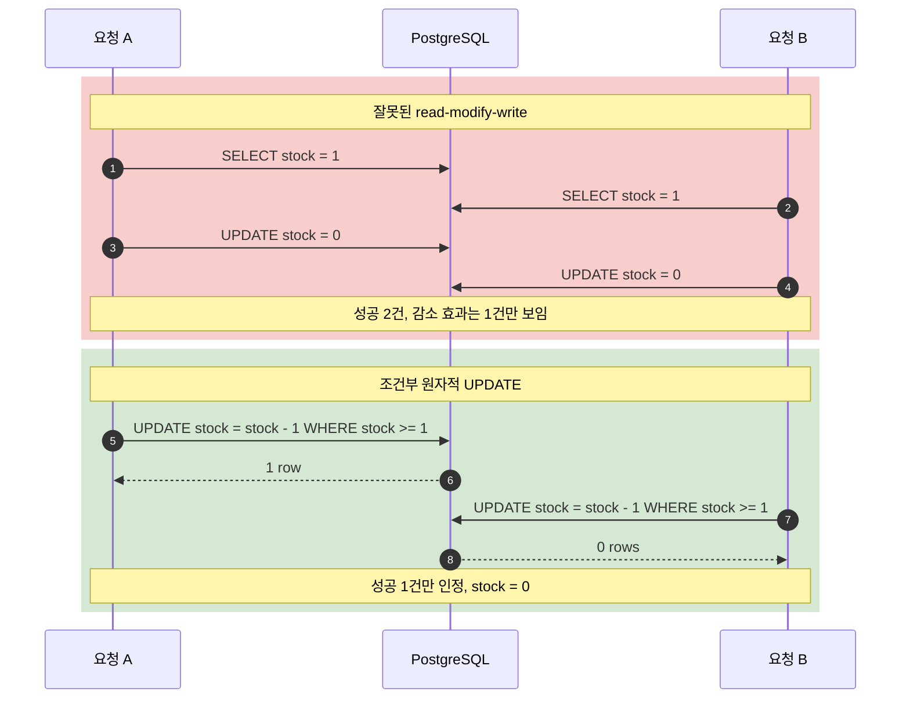
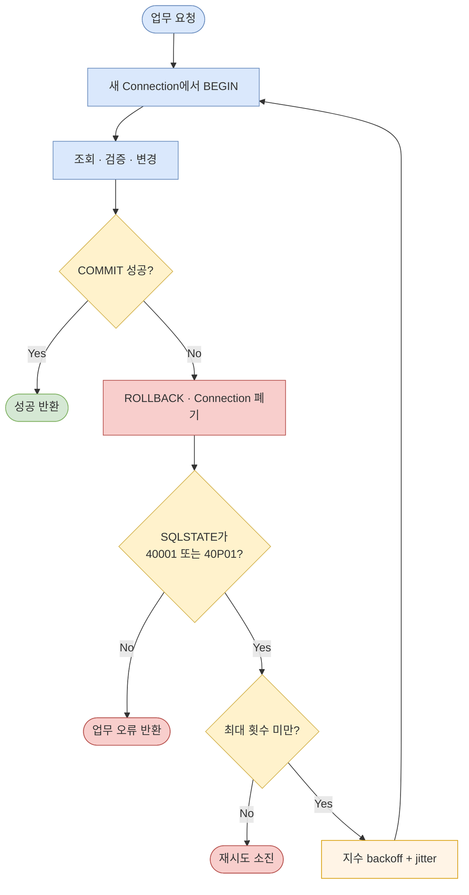

재고가 1개 남은 상품을 두 요청이 동시에 주문했다. 두 요청 모두 `SELECT stock`에서 1을 읽었고, 각각 0을 저장한 뒤 성공을 반환했다. 최종 재고는 음수가 아니지만 주문은 두 건이다. 데이터베이스가 각 SQL 문장을 정상적으로 실행했어도 **“성공한 주문 수만큼 재고가 감소한다”**는 업무 불변식은 깨질 수 있다.

DBMS의 원자성은 애플리케이션이 정한 경계를 대신 추측하지 않는다. 한 SQL 문장은 하나의 실행 단위지만, `SELECT → Java 계산 → UPDATE`는 문장이 세 부분으로 갈라진 프로토콜이다. 여러 문장을 `BEGIN`과 `COMMIT`으로 묶어도 동시 트랜잭션이 어떤 상태를 관찰하고 충돌을 어떻게 처리할지는 격리 수준, 잠금, 제약조건에 달려 있다.

이번 편은 PostgreSQL 18 `current` 문서를 기준으로 ACID의 **A(Atomicity)**와 **I(Isolation)**를 코드에 연결한다. 커밋 결과가 장애 뒤 어떻게 복구되는지, 즉 D(Durability)와 WAL은 다음 편의 주제다.

## 1. 먼저 불변식과 경계를 적는다

동시성 제어 수단을 고르기 전에 깨지면 안 되는 문장을 먼저 적는다.

| 사례 | 지켜야 할 불변식 | 경쟁 단위 | 후보 수단 |
|---|---|---|---|
| 재고 차감 | `stock >= 0`, 성공 1건마다 정확히 수량 감소 | 한 상품 행 | 조건부 원자적 `UPDATE` |
| 계좌 이체 | 출금과 입금이 전부 반영되거나 전혀 반영되지 않음 | 두 계좌 행 | 명시적 트랜잭션 + 일정한 잠금 순서 |
| 주문 중복 방지 | 같은 `request_id`의 주문은 최대 1건 | 유일 키 | `UNIQUE` + `INSERT ... ON CONFLICT` |
| 예약 | 같은 자원의 시간 구간이 겹치지 않음 | 검색 조건에 걸리는 행 집합 | `EXCLUDE` 제약조건 |
| 당직 변경 | 한 팀에 당직자가 최소 1명 남음 | 여러 행의 조건 집합 | `SERIALIZABLE` + 전체 재시도 |

PostgreSQL에서 명시적 `BEGIN`이 없으면 각 문장은 자체 트랜잭션 안에서 실행된다. 따라서 다음 두 코드는 실패 경계가 다르다.

```sql
-- 두 개의 독립된 트랜잭션: 첫 문장 성공 뒤 두 번째가 실패할 수 있다.
UPDATE account SET balance = balance - 100 WHERE id = 1;
UPDATE account SET balance = balance + 100 WHERE id = 2;

-- 하나의 트랜잭션: 두 변경을 모두 커밋하거나 모두 롤백한다.
BEGIN;
UPDATE account SET balance = balance - 100 WHERE id = 1;
UPDATE account SET balance = balance + 100 WHERE id = 2;
COMMIT;
```

두 번째 코드는 이체의 **원자성 경계**를 만든다. 하지만 동시에 같은 계좌를 수정하는 트랜잭션과의 관찰 순서까지 코드만 보고 확정할 수는 없다. 그 부분이 **격리 제어**다.

## 2. MVCC는 읽기를 열어 두고, 잠금은 충돌을 기다리게 한다

PostgreSQL은 MVCC(Multiversion Concurrency Control)로 각 SQL 문장이 자신의 스냅샷에 보이는 행 버전을 읽게 한다. 일반 `SELECT`는 행을 수정하는 트랜잭션 때문에 곧바로 같은 행 잠금을 기다리지 않는다. 반면 `UPDATE`, `DELETE`, `SELECT ... FOR UPDATE`는 대상 행의 현재 상태와 충돌하면 기다리거나 격리 수준에 따라 트랜잭션을 실패시킬 수 있다.

여기서 중요한 구분은 다음과 같다.

- **스냅샷**은 무엇을 보느냐를 정한다.
- **행 잠금**은 누가 같은 행을 바꾸거나 잠글 때 기다리느냐를 정한다.
- **제약조건**은 어떤 값의 조합을 아예 커밋 가능한 상태로 인정하지 않을지 정한다.
- **Serializable의 SSI 검사**는 성공한 전체 결과가 어떤 직렬 실행 순서로도 설명되지 않으면 한 트랜잭션을 중단한다.

일반 `SELECT`가 잠기지 않는다는 사실은 높은 읽기 동시성의 근거다. 동시에 “먼저 읽었으니 다른 트랜잭션이 못 바꾼다”는 뜻은 아니다.

## 3. 격리 수준은 PostgreSQL의 정확한 의미로 읽는다

PostgreSQL은 SQL 표준의 네 이름을 받을 수 있지만, 내부적으로 `READ UNCOMMITTED`를 `READ COMMITTED`처럼 처리한다. 실질적으로 구분할 수준은 세 가지다.

| PostgreSQL 격리 수준 | 스냅샷 경계 | 막는 현상 | 여전히 가능한 일 / 필요한 대응 |
|---|---|---|---|
| `READ COMMITTED` (기본값) | **문장 시작마다** 새 스냅샷 | dirty read | 연속 조회 결과 변화, phantom, 애플리케이션식 lost update, write skew 가능 |
| `REPEATABLE READ` | 트랜잭션의 첫 비제어 문장 시작 시점 스냅샷 | dirty read, non-repeatable read, **PostgreSQL에서는 phantom도 방지** | serialization anomaly와 write skew 가능, 동시 갱신 시 `40001` 재시도 필요 |
| `SERIALIZABLE` | `REPEATABLE READ`와 같은 스냅샷 + SSI 의존성 검사 | 성공한 트랜잭션의 serialization anomaly | 충돌 시 `40001`; 읽은 결과도 커밋 전에는 확정하지 말고 전체 트랜잭션 재시도 |

`READ COMMITTED`의 한 `SELECT`는 문장 시작 전에 커밋된 데이터만 본다. 같은 트랜잭션 안의 다음 `SELECT`는 그 사이 다른 트랜잭션이 커밋한 변경을 볼 수 있다. `UPDATE`는 문장 시작 스냅샷에서 대상을 찾지만, 먼저 갱신한 트랜잭션을 기다린 뒤 그 트랜잭션이 커밋하면 **새 행 버전에 `WHERE` 조건을 다시 평가**한다. 이 특성이 뒤에서 사용할 조건부 `UPDATE`를 안전하게 만든다.

`REPEATABLE READ`는 트랜잭션 내내 안정된 스냅샷을 제공한다. SQL 표준이 이 수준에서 phantom을 허용할 수 있게 정의했더라도 PostgreSQL 구현은 phantom을 허용하지 않는다. 그러나 안정된 스냅샷 두 개가 각각 다른 행을 수정하면 전체 불변식이 깨지는 **write skew**는 가능하다.

`SERIALIZABLE`은 모든 읽기에 상호 배제 잠금을 거는 방식이 아니다. PostgreSQL의 predicate lock(`SIReadLock`)은 쓰기를 직접 막기보다 읽기-쓰기 의존성을 추적한다. 직렬 실행으로 설명할 수 없는 조합이 감지되면 한 트랜잭션을 `serialization_failure`로 중단한다. 그러므로 `SERIALIZABLE`의 계약은 “절대 실패하지 않는다”가 아니라 **“성공한 결과만 직렬 실행과 동등하며, 실패는 재시도한다”**다.

### 제품 이름이 같아도 의미는 같지 않다

이 글의 격리 수준 설명은 PostgreSQL 기준이다. MySQL의 주 저장 엔진인 InnoDB는 기본 격리 수준부터 `REPEATABLE READ`이고, consistent read와 locking read를 구분하며 검색 범위에는 gap/next-key lock이 관여할 수 있다. PostgreSQL의 `REPEATABLE READ = Snapshot Isolation`, non-blocking predicate lock 기반 SSI 같은 세부 동작을 MySQL에 그대로 옮기면 안 된다.

원자적 산술 `UPDATE`, 유일 제약조건, 비관적·낙관적 제어라는 설계 원리는 일반화할 수 있다. 그러나 UPSERT 문법은 PostgreSQL의 `ON CONFLICT`와 MySQL의 `ON DUPLICATE KEY UPDATE`로 다르고, PostgreSQL의 exclusion constraint에 해당하는 기능도 제품마다 같지 않다. 격리 수준 이름보다 **해당 엔진 문서의 스냅샷·잠금·재시도 계약**을 확인해야 한다.

## 4. 잘못된 read-modify-write가 갱신을 잃는 순서

다음 코드는 재고를 읽어 Java에서 계산한 절대값을 다시 저장한다.

```java
// 잘못된 예: SELECT와 UPDATE 사이가 경쟁 구간이다.
int stock = jdbc.queryForObject(
        "SELECT stock FROM inventory WHERE sku = ?", Integer.class, sku);

if (stock < quantity) {
    throw new SoldOutException();
}

jdbc.update(
        "UPDATE inventory SET stock = ? WHERE sku = ?",
        stock - quantity,
        sku);
```

두 요청이 모두 `stock = 1`을 읽고 모두 `stock = 0`을 쓰면, 데이터만 보고는 감소가 두 번 성공했다는 사실을 복원할 수 없다. 각 문장이 스레드 안전하게 실행됐는지는 중요하지 않다. **읽기-검사-쓰기 전체가 한 조건부 상태 전이**여야 한다.

아래 시퀀스는 lost update와 안전한 조건부 갱신의 차이를 보여준다.



> 위쪽은 애플리케이션이 오래된 값을 덮어쓰는 경로이고, 아래쪽은 DBMS가 최신 행 버전에 조건과 계산을 함께 적용하는 경로다.

## 5. 패턴 1: 계산과 조건을 원자적 `UPDATE` 한 문장으로 옮긴다

재고의 불변식은 `stock >= 0`이고 상태 전이는 “현재 재고가 충분할 때만 현재값에서 수량을 뺀다”다. 이를 그대로 SQL로 작성한다.

```sql
UPDATE inventory
SET stock = stock - :quantity
WHERE sku = :sku
  AND stock >= :quantity
RETURNING sku, stock;
```

- 행이 반환되면 차감 성공이다.
- 0행이면 존재하지 않거나 재고가 부족한 것이다. 둘을 구분해야 한다면 별도 오류 모델을 정한다.
- PostgreSQL `READ COMMITTED`에서 경쟁 갱신을 기다린 경우, 최신 행 버전에 `stock >= :quantity`가 다시 평가된다.
- `stock = stock - :quantity`도 최신 행 버전을 기준으로 계산된다. Java가 읽은 절대값을 덮어쓰지 않는다.

방어선을 하나 더 둘 수 있다.

```sql
ALTER TABLE inventory
ADD CONSTRAINT inventory_stock_nonnegative CHECK (stock >= 0);
```

`CHECK`는 한 행의 최종 상태가 음수가 되는 버그를 거부한다. 하지만 “주문 1건마다 재고가 정확히 한 번 감소한다”처럼 다른 테이블과 연관된 불변식 전체를 대신하지는 않는다.

## 6. 패턴 2: 읽은 뒤 여러 작업이 필요하면 `SELECT ... FOR UPDATE`

가격 정책 조회, 여러 컬럼 검증, 감사 행 생성처럼 상태 전이를 한 `UPDATE`에 넣기 어렵다면 먼저 대상 행을 잠근다.

```sql
BEGIN;

SELECT stock, price
FROM inventory
WHERE sku = :sku
FOR UPDATE;

-- 애플리케이션은 잠근 행을 기준으로 검증한다.
UPDATE inventory
SET stock = stock - :quantity
WHERE sku = :sku;

INSERT INTO stock_ledger(order_id, sku, quantity)
VALUES (:order_id, :sku, -:quantity);

COMMIT;
```

`FOR UPDATE`로 잠근 행은 트랜잭션이 끝날 때까지 다른 `UPDATE`, `DELETE`, 충돌하는 행 잠금 요청을 기다리게 한다. 일반 `SELECT`까지 막는 것은 아니다. 또한 **아직 존재하지 않는 행**이나 임의의 검색 조건 전체를 행 잠금 하나로 보호한다고 생각해서는 안 된다.

여러 행을 잠글 때는 모든 코드 경로에서 같은 순서를 사용한다.

```sql
SELECT id, balance
FROM account
WHERE id IN (:from_id, :to_id)
ORDER BY id
FOR UPDATE;
```

작은 ID부터 잠근다는 규약은 교착 상태 가능성을 크게 줄인다. 그래도 DBMS 내부 잠금이나 다른 코드 경로 때문에 deadlock은 완전히 사라진다고 가정하지 않는다.

## 7. 패턴 3: 기다리는 대신 version 컬럼으로 충돌을 드러낸다

낙관적 잠금은 읽을 때 버전을 가져오고, 그 버전을 아직 아무도 바꾸지 않았을 때만 갱신한다.

```sql
SELECT stock, version
FROM inventory
WHERE sku = :sku;

UPDATE inventory
SET stock = stock - :quantity,
    version = version + 1
WHERE sku = :sku
  AND version = :observed_version
  AND stock >= :quantity
RETURNING stock, version;
```

영향받은 행이 0개라면 다음 중 하나다.

1. 다른 트랜잭션이 먼저 갱신해 버전이 바뀌었다.
2. 최신 재고가 부족하다.
3. 대상이 없다.

업무 API는 이를 “충돌이니 최신 상태를 다시 읽어 재시도”, “품절”, “없는 상품” 중 무엇으로 반환할지 정해야 한다. version 방식은 충돌을 자동 해결하지 않고 **오래된 쓰기가 성공으로 위장하지 못하게 한다**.

## 8. 패턴 4: 경쟁을 제약조건과 UPSERT에 맡긴다

### 같은 요청은 한 번만 생성한다: `UNIQUE`

먼저 조회한 뒤 없으면 삽입하는 코드는 두 세션이 동시에 “없음”을 볼 수 있다. 유일성은 조회 프로토콜이 아니라 스키마에 둔다.

```sql
CREATE TABLE orders (
    id          bigint GENERATED ALWAYS AS IDENTITY PRIMARY KEY,
    request_id  text NOT NULL UNIQUE,
    payload_hash text NOT NULL,
    status      text NOT NULL
);

INSERT INTO orders(request_id, payload_hash, status)
VALUES (:request_id, :payload_hash, 'PENDING')
ON CONFLICT (request_id) DO NOTHING
RETURNING id, status;
```

`UNIQUE (request_id)`의 불변식은 “같은 키의 행은 최대 하나”다. `ON CONFLICT`는 그 충돌을 예외 대신 명시한 대안으로 처리한다. 기존 요청의 응답을 그대로 돌려줘야 한다면 `DO NOTHING` 뒤 기존 행을 읽거나, 저장 프로시저·CTE 등으로 응답 정책을 별도로 설계한다. 같은 키에 다른 payload가 왔는지도 `payload_hash`로 검증해야 한다.

카운터 UPSERT는 읽기와 삽입/갱신 분기를 한 문장으로 옮길 수 있다.

```sql
INSERT INTO daily_counter(day, count)
VALUES (:day, 1)
ON CONFLICT (day) DO UPDATE
SET count = daily_counter.count + 1
RETURNING count;
```

PostgreSQL의 `ON CONFLICT DO UPDATE`는 관련 없는 오류가 없다면 각 제안 행에 대해 insert 또는 update 결과 하나를 원자적으로 보장한다. 일반 `MERGE`가 동일한 보장을 제공한다고 일반화해서는 안 된다.

### 시간 구간은 겹치지 않는다: `EXCLUDE`

“같은 방에 같은 시간 예약은 하나”는 단순 equality 유일성이 아니다. PostgreSQL의 exclusion constraint로 겹침 자체를 금지할 수 있다.

```sql
CREATE EXTENSION IF NOT EXISTS btree_gist;

CREATE TABLE room_booking (
    id       bigint GENERATED ALWAYS AS IDENTITY PRIMARY KEY,
    room_id  bigint NOT NULL,
    slot     tstzrange NOT NULL,
    EXCLUDE USING gist (
        room_id WITH =,
        slot WITH &&
    )
);
```

이 제약조건은 임의의 두 행을 비교했을 때 `room_id =`와 `slot &&`가 동시에 참인 상태를 허용하지 않는다. 즉 같은 방의 시간 구간은 겹칠 수 없다. `btree_gist` 확장 설치에는 운영 권한과 배포 검토가 필요하다.

`ON CONFLICT DO UPDATE`의 arbiter로 exclusion constraint를 사용할 수 있다고 가정하지 않는다. PostgreSQL에서 exclusion constraint는 `DO UPDATE`의 충돌 판정자로 지원되지 않는다. 겹침 오류를 잡아 업무 충돌로 변환하거나 트랜잭션 모델을 따로 설계한다.

## 9. write skew: 행 잠금만으로는 “조건 집합”이 안 잠길 수 있다

의사 A와 B가 모두 당직 중이고, 불변식은 “팀에 최소 한 명은 당직”이라고 하자. 두 `REPEATABLE READ` 트랜잭션이 동시에 당직자 수 2명을 보고 각자 **자기 행만** off로 바꾸면, 서로 같은 행을 갱신하지 않으므로 둘 다 커밋할 수 있다. 최종 당직자는 0명이다.

```sql
BEGIN ISOLATION LEVEL REPEATABLE READ;

SELECT count(*)
FROM doctor_on_call
WHERE team_id = :team_id
  AND on_call;

-- 둘 이상이라고 판단한 뒤 각 트랜잭션이 서로 다른 자기 행만 갱신한다.
UPDATE doctor_on_call
SET on_call = false
WHERE doctor_id = :me;

COMMIT;
```

이것이 write skew다. 같은 스냅샷이 반복해서 보이고 phantom이 없다는 사실만으로 “조건에 맞는 행 집합을 읽고 다른 행을 쓰는 불변식”이 보장되지는 않는다.

해결책은 불변식의 모양에 따라 다르다.

- 팀을 대표하는 부모 행 하나를 `FOR UPDATE`로 잠가 모든 당직 변경을 직렬화한다.
- 불변식을 직접 표현할 수 있는 스키마 제약으로 바꾼다.
- 트랜잭션을 `SERIALIZABLE`로 실행하고 `40001`이면 **처음부터** 재시도한다.

```sql
BEGIN ISOLATION LEVEL SERIALIZABLE;
-- 같은 조회와 갱신
COMMIT; -- 위험한 의존성 조합이면 한 트랜잭션이 40001로 실패한다.
```

`SERIALIZABLE`은 불변식이 단일 행이나 유일 키로 쉽게 축약되지 않는 경우 강력한 기본값이 될 수 있다. 반대로 충돌이 빈번하고 짧은 단일 행 갱신이라면 조건부 `UPDATE`가 더 단순할 수 있다.

## 10. deadlock과 serialization failure는 전체 트랜잭션 재시도 신호다

PostgreSQL은 deadlock을 감지하면 참여 트랜잭션 중 하나를 중단한다. 어떤 트랜잭션이 희생될지는 의존하지 않는다.

- `40P01`: `deadlock_detected`
- `40001`: `serialization_failure`

오류 메시지 문자열 대신 SQLSTATE를 검사한다. 둘 다 현재 트랜잭션 안의 마지막 문장만 반복해서는 안 된다. 오류가 난 트랜잭션은 롤백하고, 새 트랜잭션과 새 스냅샷으로 **업무 단위 전체**를 다시 실행한다.

아래 흐름은 재시도 가능한 트랜잭션의 제어 경계를 보여준다.



> 재시도 한 번마다 새 트랜잭션을 시작한다. backoff와 jitter는 동시 재충돌을 줄이고, 최대 횟수는 장애가 무한 루프로 가려지는 것을 막는다.

Java/JDBC 수준의 재시도 의사 코드는 다음과 같다.

```java
<T> T inRetryableTransaction(SqlWork<T> work) throws SQLException {
    int maxAttempts = 5;

    for (int attempt = 1; attempt <= maxAttempts; attempt++) {
        try (Connection connection = dataSource.getConnection()) {
            connection.setAutoCommit(false);
            connection.setTransactionIsolation(Connection.TRANSACTION_SERIALIZABLE);

            try {
                T result = work.run(connection); // DB 작업만 포함
                connection.commit();
                return result;
            } catch (SQLException error) {
                rollbackQuietly(connection);

                String state = error.getSQLState();
                boolean retryable = "40001".equals(state) || "40P01".equals(state);
                if (!retryable || attempt == maxAttempts) {
                    throw error;
                }
            }
        }

        sleep(exponentialBackoffWithJitter(attempt));
    }

    throw new AssertionError("unreachable");
}
```

실제 구현에서는 프레임워크가 예외를 감싸더라도 가장 안쪽 `SQLException`의 SQLSTATE를 보존해야 한다. 트랜잭션 본문 안에서 이메일 발송이나 결제 요청을 했다면 재시도 시 중복 부수 효과가 생긴다. DB 재시도 함수에는 재실행 가능한 DB 작업만 둔다.

`23505`(unique violation)와 `23P01`(exclusion violation)은 보통 영구적인 업무 충돌이므로 무조건 재시도하지 않는다. 다만 이전 읽기 결과로 고른 key나 range가 다른 concurrent transaction과 충돌한 경우에는 serialization anomaly의 표면 증상일 수 있다. 이 경우에도 해당 제약조건과 업무 의미를 분류한 뒤에만 **전체 트랜잭션** 재시도 후보로 넣는다.

## 11. 외부 API를 기다리며 트랜잭션을 열어 두지 않는다

다음 코드는 재고 행을 잠근 채 결제 API의 네트워크 응답을 기다린다.

```java
transactionTemplate.execute(status -> {
    Inventory item = selectForUpdate(sku);
    PaymentResult payment = paymentClient.charge(request); // 위험: 외부 I/O
    decreaseStock(item);
    saveOrder(payment);
    return payment;
});
```

이 구조의 문제는 단순히 느리다는 데 있지 않다.

- 외부 API 지연 동안 행 잠금과 DB connection을 점유한다.
- 대기 중인 요청이 늘어 lock queue와 connection pool이 함께 고갈될 수 있다.
- 결제는 성공했는데 DB 트랜잭션이 deadlock이나 `40001`로 롤백될 수 있다.
- 전체 트랜잭션을 재시도하면 결제가 중복 호출될 수 있다.
- DB rollback은 이미 완료된 외부 결제를 취소하지 못한다.

보통은 짧은 DB 트랜잭션에서 `PENDING` 상태와 outbox 이벤트를 함께 기록하고 커밋한 뒤, 별도 worker가 idempotency key로 외부 API를 호출한다. 결과는 다시 짧은 조건부 트랜잭션으로 반영한다. 이 방식은 DB와 외부 API를 하나의 ACID 트랜잭션으로 만드는 것이 아니라, 재시도·중복·보상 상태를 **명시적으로 운영 가능하게** 만든다.

정말 외부 호출 전에 자원을 예약해야 한다면 `RESERVED` 상태와 만료 시각을 DB에 먼저 커밋하고, 타임아웃 회수와 보상 작업을 설계한다. 긴 열린 트랜잭션을 예약 시스템으로 사용하지 않는다.

## 12. 동시성 테스트는 실패 순서를 강제로 만든다

동시성 버그는 반복 횟수만 늘린 테스트보다 두 세션의 특정 경계에 barrier를 둔 테스트가 설명력이 높다. 아래는 테스트 전용 PostgreSQL에서 재고 1개에 두 요청을 동시에 투입하는 JUnit 형태의 예다.

```java
@Test
void stale_absolute_update_loses_one_decrement() throws Exception {
    resetStockTo(1);
    CyclicBarrier afterRead = new CyclicBarrier(2);

    Callable<Boolean> brokenOrder = () -> inReadCommittedTx(connection -> {
        int observed = selectStock(connection, "SKU-1");
        afterRead.await(); // 두 트랜잭션 모두 1을 읽게 만든다.
        if (observed < 1) return false;
        updateAbsoluteStock(connection, "SKU-1", observed - 1);
        return true;
    });

    List<Boolean> results = runConcurrently(brokenOrder, brokenOrder);

    assertThat(results).containsExactlyInAnyOrder(true, true);
    assertThat(selectStock("SKU-1")).isZero();
    // 주문 성공은 2건인데 재고 감소는 1번만 관찰된다.
}

@Test
void conditional_update_allows_exactly_one_order() throws Exception {
    resetStockTo(1);
    CyclicBarrier beforeUpdate = new CyclicBarrier(2);

    Callable<Boolean> safeOrder = () -> inReadCommittedTx(connection -> {
        beforeUpdate.await();
        return executeUpdate(connection, """
            UPDATE inventory
            SET stock = stock - 1
            WHERE sku = 'SKU-1' AND stock >= 1
            """) == 1;
    });

    List<Boolean> results = runConcurrently(safeOrder, safeOrder);

    assertThat(results).containsExactlyInAnyOrder(true, false);
    assertThat(selectStock("SKU-1")).isZero();
}
```

실제 테스트에는 다음도 추가한다.

1. `SERIALIZABLE` write skew 시나리오에서 한 트랜잭션이 `40001`로 실패하는지 확인한다.
2. 계좌 두 개를 반대 순서로 잠가 `40P01` 경로와 전체 재시도를 검증한다.
3. 재시도 후 원장 행과 상태 변경이 중복되지 않는지 확인한다.
4. 테스트마다 독립된 connection을 사용하고, 타임아웃을 두어 무한 대기를 실패로 드러낸다.
5. 성공 횟수뿐 아니라 **최종 불변식과 원장 합계**를 함께 검증한다.

## 13. 선택표: 불변식의 모양에 맞춰 고른다

| 상황 | 우선 검토할 패턴 | 지키는 불변식 | 주의점 |
|---|---|---|---|
| 한 행의 증감·상한·하한 | 조건부 원자적 `UPDATE ... RETURNING` | 최신 값에 조건과 계산을 한 번 적용 | 0행의 업무 의미를 정의 |
| 한 행을 읽고 복잡한 후속 DB 작업 | `SELECT ... FOR UPDATE` | 잠근 행 기준의 상태 전이 | 트랜잭션을 짧게, 잠금 순서를 통일 |
| 읽기 경쟁은 드물고 충돌을 즉시 드러내고 싶음 | version 컬럼 조건부 갱신 | 오래된 쓰기 거부 | 0행 원인과 재시도 정책 필요 |
| 중복 생성 방지 | `UNIQUE` + `ON CONFLICT` | 키당 최대 한 행 | 같은 키의 다른 payload 검증 |
| 범위 겹침 금지 | PostgreSQL `EXCLUDE` | 두 행의 범위 연산이 동시에 참인 상태 금지 | 이식성, 확장 설치, 오류 처리 |
| 알려진 여러 행의 이체 | 명시적 트랜잭션 + 일정한 순서의 행 잠금 | 여러 변경의 all-or-nothing | deadlock 재시도는 여전히 필요 |
| 여러 행의 검색 조건 불변식 | `SERIALIZABLE` + `40001` 전체 재시도 | 성공 결과의 직렬 실행 동등성 | 충돌률, 재시도 비용 측정 |
| 긴 일관된 읽기 | `REPEATABLE READ`; 직렬성이 필요하면 `SERIALIZABLE READ ONLY` 검토 | 안정된 스냅샷 또는 직렬 결과 | PostgreSQL 제품 의미로 판단 |
| 외부 API와 DB 상태 전이 | 짧은 트랜잭션 + 상태 머신/outbox + 멱등 키 | 재시도 가능한 단계별 효과 | 하나의 ACID라고 오해하지 않기 |

높은 격리 수준은 잘못 작성한 업무 경계를 자동 교정하지 않는다. 반대로 모든 곳에 `FOR UPDATE`를 붙이면 정확성 대신 긴 대기와 deadlock을 만들 수 있다. 가장 작은 단위로 불변식을 표현하되, 여러 행의 조건 집합처럼 축약할 수 없는 규칙에는 Serializable과 재시도를 사용한다.

## 14. 운영 체크리스트

- 불변식을 `stock >= 0`처럼 데이터 문장으로 적었는가?
- 원자성 경계가 한 SQL 문장인지, 여러 문장의 트랜잭션인지 명확한가?
- 애플리케이션에서 읽은 절대값을 조건 없이 다시 덮어쓰지 않는가?
- 유일성·범위 겹침을 “먼저 조회”가 아니라 제약조건으로 표현할 수 있는가?
- 사용하는 PostgreSQL 격리 수준의 스냅샷 경계를 알고 있는가?
- `40001`, `40P01`에 대해 새 트랜잭션으로 전체 업무를 재시도하는가?
- 재시도 본문에 외부 API·이메일 같은 중복 불가 부수 효과가 없는가?
- 여러 행의 잠금 순서가 모든 코드 경로에서 같은가?
- lock wait, deadlock, serialization failure, `idle in transaction`을 관측하는가?
- 동시성 테스트가 성공 응답 수와 최종 불변식을 함께 검증하는가?

DBMS는 SQL 문장, 트랜잭션, MVCC, 잠금, 제약조건, 격리 수준이라는 강력한 재료를 제공한다. 원자성의 핵심은 그 재료로 **업무 상태 전이를 나눌 수 없는 단위로 표현하는 것**이고, 격리의 핵심은 경쟁 트랜잭션이 그 전이를 관찰하고 충돌하는 규칙을 선택하는 것이다.

여기까지는 살아 있는 PostgreSQL 안에서 동시 실행을 제어하는 이야기였다. 다음 편에서는 커밋 직후 프로세스나 OS가 중단되어도 DBMS가 어떻게 WAL과 crash recovery로 원자성과 내구성을 다시 성립시키는지 살펴본다.

## 참고 자료

- [PostgreSQL 18 — Transactions](https://www.postgresql.org/docs/current/tutorial-transactions.html)
- [PostgreSQL 18 — Transaction Isolation](https://www.postgresql.org/docs/current/transaction-iso.html)
- [PostgreSQL 18 — Explicit Locking](https://www.postgresql.org/docs/current/explicit-locking.html)
- [PostgreSQL 18 — Data Consistency Checks at the Application Level](https://www.postgresql.org/docs/current/applevel-consistency.html)
- [PostgreSQL 18 — Constraints](https://www.postgresql.org/docs/current/ddl-constraints.html)
- [PostgreSQL 18 — INSERT / ON CONFLICT](https://www.postgresql.org/docs/current/sql-insert.html)
- [PostgreSQL 18 — PostgreSQL Error Codes](https://www.postgresql.org/docs/current/errcodes-appendix.html)

---
