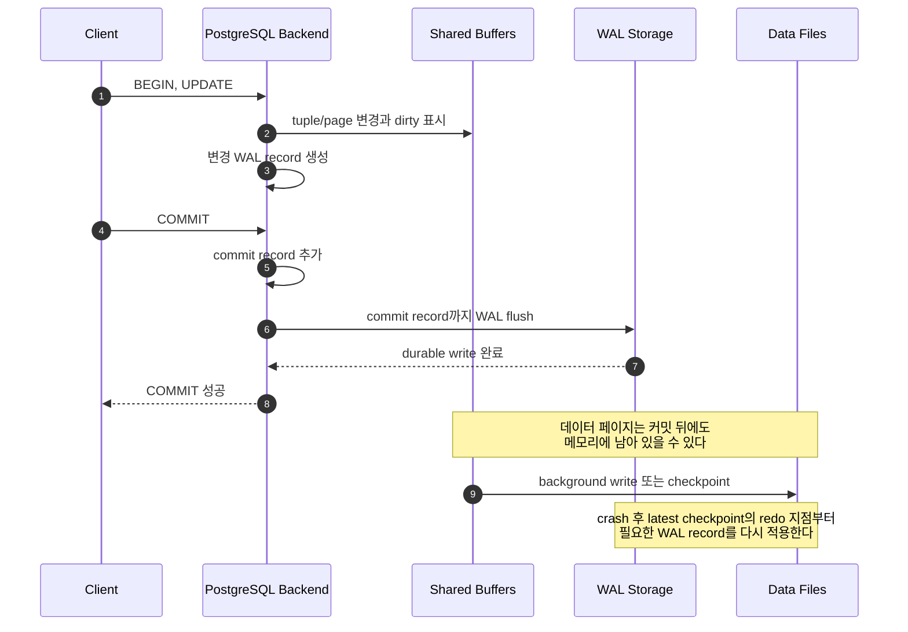
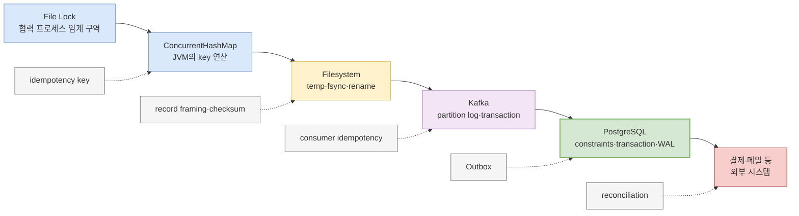

계좌 이체 트랜잭션이 `COMMIT`에 성공한 직후 서버 전원이 내려갔다고 하자. 수정된 모든 데이터 페이지가 이미 디스크에 쓰였기 때문에 이체가 남는 것일까? 그렇지 않다. PostgreSQL은 보통 커밋 때마다 계좌 행과 인덱스 페이지를 전부 동기화하지 않는다. 대신 **그 변경을 다시 수행할 수 있는 WAL과 트랜잭션의 커밋 사실을 먼저 영구 저장**하고 성공을 반환한다.

이 순서 하나가 ACID의 Atomicity와 Durability를 장애 뒤에도 다시 성립시키는 출발점이다. 다만 WAL이 있다고 해서 모든 실패가 해결되거나, DB 트랜잭션 밖의 Kafka 발행과 HTTP 호출까지 원자적이 되는 것은 아니다. 이 글은 PostgreSQL 18 현재 문서를 기준으로 커밋에서 crash recovery까지를 따라가고, 마지막에는 시리즈 전체의 보장 경계를 하나의 주문 사례로 연결한다.

## 1. A와 D는 같은 보장이 아니다

ACID의 두 글자를 장애 관점에서 먼저 분리하자.

- **Atomicity**: 트랜잭션 안의 변경이 전부 효과를 갖거나 전혀 효과를 갖지 않는다.
- **Durability**: 성공했다고 알린 커밋이 약속한 장애 뒤에도 남는다.

정상 실행 중에는 `ROLLBACK`과 MVCC 가시성 규칙이 Atomicity를 만든다. 장애가 나면 WAL 재생과 트랜잭션 상태 복원이 디스크의 물리 상태를 일관된 지점으로 가져가고, 커밋하지 않은 변경은 사용자에게 보이지 않게 한다. Durability는 “성공”을 언제 반환했는지에 좌우된다. 기본 동기 커밋은 커밋 레코드를 포함한 WAL이 로컬 영구 저장소에 flush될 때까지 기다리지만, 비동기 커밋은 그보다 먼저 성공을 반환한다.

따라서 `COMMIT`이라는 SQL 문장만 보고 보장을 단정할 수 없다. 적어도 다음을 함께 알아야 한다.

| 질문 | 기본 PostgreSQL이 사용하는 장치 | 경계 밖의 문제 |
|---|---|---|
| 트랜잭션 변경을 모두 반영하거나 모두 숨기는가? | transaction status, MVCC 가시성, WAL recovery | 외부 API의 이미 발생한 부수 효과 |
| 성공 응답 뒤 DB crash에도 남는가? | WAL commit record의 동기 flush | 호스트·스토리지 전체 유실 |
| 반쯤 기록된 데이터 페이지를 복원할 수 있는가? | WAL과 `full_page_writes` | 저장장치가 flush 명령을 거짓으로 보고하는 경우 |
| 과거 시점이나 다른 노드에서 복구할 수 있는가? | 별도의 base backup, WAL archive, replication | 보존 정책 밖의 시점, 함께 백업하지 않은 외부 시스템 |

## 2. WAL 규칙: 데이터 페이지보다 설명서를 먼저 남긴다

PostgreSQL의 Write-Ahead Logging 규칙은 간단하다.

> 데이터 파일의 변경된 페이지를 영구 저장소에 쓰기 전에, 그 변경을 설명하는 WAL 레코드를 먼저 영구 저장한다.

애플리케이션이 `UPDATE`를 실행하면 변경된 페이지는 우선 `shared_buffers`의 dirty page가 될 수 있고 WAL 레코드도 생성된다. 커밋 시점에 중요한 것은 모든 dirty page가 아니라 **해당 트랜잭션의 커밋 레코드까지 WAL이 flush되었는가**이다. WAL만 안전하게 남아 있으면 아직 데이터 파일에 반영되지 않은 변경은 재시작 때 REDO할 수 있다. 순차적으로 쓰는 WAL 하나를 동기화하는 편이 서로 다른 여러 데이터 파일 페이지를 매 커밋마다 동기화하는 것보다 효율적이다.

아래 시퀀스는 기본값인 `fsync = on`, `synchronous_commit = on`에서 커밋 성공과 늦은 데이터 페이지 writeback의 관계를 보여준다.



> 실선은 정상 실행의 주요 순서다. WAL flush 완료가 성공 응답의 내구성 경계이고, dirty data page의 writeback은 그 뒤에 일어나도 된다. 여러 backend의 커밋은 한 번의 WAL flush에 함께 포함될 수 있다.

여기서 두 개의 “먼저”를 구분하면 이해가 쉽다.

1. **page write 전 WAL 선행**: 어떤 dirty data page를 디스크에 내보내려면 그 페이지 변경에 필요한 WAL이 먼저 flush되어야 한다.
2. **성공 응답 전 commit record flush**: 동기 커밋은 트랜잭션의 commit record까지 WAL이 영구 저장되기 전에 클라이언트에게 성공을 알리지 않는다.

첫째는 복구 재료가 데이터 페이지보다 뒤처지지 않게 한다. 둘째는 클라이언트가 관찰한 성공과 장애 후 보존을 연결한다.

## 3. dirty page와 checkpoint는 커밋의 동의어가 아니다

dirty page는 메모리의 페이지가 데이터 파일의 현재 페이지보다 새롭다는 뜻이다. background writer나 backend가 버퍼를 내보낼 수도 있고, checkpoint가 변경된 버퍼들을 디스크에 반영한다. 이 과정에서도 WAL 선행 규칙은 유지된다.

checkpoint는 트랜잭션을 커밋시키는 명령이 아니다. PostgreSQL 공식 문서가 설명하는 checkpoint의 핵심은 다음과 같다.

- 그 checkpoint보다 앞선 변경이 heap과 index 데이터 파일에 반영됐다고 보장한다.
- dirty data page들을 flush하고 WAL에 checkpoint record를 남긴다.
- crash recovery는 최신 checkpoint record가 가리키는 redo 지점부터 시작할 수 있다.
- checkpoint를 자주 하면 재생할 WAL이 줄어 복구 시간이 짧아질 수 있지만, dirty page 쓰기와 full-page image 증가로 정상 I/O 비용이 커진다.

즉 checkpoint는 **복구 시작점을 앞으로 당기는 운영 장치**다. “방금 커밋한 행이 데이터 파일에 들어갔는지”를 매 요청마다 보장하는 장치가 아니다. 반대로 checkpoint 이전에 crash가 나도, 커밋 WAL이 안전하다면 해당 변경을 REDO할 수 있다.

운영에서는 checkpoint 간격을 단순히 짧게 잡기보다 다음 지표와 함께 본다.

```sql
SELECT num_timed,
       num_requested,
       num_done,
       write_time,
       sync_time,
       buffers_written
FROM pg_stat_checkpointer;

SHOW checkpoint_timeout;
SHOW checkpoint_completion_target;
SHOW max_wal_size;
```

버전과 관리형 서비스에 따라 노출되는 컬럼·권한이 다를 수 있으므로 대상 서버의 `pg_stat_checkpointer` 정의를 먼저 확인한다. 잦은 requested checkpoint, WAL 급증, commit latency spike가 함께 보인다면 `max_wal_size`, checkpoint pacing, 스토리지 지연을 한 묶음으로 조사한다.

## 4. crash recovery는 REDO하지만 “모든 DBMS가 같은 UNDO”를 하지는 않는다

WAL을 설명할 때 흔히 “커밋 트랜잭션은 REDO하고 미커밋 트랜잭션은 UNDO한다”라고 요약한다. 트랜잭션의 **논리적 결과**를 설명하는 문장으로는 쓸 수 있지만, 모든 제품이 같은 형태의 물리 UNDO 로그와 역연산을 수행한다는 구현 설명으로 받아들이면 틀린다.

PostgreSQL은 MVCC 때문에 행의 여러 버전을 다룬다. 각 행 버전의 생성·삭제와 관련된 transaction ID, transaction commit/abort 상태, 쿼리 snapshot을 조합해 가시성을 결정한다. crash recovery에서는 최신 checkpoint의 redo 지점부터 유효한 WAL record를 재생해 데이터 페이지와 내부 상태를 재구성한다. 이 과정에서 미커밋 트랜잭션이 만들었던 물리적 행 버전이 페이지에 존재하거나 WAL 재생으로 다시 놓일 수 있어도, **durable commit에 도달하지 못한 트랜잭션의 효과는 정상 쿼리에 커밋된 데이터로 보이지 않는다**.

그 물리 공간을 즉시 과거 바이트로 되감는 것과 논리적 효과가 보이지 않는 것은 다르다. 더 이상 어떤 transaction에도 필요하지 않은 dead row version은 이후 `VACUUM`이 회수해 재사용할 수 있게 한다. 이 구조 때문에 PostgreSQL의 복구를 다른 DBMS의 전통적인 REDO/UNDO 알고리즘과 한 문장으로 동일시하면 안 된다.

정리하면 다음 세 층이 협력한다.

| 층 | crash 후 역할 | 오해하기 쉬운 점 |
|---|---|---|
| WAL REDO | 디스크에 늦게 반영된 페이지 변경과 내부 상태를 재구성 | WAL에 있다고 모두 커밋된 사용자 데이터는 아니다 |
| transaction status + MVCC | 커밋 여부와 snapshot에 따라 row version의 가시성을 결정 | “안 보임”이 즉시 물리 삭제됐다는 뜻은 아니다 |
| VACUUM | 더는 볼 수 없는 dead version의 공간을 장기적으로 회수 | crash recovery 그 자체와 같은 단계가 아니다 |

Atomicity는 단순히 “파일 두 개를 원래 바이트로 되감음”이 아니다. 복구 후 관찰자가 커밋된 트랜잭션의 완전한 효과만 보도록 **로그 재생과 가시성 규칙이 함께 만드는 성질**이다.

## 5. `full_page_writes`가 torn page를 막는 방식

PostgreSQL의 일반 데이터 페이지는 보통 8 KiB이지만, 전원 차단 중 저장장치가 그 전체를 한 번에 기록한다고 가정할 수 없다. 일부 sector만 새 값이고 나머지는 옛 값인 torn page가 생기면, 작은 변경만 기술한 WAL record를 정상 페이지에 적용한다는 전제가 깨질 수 있다.

기본값 `full_page_writes = on`에서는 checkpoint 뒤 각 페이지가 **처음 변경될 때 페이지 전체 이미지**를 WAL에 기록한다. 데이터 페이지를 디스크에 쓰기 전 해당 WAL이 먼저 안전해지므로, crash recovery는 torn page에 의존하지 않고 full-page image에서 복원한 뒤 후속 WAL 변경을 적용할 수 있다.

이 옵션의 대가는 WAL 양이다. checkpoint 직후 여러 페이지의 첫 변경이 full-page image를 만들기 때문에 checkpoint가 잦으면 WAL 트래픽도 늘어난다. 그렇다고 성능 문제를 보고 곧바로 끄면 안 된다. 공식 문서는 partial page write를 방지한다고 신뢰할 수 있는 파일시스템·스토리지일 때만 비활성화를 고려할 수 있다고 설명한다. 일반적인 운영 기본값은 켠 상태다.

```sql
SHOW block_size;
SHOW full_page_writes;
SHOW data_checksums;

SELECT pg_current_wal_lsn()       AS inserted_lsn,
       pg_current_wal_flush_lsn() AS flushed_lsn;
```

`full_page_writes`는 torn page 복구 장치이고 data checksum은 손상 탐지 장치다. checksum이 손상을 알려준다고 자동 복구되는 것은 아니며, full-page image가 모든 종류의 장치 고장·장기 bit rot·볼륨 유실을 복구하는 것도 아니다.

## 6. group commit: 내구성 비용을 나눠 낸다

동기 커밋의 비싼 부분은 WAL flush를 기다리는 시간이다. 하지만 동시에 커밋하는 트랜잭션마다 물리 flush가 반드시 한 번씩 필요하지는 않다. 한 backend가 WAL을 어떤 LSN까지 flush하면, 그보다 앞선 commit record를 기다리던 여러 트랜잭션도 함께 안전해진다. 이것이 group commit의 핵심이다.

`commit_delay`는 flush 직전에 아주 짧게 기다려 같은 group에 들어올 트랜잭션을 늘리는 튜닝 옵션이다. `commit_siblings`만큼 다른 활성 트랜잭션이 있을 때만 적용되고, 기본 `commit_delay`는 0이다. 지연을 인위적으로 추가하는 옵션이므로 추측으로 바꾸지 않는다. 실제 동시성, TPS, p95/p99 commit latency, WAL sync time을 부하 테스트에서 함께 비교해야 한다.

```sql
SHOW commit_delay;
SHOW commit_siblings;

SELECT wal_records,
       wal_fpi,
       wal_bytes,
       wal_buffers_full
FROM pg_stat_wal;

SELECT backend_type,
       context,
       writes,
       write_time,
       fsyncs,
       fsync_time
FROM pg_stat_io
WHERE object = 'wal';
```

PostgreSQL 18에서는 WAL 생성량은 `pg_stat_wal`, WAL write·fsync 횟수와 시간은 `pg_stat_io`에서 확인한다. `track_wal_io_timing`이 꺼져 있으면 시간 값은 0이며, 이전 버전에서는 뷰와 컬럼이 다르므로 해당 버전 문서를 따라야 한다. group commit은 Atomicity를 약화하는 기능이 아니다. 여러 독립 트랜잭션의 WAL flush 비용을 한 번의 동기화로 분담할 뿐, 각 트랜잭션의 commit 여부와 가시성은 분리되어 있다.

## 7. `synchronous_commit`은 성능과 “최근 성공 유실”을 교환한다

`synchronous_commit = off`는 트랜잭션이 논리적으로 완료되면 WAL이 영구 저장소에 flush되기 전에 성공을 반환할 수 있게 한다. crash 위험 구간에 있던 최근 트랜잭션은 재시작 뒤 사라질 수 있다. 그러나 PostgreSQL은 마지막으로 안전하게 flush된 WAL까지만 복구하므로 데이터베이스는 일관된 상태로 돌아온다. 즉 **data loss 위험이지 database inconsistency 위험은 아니다**.

반면 `fsync = off`는 전혀 다른 선택이다. PostgreSQL이 WAL과 데이터 파일의 쓰기 순서를 영구 저장소에 강제하는 전반적인 장치를 끈다. OS·하드웨어 crash에서 임의의 손상과 복구 불가능한 corruption이 생길 수 있다. 공식 문서도 외부 데이터로 전체 클러스터를 쉽게 재생성할 수 있는 경우가 아니라면 끄지 말라고 경고한다. 고급 스토리지를 쓴다는 주장만으로 충분하지 않다.

거래 데이터를 다루는 단일 노드의 출발점은 세 안전장치를 유지하는 것이다. 이 값들은 대상 버전과 관리형 서비스의 변경 절차를 확인한 뒤 적용한다.

```ini
# postgresql.conf — crash-safe local baseline
fsync = on
full_page_writes = on
synchronous_commit = on
```

성능 실험은 이 기준에서 한 변수씩 바꾸고, WAL 양·commit latency·복구 시간·업무 불변식을 함께 측정한다. `fsync = off`를 운영 튜닝 후보로 두기보다, 내구성을 완화해도 되는 개별 트랜잭션에 `synchronous_commit = off`가 적합한지 먼저 검토한다.

### 로컬 커밋 보장 매트릭스

| 설정 | 클라이언트 성공 시점 | PostgreSQL process crash | OS·전원 crash | 적합한 예 |
|---|---|---|---|---|
| `fsync=on`, `synchronous_commit=on` | local WAL flush 뒤 | 성공한 커밋 보존 | storage가 flush 계약을 지키면 성공한 커밋 보존 | 주문·결제·원장 기본값 |
| `fsync=on`, `synchronous_commit=off` | logical completion 뒤, flush 전 가능 | 최근 성공이 유실될 수 있음 | 최근 성공이 유실될 수 있으나 일관된 상태로 복구 | 재생성 가능한 로그·통계 |
| `fsync=off` | 영구 쓰기 순서를 강제하지 않음 | DB process crash만으로 OS cache가 사라지지는 않지만 안전성 근거가 아님 | 데이터 유실뿐 아니라 복구 불가능한 corruption 가능 | 폐기·재생성 가능한 일회성 클러스터에만 제한 |
| 동기 standby + `remote_apply` | 지정 standby가 WAL을 replay해 쿼리에 보일 때까지 대기 | local/remote 조건에 따름 | 구성된 동기 standby의 durable 적용까지 강화 | standby에서 즉시 읽어야 하는 causal read |

동기 복제를 사용하면 `synchronous_commit`에는 `local`, `remote_write`, `on`, `remote_apply`처럼 원격 대기 지점을 정하는 값도 있다. 예를 들어 `remote_write`는 standby OS에 쓰인 시점이지 standby 영구 저장소 flush까지는 아니다. 이 표의 로컬 보장과 원격 보장을 섞지 말고, “어느 노드의 어느 층까지 기다렸는가”로 읽어야 한다.

트랜잭션별로 내구성 정책을 다르게 줄 수도 있다.

```sql
-- 재생성 가능한 접속 통계만 비동기 커밋으로 처리한다.
BEGIN;
SET LOCAL synchronous_commit = off;
INSERT INTO access_stat(event_id, occurred_at, path)
VALUES ($1, clock_timestamp(), $2)
ON CONFLICT (event_id) DO NOTHING;
COMMIT;

-- 현금 지급, 결제 승인, 주문 확정 같은 외부 행동의 근거는
-- 기본 동기 커밋을 유지한다.
BEGIN;
SET LOCAL synchronous_commit = on;
-- business writes
COMMIT;
```

비동기 커밋 결과를 근거로 현금을 지급하거나 외부 시스템에 취소 불가능한 명령을 보내면 안 된다. DB가 스스로 일관되게 복구되는 것과, 클라이언트가 이미 수행한 외부 행동과의 일관성은 별개이기 때문이다.

## 8. 한 트랜잭션에 업무 불변식과 Outbox를 함께 넣는다

WAL은 올바르게 정의된 DB 트랜잭션을 보존한다. 잘못된 업무 로직까지 고쳐주지는 않는다. 주문 처리에서는 요청 멱등성, 재고의 음수 방지, 주문과 이벤트 발행 의도의 원자적 기록을 스키마와 SQL에 넣는다.

```sql
CREATE TABLE inventory (
    product_id bigint PRIMARY KEY,
    available  integer NOT NULL CHECK (available >= 0)
);

CREATE TABLE orders (
    order_id       uuid PRIMARY KEY,
    request_id     text NOT NULL UNIQUE,
    product_id     bigint NOT NULL REFERENCES inventory(product_id),
    quantity       integer NOT NULL CHECK (quantity > 0),
    status         text NOT NULL CHECK (status IN ('CONFIRMED', 'CANCELLED'))
);

CREATE TABLE outbox (
    event_id       uuid PRIMARY KEY,
    aggregate_id  uuid NOT NULL REFERENCES orders(order_id),
    event_type     text NOT NULL,
    payload        jsonb NOT NULL,
    published_at  timestamptz
);
```

```sql
BEGIN;

-- 같은 request_id 재시도는 UNIQUE 제약조건에서 결정적으로 충돌한다.
INSERT INTO orders(order_id, request_id, product_id, quantity, status)
VALUES (:order_id, :request_id, :product_id, :quantity, 'CONFIRMED');

-- 읽고 나중에 쓰지 않고, 조건을 UPDATE 자체에 둔다.
UPDATE inventory
SET available = available - :quantity
WHERE product_id = :product_id
  AND available >= :quantity;

-- 애플리케이션은 affected rows = 1인지 확인하고 아니면 ROLLBACK한다.
INSERT INTO outbox(event_id, aggregate_id, event_type, payload)
VALUES (
    :event_id,
    :order_id,
    'OrderConfirmed',
    jsonb_build_object('orderId', :order_id, 'quantity', :quantity)
);

COMMIT;
```

여기서 DB 트랜잭션은 `orders`, `inventory`, `outbox`까지만 함께 커밋한다. 별도 relay가 미발행 outbox 행을 읽어 Kafka에 전송하고 성공 뒤 `published_at`을 갱신한다. relay가 발행 직후 죽으면 같은 이벤트를 다시 보낼 수 있으므로 Kafka consumer도 `event_id`를 기준으로 멱등하게 처리해야 한다. Outbox는 “정확히 한 번 네트워크 전송”이 아니라 **DB 상태와 발행 의도를 잃어버리지 않게 묶는 패턴**이다.

## 9. 장애 실험: 보장을 문서가 아니라 관찰로 확인한다

운영 클러스터에서 실험하지 말고, 폐기 가능한 로컬 PostgreSQL 인스턴스에서 수행한다. 강제 종료 전후의 행 개수뿐 아니라 업무 불변식과 서버 로그의 recovery 구간을 함께 확인한다.

### 9.1 기본 동기 커밋의 crash recovery

먼저 설정을 기록한다.

```sql
SELECT current_setting('server_version')      AS server_version,
       current_setting('fsync')               AS fsync,
       current_setting('synchronous_commit')  AS synchronous_commit,
       current_setting('full_page_writes')    AS full_page_writes;

SELECT pg_current_wal_lsn(), pg_current_wal_flush_lsn();
```

하나의 트랜잭션에서 두 계좌와 감사 레코드를 함께 변경한다.

```sql
BEGIN;
UPDATE account SET balance = balance - 100 WHERE account_id = 1;
UPDATE account SET balance = balance + 100 WHERE account_id = 2;
INSERT INTO transfer_audit(transfer_id, amount) VALUES ('crash-test-001', 100);
COMMIT;
```

`COMMIT` 성공을 확인한 뒤 테스트 인스턴스를 immediate shutdown하고 다시 시작한다. PostgreSQL 설치 방식에 맞는 data directory를 명시한다.

```bash
pg_ctl -D "$PGDATA" stop -m immediate
pg_ctl -D "$PGDATA" start
```

immediate shutdown은 정상 checkpoint 없이 종료되어 다음 시작 때 WAL recovery를 유도한다. 단순히 postgres 부모 프로세스에 `SIGKILL`을 보내면 공유 메모리와 자식 프로세스가 남을 수 있으므로 공식 문서가 권장하는 테스트 경계를 사용한다. 재시작 뒤에는 결과 한 행만 보지 말고 합계와 감사 레코드를 함께 확인한다.

```sql
SELECT sum(balance) AS total_balance FROM account;
SELECT * FROM transfer_audit WHERE transfer_id = 'crash-test-001';
```

기대 결과는 커밋된 두 계좌 변경과 감사 레코드가 함께 보이고 합계 불변식이 유지되는 것이다.

### 9.2 비동기 커밋의 유실 창

같은 폐기용 인스턴스에서만 `SET LOCAL synchronous_commit = off`로 순번 행을 빠르게 넣은 뒤 immediate shutdown을 반복한다.

```sql
BEGIN;
SET LOCAL synchronous_commit = off;
INSERT INTO async_probe(seq, created_at)
SELECT g, clock_timestamp()
FROM generate_series(:from_seq, :to_seq) AS g;
COMMIT;
```

재시작 뒤 가장 최근 일부 순번이 없을 수도 있고 모두 남을 수도 있다. 유실은 timing 의존적이라 한 번에 재현되지 않는 것이 정상이다. 관찰해야 할 핵심은 두 가지다.

1. 클라이언트가 성공을 본 최근 트랜잭션도 사라질 수 있다.
2. 복구된 DB는 flush된 WAL 경계의 일관된 상태이며 트랜잭션 일부만 임의로 보이는 식의 손상을 기대하지 않는다.

`fsync = off`의 전원 장애 실험은 파일시스템·VM·스토리지까지 망가뜨릴 수 있고 결과도 장치에 종속적이다. 기능 테스트 한 번을 근거로 안전하다고 결론 내리지 않는다. 꼭 검증해야 한다면 프로덕션과 격리된 폐기용 호스트, 동일 스토리지 계층, 복구 자동화와 데이터 검증 절차를 갖춘 chaos test로 별도 설계한다.

## 10. crash recovery, backup, PITR, replication의 범위를 나눈다

WAL은 여러 복구 기능의 재료지만 네 기능의 목적은 다르다.

| 수단 | 주로 다루는 실패 | 필요한 재료 | 자동으로 해결하지 않는 것 |
|---|---|---|---|
| local crash recovery | PostgreSQL/OS의 비정상 종료 뒤 같은 cluster 재시작 | data directory와 `pg_wal`의 생존한 WAL | 볼륨 전체 유실, 과거 `DROP TABLE`, 사이트 재해 |
| backup restore | 데이터 파일·노드 유실, 장기 보존 | 검증된 backup과 복원 절차 | backup 이후 변경, 짧은 RTO |
| PITR | base backup 뒤 원하는 과거 시점으로 roll-forward | base backup + 끊김 없는 archived WAL | WAL archive 밖 시점, SQL 밖에서 수정한 설정 파일 |
| replication | 다른 노드에 변경 전달, 장애조치와 읽기 확장 | primary WAL 전송·보관·replay | 실수로 실행한 `DELETE`의 전파 방지, 장기 backup 대체 |

local crash recovery는 남아 있는 같은 클러스터를 최근 일관된 상태로 여는 절차다. PITR은 과거 base backup을 설치하고 archived WAL을 목표 시점까지만 재생한다. replication은 WAL을 standby에 전달하지만 비동기 복제에서는 장애조치 때 아직 전송·flush되지 않은 최근 변경이 빠질 수 있다. 동기 복제도 운영 실수와 논리 손상을 함께 복제하므로 backup을 대체하지 않는다.

운영 목표는 기술 이름이 아니라 수치로 정한다.

- **RPO**: 장애 시 잃어도 되는 변경의 시간·건수는 얼마인가?
- **RTO**: 서비스를 다시 열기까지 허용되는 시간은 얼마인가?
- base backup은 실제 복원됐는가, archived WAL은 연속적인가?
- standby promotion 뒤 애플리케이션이 참조할 authoritative node는 하나인가?
- DB 설정, 인증서, secret, Kafka offset 같은 DB 밖 상태는 어디서 복구하는가?

## 11. File Lock에서 DBMS까지: 끝판왕에도 경계가 있다

하나의 주문 요청이 파일 수신, JVM 집계, Kafka, PostgreSQL, 결제사까지 흐른다고 하자. 각 계층은 자기 경계 안에서 강력한 보장을 제공하지만, 어느 하나도 전체 흐름을 자동으로 한 트랜잭션으로 만들지 않는다.

아래 흐름은 계층마다 달라지는 원자성 경계와 경계 사이를 잇는 보완 수단을 보여준다.



> 실선은 데이터 흐름, 점선은 경계 사이 실패와 재시도를 견디게 하는 보완 수단이다. DBMS 트랜잭션은 가장 넓은 만능 경계가 아니라 DBMS가 소유한 상태에 대한 정교한 경계다.

같은 요청을 계층별로 읽으면 책임이 선명해진다.

1. **File Lock**은 같은 파일에 접근하는 협력 프로세스의 임계 구역을 조정한다. 원격 호스트와 무시하는 writer, 전원 장애 내구성은 자동 포함하지 않는다.
2. **ConcurrentHashMap**의 `compute`는 한 JVM의 키 단위 복합 연산을 안전하게 만들 수 있다. 다른 프로세스와 durable state는 모른다.
3. **filesystem**의 temp → file `fsync` → atomic `rename` → directory `fsync`는 완성된 파일의 공개와 보존을 설계한다. 여러 파일과 Kafka 발행까지 한 번에 묶지 않는다.
4. **Kafka**는 파티션 로그, 복제, 멱등적 전송과 transaction의 문서화된 범위를 다룬다. consumer가 호출한 결제사 효과까지 rollback하지 않는다.
5. **PostgreSQL**은 constraints, isolation, transaction, WAL과 recovery로 자신이 소유한 관계형 상태의 A/I/D를 제공한다. DB 밖에서 이미 발송된 메일을 crash recovery가 취소하지 않는다.

그래서 end-to-end 정확성에는 보통 네 장치가 함께 필요하다.

- **constraints**: `UNIQUE`, `CHECK`, FK, 조건부 `UPDATE`로 DB가 불변식을 거부하게 한다.
- **idempotency**: 요청·이벤트 식별자를 저장해 timeout 뒤 재시도를 동일한 효과로 수렴시킨다.
- **Outbox**: 업무 상태와 “발행해야 할 사건”을 하나의 DB 트랜잭션에 기록한다.
- **reconciliation**: DB, Kafka, 결제사처럼 끝내 하나로 묶이지 않는 원장을 주기적으로 비교하고 차이를 보정한다.

2PC 같은 분산 트랜잭션이 가능한 환경도 있지만 참여자 지원, 장애 시 blocking, 운영 복잡성과 가용성 비용을 함께 가져온다. 도입 여부와 무관하게 타임아웃 뒤 결과 조회, 중복 요청, 장기 불일치 탐지는 여전히 운영 설계에 남는다.

## 12. 운영 체크리스트

### 커밋 경계

- [ ] 거래별 `synchronous_commit` 정책과 이유를 문서화했는가?
- [ ] 성공 응답 뒤 수행하는 외부 행동이 DB 내구성 수준과 맞는가?
- [ ] `fsync`, `full_page_writes` 변경을 성능 튜닝만으로 승인하지 않는가?
- [ ] storage controller와 volume이 flush·write barrier 계약을 실제로 지키는가?

### 복구

- [ ] immediate shutdown 뒤 자동 recovery와 업무 불변식을 테스트했는가?
- [ ] checkpoint 빈도, WAL 양, WAL sync latency, recovery 시간을 함께 관찰하는가?
- [ ] base backup과 WAL archive를 실제로 복원해 RPO/RTO를 측정했는가?
- [ ] replication과 backup의 역할을 구분했는가?

### 경계 밖 부수 효과

- [ ] request/event ID에 유일 제약조건이 있는가?
- [ ] Outbox relay와 consumer가 crash 후 재시도를 견디는가?
- [ ] 외부 결제·메일·파일 원장과 DB를 대조하는 reconciliation이 있는가?
- [ ] “정확히 한 번”이라는 표현에 주체, 상태, 실패 모델을 함께 적었는가?

## 마치며

DBMS가 파일 락이나 `fsync` 호출보다 높은 수준의 원자성을 제공하는 이유는 저장 장치를 마법처럼 만들기 때문이 아니다. 변경을 WAL에 먼저 기록하고, commit record의 flush를 성공 응답과 연결하며, dirty page와 checkpoint를 늦춰도 REDO할 수 있게 하고, MVCC 가시성으로 미커밋 효과를 숨기고, torn page를 full-page image로 복원하는 여러 장치를 하나의 트랜잭션 계약으로 묶기 때문이다.

그 계약에도 끝은 있다. 기본 동기 커밋은 살아남은 로컬 스토리지의 crash recovery를 강하게 만들지만 볼륨 전체 유실에는 backup과 replication이 필요하다. PostgreSQL 트랜잭션은 Kafka와 결제사를 자동 포함하지 않으므로 Outbox, 멱등성, 제약조건, reconciliation이 필요하다.

시리즈 전체의 결론도 같다. **어떤 원자성 경계도 외부 시스템 전체를 자동으로 포함하지 않는다.** 기술 이름보다 먼저 “무엇을 한 단위로, 어느 성공 시점까지, 어떤 장애에 대해 보장하는가”를 적어야 한다.

## 참고 자료

- [PostgreSQL 18 — Write-Ahead Logging (WAL)](https://www.postgresql.org/docs/current/wal-intro.html)
- [PostgreSQL 18 — Reliability](https://www.postgresql.org/docs/current/wal-reliability.html)
- [PostgreSQL 18 — Asynchronous Commit](https://www.postgresql.org/docs/current/wal-async-commit.html)
- [PostgreSQL 18 — WAL Configuration](https://www.postgresql.org/docs/current/wal-configuration.html)
- [PostgreSQL 18 — Write Ahead Log 설정](https://www.postgresql.org/docs/current/runtime-config-wal.html)
- [PostgreSQL 18 — Transactions](https://www.postgresql.org/docs/current/tutorial-transactions.html)
- [PostgreSQL 18 — Routine Vacuuming](https://www.postgresql.org/docs/current/routine-vacuuming.html)
- [PostgreSQL 18 — Continuous Archiving and Point-in-Time Recovery](https://www.postgresql.org/docs/current/continuous-archiving.html)
- [PostgreSQL 18 — Log-Shipping Standby Servers](https://www.postgresql.org/docs/current/warm-standby.html)
- [PostgreSQL 18 — Shutting Down the Server](https://www.postgresql.org/docs/current/server-shutdown.html)
- [PostgreSQL 18 — Monitoring Database Activity](https://www.postgresql.org/docs/current/monitoring-stats.html)
