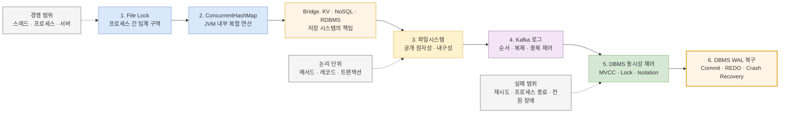

이 시리즈의 출발점은 다음 직관이다.

> 동시성과 원자성은 같은 것일까? `ConcurrentHashMap`은 작은 DB처럼 보이는데, 여기에 네트워크와 디스크를 붙이면 NoSQL이 되고 관계와 JOIN, 엄격한 트랜잭션을 더하면 RDBMS가 되는 것 아닐까?

이 직관에는 공통 뿌리가 있다. 세 시스템 모두 공유 가변 상태의 충돌 순서를 정하고 불변식을 지킨다. 다만 **동시성은 여러 작업이 겹치는 상황이고 원자성은 그 상황과 장애에 대해 제공하는 보장**이다. 또한 NoSQL과 RDBMS의 차이는 기능의 개수만이 아니라 데이터 모델, 질의 계약, 트랜잭션 경계와 운영 책임에 있다. 브리지 편에서 이 차이를 먼저 정리한 뒤 파일과 로그, DBMS로 범위를 넓힌다.

파일 락은 약속을 지키는 프로세스의 동시 진입을 막고, `ConcurrentHashMap`은 JVM 안에서 특정 연산을 원자적으로 제공한다. 파일시스템은 완성된 파일의 공개 시점과 장애 후 잔존 여부를 나누어 다루며, Kafka는 파티션 로그와 복제·멱등적 전송·트랜잭션으로 보장 범위를 넓힌다. DBMS에 이르면 여러 레코드의 변경, 동시 트랜잭션의 관찰, 커밋 이후의 복구를 하나의 트랜잭션 모델 안에서 다룬다.

이 시리즈는 이 기술들을 “약한 것에서 강한 것”으로 줄 세우지 않는다. 대신 **누가 함께 경쟁하는지, 무엇을 한 단위로 묶는지, 언제 성공으로 인정하는지, 어떤 장애까지 견뎌야 하는지**를 계층마다 다시 묻는다. 마지막 편에 도달하면 “락을 걸었으니 안전하다”가 아니라, 필요한 보장을 정확한 경계와 실패 모델로 설명하는 것이 목표다.

## 시리즈의 핵심 지도

아래 다이어그램은 한 프로세스의 임계 구역에서 시작해, 영속 로그와 DBMS의 장애 복구까지 보장 경계가 확장되는 흐름을 보여준다.

> 실선은 학습 순서, 점선은 각 계층에서 반드시 다시 정해야 하는 보장 경계를 뜻한다. 오른쪽으로 갈수록 무조건 더 좋은 기술이 되는 것이 아니라, 다루는 상태와 실패 모델이 넓어진다.

## 먼저 구분할 여섯 가지 보장

이 용어들은 서로 협력하지만 대체 관계가 아니다. 특히 JVM 연산의 원자성과 DB 트랜잭션의 원자성을 설명 없이 같은 뜻으로 쓰거나, 격리와 내구성을 락 하나로 해결하려 하면 장애 시나리오를 놓치기 쉽다.

| 개념 | 답하는 질문 | 보장하지 않는 것 | 대표 예시 |
|---|---|---|---|
| **연산 원자성(Operation atomicity)** | 한 API 호출이나 임계 구역의 상태 전이가 동시 참여자에게 더 작은 성공 단위로 쪼개지지 않는가? | 여러 호출·자원 전체의 all-or-nothing, 장애 후 보존 | CAS, `ConcurrentHashMap.compute` |
| **선형화 가능성(Linearizability)** | 겹친 호출을 실제 시간 순서와 모순되지 않는 하나의 순차 실행처럼 설명할 수 있는가? | 여러 키의 트랜잭션, 내구성 | 선형화 가능하다고 명시된 조건부 KV 연산 |
| **트랜잭션·실패 원자성** | 선택한 여러 변경이 전부 효과를 갖거나 전혀 효과를 갖지 않으며, 실패 뒤에도 그 경계로 복구되는가? | 동시 트랜잭션 사이의 모든 관찰 규칙, 커밋 보존 | DB 트랜잭션과 WAL 복구 |
| **격리(Isolation)** | 동시에 실행되는 작업이 서로의 중간 상태와 충돌을 어떻게 관찰하는가? | 커밋 결과의 영구 보존 | mutex, 행 잠금, MVCC, 격리 수준 |
| **내구성(Durability)** | 성공을 알린 뒤 프로세스·OS·장비 장애가 나도 결과가 남는가? | 중복 요청 방지, 업무 규칙의 정확성 | `fsync`, 로그 복제, DB WAL flush |
| **멱등성(Idempotency)** | 같은 요청을 재시도해도 최종 효과가 한 번 수행한 것과 같은가? | 여러 변경의 all-or-nothing, 동시 실행의 직렬화 | 요청 키 중복 제거, Kafka 멱등적 프로듀서, 조건부 `UPDATE` |

예를 들어 임시 파일을 완성한 뒤 `rename`하면 독자가 반쪽짜리 파일을 보지 않도록 **공개 시점의 연산 원자성**을 얻을 수 있다. 그러나 파일과 부모 디렉터리를 적절히 동기화하지 않았다면 전원 장애 후 이름이나 내용이 남는다는 **내구성**까지 자동으로 따라오지는 않는다. 반대로 멱등성 키는 응답을 받지 못해 같은 요청을 재전송할 때 중복 효과를 줄이지만, 서로 다른 두 레코드 변경을 하나의 트랜잭션으로 묶어 주지는 않는다.

## 6편과 브리지 편에서 답할 질문

### 1. [File Lock: 파일 쓰기의 임계 구역은 어디까지인가?](/blog/concurrency-01-file-locks)

첫 편은 여러 프로세스가 한 파일에 기록할 때 실제 경쟁 지점을 찾는다.

- `if (사용 가능) → write`가 왜 TOCTOU 경쟁을 만드는가?
- `flock`과 `fcntl` 계열의 advisory lock은 누구를 막고, 누가 우회할 수 있는가?
- 락 파일, 데이터 파일, 파일 디스크립터 중 무엇을 잠가야 수명 주기가 맞는가?
- 프로세스 내부 mutex, 같은 호스트의 파일 락, 여러 서버의 조정 수단은 왜 서로 대체할 수 없는가?

이 편의 결론은 “락을 썼다”가 아니라 **모든 경쟁 참여자가 공유하는 임계 구역을 정의했다**여야 한다. 락은 동시 진입을 조정하지만, 쓰기 완료 후 전원 장애까지 책임지지는 않는다.

### 2. [ConcurrentHashMap: 스레드 안전한 컬렉션이면 업무 연산도 원자적인가?](/blog/concurrency-02-jvm-concurrent-hash-map)

두 번째 편은 보장 범위를 JVM 내부로 좁혀, API가 제공하는 원자성과 사용자가 조합한 코드의 차이를 살핀다.

- `get`과 `put`이 각각 안전해도 `get → 계산 → put`이 왜 하나의 원자적 연산은 아닌가?
- `putIfAbsent`, `compute`, `merge`는 어느 키와 호출 범위까지 원자적인가?
- happens-before는 원자성, 가시성, 실행 순서를 어떻게 연결하는가?
- 한 키의 원자적 갱신과 여러 키에 걸친 업무 불변식은 왜 별도 설계가 필요한가?

이 편에서 얻은 “**제공된 원자 연산과 연산의 임의 조합은 다르다**”는 원칙은 이후 파일 API, Kafka 클라이언트, SQL 문장을 읽는 기준이 된다.

### 브리지. [ConcurrentHashMap에 네트워크를 붙이면 DB가 될까?](/blog/concurrency-map-nosql-rdb-bridge)

사용자의 최초 질문을 저장 시스템의 책임으로 확장한다.

- 동시성과 원자성은 왜 같은 말이 아닌가?
- `ConcurrentHashMap`에 API, 직렬화, WAL, 복구, 복제와 샤딩을 붙이면 어떤 순간부터 분산 KV 저장소의 문제를 풀게 되는가?
- NoSQL은 왜 하나의 데이터 모델이나 약한 트랜잭션을 뜻하지 않는가?
- RDBMS의 핵심은 JOIN 기능 하나가 아니라 관계 모델, 제약조건, 선언적 질의, optimizer와 여러 행의 트랜잭션이라는 계약에 있는가?

이 편의 결론은 `NoSQL + JOIN + ACID = RDBMS`라는 분류 공식이 아니라, **공유 상태를 다룬다는 뿌리는 같고 데이터 모델·질의·실패·운영 경계가 다르다**는 것이다.

### 3. [파일시스템: 원자적으로 보이는 쓰기와 장애 후 남는 쓰기는 어떻게 다른가?](/blog/concurrency-03-filesystem-atomicity-durability)

세 번째 편은 코드의 `write()` 성공과 저장 장치의 영구 반영 사이를 따라간다.

- `O_APPEND`가 원자적으로 묶는 범위는 무엇이며, 레코드를 여러 `write()`로 나누면 무엇이 달라지는가?
- buffered I/O의 `flush`, 커널의 `fsync`, 저장 장치 반영은 어떤 경계인가?
- 임시 파일 작성 후 같은 파일시스템에서 `rename`하는 패턴은 독자에게 무엇을 보장하는가?
- 새 파일과 이름 변경을 장애 후에도 보존하려면 왜 파일뿐 아니라 부모 디렉터리 동기화까지 검토해야 하는가?

목표는 **동시 쓰기 안전성, 공개 원자성, 장애 후 내구성**을 서로 다른 체크 항목으로 만드는 것이다. 로컬 파일시스템의 보장을 NFS·SMB 같은 공유 스토리지에 그대로 옮기지 않는 것도 중요한 결론이다.

### 4. [Kafka: 로그의 원자성은 파일 append와 무엇이 다른가?](/blog/concurrency-04-kafka-log-atomicity)

네 번째 편은 단일 파일의 append 모델을 복제된 파티션 로그로 확장한다.

- 파티션 단위 순서와 오프셋은 어떤 범위의 원장을 만드는가?
- `acks`, 복제 계수, ISR, `min.insync.replicas`는 성공 응답과 데이터 유실 가능성을 어떻게 바꾸는가?
- 멱등적 프로듀서는 재시도 중복을 어디까지 제거하며, 트랜잭션 프로듀서는 어떤 레코드를 함께 공개하는가?
- `read_committed` 소비와 오프셋 커밋은 처리 결과의 exactly-once와 어떻게 다른가?
- Kafka와 외부 DB를 함께 변경할 때 트랜잭션 경계가 갈라지는 문제를 Outbox와 멱등 소비로 어떻게 다루는가?

Kafka의 로그는 강력한 복구 재료지만, 애플리케이션의 외부 부수 효과까지 저절로 하나의 트랜잭션이 되지는 않는다. 이 편은 “메시지를 한 번 전달”과 “업무 효과가 한 번만 남음”을 분리한다.

### 5. [DBMS 동시성 제어: 여러 트랜잭션의 현실을 어떻게 격리하는가?](/blog/concurrency-05-dbms-concurrency-control)

다섯 번째 편은 단일 키·레코드의 제어를 여러 행과 업무 불변식으로 넓힌다.

- Lost Update, Dirty Read, Non-repeatable Read, Phantom은 어떤 실행 순서에서 생기는가?
- MVCC의 스냅샷과 행 잠금은 읽기·쓰기 충돌을 어떻게 다르게 처리하는가?
- Read Committed, Repeatable Read, Serializable 중 무엇을 선택하고 어떤 실패를 재시도해야 하는가?
- `SELECT ... FOR UPDATE`, 조건부 `UPDATE`, 유일 제약조건은 각각 어떤 불변식을 지키는가?
- 데드락 탐지와 serialization failure는 왜 숨길 오류가 아니라 재시도 정책의 입력인가?

핵심은 높은 격리 수준을 무조건 선택하는 것이 아니라 **보호할 불변식과 허용할 동시성**을 먼저 적는 것이다. DBMS도 트랜잭션 밖의 HTTP 호출이나 Kafka 발행까지 자동으로 롤백하지는 않는다.

### 6. [DBMS WAL과 복구: 커밋은 어떻게 장애를 넘어 살아남는가?](/blog/concurrency-06-dbms-wal-recovery)

마지막 편은 DBMS가 원자성과 내구성을 장애 복구 과정에서 어떻게 다시 성립시키는지 살핀다.

- 데이터 페이지보다 WAL 레코드를 먼저 영구 저장해야 하는 이유는 무엇인가?
- 커밋 응답, WAL flush, checkpoint, 데이터 페이지 writeback은 어떤 순서와 책임을 갖는가?
- 프로세스나 OS가 갑자기 종료된 뒤 REDO 기반 crash recovery는 무엇을 재구성하는가?
- group commit과 동기 커밋 설정은 지연 시간과 유실 가능성 사이에서 무엇을 교환하는가?
- 백업·PITR·복제는 로컬 crash recovery와 어떤 장애 범위를 추가로 다루는가?

끝판왕처럼 보이는 DBMS도 마법은 아니다. 트랜잭션 경계 안의 변경과 문서화된 장애 모델에 대해 ACID와 복구를 제공할 뿐이다. 애플리케이션은 올바른 격리 수준, 제약조건, 재시도, 외부 시스템과의 경계를 여전히 설계해야 한다.

## 앞 편의 한계가 다음 편의 질문이 된다

| 현재 계층에서 얻는 것 | 남는 빈틈 | 다음 계층에서 확인할 것 |
|---|---|---|
| 파일 락으로 임계 구역 보호 | JVM 자료구조 API의 원자 연산과 가시성 | `ConcurrentHashMap`의 메서드 단위 보장 |
| 한 키의 안전한 갱신 | 네트워크·영속성·복제·질의 계약 | KV·NoSQL·RDBMS의 책임 경계 |
| 저장 시스템의 책임 구분 | 프로세스 종료·전원 장애 뒤 결과 | 파일 공개와 `fsync` 경계 |
| 로컬 파일의 공개·보존 전략 | 여러 브로커의 복제, 재시도 중복, 소비 위치 | Kafka 로그의 커밋과 트랜잭션 |
| 복제 로그와 메시지 공개 제어 | 여러 레코드의 업무 불변식과 읽기 격리 | DBMS MVCC·Lock·Isolation |
| 동시 트랜잭션의 원자성·격리 | 커밋 직후 장애에서의 재구성 | WAL과 crash recovery |

이 연결을 따라가면 기술 이름보다 **보장 단위와 실패 경계**가 먼저 보인다. 같은 `atomic`이라는 단어도 JVM에서는 메서드 또는 키 단위일 수 있고, 파일시스템에서는 이름 교체의 관찰 단위일 수 있으며, DBMS에서는 여러 SQL 문장을 묶은 트랜잭션 단위일 수 있다.

## 기존 파일 동시성 워크북과의 관계

[파일 동시성 기초부터 커널·DB까지: 장비 결과 수집 워크북](/blog/backend-file-concurrency-workbook)은 “여러 장비의 결과가 한 파일에서 누락됐다”는 하나의 운영 사례를 진단하고 실습하는 문서다. CPU의 원자 연산, 파일 디스크립터와 페이지 캐시, `O_APPEND`, 파일 락, 단일 writer, DB 전환을 한 번에 훑는 **문제 해결형 입문서**에 가깝다.

이번 6편과 브리지 편은 그 워크북을 대체하지 않고 세로로 깊게 파고든다.

- 워크북을 먼저 읽으면 실제 장애 증상에서 출발해 어떤 질문을 해야 하는지 익힐 수 있다.
- 1편과 3편은 워크북의 파일 락·append·flush 논의를 보장 범위와 실패 주입 관점에서 확장한다.
- 2편은 워크북에서 짧게 다룬 프로세스 내부 동시성을 Java 컬렉션 API 수준으로 구체화한다.
- 브리지 편은 `ConcurrentHashMap`에서 KV·NoSQL·RDBMS로 책임이 확장되는 사고 실험을 다룬다.
- 4편은 단일 writer·append-only 원장을 분산 로그와 재시도 모델로 확장한다.
- 5편과 6편은 “파일 대신 DB를 쓰자” 이후에 실제로 선택해야 할 격리, 잠금, WAL, 커밋과 복구를 분리해 설명한다.

빠르게 문제를 해결해야 한다면 워크북에서 자신의 실패 유형을 먼저 찾고 관련 편으로 이동한다. 개념을 체계적으로 쌓고 싶다면 이 안내 글의 1편부터 순서대로 읽는 편이 좋다.

## 실행 자체를 더 깊게 보고 싶다면

이 시리즈는 공유 상태의 정확성과 복구에 집중한다. CPU 코어와 cache coherence, OS scheduler, Java Memory Model, 비동기 I/O와 가상 스레드처럼 **작업이 실제로 어떻게 겹치고 병렬 실행되는지**는 별도의 [동시성은 어떻게 실제 병렬 실행이 되는가: HW에서 가상 스레드까지](/blog/concurrency-parallelism-series) 시리즈에서 다룬다.

## 시리즈를 읽을 때 사용할 체크리스트

새로운 동시성 도구나 저장 기술을 만날 때마다 다음 질문에 답해 본다.

1. 경쟁 참여자는 스레드, 프로세스, 호스트, 클러스터 중 어디까지인가?
2. 원자적으로 보장되는 최소 단위는 명령, 키, 레코드, 파티션, 트랜잭션 중 무엇인가?
3. 다른 참여자는 진행 중인 상태를 볼 수 있는가?
4. API가 성공을 반환하는 시점에 데이터는 메모리, 커널, 디스크, 복제본 중 어디까지 도달했는가?
5. 타임아웃 뒤 재시도하면 중복 효과가 생기는가?
6. 프로세스 종료, OS crash, 전원 장애, 노드 유실 중 어디까지 복구할 수 있는가?
7. 보장 밖에 있는 외부 시스템과 부수 효과는 어떻게 조정할 것인가?

이 일곱 질문에 답할 수 있다면 “동시성에 안전하다”는 모호한 표현을 운영 가능한 설계와 검증 계획으로 바꿀 수 있다.

## 참고 자료

- [Linux `open(2)` — `O_APPEND`와 동기 I/O 플래그](https://man7.org/linux/man-pages/man2/open.2.html)
- [Linux `fsync(2)` — 파일 데이터와 디렉터리 엔트리의 동기화](https://man7.org/linux/man-pages/man2/fsync.2.html)
- [Linux `rename(2)` — 파일 이름 교체의 원자성](https://man7.org/linux/man-pages/man2/rename.2.html)
- [Linux `flock(2)` — advisory file lock](https://man7.org/linux/man-pages/man2/flock.2.html)
- [Java `ConcurrentHashMap` API](https://docs.oracle.com/en/java/javase/26/docs/api/java.base/java/util/concurrent/ConcurrentHashMap.html)
- [Java Language Specification, Chapter 17: Threads and Locks](https://docs.oracle.com/javase/specs/jls/se26/html/jls-17.html)
- [Apache Kafka Design — persistence, replication, delivery semantics](https://kafka.apache.org/documentation/#design)
- [Apache Kafka Producer Configuration — idempotence and transactions](https://kafka.apache.org/documentation/#producerconfigs)
- [PostgreSQL Transactions](https://www.postgresql.org/docs/current/tutorial-transactions.html)
- [PostgreSQL Transaction Isolation](https://www.postgresql.org/docs/current/transaction-iso.html)
- [PostgreSQL Write-Ahead Logging](https://www.postgresql.org/docs/current/wal-intro.html)
