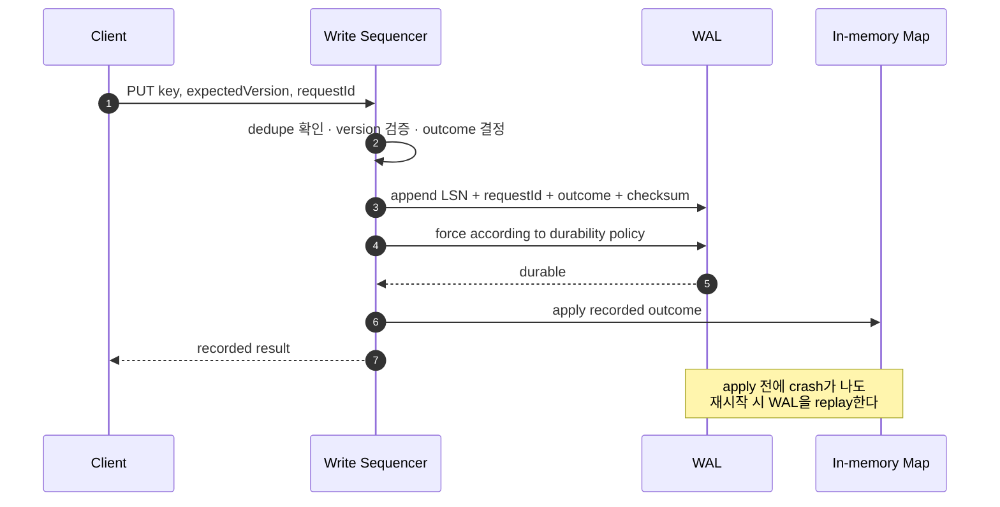

`ConcurrentHashMap`을 보다 보면 묘한 기시감이 든다. 여러 사용자가 동시에 값을 읽고 바꿔도 망가지지 않고, 키로 값을 찾으며, `compute`로 조건부 갱신도 한다. 이것은 이미 아주 작은 데이터베이스처럼 보인다.

여기서 다음 직관이 자연스럽게 이어진다.

> ConcurrentHashMap에 네트워크 기능과 디스크 저장을 붙이면 NoSQL이 되고, 여기에 복잡한 관계와 JOIN, 엄격한 트랜잭션을 얹으면 RDB가 되는 것 아닐까?

방향을 잡는 사고 실험으로는 꽤 좋다. 실제로 세 시스템은 모두 **여러 실행 주체가 공유 상태를 읽고 바꿀 때 순서를 정하고, 불변식을 지키는 문제**를 푼다. 그러나 이것을 제품 분류 공식으로 쓰면 중요한 차이를 놓친다. 네트워크와 디스크를 붙였다고 자동으로 NoSQL이 되지는 않으며, NoSQL에 JOIN과 ACID 트랜잭션을 더했다고 관계형 데이터베이스가 되는 것도 아니다.

이 글은 그 직관을 버리지 않고 더 정확하게 다듬는다. 핵심 질문은 세 가지다.

1. 동시성과 원자성은 같은 것인가?
2. `ConcurrentHashMap`과 NoSQL, RDBMS는 본질적으로 같은가?
3. 같다면 어디까지 같고, 어디서부터 다른 계약이 시작되는가?

## 1. 동시성은 상황이고, 원자성은 그 상황에 대한 보장이다

먼저 가장 많이 섞이는 두 단어부터 분리하자.

- **동시성(concurrency)**은 둘 이상의 작업이 진행 구간을 겹치는 **상황**이다.
- **원자성(atomicity)**은 정해 둔 단위를 불가분하게 다루는 **보장 계열**이다. 한 호출의 연산 원자성과, 여러 변경을 전부 또는 전무로 복구하는 트랜잭션·실패 원자성을 구분해야 한다.

동시성이 없어도 원자성은 필요할 수 있다. 프로세스가 하나뿐이어도 디스크에 값을 절반만 쓴 시점에 전원이 꺼질 수 있기 때문이다. 반대로 동시 요청을 잘 직렬화해도 메모리만 바꿨다면 프로세스가 종료되는 순간 결과가 사라진다.

여기서 `atomic`이라는 말도 관찰자와 실패 모델에 따라 다시 나뉜다.

| 구분 | 묻는 질문 | 예시 | 별도로 필요한 보장 |
|---|---|---|---|
| 연산 원자성 | 한 API 호출의 상태 전이가 더 작은 성공 단위로 끼어들거나 나뉘지 않는가? | `ConcurrentHashMap.compute` 한 번 | 여러 호출의 트랜잭션, 프로세스 장애 후 복구 |
| 선형화 가능성(linearizability) | 겹친 호출 각각을 시작과 종료 사이 한 시점에 일어난 것처럼 설명할 수 있는가? | 선형화 가능하다고 명시된 단일 키 조건부 쓰기 API | 여러 키 트랜잭션, 내구성 |
| 격리(isolation) | 여러 연산·트랜잭션이 서로 어떤 중간 상태를 관찰하는가? | DBMS의 MVCC와 격리 수준 | 커밋 결과의 영구 보존 |
| 실패 원자성(failure atomicity) | 도중에 crash가 나도 변경 전 또는 변경 후 상태 중 하나로 복구되는가? | 검증 가능한 WAL 레코드의 replay | 동시에 실행되는 요청의 관찰 규칙 |
| 내구성(durability) | 성공 응답 뒤 장애가 나도 결과가 남는가? | WAL을 안정 저장소에 동기화한 뒤 응답 | 관계 무결성, 질의 기능 |

따라서 “원자적이다”만으로는 설계 설명이 끝나지 않는다. **어떤 단위가, 누구에게, 어떤 장애까지 원자적인지**를 말해야 한다.

CPU cache coherence, OS scheduler, Java Memory Model처럼 작업이 실제로 어떻게 겹쳐 실행되는지 더 깊게 보려면 별도 [HW에서 가상 스레드까지 동시성·병렬성 시리즈](/blog/concurrency-parallelism-series)로 이어간다.

## 2. 출발점: JVM 한 개 안의 `ConcurrentHashMap`

아주 작은 재고 저장소를 생각해 보자.

```java
record Stock(long quantity, long version) {}

final class LocalStockStore {
    private final ConcurrentHashMap<String, Stock> data =
            new ConcurrentHashMap<>();

    boolean decrease(String sku, long expectedVersion, long amount) {
        AtomicBoolean changed = new AtomicBoolean(false);

        data.compute(sku, (key, current) -> {
            if (current == null
                    || current.version() != expectedVersion
                    || current.quantity() < amount) {
                return current;
            }

            changed.set(true);
            return new Stock(
                    current.quantity() - amount,
                    current.version() + 1);
        });

        return changed.get();
    }
}
```

이 코드는 한 JVM 안에서 한 `sku`의 “버전을 확인하고 재고를 감소시키는” 변경을 `compute` 호출 하나로 묶는다. `get → 검사 → put`을 따로 호출할 때 생기는 lost update를 피할 수 있다.

그런데 데이터베이스처럼 보이면서도 데이터베이스에 기대하는 수많은 계약이 없다.

- 다른 프로세스나 다른 서버에서는 접근할 수 없다.
- JVM이 종료되면 상태가 사라진다.
- 배포 후 객체 구조가 달라졌을 때 이전 값을 읽는 스키마 진화 규칙이 없다.
- 두 `sku`를 한 번에 바꾸는 트랜잭션이 없다.
- 임의 조건 검색, 인덱스, JOIN, 실행 계획이 없다.
- 백업, 접근 제어, 감사 로그, 용량 계획, 장애 조치 계약이 없다.

즉 `ConcurrentHashMap`은 **동시 접근 가능한 인메모리 자료구조**다. 저장 시스템이 풀어야 할 문제의 씨앗을 갖고 있지만, 저장 시스템 전체는 아니다.

## 3. 무엇을 하나씩 붙여야 원격 KV 저장소에 가까워질까

다음 그림은 `ConcurrentHashMap`에 기능을 더할수록 보호해야 할 경계가 JVM 밖으로 확장되는 과정을 보여준다.

```mermaid
flowchart LR
    M["ConcurrentHashMap<br/>JVM 안의 키 연산"] --> N["Network API<br/>프로세스 밖의 클라이언트"]
    N --> S["Serialization · Schema<br/>바이트 계약과 버전"]
    S --> W["Disk · WAL<br/>재시작 후 복구"]
    W --> R["Replication · Leader<br/>노드 장애와 쓰기 순서"]
    R --> H["Sharding<br/>키 공간 분할"]
    H --> C["Consistency Model<br/>읽기·쓰기 관찰 계약"]
    C --> O["Auth · Backup · Metrics<br/>운영 가능한 데이터 서비스"]

    style M fill:#dae8fc,stroke:#6c8ebf
    style N fill:#dae8fc,stroke:#6c8ebf
    style S fill:#fff2cc,stroke:#d6b656
    style W fill:#fff4e6,stroke:#d79b00
    style R fill:#f3e5f5,stroke:#9673a6
    style H fill:#f3e5f5,stroke:#9673a6
    style C fill:#d5e8d4,stroke:#82b366
    style O fill:#f5f5f5,stroke:#666666
```



> 화살표는 제품의 진화 법칙이 아니라 학습용 확장 순서다. 각 단계를 추가할 때 기능뿐 아니라 새로운 실패 모드와 운영 계약도 함께 생긴다.

### 3.1 네트워크 API: 메서드 호출이 요청이 되는 순간

먼저 map 앞에 HTTP 서버를 둔다.

```text
PUT /v1/stocks/ABC
Idempotency-Key: 7d0c...

{
  "expectedVersion": 12,
  "quantity": 9
}
```

이제 다른 프로세스와 언어에서도 접근할 수 있다. 대신 로컬 메서드에는 없던 문제가 생긴다.

- 서버가 변경을 마친 뒤 응답만 유실되면 클라이언트는 성공 여부를 모른다.
- 타임아웃 후 재시도한 같은 요청이 두 번 적용될 수 있다.
- 서로 다른 클라이언트의 패킷 도착 순서가 업무상 생성 순서와 같지 않을 수 있다.
- JSON 파싱 실패, 최대 요청 크기, 이전 필드와 새 필드의 호환성을 정해야 한다.

`expectedVersion`은 경쟁 갱신을 탐지하지만 재시도 중복을 해결하지 않는다. `Idempotency-Key`와 그 처리 결과를 함께 저장해야 “응답을 못 받았으니 다시 보낸다”는 네트워크의 정상 동작을 견딜 수 있다. 중요한 점은 idempotency key의 기록과 실제 변경이 같은 원자적 경계에 있어야 한다는 것이다.

### 3.2 직렬화와 스키마: 객체가 바이트 계약이 되는 순간

메모리의 `Stock` 객체는 같은 JVM 코드끼리만 이해한다. 네트워크와 디스크를 통과하려면 JSON, Protocol Buffers 같은 표현으로 바꾸고 다음을 결정해야 한다.

- 필드 추가·삭제와 기본값을 어떻게 해석하는가?
- 숫자 범위, 문자 인코딩, 시간대는 무엇인가?
- 알 수 없는 필드를 보존할 것인가?
- 오래된 클라이언트와 새 서버가 함께 동작할 수 있는가?

단순히 Java 객체를 직렬화해 파일에 덤프하는 것은 스냅샷 하나를 만드는 방법일 뿐이다. 그것만으로 crash 중 찢어진 쓰기를 감지하거나, 버전이 다른 코드로 복구하거나, 성공한 마지막 요청까지 재현하지는 못한다. 자료구조가 **공개된 데이터 형식의 수명 주기**를 책임지기 시작한다.

### 3.3 디스크와 WAL: 성공의 의미가 재시작을 넘어가는 순간

매 요청마다 map 전체를 다시 저장하면 느릴 뿐 아니라 쓰기 도중 crash가 났을 때 어느 파일이 정답인지 애매해진다. 그래서 보통 변경 명령을 append-only log에 먼저 기록하고, 재시작할 때 이를 재생하는 사고방식으로 이동한다.

```text
put(command):
  lock writeSequencer
  try:
    if dedupeIndex contains command.requestId:
      return dedupeIndex[command.requestId].result

    outcome = validateExpectedVersionAndPlanMutation(map, command)
    lsn = nextSequence()
    record = encode(lsn, command.requestId, outcome, checksum)
    appendFully(wal, record)
    force(wal)                 // 내구성을 성공 조건에 넣는 정책이라면 필수
    applyRecordedOutcome(map, dedupeIndex, record)
    return outcome.result
  finally:
    unlock writeSequencer

recover():
  loadLastValidSnapshot()
  for record in scanWalUntilFirstInvalidRecord():
    if record.lsn > snapshot.lastAppliedLsn:
      applyRecordedOutcome(map, dedupeIndex, record)
```

여기서 WAL에 기록하는 것은 아직 판단하지 않은 raw 요청이 아니라 **검증을 끝낸 outcome**이다. stale version이나 중복 request도 그 결과를 결정적으로 기록·재생해야, 복구 뒤에 같은 `requestId`가 다른 성공 응답으로 바뀌지 않는다.

쓰기 경로와 복구 경로의 관계는 다음과 같다.



> `LSN`은 로그의 순서를 식별하고 checksum과 길이는 끝부분의 불완전한 레코드를 찾는 재료다. 실제 보장 수준은 파일시스템, `force` 시점, 장치, 스냅샷 교체 방식까지 포함해 정의해야 한다.

이제 성공 응답은 단순히 `map.put()`이 끝났다는 뜻이 아니다. “어느 로그 레코드까지 어떤 매체에 도달했는가”라는 내구성 정책이 된다. 스냅샷 압축, WAL 절단, 손상 탐지, 백업과 복원 테스트도 필요하다. 이 지점부터는 직접 만든 코드가 [다음 편의 파일 원자성과 내구성](/blog/concurrency-03-filesystem-atomicity-durability) 문제를 그대로 떠안는다.

### 3.4 복제와 리더: 서버 한 대의 순서를 클러스터 순서로 만드는 순간

디스크가 있어도 서버 자체가 유실되면 서비스는 멈춘다. 복제본을 두면 질문이 더 어려워진다.

- primary가 응답하기 전에 몇 개 replica가 로그를 받아야 하는가?
- primary와 replica가 서로 단절되면 누가 쓰기를 받을 수 있는가?
- 두 노드가 모두 자신을 leader라고 믿는 split-brain을 어떻게 막는가?
- failover 직전 성공한 쓰기를 새 leader가 갖고 있는가?
- 오래된 replica에서 읽은 값도 허용할 것인가?

leader와 합의 프로토콜은 단순히 map을 여러 번 복사하는 기능이 아니다. 노드들이 **하나의 확정된 로그 순서**에 동의하도록 하는 장치다. 비동기 복제는 짧은 지연 시간과 가용성을 얻는 대신 failover 때 최근 쓰기를 잃을 수 있고, 다수 확인을 성공 조건으로 삼으면 보장이 강해지는 대신 지연과 가용성 비용이 생긴다.

### 3.5 샤딩: 한 map을 여러 key space로 나누는 순간

데이터나 트래픽이 한 노드에 들어가지 않으면 키를 hash slot이나 range로 나눈다. 단일 키 명령은 해당 shard의 leader만 찾아가면 되지만, 두 키가 서로 다른 shard에 있으면 원자성 경계가 갈라진다.

`A`의 재고를 줄이고 `B`의 재고를 늘리는 명령이 한 map의 전역 락으로 해결되던 시절과 달리, 이제는 분산 트랜잭션, 같은 shard에 두는 데이터 배치, saga 같은 선택이 필요하다. rebalance 중에는 키가 이동하고, 오래된 routing 정보를 가진 클라이언트도 처리해야 한다.

### 3.6 일관성 모델과 운영 기능: 구현이 서비스 계약이 되는 순간

분산 저장소에서는 “읽으면 최신값이 나온다”조차 자동으로 참이 아니다. read-your-writes, monotonic reads, eventual consistency, linearizable read 중 무엇을 제공하는지 공개해야 한다. 보장이 강할수록 무조건 좋은 것도 아니다. 지연 시간, 장애 시 가용성, 지역 간 거리와 교환 관계가 있다.

여기에 인증·인가, TLS, quota, 암호화, 감사, metrics, compaction, rolling upgrade, backup/restore, 재해 복구가 붙는다. 운영자가 예측 가능한 방식으로 설치하고 관찰하고 복구할 수 있어야 비로소 “원격 map”이 운영 가능한 데이터 서비스에 가까워진다.

## 4. 그러면 언제부터 NoSQL인가?

단일한 경계는 없다. 네트워크 API 하나를 붙인 실험용 map도 넓은 의미에서는 데이터 서버지만, 그것을 곧바로 NoSQL 데이터베이스라고 부르면 데이터 형식, 내구성, 복구, 분산 합의와 운영 계약이 완성됐다는 오해를 줄 수 있다.

더 중요한 점은 **NoSQL이 하나의 데이터 모델이나 하나의 보장 수준을 뜻하지 않는다**는 것이다.

| 계열 | 자연스러운 데이터 모델 | 대표 접근 형태 | 관계를 다루는 방식 |
|---|---|---|---|
| Key-Value | key → opaque value 또는 자료형 | 키 기반 get/set, 조건부 갱신 | 애플리케이션 조합, 서버 측 명령·스크립트 |
| Document | 중첩 document | 필드 조건, aggregation, 보조 인덱스 | embedding, reference, lookup 계열 연산 |
| Wide-column | partition key 안의 sparse row/column | partition 중심 질의 | 질의 패턴에 맞춘 비정규화 |
| Graph | vertex와 edge | traversal, path, pattern | 관계 자체를 1급 데이터로 모델링 |

이 분류 안에서도 제품마다 트랜잭션과 일관성 계약은 크게 다르다. MongoDB는 단일 document 연산의 원자성뿐 아니라 여러 document, collection, database와 shard에 걸친 transaction을 제공하고, `$lookup`으로 collection 간 결합도 지원한다. Redis에도 여러 명령을 연속 실행하는 transaction 기능과 AOF·snapshot 같은 영속화 선택지가 있다.

따라서 다음 등식은 성립하지 않는다.

```text
NoSQL + JOIN + 엄격한 transaction = RDBMS   // 분류 공식으로는 틀림
```

JOIN과 transaction은 중요한 기능이지만 데이터 모델 자체는 아니다. document DB가 JOIN 비슷한 연산과 ACID transaction을 제공해도 document 중심 모델과 API 계약을 유지할 수 있다. 반대로 관계형 DBMS도 JSON, 전문 검색, 분산 배치 같은 기능을 제공할 수 있다.

## 5. RDBMS의 본질은 “기능이 많은 NoSQL”이 아니다

관계형 데이터베이스의 중심은 데이터를 **relation**으로 모델링하고, 그 모델 위에 선언적 질의와 무결성 계약을 제공하는 데 있다.

- row와 column으로 이루어진 relation, key와 domain을 중심으로 데이터를 표현한다.
- primary key, unique, foreign key, check 같은 schema constraint를 데이터베이스가 지속적으로 집행한다.
- selection, projection, join 같은 관계 연산으로 “어떻게 순회할지”보다 “어떤 결과를 원하는지”를 기술한다.
- optimizer가 통계와 index를 이용해 동일한 SQL의 실행 계획을 선택한다.
- 여러 row와 table의 변경을 transaction으로 묶고 격리 수준에 따른 관찰 규칙을 제공한다.
- SQL이라는 비교적 안정적인 언어·타입·오류·transaction 계약을 클라이언트에 노출한다.

예를 들어 주문과 상품의 관계를 애플리케이션 map 두 개로 관리할 수는 있다. 하지만 다음 SQL은 단순 조회 문법 이상의 계약을 담는다.

```sql
CREATE TABLE product (
    product_id bigint PRIMARY KEY,
    name text NOT NULL,
    stock bigint NOT NULL CHECK (stock >= 0)
);

CREATE TABLE order_item (
    order_id bigint NOT NULL,
    product_id bigint NOT NULL REFERENCES product(product_id),
    quantity bigint NOT NULL CHECK (quantity > 0),
    PRIMARY KEY (order_id, product_id)
);

BEGIN;

UPDATE product
   SET stock = stock - 1
 WHERE product_id = 42
   AND stock >= 1;

-- 애플리케이션은 affected_rows = 1일 때만 다음 문장을 실행한다.
-- 0이면 ROLLBACK하여 품절 주문을 만들지 않는다.

INSERT INTO order_item(order_id, product_id, quantity)
VALUES (1001, 42, 1);

COMMIT;
```

이 schema는 존재하지 않는 상품을 주문 항목이 참조하지 못하게 하고, 같은 주문의 같은 상품이 중복되지 않게 하며, 수량 범위를 제한한다. transaction은 재고 감소와 주문 항목 추가를 하나의 업무 단위로 묶는다. 동시 transaction이 서로 무엇을 보는지는 MVCC와 선택한 격리 수준이 다룬다.

물론 위 예시도 완전한 주문 시스템은 아니다. `UPDATE`가 실제로 한 행을 바꿨는지 확인해야 하고, 외부 결제나 메시지 발행은 PostgreSQL transaction에 자동으로 포함되지 않는다. RDBMS는 경계 안의 불변식과 복구를 강하게 지원하지만, 경계 자체를 대신 정해 주지는 않는다.

그리고 관계형인지 여부는 분산 여부와 별개다. 단일 노드 RDBMS도 있고 분산 SQL 시스템도 있으며, 단일 노드 document DB도 있고 여러 지역에 복제되는 key-value store도 있다. **데이터 모델의 축과 배치·복제의 축을 하나로 합치지 말아야 한다.**

## 6. 세 계층은 무엇이 같고 무엇이 다른가

직관을 가장 유용한 형태로 정리하면 다음과 같다.

| 축 | `ConcurrentHashMap` | 분산 KV / NoSQL의 한 형태 | RDBMS |
|---|---|---|---|
| 기본 경계 | JVM 객체 | 프로세스·노드·클러스터 | DB session·transaction·relation |
| 공유 참여자 | 같은 JVM의 thread | 네트워크 client와 storage node | 여러 client와 transaction |
| 대표 데이터 모델 | Java key/value object | KV, document, wide-column, graph 등 | relation, row, column, key |
| 원자 단위 | 제공된 map 연산, 주로 한 key 갱신 | 제품별 key/document/partition/transaction | SQL statement 또는 multi-row transaction |
| 질의 | key 접근, iteration | 모델별 API와 index/aggregation | 관계 대수 기반 선언적 SQL, JOIN, optimizer |
| 무결성 | 애플리케이션 코드와 객체 규약 | 제품별 조건부 쓰기·schema validation | PK·FK·UNIQUE·CHECK와 transaction |
| 영속성·복구 | 없음 | 제품·설정별 snapshot, log, replay, 복제 | WAL, checkpoint, crash recovery |
| 일관성 | JVM 메모리 모델과 API 계약 | eventual부터 linearizable까지 제품별 | 격리 수준, MVCC·lock, commit 계약 |
| 운영 책임 | 애플리케이션 프로세스에 포함 | shard·replica·backup·failover 운영 | schema·통계·index·backup·recovery 운영 |

공통 본질은 분명히 있다.

1. **공유 가변 상태**가 있다.
2. 충돌하는 변경을 어떤 **순서**로 직렬화할지 정한다.
3. 지켜야 할 **불변식**과 원자 단위를 정한다.
4. 상태를 **영속화**하고 장애 후 **복구**할 방법을 정한다.
5. 읽는 쪽이 어떤 상태를 볼 수 있는지 **관찰 계약**을 정한다.

결정적 차이는 이 문제들을 다루는 **경계, 데이터 모델, 질의 언어, 실패 모델, 운영 계약**이다. `ConcurrentHashMap`의 `compute`를 이해한 경험이 DB transaction을 이해하는 데 도움이 되는 이유도 여기에 있다. 둘 다 “현재 값을 보고 조건을 확인한 뒤 변경한다”는 경쟁을 다루지만, 전자는 한 JVM의 map 연산이고 후자는 여러 client·row·index·log·crash recovery까지 포함할 수 있다.

## 7. 어디서 DB가 되는가에는 단일 경계가 없다

“네트워크를 붙인 순간”, “디스크에 저장한 순간”, “SQL을 지원한 순간” 중 어느 하나만 정답으로 고를 수는 없다. 데이터베이스는 자연과학적 종 분류가 아니라 데이터 모델과 보장, 운영 기능을 묶은 시스템 범주이기 때문이다.

대신 직접 만든 저장소나 새 제품을 볼 때 다음 질문을 던지면 경계가 선명해진다.

1. 동시에 들어온 명령의 전역 또는 key별 순서는 누가 정하는가?
2. 원자 단위는 한 key, 한 document, 한 partition, 여러 row 중 어디까지인가?
3. 성공 응답 직후 프로세스·OS·노드가 죽으면 어디까지 복구되는가?
4. 타임아웃 재시도와 중복 요청은 어떻게 식별하는가?
5. replica와 shard가 있을 때 최신 읽기와 failover의 계약은 무엇인가?
6. 데이터 모델은 KV, document, graph, relation 중 무엇이며 불변식은 누가 집행하는가?
7. 질의 계획, index, schema 변경, backup과 restore는 누가 책임지는가?

처음의 직관은 이렇게 고쳐 말할 수 있다.

> `ConcurrentHashMap`에 네트워크, 직렬화, WAL, 복구, 복제, 샤딩과 운영 계약을 붙이면 분산 KV 저장소의 문제 공간에 가까워진다. 관계형 모델, schema constraint, 관계 연산과 optimizer, 여러 row의 transaction, SQL 계약을 중심에 두면 RDBMS의 문제 공간에 가까워진다. 둘은 공유 상태의 순서와 불변식을 다룬다는 뿌리는 같지만, 제공하는 추상화와 책임의 경계가 다르다.

다음 편에서는 이 확장 과정에서 가장 먼저 부딪히는 영속성 문제를 다룬다. `write()`가 성공한 순간, 다른 reader에게 완성본만 보이는 순간, 전원 장애 뒤에도 데이터가 남는 순간이 왜 서로 다른지 파일 I/O 수준에서 확인한다.

## 참고 자료

- [Java `ConcurrentHashMap` API](https://docs.oracle.com/en/java/javase/26/docs/api/java.base/java/util/concurrent/ConcurrentHashMap.html)
- [PostgreSQL Transactions](https://www.postgresql.org/docs/current/tutorial-transactions.html)
- [PostgreSQL MVCC 소개](https://www.postgresql.org/docs/current/mvcc-intro.html)
- [PostgreSQL Constraints](https://www.postgresql.org/docs/current/ddl-constraints.html)
- [PostgreSQL Table Expressions와 JOIN](https://www.postgresql.org/docs/current/queries-table-expressions.html)
- [MongoDB Transactions](https://www.mongodb.com/docs/manual/core/transactions/)
- [MongoDB `$lookup`](https://www.mongodb.com/docs/manual/reference/operator/aggregation/lookup/)
- [Redis Persistence](https://redis.io/docs/latest/operate/oss_and_stack/management/persistence/)
- [Redis Replication](https://redis.io/docs/latest/operate/oss_and_stack/management/replication/)
- [etcd: key-value store와 일관성·합의](https://etcd.io/docs/v3.6/learning/why/)
