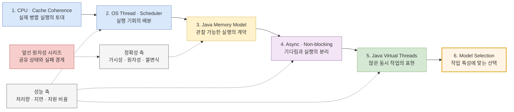

“동시에 처리한다”는 코드는 언제 실제로 동시에 실행될까? 스레드를 열 개 만들면 열 개가 병렬로 움직이는가? CPU 코어, OS 스레드, Java 플랫폼 스레드, 가상 스레드는 서로 어떻게 연결되는가?

이 시리즈는 [파일 락에서 DBMS 복구까지: 계층별 원자성 여정](/blog/concurrency-atomicity-series)을 쓰며 남은 질문에서 출발한다. 앞선 시리즈가 **공유 상태를 어떻게 올바르게 바꾸고 장애 뒤에도 지킬 것인가**를 따라갔다면, 이번 시리즈는 **여러 작업이 실제 실행 자원을 어떻게 나누며 처리량과 지연 시간에 어떤 영향을 받는가**를 따라간다.

두 주제는 맞닿아 있지만 같은 질문은 아니다. 동시성 구조를 채택했다고 공유 상태가 자동으로 안전해지지 않고, 원자성을 확보했다고 여러 코어에서 병렬로 실행되는 것도 아니다. 특히 가상 스레드는 기다리는 작업을 저렴하게 많이 유지하는 수단이지, CPU 코어나 연산 처리 능력을 새로 만드는 수단이 아니다.

## 먼저 네 축을 분리한다

| 축 | 답하는 질문 | 흔한 오해 |
|---|---|---|
| **동시성(Concurrency)** | 여러 작업의 수명이 겹치며 진행될 수 있는가? | 동시 작업 수만큼 같은 순간에 실행된다 |
| **병렬성(Parallelism)** | 어떤 순간에 둘 이상의 작업이 실제 실행 자원에서 수행되는가? | 스레드 수를 늘리면 비례해서 커진다 |
| **정확성(Correctness)** | 실행 순서가 달라도 가시성·원자성·불변식이 지켜지는가? | 캐시 일관성이나 thread-safe 컬렉션이 업무 규칙까지 지킨다 |
| **성능(Performance)** | 처리량, 지연 시간, 자원 사용량이 목표를 만족하는가? | 정확한 설계는 곧 빠른 설계다 |

동시성은 **작업을 구성하는 방식**, 병렬성은 **실행이 일어나는 상태**에 가깝다. 한 코어에서도 스케줄러가 작업을 번갈아 실행하면 여러 작업이 동시 진행될 수 있지만 같은 순간의 CPU 실행은 하나일 수 있다. 반대로 여러 코어에서 독립 작업을 실제로 함께 실행하면 병렬성이 생긴다. 다만 동시 실행의 정확한 의미와 실행 폭은 CPU 구조, OS 정책, 런타임과 작업 특성에 따라 달라지므로 “스레드 N개 = N배 병렬” 같은 등식은 사용하지 않는다.

## 시리즈 전체 지도

아래 다이어그램은 물리 실행 자원에서 출발해 Java 애플리케이션의 동시성 모델 선택까지 올라오는 학습 순서를 보여준다.

> 실선은 학습 순서, 점선은 각 편을 관통하는 평가 축을 뜻한다. 위 계층은 아래 계층을 추상화하지만, 정확성 계약과 성능 특성을 대신 결정해 주지는 않는다.

## 소프트웨어 스레드와 하드웨어 실행 자원은 같은 것이 아니다

용어가 겹치기 쉬우므로 이 시리즈에서는 다음처럼 구분한다.

- **소프트웨어 스레드**는 독립적인 실행 흐름과 상태를 가진 스케줄링 대상이다. Java 플랫폼 스레드는 보통 OS 스레드와 연결되고, OS가 실행 기회를 배분한다.
- **물리 코어**는 명령을 실행하는 하드웨어 자원을 포함한다. 코어마다 어떤 자원을 갖고 공유하는지는 프로세서 세대와 설계에 따라 다르다.
- **하드웨어 스레드 또는 논리 프로세서**는 SMT 같은 구현에서 OS에 노출되는 실행 문맥이다. 하나의 논리 프로세서를 물리 코어 하나와 같은 성능 단위로 세어서는 안 된다.
- **가상 스레드**는 JDK가 스케줄링하는 `java.lang.Thread`다. 실행 중에는 carrier인 플랫폼 스레드 위에 올라가고, 대기 중에는 내려와 제한된 플랫폼 스레드를 다른 가상 스레드가 사용할 수 있게 한다.

따라서 애플리케이션 작업은 대략 `가상 스레드 또는 태스크 → 플랫폼/OS 스레드 → 논리 프로세서 → 코어의 실행 자원`을 거친다. 그러나 이는 개념 지도이지 영구적인 1:1 매핑이 아니다. 스케줄러는 스레드를 옮길 수 있고, 가상 스레드는 수명 동안 서로 다른 carrier에서 실행될 수 있으며, 코어와 캐시·SMT의 구성도 제품마다 다르다.

## 6편에서 답할 질문

### 1. [CPU 코어와 캐시 일관성: 실제 병렬 실행은 어디서 시작되는가?](/blog/parallelism-01-cpu-cache-coherence)

첫 편은 “스레드 두 개가 실행된다”는 문장을 하드웨어 관점에서 다시 읽는다.

- 물리 코어, 논리 프로세서, SMT는 무엇이 같고 무엇이 다른가?
- 여러 코어의 private cache와 공유 cache가 있는 시스템에서 같은 cache line을 읽고 쓸 때 어떤 비용이 생길 수 있는가?
- cache coherence와 memory ordering은 왜 같은 개념이 아니며, coherence가 data race를 고쳐 주지 않는 이유는 무엇인가?
- false sharing은 값이 논리적으로 독립적이어도 처리량을 낮출 수 있는데, 어떻게 측정하고 완화하는가?
- 코어 수, 주파수, 캐시 계층만 보고 애플리케이션 성능을 단정할 수 없는 이유는 무엇인가?

이 편은 특정 캐시 프로토콜이나 파이프라인 구성을 모든 CPU의 공통 구현으로 일반화하지 않는다. Intel과 Arm의 공식 자료를 사용하되, 문서화된 아키텍처 계약과 제품별 최적화 조언을 구분한다.

앞선 [ConcurrentHashMap 편](/blog/concurrency-02-jvm-concurrent-hash-map)과의 연결점은 CAS와 경합이다. 그 편에서는 CAS를 한 변수의 원자적 갱신 수단으로 보았다면, 여기서는 여러 코어가 같은 cache line을 갱신할 때의 통신 비용을 성능 축에서 본다. **CAS의 정확성과 CAS 경합의 비용은 다른 문제**다.

### 2. [OS 스레드와 스케줄러: runnable 작업은 언제 running이 되는가?](/blog/parallelism-02-os-threads-scheduler)

두 번째 편은 소프트웨어 스레드가 CPU 시간을 얻고 잃는 과정을 따라간다.

- 생성된 스레드, runnable 상태, 실제 running 상태는 어떻게 다른가?
- CPU보다 runnable 스레드가 많을 때 스케줄러는 실행 기회를 어떻게 나누며, context switch와 migration은 어떤 비용을 만들 수 있는가?
- blocking, sleep, I/O wait 뒤 깨어난 작업은 어떤 경로로 다시 실행 가능한 상태가 되는가?
- CPU affinity와 scheduler domain은 언제 locality에 도움이 되고, 언제 공정성과 부하 분산을 해칠 수 있는가?
- Linux 스케줄러의 세부 구현은 커널 버전과 정책에 따라 달라지는데, 애플리케이션은 어떤 안정된 관찰 지표를 봐야 하는가?

Linux의 기본 공정 스케줄링 설명에서는 CFS만을 현재의 유일한 답처럼 고정하지 않는다. Linux 커널 문서가 설명하는 EEVDF 전환과 스케줄링 클래스의 차이를 확인하고, `runnable`, CPU 사용률, run queue, context switch 같은 관찰 가능한 현상에 집중한다.

앞선 원자성 시리즈의 락은 임계 구역을 보호했지만, 락 대기 중인 스레드가 언제 다시 실행될지는 보장하지 않았다. 이 편은 **상호 배제의 정확성**과 **스케줄링 지연·기아 가능성**을 분리한다.

### 3. [Java Memory Model: JVM은 CPU의 차이를 어떤 계약으로 감추는가?](/blog/parallelism-03-jvm-memory-model)

세 번째 편은 소스 코드의 순서와 다른 스레드가 관찰하는 순서 사이에 Java가 세운 계약을 읽는다.

- compiler와 processor가 최적화를 수행해도 Java 프로그램이 의존할 수 있는 규칙은 무엇인가?
- program order, synchronization order, synchronizes-with, happens-before는 어떻게 연결되는가?
- `synchronized`, `volatile`, `final`, `java.util.concurrent` API는 가시성과 순서를 어떻게 제공하는가?
- 원자성, 가시성, ordering은 왜 서로 관련되지만 대체할 수 없는가?
- Java 메모리 모델의 연산을 특정 CPU 명령 하나와 항상 1:1로 대응시키면 왜 위험한가?

[ConcurrentHashMap 편](/blog/concurrency-02-jvm-concurrent-hash-map)에서 사용한 happens-before와 원자 메서드 계약을 더 깊게 파고든다. 핵심은 map의 구현 세부를 외우는 것이 아니라, Java 코드가 의존해야 할 것은 JLS와 API의 **언어·라이브러리 계약**이라는 점이다. 캐시 일관성이 있어도 happens-before가 없는 data race는 안전해지지 않는다.

### 4. [비동기와 논블로킹: 기다리지 않는 코드는 병렬 코드인가?](/blog/parallelism-04-async-nonblocking)

네 번째 편은 작업의 대기와 실행을 분리하는 여러 표현을 비교한다.

- synchronous/asynchronous와 blocking/non-blocking은 왜 서로 다른 분류 축인가?
- readiness, completion, callback, `CompletionStage`는 대기 중인 작업을 어떻게 표현하는가?
- event loop 하나로 많은 연결을 처리할 수 있어도 CPU-bound 작업은 왜 별도 실행 자원이 필요한가?
- callback 또는 stage의 완료 순서와 공유 상태의 안전성은 왜 별도 계약인가?
- backpressure, cancellation, timeout, context propagation과 오류 전파를 빠뜨리면 어떤 운영 문제가 생기는가?

앞선 원자성 시리즈가 중복 요청과 외부 부수 효과의 멱등성을 다뤘다면, 이 편은 비동기 경계에서 **실행 제어가 반환된 시점과 업무가 완료된 시점이 다르다**는 점을 연결한다. 비동기 API는 원자적 트랜잭션을 만들지 않으며, 논블로킹 I/O도 계산 자체를 여러 코어에 병렬화하지 않는다.

### 5. [Java 가상 스레드: 동시 작업을 늘리면 병렬성도 늘어나는가?](/blog/parallelism-05-java-virtual-threads)

다섯 번째 편은 Java의 thread-per-request 모델이 가상 스레드에서 어떻게 확장되는지 살핀다.

- 플랫폼 스레드, carrier, 가상 스레드는 실행 중에 어떻게 연결되고 분리되는가?
- blocking I/O에서 가상 스레드가 unmount될 수 있다는 것은 처리량에 어떤 이점을 주는가?
- 가상 스레드는 왜 “더 빠른 스레드”가 아니며 CPU-bound 작업의 병렬성을 늘리지 않는가?
- thread pool로 희소 자원을 제한하던 설계를 가상 스레드로 옮길 때 왜 `Semaphore` 같은 명시적 제한이 필요한가?
- pinning, `ThreadLocal`, 관측 도구, 외부 connection pool과 rate limit은 어떤 병목을 남기는가?

OpenJDK JEP 444의 비목표에는 새로운 data-parallelism 구문을 제공하지 않는다는 점이 명시되어 있다. 가상 스레드가 많아져도 동시에 Java 코드를 실행할 수 있는 폭은 carrier와 실제 CPU 자원의 제약을 받는다. 주된 이점은 I/O를 기다리는 동시 작업을 저렴하게 유지해 **서버 처리량**을 높이는 데 있으며, 개별 요청의 **연산 지연 시간**을 자동으로 줄이지 않는다.

[ConcurrentHashMap 편](/blog/concurrency-02-jvm-concurrent-hash-map)의 규칙도 그대로 남는다. 가상 스레드 천 개가 같은 map을 사용하면 여전히 공유 상태이며, 여러 키의 불변식이나 외부 부수 효과가 원자적으로 바뀌지는 않는다.

### 6. [동시성 모델 선택: 정확성, 처리량, 지연 시간을 어떻게 함께 판단하는가?](/blog/parallelism-06-choosing-concurrency-model)

마지막 편은 기술 이름이 아니라 작업과 제약에서 출발하는 선택 절차를 만든다.

- CPU-bound, I/O-bound, 혼합 workload를 무엇으로 측정하고 어떻게 분리하는가?
- platform thread pool, virtual-thread-per-task, async pipeline, parallel stream 또는 명시적 분할 중 무엇이 자연스러운가?
- 공유 mutable state, task ownership, cancellation, deadline, backpressure 요구가 모델 선택을 어떻게 바꾸는가?
- throughput을 높인 변경이 tail latency, 메모리, downstream 부하를 악화시키는지 어떻게 검증하는가?
- 개발 환경의 microbenchmark가 아니라 운영 workload에서 무엇을 관찰해야 하는가?

결론은 하나의 우승자를 고르는 것이 아니다. I/O-bound 요청 처리에는 가상 스레드의 단순한 동기식 코드가 잘 맞을 수 있고, 이벤트 기반 생태계와 세밀한 흐름 제어가 중요하면 비동기 파이프라인이 자연스러울 수 있다. CPU-bound 작업은 사용 가능한 실행 자원과 작업 분할 비용을 기준으로 제한해야 한다. 어떤 모델을 쓰더라도 공유 상태의 correctness는 락, 불변성, 원자 연산, 메시지 소유권 또는 트랜잭션으로 별도 설계한다.

## 두 시리즈를 함께 읽는 방법

| 궁금한 질문 | 먼저 읽을 문서 | 이어서 읽을 문서 |
|---|---|---|
| `ConcurrentHashMap`의 연산은 왜 안전한가? | [ConcurrentHashMap 편](/blog/concurrency-02-jvm-concurrent-hash-map) | [Java Memory Model](/blog/parallelism-03-jvm-memory-model) |
| CAS를 쓰면 왜 경합에 따라 느려질 수 있는가? | [ConcurrentHashMap 편](/blog/concurrency-02-jvm-concurrent-hash-map) | [CPU와 Cache Coherence](/blog/parallelism-01-cpu-cache-coherence) |
| 락을 기다리는 스레드는 언제 다시 실행되는가? | [File Lock 편](/blog/concurrency-01-file-locks) | [OS Thread와 Scheduler](/blog/parallelism-02-os-threads-scheduler) |
| 비동기 호출의 완료와 원자적 커밋은 같은가? | [Kafka 로그 원자성](/blog/concurrency-04-kafka-log-atomicity) | [Async와 Non-blocking](/blog/parallelism-04-async-nonblocking) |
| 가상 스레드로 DB 호출을 늘리면 안전한가? | [DBMS 동시성 제어](/blog/concurrency-05-dbms-concurrency-control) | [Java Virtual Threads](/blog/parallelism-05-java-virtual-threads) |
| 빠르고 올바른 모델을 어떻게 선택하는가? | [원자성 시리즈 안내](/blog/concurrency-atomicity-series) | [동시성 모델 선택](/blog/parallelism-06-choosing-concurrency-model) |

앞선 시리즈와 이번 시리즈를 한 문장으로 연결하면 다음과 같다.

> 실행 자원을 더 잘 나누는 일은 성능 문제이고, 어떤 실행 순서에서도 상태를 지키는 일은 정확성 문제다. 실제 시스템은 두 문제를 함께 풀되, 검증 기준은 분리해야 한다.

## 시리즈를 읽을 때 사용할 체크리스트

1. 작업 수명은 서로 겹치는가, 실제로 같은 순간에 CPU에서 실행되어야 하는가?
2. runnable 작업 수와 실제 실행 가능한 논리 프로세서·코어 자원은 각각 얼마인가?
3. 작업은 CPU 계산, I/O 대기, 락 대기 중 어디에서 시간을 쓰는가?
4. 공유 mutable state가 있다면 어떤 happens-before와 원자 연산이 불변식을 지키는가?
5. 동시 작업 수를 늘렸을 때 downstream connection, 메모리, rate limit은 버틸 수 있는가?
6. 평균이 아니라 처리량, p95/p99 latency, queueing time, context switch와 CPU 사용률이 어떻게 변하는가?
7. 사용하는 CPU, OS, JDK 버전에서 가정한 동작이 공식 문서와 측정 결과로 확인되는가?

이 질문에 답하면 “멀티스레드니까 빠르다”, “가상 스레드니까 확장된다”, “thread-safe니까 안전하다”는 문장을 측정 가능하고 검증 가능한 설계 판단으로 바꿀 수 있다.

## 참고 자료

- [Intel® 64 and IA-32 Architectures Optimization](https://www.intel.com/content/www/us/en/developer/articles/technical/intel64-and-ia32-architectures-optimization.html)
- [Arm — Memory access ordering: an introduction](https://developer.arm.com/community/arm-community-blogs/b/architectures-and-processors-blog/posts/memory-access-ordering---an-introduction)
- [Linux Kernel — Scheduler documentation](https://docs.kernel.org/scheduler/index.html)
- [Linux Kernel — EEVDF Scheduler](https://docs.kernel.org/scheduler/sched-eevdf.html)
- [Java Language Specification §17: Threads and Locks](https://docs.oracle.com/javase/specs/jls/se25/html/jls-17.html)
- [Java SE 25 API — `CompletionStage`](https://docs.oracle.com/en/java/javase/25/docs/api/java.base/java/util/concurrent/CompletionStage.html)
- [OpenJDK JEP 444: Virtual Threads](https://openjdk.org/jeps/444)
- [Oracle Java 25 — Virtual Threads](https://docs.oracle.com/en/java/javase/25/core/virtual-threads.html)

하드웨어와 OS에 관한 편은 위 자료를 보편적인 단일 구현 설명으로 섞지 않고 출처별 적용 범위를 밝힌다. Java 편은 특정 HotSpot 최적화보다 JLS·Java API의 이식 가능한 계약을 먼저 설명하고, 구현 관찰이 필요할 때만 JDK 버전을 명시한다.
