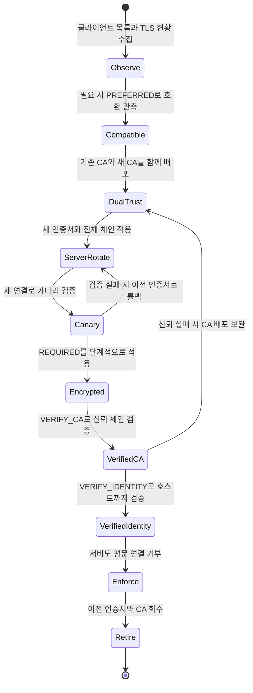

DBMS 인증서 교체에서 어려운 점은 새 인증서를 서버에 넣는 작업 자체가 아니다. 실제 위험은 **서로 다른 드라이버와 설정을 사용하는 기존·신규 클라이언트가 동시에 접속하는 전환 구간**에 있다.

서버부터 새 CA로 바꾸면 아직 새 CA를 모르는 클라이언트가 끊긴다. 반대로 클라이언트에 강한 검증을 한 번에 강제하면 평문 연결 중인 레거시 애플리케이션, CA 파일이 없는 배치, 인증서의 SAN과 다른 주소로 접속하는 모니터링 도구가 동시에 장애를 일으킬 수 있다. 그래서 인증서 교체는 파일 교체가 아니라 **호환성 확인 → 신뢰 배포 → 서버 교체 → 클라이언트 검증 강화 → 이전 신뢰 회수** 순서의 마이그레이션으로 다뤄야 한다.

이 글에서는 관용적으로 SSL이라는 이름을 쓰지만, 실제 보호 프로토콜은 TLS다.

## 먼저 구분할 것: 암호화와 신원 검증

MySQL 8.x 클라이언트의 `--ssl-mode`는 다음과 같이 강해진다.

| 모드 | TLS 사용 | CA 검증 | 호스트 이름 검증 | 실패 시 동작 |
|---|---:|---:|---:|---|
| `DISABLED` | 아니요 | 아니요 | 아니요 | 평문으로만 연결 |
| `PREFERRED` | 가능하면 | 아니요 | 아니요 | TLS를 먼저 시도하고 불가능하면 평문으로 폴백 |
| `REQUIRED` | 필수 | 아니요 | 아니요 | TLS를 만들 수 없으면 실패 |
| `VERIFY_CA` | 필수 | 예 | 아니요 | 신뢰한 CA로 체인을 검증하지 못하면 실패 |
| `VERIFY_IDENTITY` | 필수 | 예 | 예 | CA 검증 또는 접속 호스트와 인증서 신원이 다르면 실패 |

핵심은 `PREFERRED`가 **인증서를 검증하는 중간 모드가 아니라는 점**이다. 암호화에 성공해도 접속한 서버가 진짜 DB 서버인지 확인하지 않으며, TLS 협상이 불가능하면 평문으로 내려갈 수 있다. 능동적 공격자가 이 폴백을 유도할 가능성도 있으므로 `PREFERRED`는 레거시 호환성과 실제 접속 현황을 파악하기 위한 한시적 단계일 뿐, 운영의 최종 상태가 될 수 없다.

`REQUIRED`도 통신을 암호화할 뿐 서버 신원을 인증하지 않는다. 가능한 최종 목표는 `VERIFY_IDENTITY`이며, 사정상 호스트 이름을 검증할 수 없는 동안만 `VERIFY_CA`를 제한적으로 사용한다.

## 왜 바로 `VERIFY_IDENTITY`로 바꾸면 장애가 나는가

강한 검증은 잘못된 상태를 숨기지 않고 연결 실패로 바꾼다. 보안상 올바른 동작이지만 다음 준비가 끝나지 않았다면 곧바로 가용성 문제가 된다.

- 일부 클라이언트에 새 CA 또는 중간 인증서가 없다.
- `db.internal.example` 인증서로 `10.0.12.34`, `localhost`, 프록시의 별칭에 접속한다.
- 인증서 SAN에 실제 접속 DNS 이름이나 IP 주소가 없다.
- 오래된 드라이버가 서버와 공통 TLS 버전·암호군을 협상하지 못한다.
- 장기 연결 풀은 정상처럼 보이지만, 재시작 후 새 연결부터 실패한다.
- 복제, 백업, CDC, 모니터링처럼 애플리케이션 밖의 클라이언트를 목록에서 빠뜨렸다.

따라서 무중단의 의미는 실패를 허용하는 것이 아니라, **실패 조건을 작은 카나리에서 먼저 드러낸 뒤 전체 트래픽에 적용하는 것**이다.

## 무중단 전환 순서

아래 상태 다이어그램은 호환 모드에서 시작해 신뢰 체인을 겹쳐 배포하고, 새 인증서 적용과 검증 강화를 거쳐 이전 CA를 회수하는 흐름을 보여준다.



> `PREFERRED`, `REQUIRED`, `VERIFY_CA`는 영구 상태가 아니라 문제를 TLS 협상·CA 신뢰·호스트 이름 검증 단계로 나눠 찾기 위한 전환 지점이다.

### 1. 연결 주체와 현재 상태를 먼저 수집한다

애플리케이션만 세지 말고 다음 연결을 모두 인벤토리에 넣는다.

- API 서버와 워커의 모든 인스턴스
- 배치, ETL, CDC, 백업·복구 도구
- 모니터링, 관리 콘솔, 운영자 CLI
- 프록시와 서비스 메시
- 소스·레플리카, Group Replication 등 DB 간 연결

현재 세션이 TLS인지 클라이언트에서 확인한다. `Ssl_cipher` 값이 비어 있으면 해당 세션은 암호화되지 않았다.

```bash
mysql \
  --host=db.internal.example \
  --user=ops_probe \
  --password \
  --ssl-mode=PREFERRED \
  --execute="SHOW SESSION STATUS LIKE 'Ssl_cipher';"
```

비밀번호는 명령행 인수에 넣지 않고 프롬프트나 조직의 비밀 관리 체계를 사용한다. 연결 풀은 기존 세션을 계속 재사용하므로, 카나리 인스턴스에서 풀을 재생성해 **새 연결**도 반드시 시험한다.

서버에서는 인증서 유효 기간과 활성 TLS 컨텍스트를 확인할 수 있다.

```sql
SHOW GLOBAL STATUS LIKE 'Ssl_server_not_%';
SHOW GLOBAL VARIABLES LIKE 'tls_version';

-- performance_schema.tls_channel_status는 MySQL 8.0.21 이상
SELECT *
FROM performance_schema.tls_channel_status
WHERE CHANNEL = 'mysql_main';
```

MySQL 8.0.16~8.0.20처럼 `tls_channel_status`가 없는 버전에서는 `SHOW GLOBAL STATUS LIKE 'Current_tls_%'`와 `SHOW GLOBAL STATUS LIKE 'Ssl_server_not_%'`를 사용하고, 대상 버전에서 제공하는 status variable을 먼저 확인한다.

정상 연결률만 보지 말고 TLS 핸드셰이크 오류, DB 연결 풀 생성 실패, 인증 오류, 재시도 증가를 클라이언트·프록시·DB 로그에서 함께 기준선으로 잡는다.

### 2. 호환 구간에서는 암호화 가능 여부를 관측한다

이미 모든 클라이언트가 `VERIFY_IDENTITY`를 지원하고 올바른 CA를 갖고 있다면 이 단계를 생략할 수 있다. 그렇지 않다면 `PREFERRED`로 TLS 가능 여부를 확인하되, 기간과 종료 조건을 변경 계획에 명시한다.

이 단계에서 해야 할 일은 `PREFERRED`를 안전하다고 선언하는 것이 아니라 다음 예외를 없애는 것이다.

- `Ssl_cipher`가 빈 클라이언트의 드라이버와 연결 문자열 수정
- TLS 1.2 이상을 지원하지 못하는 드라이버 업그레이드
- IP나 임시 별칭 대신 인증서 SAN에 포함할 안정적인 DNS 이름 확정
- 누락된 배치·모니터링 계정 발견

평문이 관측되는 동안에는 네트워크 접근 제어를 더 엄격히 유지해야 한다. 이 호환 구간을 장기 운영 상태로 방치해서는 안 된다.

### 3. 새 CA를 서버 인증서보다 먼저 배포한다

CA가 바뀌는 교체라면 클라이언트 신뢰 번들에 **기존 CA와 새 CA를 동시에** 넣는다. 이중 신뢰 기간에는 기존 서버 인증서와 새 서버 인증서 어느 쪽도 검증할 수 있어 배포 순서 차이로 인한 장애를 막을 수 있다.

배포 후 모든 런타임이 실제 새 번들을 읽었는지 확인한다. 컨테이너 이미지에 CA를 복사해 두고 프로세스만 재시작하지 않거나, JVM·프록시·OS가 서로 다른 trust store를 보는 실수가 흔하다.

### 4. 새 인증서와 전체 체인을 검증한 뒤 서버에 적용한다

운영 반영 전에 최소한 다음을 확인한다.

```bash
# 유효 기간, 발급자, 주체, SAN 확인
openssl x509 \
  -in server-cert.pem \
  -noout \
  -dates \
  -issuer \
  -subject \
  -ext subjectAltName

# 30일(2,592,000초) 안에 만료하면 실패 코드 반환
openssl x509 -in server-cert.pem -noout -checkend 2592000

# 실제 접속 DNS 이름이 인증서와 일치하는지 확인
openssl x509 \
  -in server-cert.pem \
  -noout \
  -checkhost db.internal.example

# 루트와 중간 인증서로 서버 인증서 체인 검증
openssl verify \
  -purpose sslserver \
  -CAfile root-ca.pem \
  -untrusted intermediate.pem \
  server-cert.pem
```

서버는 leaf 인증서뿐 아니라 클라이언트가 루트까지 체인을 구성하는 데 필요한 중간 인증서도 제공해야 한다. 단, 루트 CA 자체는 일반적으로 서버가 보내는 체인에 넣지 않고 클라이언트의 신뢰 저장소에 둔다.

MySQL 8.0.16 이상에서는 파일과 설정을 준비한 뒤 서버 재시작 없이 TLS 컨텍스트를 다시 읽을 수 있다.

```sql
ALTER INSTANCE RELOAD TLS;
```

새 컨텍스트는 이후 생성되는 연결에 적용되고 기존 연결은 영향을 받지 않는다. 또한 기본 `RELOAD TLS`는 새 컨텍스트를 만들지 못하면 오류를 반환하고 이전 컨텍스트를 유지한다. 운영에서는 실패 시 새 연결의 암호화를 꺼버릴 수 있는 `NO ROLLBACK ON ERROR`를 사용하지 않는다.

`ALTER INSTANCE RELOAD TLS`는 복제되지 않으며 인스턴스 로컬 작업이다. 모든 노드에 각각 인증서 파일을 배포하고 실행해야 한다. MySQL 공식 문서에 따르면 main 인터페이스의 reload가 Group Replication이나 X Plugin의 TLS 컨텍스트까지 자동 갱신하는 것도 아니므로, 사용하는 구성요소별 교체 절차를 별도로 확인해야 한다.

### 5. 새 연결을 카나리로 검증한다

실제 서비스와 같은 DNS 이름, 네트워크 경로, 드라이버 버전으로 새 연결을 만든다.

```bash
mysql \
  --host=db.internal.example \
  --user=ops_probe \
  --password \
  --ssl-mode=VERIFY_IDENTITY \
  --ssl-ca=/etc/db-certs/ca-bundle.pem \
  --tls-version=TLSv1.2,TLSv1.3 \
  --execute="SHOW SESSION STATUS LIKE 'Ssl_cipher'; SELECT 1;"
```

인증서 파일 검사만 통과했다고 끝내면 안 된다. 로드 밸런서나 프록시가 다른 인증서를 종료할 수 있으므로 원격 핸드셰이크도 검사한다. OpenSSL 3.x의 `s_client`는 MySQL의 TLS 전환 메시지를 이해하는 `-starttls mysql`을 지원한다.

```bash
openssl s_client \
  -starttls mysql \
  -connect db.internal.example:3306 \
  -servername db.internal.example \
  -showcerts \
  -verifyCAfile /etc/db-certs/ca-bundle.pem \
  -verify_hostname db.internal.example \
  -verify_return_error </dev/null
```

`s_client`는 기본적으로 검증 오류가 있어도 진단을 계속할 수 있으므로 성공 판정에는 `-verify_return_error`를 넣는다. `-showcerts`는 서버가 전송한 인증서 목록을 보여줄 뿐, 그 자체가 체인 검증 성공을 뜻하지 않는다.

### 6. 클라이언트 검증을 단계적으로 강화한다

롤아웃 단위를 인스턴스나 트래픽 비율로 잘게 나눠 다음 순서로 진행한다.

1. `REQUIRED`: 모든 클라이언트가 TLS를 협상할 수 있는지 확인한다.
2. `VERIFY_CA`: 새 trust store로 서버 체인을 검증한다.
3. `VERIFY_IDENTITY`: 실제 접속 이름과 SAN까지 검증한다.

각 단계에서 새 연결 성공률과 오류를 관측하고 연결 풀을 의도적으로 재생성한다. 새 배포만 성공하고 오래된 인스턴스가 실패한다면 인증서 교체 문제가 아니라 런타임·trust store 배포 편차일 가능성이 높다.

모든 클라이언트가 최소 `REQUIRED` 이상임을 확인한 다음 서버에서도 평문 TCP 연결을 거부한다.

```sql
SET PERSIST require_secure_transport = ON;
```

최종적으로는 클라이언트를 `VERIFY_IDENTITY`에 고정하고, 정책 검사나 설정 스캔으로 `PREFERRED` 회귀를 막는다.

### 7. 이전 인증서와 CA는 마지막에 회수한다

다음 조건을 모두 만족한 뒤 이전 CA를 trust store에서 제거한다.

- 모든 DB 노드가 새 인증서와 전체 체인을 제공한다.
- 장기 실행 클라이언트를 포함해 모두 새 CA 번들을 읽었다.
- 연결 풀을 한 차례 이상 재생성한 뒤에도 검증 오류가 없다.
- 복제, 백업, CDC, 모니터링 연결도 새 체인으로 재접속했다.
- 롤백 관찰 기간이 끝났고 이전 CA로 서명된 다른 서비스 인증서가 없다.

CA는 여러 서비스가 공유할 수 있다. DB 교체가 끝났다는 이유만으로 공용 이전 CA를 삭제하면 다른 서비스가 끊길 수 있으므로 신뢰 저장소의 사용 범위를 먼저 조사해야 한다.

## 증상별 진단법

| 증상 또는 메시지 | 우선 확인할 원인 | 확인 방법 |
|---|---|---|
| `certificate has expired` | 서버 또는 중간 인증서 만료 | `openssl x509 -dates`, `-checkend`, MySQL `Ssl_server_not_after` |
| `certificate is not yet valid` | 인증서 `notBefore`, 클라이언트·서버 시간 오차 | `openssl x509 -dates`, `date -u`, NTP 동기화 상태 |
| hostname mismatch | 접속 DNS/IP가 SAN에 없음 | `openssl x509 -ext subjectAltName`, `-checkhost` 또는 `-checkip` |
| `unable to get local issuer certificate` | 중간 인증서 누락 또는 잘못된 체인 | `s_client -showcerts`, `openssl verify -untrusted` |
| unknown CA / self-signed chain | 클라이언트 trust store에 올바른 루트가 없음 | 실제 프로세스가 읽는 CA 경로와 fingerprint 확인 |
| protocol version / no shared cipher | 서버·클라이언트의 TLS 버전 또는 암호군 교집합 없음 | MySQL `tls_version`, `s_client -tls1_2`·`-tls1_3`로 분리 시험 |
| reload 실패 | 인증서·키 불일치, 파일 권한, PEM 형식 오류 | MySQL 오류 로그와 `ALTER INSTANCE RELOAD TLS` 결과 확인 |
| 기존 세션 정상, 재시작 후 실패 | 새 TLS 컨텍스트나 CA가 새 연결에서만 문제 | 카나리의 연결 풀 재생성 후 재시험 |

호스트 이름 검증에서는 “인증서가 맞는데 왜 실패하지?”보다 **클라이언트가 어떤 문자열로 접속했는지**를 먼저 본다. 인증서 SAN이 `db.internal.example`이라면 같은 서버를 가리키더라도 IP 주소 `10.0.12.34`로 접속한 `VERIFY_IDENTITY` 연결은 실패하는 것이 정상이다.

TLS 버전 문제는 조건을 하나씩 고정해 분리한다.

```bash
# TLS 1.2 경로만 시험
openssl s_client \
  -starttls mysql \
  -connect db.internal.example:3306 \
  -tls1_2 \
  -brief </dev/null

# TLS 1.3 경로만 시험
openssl s_client \
  -starttls mysql \
  -connect db.internal.example:3306 \
  -tls1_3 \
  -brief </dev/null
```

MySQL 8.0.28 이상은 TLS 1.0과 1.1을 지원하지 않는다. 오래된 클라이언트가 그 버전만 지원한다면 인증서보다 먼저 드라이버를 교체해야 한다.

## PostgreSQL `sslmode`와 짧게 비교

PostgreSQL libpq의 이름은 소문자와 하이픈을 사용하며 MySQL과 완전히 같지 않다.

| PostgreSQL libpq | 대략 대응하는 MySQL | 차이 |
|---|---|---|
| `disable` | `DISABLED` | 비 TLS만 시도 |
| `allow` | 직접 대응 없음 | 비 TLS를 먼저 시도하고 실패하면 TLS 시도 |
| `prefer` | `PREFERRED` | TLS를 먼저 시도하고 실패하면 비 TLS 시도 |
| `require` | `REQUIRED` | TLS만 시도. 단 libpq는 root CA 파일이 있으면 하위 호환성 때문에 `verify-ca`처럼 검증할 수 있음 |
| `verify-ca` | `VERIFY_CA` | TLS와 CA 체인 검증 |
| `verify-full` | `VERIFY_IDENTITY` | TLS, CA 체인, 요청한 서버 호스트 이름까지 검증 |

특히 PostgreSQL의 `require`는 root CA 파일 존재 여부에 따라 검증 동작이 달라질 수 있으므로 MySQL의 `REQUIRED`와 완전히 동일하다고 가정하면 안 된다. PostgreSQL에서도 `prefer`는 최종 보안 상태가 아니며, 일반적인 목표는 `verify-full`이다. 사용하는 드라이버가 libpq가 아니라면 같은 이름이라도 세부 동작과 기본값을 해당 드라이버 공식 문서에서 다시 확인한다.

## 롤백 원칙

롤백도 배포 전에 실행 가능한 절차로 준비한다.

- **새 TLS 컨텍스트 생성 실패**: 기본 `ALTER INSTANCE RELOAD TLS`가 이전 컨텍스트를 유지하는지 확인하고 오류를 수정한다. `NO ROLLBACK ON ERROR`는 사용하지 않는다.
- **새 인증서는 유효하지만 클라이언트가 실패**: 보관한 이전 인증서 세트로 되돌린 뒤 다시 `ALTER INSTANCE RELOAD TLS`를 실행한다. 이전 파일은 접근 통제된 위치에 롤백 기간 동안만 보관한다.
- **CA 신뢰 실패**: 이중 CA 번들을 유지한 채 누락된 런타임에 새 CA를 재배포한다. 서버를 새 CA로 바꾼 뒤 이전 CA를 성급히 삭제하지 않는다.
- **클라이언트 검증 강화 실패**: 실패 범위만 직전 모드로 되돌리고 원인을 수정한다. `PREFERRED`로의 후퇴는 평문·downgrade 위험이 되살아나는 보안 완화이므로 승인과 종료 시각을 남긴다.
- **서버의 평문 차단 후 실패**: 누락된 클라이언트를 먼저 고친다. 불가피하게 `require_secure_transport`를 되돌려야 한다면 보안 위험 승인, 네트워크 통제, 재적용 시각을 함께 기록한다.

기존 장기 세션은 인증서 reload의 영향을 받지 않기 때문에 롤백 판단을 왜곡할 수 있다. 변경 전후 모두 새 연결 카나리를 따로 운영해야 한다.

## 작업 체크리스트

### 변경 전

- [ ] 인증서 만료 30일·14일·7일 알림이 동작한다.
- [ ] 애플리케이션 외 배치, 복제, 백업, CDC, 모니터링을 포함한 연결 주체 목록이 있다.
- [ ] 실제 접속 DNS/IP가 새 인증서 SAN에 포함되어 있다.
- [ ] 서버 인증서, 중간 인증서, 루트 CA의 체인을 오프라인에서 검증했다.
- [ ] 새 CA를 기존 CA와 함께 모든 trust store에 먼저 배포했다.
- [ ] TLS 버전과 암호군의 서버·클라이언트 교집합을 확인했다.
- [ ] 이전 인증서 세트와 설정을 접근 통제된 위치에 보관했고 롤백 담당자가 정해졌다.

### 변경 중

- [ ] 한 노드 또는 카나리 경로부터 인증서를 교체했다.
- [ ] `ALTER INSTANCE RELOAD TLS`가 성공했고 활성 컨텍스트를 확인했다.
- [ ] 기존 세션이 아니라 새 연결로 `VERIFY_IDENTITY`를 시험했다.
- [ ] DB 연결 오류, TLS 오류, 연결 풀 재시도, 지연 시간을 관측했다.
- [ ] `REQUIRED` → `VERIFY_CA` → `VERIFY_IDENTITY`를 작은 단위로 확대했다.

### 변경 후

- [ ] 모든 클라이언트가 최소 TLS 필수, 최종적으로 신원 검증 모드다.
- [ ] `require_secure_transport=ON`으로 평문 TCP 연결을 거부한다.
- [ ] 장기 연결 풀과 운영 도구도 재접속 검증했다.
- [ ] 관찰 기간 후 이전 인증서와 CA를 안전하게 회수했다.
- [ ] 다음 만료일, 담당자, 자동 갱신·실패 알림을 갱신했다.

## 참고 자료

- [MySQL 8.0: Configuring MySQL to Use Encrypted Connections](https://dev.mysql.com/doc/refman/8.0/en/using-encrypted-connections.html)
- [MySQL 8.0: Command Options for Connecting to the Server](https://dev.mysql.com/doc/refman/8.0/en/connection-options.html)
- [MySQL 8.0: Encrypted Connection TLS Protocols and Ciphers](https://dev.mysql.com/doc/refman/8.0/en/encrypted-connection-protocols-ciphers.html)
- [MySQL 8.0: ALTER INSTANCE Statement](https://dev.mysql.com/doc/refman/8.0/en/alter-instance.html)
- [PostgreSQL: Database Connection Control Functions (`sslmode`)](https://www.postgresql.org/docs/current/libpq-connect.html)
- [PostgreSQL: SSL Support in libpq](https://www.postgresql.org/docs/current/libpq-ssl.html)
- [OpenSSL: `s_client`](https://docs.openssl.org/3.0/man1/openssl-s_client/)
- [OpenSSL: `x509`](https://docs.openssl.org/3.0/man1/openssl-x509/)
- [OpenSSL: `verify`](https://docs.openssl.org/3.0/man1/openssl-verify/)
