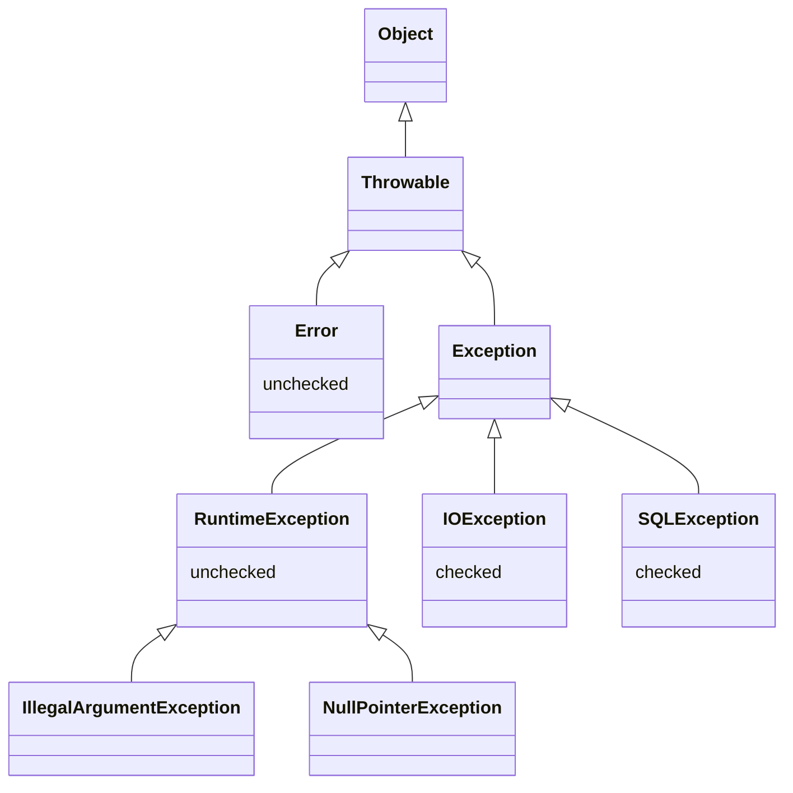
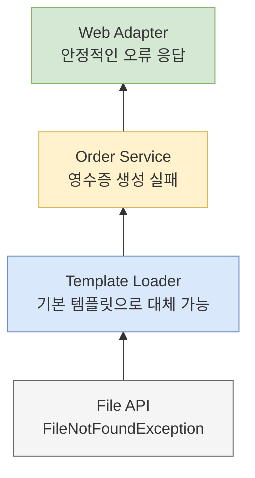
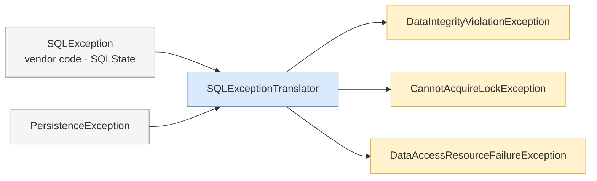

Java 코드를 처음 배울 때 Checked Exception은 대개 문법으로 등장한다.

```java
String read(Path path) throws IOException {
    return Files.readString(path);
}
```

`IOException`을 직접 처리하지 않으면 메서드에 `throws`를 선언해야 한다. 이 메서드를 호출하는 메서드도 다시 처리하거나 선언해야 한다. 반면 `IllegalArgumentException`은 선언하지 않아도 컴파일된다.

이 차이를 “Checked는 예상 가능한 예외, Runtime은 예상하지 못한 예외”라고 외우면 곧 모순을 만난다. 중복 이메일이나 재고 부족은 충분히 예상 가능하지만 많은 Spring 애플리케이션이 RuntimeException으로 표현한다. DB 연결 실패는 예상할 수 있지만 요청 처리 코드가 그 자리에서 복구하기는 어렵다.

Checked/Unchecked가 처음 답하려던 질문은 발생 가능성을 예측할 수 있느냐가 아니다.

> **메서드의 호출자가 이 실패를 공개 계약의 일부로 알아야 하며, 지금 위치에서 처리하도록 컴파일러가 강제해야 하는가?**

## `Throwable` 계층보다 중요한 컴파일러 계약

Java의 예외 계층은 다음처럼 나뉜다.



`Throwable` 중 `RuntimeException`과 `Error`의 하위 타입은 unchecked다. 그 밖의 `Exception` 하위 타입은 checked다. 여기서 checked라는 말은 예외의 심각도가 아니라 컴파일러가 적용하는 **catch or specify requirement**를 뜻한다.

Checked Exception을 던질 수 있는 코드는 다음 중 하나를 선택해야 한다.

```java
// 현재 메서드에서 처리한다.
String load(Path path) {
    try {
        return Files.readString(path);
    } catch (IOException e) {
        return "default";
    }
}

// 호출자에게 계약으로 공개한다.
String load(Path path) throws IOException {
    return Files.readString(path);
}
```

Unchecked Exception은 잡을 수도 있고 선언할 수도 있지만 언어가 강제하지 않는다.

## Java가 Checked Exception으로 얻으려던 것

Oracle의 Java Tutorial은 메서드가 던질 수 있는 Checked Exception을 parameter와 return value처럼 **public programming interface의 일부**로 설명한다. 호출자는 가능한 실패를 알아야 무엇을 할지 결정할 수 있다는 것이다.

예를 들어 파일 복사를 요청하는 라이브러리를 생각해 보자.

```java
void copy(Path source, Path target)
        throws NoSuchFileException, AccessDeniedException, IOException;
```

호출자는 타입을 보고 서로 다른 결정을 내릴 수 있다.

- 원본 파일이 없으면 사용자에게 경로를 다시 선택하게 한다.
- 권한이 없으면 관리자 승인을 안내한다.
- 일시적인 I/O 실패라면 제한적으로 다시 시도한다.
- 그 밖의 실패는 현재 작업을 중단한다.

이런 API에서 실패를 `boolean`이나 `null`로 숨기는 것보다 구체적인 예외를 계약에 포함하는 편이 정보가 많다. 컴파일러는 호출자가 그 정보를 조용히 잊어버리지 못하게 한다.

Oracle이 제시한 요약도 “예상 가능한 비즈니스 예외”가 아니라 다음 기준에 가깝다.

- API client가 합리적으로 복구할 수 있다면 Checked Exception을 고려한다.
- 호출자가 복구할 방법이 없다면 Unchecked Exception을 고려한다.

여기서 주어는 예외를 발생시킨 코드가 아니라 **API client**다. 복구 가능성은 예외 타입의 영구적인 속성이 아니라 호출 위치와 추상화 수준에 따라 달라진다.

## 복구 가능성은 계층을 올라가며 달라진다

같은 `FileNotFoundException`도 문맥에 따라 의미가 다르다.



템플릿 로더는 요청한 파일이 없을 때 기본 템플릿을 선택할 수 있다. 이 계층에는 실제 복구 전략이 있다. 하지만 주문 service까지 `FileNotFoundException`이 올라오면 “영수증 생성에 필요한 내부 파일 경로가 없음”이라는 구현 세부만 노출한다. service가 다른 경로를 추측해서 복구할 수도 없다.

이 경계에서는 의미를 번역하는 편이 낫다.

```java
final class ReceiptGenerationException extends RuntimeException {
    ReceiptGenerationException(String orderId, Throwable cause) {
        super("영수증을 생성하지 못했습니다. orderId=" + orderId, cause);
    }
}

Receipt generate(String orderId) {
    try {
        return templateEngine.render(orderId);
    } catch (IOException e) {
        throw new ReceiptGenerationException(orderId, e);
    }
}
```

상위 계층에는 업무 문맥을 전달하고, 원래 `IOException`은 `cause`로 보존한다. unchecked로 번역한 이유는 실패를 숨기기 위해서가 아니라, 현재 호출자에게 의미 없는 하위 타입의 처리를 강제하지 않기 위해서다.

## `throws`가 전파될 때 생기는 비용

Checked Exception의 장점은 호출자가 놓치지 못한다는 것이다. 같은 강제가 계층이 깊은 애플리케이션에서는 비용이 된다.

```java
String serialize(Order order) throws JsonProcessingException;

Message createMessage(Order order) throws JsonProcessingException;

void publishOrder(Order order) throws JsonProcessingException;

void completeOrder(Order order) throws JsonProcessingException;
```

가장 아래 serialization 라이브러리의 예외가 application service의 공개 signature까지 전파됐다. JSON 대신 Avro를 쓰면 상위 메서드의 signature도 바뀔 수 있다. 네 메서드 중 어느 호출자도 JSON 문자열을 고치거나 serialization을 복구할 수 없다면 `throws`는 유용한 선택을 요구하지 않고 구현 의존성만 노출한다.

결국 다음과 같은 코드가 늘어난다.

```java
try {
    publisher.publish(order);
} catch (JsonProcessingException e) {
    throw new RuntimeException(e);
}
```

이 코드는 컴파일 오류를 제거하지만 실패의 의미를 더하지 않는다. 더 나쁜 경우에는 `log.error`만 남기고 정상 흐름을 계속해 부분 성공을 만든다. Checked Exception 자체가 문제라기보다 **복구할 수 없는 모든 중간 호출자에게 동일한 처리를 반복해서 강제한 것**이 문제다.

## Spring이 선택한 unchecked 예외 번역

JDBC의 `SQLException`은 Checked Exception이다.

```java
List<Member> findAll() throws SQLException;
```

하지만 service가 SQL state, vendor error code, JDBC driver 타입을 직접 알아야 할까? 대부분의 경우 service가 원하는 정보는 더 높은 수준에 있다.

- 데이터 무결성 제약을 위반했는가?
- 락을 얻지 못했거나 transaction이 충돌했는가?
- 일시적인 resource 장애인가?
- 현재 작업을 다시 시도해도 되는가?

Spring은 기술별 예외를 unchecked `DataAccessException` 계층으로 번역한다.



이 선택에는 두 가지 목적이 함께 있다.

1. persistence 기술의 구체적인 예외를 일관된 추상화로 바꾼다.
2. 실제로 처리할 계층만 필요한 subtype을 잡고, 나머지 계층은 boilerplate 없이 전파하게 한다.

```java
try {
    orderRepository.save(order);
} catch (DataIntegrityViolationException e) {
    throw new DuplicateOrderException(order.number(), e);
}
```

unchecked는 “잡지 말라”는 뜻이 아니다. **잡을 수 있지만 모든 호출자에게 잡는 척을 강제하지 않는다**는 뜻이다. Spring의 `TransientDataAccessException`, `RecoverableDataAccessException`처럼 RuntimeException 계층 안에서도 복구와 재시도 가능성을 더 구체적으로 표현할 수 있다. 따라서 Checked=복구 가능, Unchecked=복구 불가능이라는 등식도 성립하지 않는다.

## Rod Johnson의 반론을 어떻게 읽어야 하는가

초기 Spring 문서와 `DataAccessException` 설계에는 Rod Johnson이 『Expert One-on-One J2EE Design and Development』에서 전개한 문제의식이 반영돼 있다. 핵심은 모든 business failure를 무조건 RuntimeException으로 만들자는 구호라기보다 다음에 가깝다.

- 복구할 수 없는 중간 계층에 catch/rethrow를 강제하지 않는다.
- 특정 data access 기술의 예외가 service 계약을 지배하지 않게 한다.
- 원래 cause와 stack trace는 보존한다.
- 필요한 호출자는 여전히 구체적인 RuntimeException subtype을 잡을 수 있다.

이는 Java의 원래 목적을 완전히 부정한다기보다 **컴파일러의 강제가 대규모 계층형 애플리케이션에서 실제 복구로 이어졌는가**에 대한 반론이다.

두 입장에는 각각 실패 방식이 있다.

| 선택 | 얻는 것 | 잘못 사용했을 때 |
|---|---|---|
| Checked Exception | 가능한 실패가 signature에 드러나고 처리를 잊기 어렵다 | `throws Exception` 전파, 하위 구현 누수, 의미 없는 catch/rethrow |
| RuntimeException | 중간 계층의 boilerplate를 줄이고 경계에서 선택적으로 처리한다 | 문서와 타입을 소홀히 하면 가능한 실패가 숨고 예상 가능한 오류까지 하나의 예외로 뭉친다 |

따라서 “현대 Java에서는 Checked를 쓰지 않는다”도 지나치게 강한 결론이다. 라이브러리 경계가 작고 호출자가 실제 대안을 선택해야 하며 signature가 안정적인 경우 Checked는 여전히 의미가 있다. 반대로 호출자가 복구하지 못하거나 하위 구현을 노출하는 경우에는 구체적인 unchecked 예외 번역이 더 자연스럽다.

## 다른 언어는 다른 비용을 선택했다

### Kotlin: Java 생태계 위에서 checked 강제를 제거한다

Kotlin은 Java의 예외 타입을 사용할 수 있지만 Checked Exception 처리를 컴파일러가 강제하지 않는다. Java 메서드의 `throws IOException`을 호출해도 Kotlin 호출자는 반드시 `try-catch`를 쓰거나 다시 선언할 필요가 없다.

이 선택은 boilerplate를 줄이는 대신 가능한 실패를 타입 signature에서 자동으로 확인하는 기능을 포기한다. 같은 JVM과 같은 `IOException`을 사용해도 언어가 호출자에게 부과하는 계약은 다르다.

### Go: 예외가 아니라 값으로 전달한다

Go의 일반적인 실패는 여러 반환값 중 `error`로 표현한다.

```go
data, err := os.ReadFile(path)
if err != nil {
    return fmt.Errorf("read config: %w", err)
}
```

호출자가 매번 `err`를 확인한다는 점은 Checked Exception과 닮았다. 그러나 Java처럼 가능한 exception type이 signature에 열거되지 않으며, 값을 무시할 수도 있다. 정상적인 오류 반환과 별도로 `panic`/`recover`도 존재한다.

비교에서 얻을 결론은 어느 언어가 옳다는 것이 아니다. **오류를 반드시 눈에 보이게 하는 비용, 정상 흐름과 분리하는 방식, 타입으로 표현하는 정밀도 사이에서 각 언어가 다른 선택을 했다**는 점이다.

## Checked와 Unchecked를 선택하는 기준

새 예외를 만들기 전에 다음 순서로 판단한다.

1. **호출자가 복구할 수 있는가?** 단순히 로그를 남기고 다시 던지는 것은 복구가 아니다.
2. **호출자가 지금 계층에서 복구해야 하는가?** 더 낮거나 높은 경계가 의미를 더 잘 이해할 수 있다.
3. **예외 타입이 공개 API의 안정적인 일부인가?** 구현 기술을 바꿔도 유지할 계약이어야 한다.
4. **컴파일러 강제가 실제 선택을 요구하는가?** 모든 호출자가 똑같이 다시 던진다면 강제의 가치가 작다.
5. **unchecked로 만들더라도 구체적인 의미가 있는가?** `RuntimeException` 하나로 감싸지 말고 실패 의미와 cause를 보존한다.

애플리케이션의 기본값으로는 다음 규칙이 실용적이다.

- domain/application failure는 구체적인 unchecked 타입으로 표현한다.
- infrastructure exception은 해당 기술을 이해하는 adapter에서 번역한다.
- caller가 실제로 대안을 선택해야 하는 좁고 안정적인 API에는 Checked Exception을 사용할 수 있다.
- 문법적 분류와 별개로 Javadoc, API 문서, 테스트에 가능한 실패와 처리 정책을 남긴다.

이 규칙은 아직 transaction이 commit돼야 하는지 알려 주지 않는다. 그것은 다음 편의 질문이다.

## 다음 글

[Spring은 왜 Checked Exception을 롤백하지 않는가?](/blog/exception-02-spring-transaction-rollback)에서는 Spring이 Checked Exception을 예상된 business outcome으로 해석한 배경과 transaction interceptor의 실제 판단 시점을 살펴본다. `rollbackFor`, 예외를 catch한 경우, rollback-only와 `UnexpectedRollbackException`, Spring 6.2의 `ALL_EXCEPTIONS`를 하나의 실행 흐름으로 연결한다.

## 참고 자료

- [Java Language Specification §11: Exceptions](https://docs.oracle.com/javase/specs/jls/se26/html/jls-11.html)
- [Oracle Java Tutorials — The Catch or Specify Requirement](https://docs.oracle.com/javase/tutorial/essential/exceptions/catchOrDeclare.html)
- [Oracle Java Tutorials — Unchecked Exceptions: The Controversy](https://docs.oracle.com/javase/tutorial/essential/exceptions/runtime.html)
- [Spring Framework — DAO Support](https://docs.spring.io/spring-framework/reference/data-access/dao.html)
- [Spring Framework — `DataAccessException`](https://docs.spring.io/spring-framework/docs/current/javadoc-api/org/springframework/dao/DataAccessException.html)
- [Kotlin Documentation — Exceptions](https://kotlinlang.org/docs/exceptions.html)
- [Go Blog — Error handling and Go](https://go.dev/blog/error-handling-and-go)
- [Go Blog — Defer, Panic, and Recover](https://go.dev/blog/defer-panic-and-recover)
