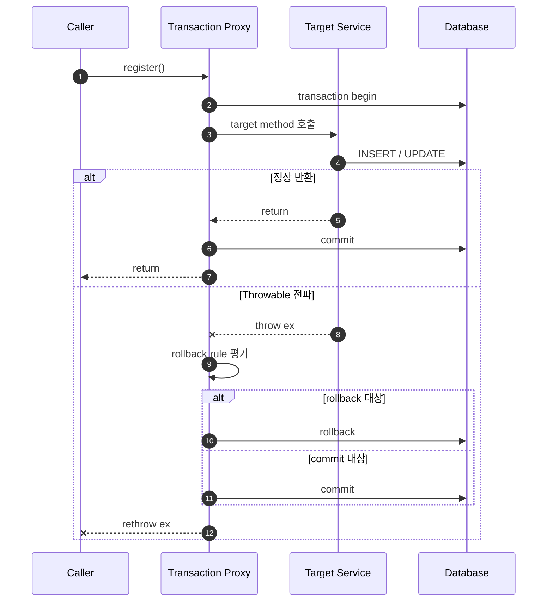
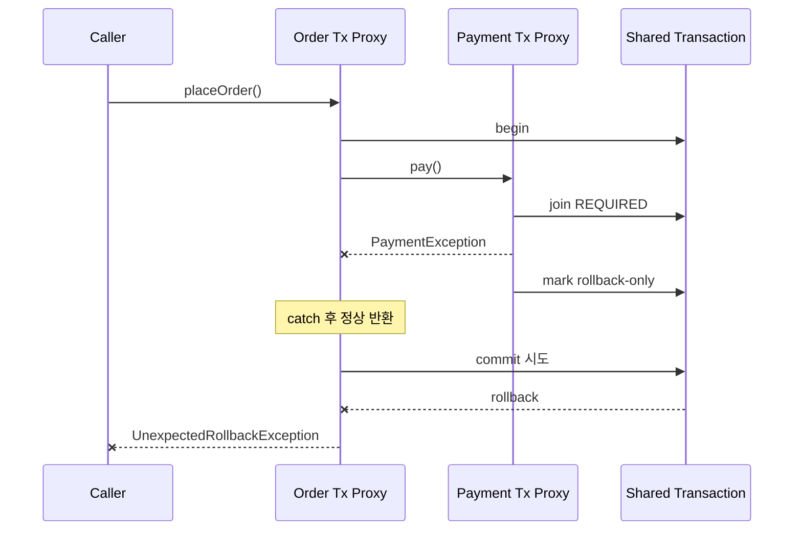

다음 service method는 회원을 저장한 뒤 항상 실패한다.

```java
@Transactional
public void register(Member member) throws IOException {
    memberRepository.save(member);
    throw new IOException("프로필 파일을 저장하지 못했습니다.");
}
```

호출자는 회원 등록이 실패했다고 본다. 하지만 Spring의 전통적인 기본 설정에서는 `IOException`이 Checked Exception이므로 DB transaction은 rollback되지 않고 commit된다.

이를 “Spring은 Checked Exception을 심각하지 않게 본다”라고 설명하면 정확하지 않다. Spring의 기본 정책은 예외의 심각도를 측정하지 않는다. **Checked Exception을 의도적으로 선언된 business outcome으로 해석해 resource operation의 정상 완료를 허용하고, RuntimeException을 정상 완료할 수 없는 예상 밖 결과로 해석하는 규칙**이다.

이 규칙이 어디에서 적용되는지 알려면 `@Transactional` annotation보다 transaction interceptor의 실행 흐름을 먼저 봐야 한다.

## `@Transactional`은 메서드 안에서 동작하지 않는다

일반적인 proxy mode에서 호출자는 target object를 직접 호출하지 않고 Spring proxy를 거친다.



중요한 점은 target method가 끝난 뒤 proxy가 결과를 본다는 것이다.

- 정상적으로 반환하면 commit을 시도한다.
- 예외가 proxy까지 전파되면 해당 타입의 rollback rule을 평가한다.
- rollback 대상이면 rollback하고, 아니면 commit한 뒤 같은 예외를 다시 던진다.

따라서 “예외가 발생했다”만으로는 transaction 결과를 알 수 없다. **어떤 예외가 transaction 경계 밖으로 빠져나왔는가**를 봐야 한다.

## 전통적인 기본값: Runtime은 rollback, Checked는 commit

별도 규칙이 없을 때 Spring declarative transaction은 다음처럼 판단한다.

| 경계를 빠져나온 결과 | 기본 transaction 결과 |
|---|---|
| 정상 반환 | commit |
| `RuntimeException` 또는 하위 타입 | rollback |
| `Error` 또는 하위 타입 | rollback |
| 그 밖의 Checked Exception | commit |

Spring의 `DefaultTransactionAttribute`는 이 동작이 EJB 방식과 일치한다고 설명한다. unchecked exception은 business rule 밖에서 발생한 예상하지 못한 결과로 보고 rollback한다. 반대로 선언된 Checked Exception은 business method가 의도적으로 제공하는 **alternative return value**처럼 보고 resource operation의 정상 완료, 즉 commit을 허용한다.

예를 들어 다음 요구사항이라면 commit-on-checked-exception이 의도와 맞을 수 있다.

```java
@Transactional
public void requestLoan(LoanRequest request) throws LoanRejectedException {
    loanRequestRepository.save(request);

    ScreeningResult result = screening.evaluate(request);
    screeningHistoryRepository.save(result);

    if (result.rejected()) {
        throw new LoanRejectedException(result.reason());
    }
}
```

대출 승인은 거절됐지만 신청과 심사 이력은 보존해야 한다. `LoanRejectedException`을 Checked Exception으로 선언하고 기본 commit 정책을 사용하면 exception은 호출자에게 거절을 알리는 대체 결과가 된다.

하지만 이것이 모든 business exception에 적합한 것은 아니다.

```java
@Transactional
public void placeOrder(OrderCommand command) throws PaymentFailedException {
    orderRepository.save(Order.pending(command));
    stockRepository.decrease(command.productId(), command.quantity());
    paymentClient.pay(command.payment());
}
```

결제 실패 시 주문과 재고 변경이 남으면 안 된다는 불변식이라면 `PaymentFailedException`이 Checked인지 여부와 상관없이 rollback해야 한다. transaction의 완료 의미가 exception hierarchy의 역사적 기본값보다 우선한다.

## 시나리오 1: RuntimeException은 rollback된다

```java
@Transactional
public void createRuntimeFailure(String name) {
    memberRepository.save(new Member(name));
    throw new IllegalStateException("registration failed");
}
```

```java
@Test
void runtime_exception_rolls_back() {
    assertThatThrownBy(() -> service.createRuntimeFailure("runtime"))
        .isInstanceOf(IllegalStateException.class);

    assertThat(memberRepository.count()).isZero();
}
```

`IllegalStateException`이 proxy까지 전파되고 기본 rollback rule과 일치한다. INSERT가 실행됐더라도 transaction 전체가 rollback되므로 row는 남지 않는다.

## 시나리오 2: Checked Exception은 기본적으로 commit된다

```java
@Transactional
public void createCheckedFailure(String name) throws IOException {
    memberRepository.save(new Member(name));
    throw new IOException("file failed");
}
```

```java
@Test
void checked_exception_commits_by_default() {
    assertThatThrownBy(() -> service.createCheckedFailure("checked"))
        .isInstanceOf(IOException.class);

    assertThat(memberRepository.count()).isEqualTo(1);
}
```

메서드는 실패했지만 proxy는 `IOException`을 rollback 대상으로 판단하지 않는다. transaction을 commit한 뒤 예외를 호출자에게 다시 던진다. “예외가 던져졌는데 row가 남는” 어색함은 이 두 결과가 동시에 일어나기 때문에 생긴다.

## 시나리오 3: Checked Exception도 명시적으로 rollback할 수 있다

```java
@Transactional(rollbackFor = IOException.class)
public void createCheckedRollback(String name) throws IOException {
    memberRepository.save(new Member(name));
    throw new IOException("file failed");
}
```

```java
@Test
void rollback_for_rolls_back_checked_exception() {
    assertThatThrownBy(() -> service.createCheckedRollback("checked"))
        .isInstanceOf(IOException.class);

    assertThat(memberRepository.count()).isZero();
}
```

`rollbackFor = IOException.class`는 `IOException`과 그 하위 타입에 적용된다. 반대로 `noRollbackFor`는 기본적으로 rollback될 타입을 commit 대상으로 바꿀 수 있다.

```java
@Transactional(noRollbackFor = DuplicateRequestException.class)
public void recordDuplicateRequest(Request request) {
    auditRepository.save(Audit.duplicate(request));
    throw new DuplicateRequestException(request.id());
}
```

여기서 중요한 것은 annotation을 붙이는 기술보다 “예외 뒤에 어떤 변경을 남길 것인가”를 먼저 결정하는 것이다.

### 타입 규칙을 우선한다

Spring은 class type과 class name pattern을 모두 지원한다.

```java
@Transactional(rollbackFor = PaymentException.class)
```

```java
@Transactional(rollbackForClassName = "PaymentException")
```

가능하면 첫 번째처럼 타입 기반 규칙을 사용한다. type-safe하고 해당 타입과 하위 타입에 정확히 적용된다. 문자열 pattern은 wildcard가 아니라 fully qualified class name의 substring matching이므로 의도하지 않은 비슷한 이름까지 매칭될 수 있다. 특히 `"Exception"` 같은 넓은 pattern은 다른 규칙을 사실상 가릴 수 있다.

## 시나리오 4: 메서드 안에서 잡으면 proxy는 예외를 모른다

```java
@Transactional
public void catchAndContinue(String name) {
    memberRepository.save(new Member(name));

    try {
        profileRepository.saveRequiredProfile(name);
    } catch (RuntimeException e) {
        log.warn("profile creation failed: {}", name, e);
    }
}
```

target method가 `RuntimeException`을 잡고 정상 반환했다. proxy가 관찰한 결과는 exception이 아니라 정상 return이므로 commit한다.

```java
@Test
void caught_exception_does_not_trigger_rollback() {
    service.catchAndContinue("caught");

    assertThat(memberRepository.count()).isEqualTo(1);
}
```

이 동작은 Checked/Unchecked와 무관하다. 어떤 타입이든 transaction interceptor에 도달하지 않으면 exception-based rollback rule의 입력이 되지 않는다.

가능한 선택은 세 가지다.

1. 실패를 현재 transaction의 실패로 볼 경우 예외를 다시 던진다.
2. 의도적으로 부분 성공을 허용할 경우 잡고 정상 완료하되, 남는 상태를 명확히 설계한다.
3. 예외를 외부로 던질 수 없지만 rollback해야 한다면 programmatically rollback-only로 표시한다.

```java
catch (RuntimeException e) {
    TransactionAspectSupport.currentTransactionStatus().setRollbackOnly();
    return RegistrationResult.failed(e.getMessage());
}
```

세 번째 방법은 application code를 Spring transaction API에 결합하므로 예외 전파나 transaction 경계 재구성으로 해결할 수 없을 때 제한적으로 사용한다.

## 시나리오 5: 내부에서 rollback-only가 되면 외부 catch로 되돌릴 수 없다

같은 physical transaction에 참여하는 두 service를 보자.

```java
@Service
class PaymentService {

    @Transactional
    public void pay() {
        paymentRepository.save(new Payment());
        throw new PaymentException();
    }
}
```

```java
@Service
class OrderService {

    private final PaymentService paymentService;

    @Transactional
    public void placeOrder() {
        orderRepository.save(new Order());

        try {
            paymentService.pay();
        } catch (PaymentException e) {
            log.warn("payment failed", e);
        }
    }
}
```

기본 propagation인 `REQUIRED`에서는 두 메서드가 같은 physical transaction을 사용한다.

1. `PaymentService`의 proxy가 `PaymentException`을 보고 transaction을 rollback-only로 표시한다.
2. `OrderService`가 예외를 잡아 정상 반환한다.
3. 외부 transaction interceptor가 commit을 시도한다.
4. transaction은 이미 rollback-only이므로 실제로 rollback된다.
5. 호출자가 commit된 것으로 오해하지 않도록 `UnexpectedRollbackException`이 발생한다.



예외를 catch하면 Java의 제어 흐름은 회복할 수 있지만, 이미 transaction manager에 기록된 rollback-only 상태를 commit 가능 상태로 되돌리지는 못한다.

감사 로그처럼 실패해도 독립적으로 commit해야 할 데이터는 transaction 경계를 분리할 수 있다.

```java
@Transactional(propagation = Propagation.REQUIRES_NEW)
public void recordFailure(PaymentFailure failure) {
    auditRepository.save(failure);
}
```

다만 `REQUIRES_NEW`는 별도 physical transaction과 connection을 사용하고, 외부 transaction과 원자적으로 묶이지 않는다. “예외를 피하는 annotation”이 아니라 독립 commit이라는 요구가 있을 때만 선택한다.

## self-invocation이면 interceptor 자체를 지나지 않는다

proxy mode에서는 같은 객체 안에서 `this`를 통해 호출한 메서드는 proxy를 거치지 않는다.

```java
@Service
class OrderService {

    public void placeOrder() {
        this.saveOrder();
    }

    @Transactional
    public void saveOrder() {
        // proxy를 거치지 않은 내부 호출에서는 새 transaction advice가 적용되지 않는다.
    }
}
```

이 경우 rollback rule을 논하기 전에 transaction 경계가 실제로 만들어졌는지 확인해야 한다. transaction method를 별도 bean의 public method로 분리하거나, 필요하다면 AspectJ mode 같은 다른 interception 방식을 선택한다.

## Spring 6.2: 모든 Exception을 rollback하는 전역 선택

Spring 6.2부터 annotation-driven transaction의 전역 기본 rollback 동작을 바꿀 수 있다.

```java
import static org.springframework.transaction.annotation.RollbackOn.ALL_EXCEPTIONS;

@Configuration
@EnableTransactionManagement(rollbackOn = ALL_EXCEPTIONS)
class TransactionConfig {
}
```

이 설정은 별도 custom rule이 없는 Spring `@Transactional`과 JTA `@Transactional`에 Checked Exception을 포함한 모든 `Exception`을 rollback하는 기본 규칙을 적용한다. method별 `rollbackFor`와 `noRollbackFor`는 여전히 전역 기본값보다 우선한다.

Spring 문서는 EJB-style business exception의 commit 동작에 의존하지 않는다면 `ALL_EXCEPTIONS`로 전환해 일관된 rollback semantics를 사용하는 것을 권한다. Checked Exception을 강제하지 않는 Kotlin application에도 이 설정을 권한다. Kotlin에서는 같은 Java exception type이 선언 여부와 무관하게 전파될 수 있어 전통적인 Checked/Unchecked 구분을 transaction 정책으로 사용하는 의미가 더 약하기 때문이다.

Spring 6.2 이전에는 필요한 transaction boundary에 타입 기반 규칙을 명시할 수 있다.

```java
@Transactional(rollbackFor = Exception.class)
public void execute() throws Exception {
    // ...
}
```

여러 곳에서 같은 정책을 사용한다면 team convention과 composed annotation으로 중복을 줄일 수 있다. 다만 전역적으로 넓은 규칙을 적용하기 전에 의도적으로 commit하던 Checked business exception이 없는지 확인해야 한다.

## 어떤 기본값을 선택할 것인가

### `ALL_EXCEPTIONS`가 자연스러운 경우

- 예외로 종료된 application service method를 실패한 transaction으로 정의한다.
- domain/application exception을 주로 unchecked로 표현하고 Checked Exception을 business alternative return으로 사용하지 않는다.
- Kotlin처럼 Checked Exception 선언을 강제하지 않는 언어를 함께 사용한다.
- accidental checked exception 때문에 일부 변경만 commit되는 위험을 줄이고 싶다.

이 경우 Spring 6.2+에서는 `ALL_EXCEPTIONS`를 team default로 두고, commit이 필요한 구체적인 예외만 `noRollbackFor`로 드러내는 편이 일관적이다.

### 전통적인 기본값이 의미 있는 경우

- Checked Exception을 정상적으로 예상한 business outcome으로 사용한다.
- exception을 던져 호출 흐름은 중단하지만, transaction 안의 신청·거절·감사 기록은 commit해야 한다.
- 기존 EJB/JTA semantics와 호환해야 한다.

이 경우에도 “Checked라서 우연히 commit”에 기대지 말고 테스트와 문서로 의도를 고정한다. 중요한 commit-on-exception 정책은 `noRollbackFor`처럼 명시적으로 드러내는 것도 방법이다.

## rollback과 외부 부수 효과는 별개다

다음 코드는 DB transaction 안에서 외부 결제를 먼저 호출한다.

```java
@Transactional
public void placeOrder(Order order) {
    orderRepository.save(order);
    paymentClient.approve(order.payment());
    inventoryRepository.decrease(order.items());
}
```

재고 변경에서 RuntimeException이 발생하면 DB의 주문과 재고는 rollback될 수 있다. 이미 외부 payment server에서 승인된 결제는 함께 rollback되지 않는다. Spring transaction manager가 제어하는 resource 경계 밖에 있기 때문이다.

따라서 exception type과 rollback rule만으로 분산된 부수 효과를 해결할 수 없다.

- 결제 요청에는 idempotency key와 결과 조회가 필요하다.
- DB 변경과 event 발행에는 transactional outbox를 고려한다.
- 이미 완료된 외부 작업에는 명시적인 compensation과 reconciliation이 필요하다.
- timeout은 실패 확정이 아니라 결과 불명일 수 있다.

transaction rollback은 강력하지만 **해당 transaction manager가 소유한 resource의 상태 전이**에만 적용된다.

## 테스트로 고정할 최소 행렬

팀의 transaction 정책은 문서만이 아니라 integration test로 남긴다.

| 시나리오 | 기대 결과 |
|---|---|
| 정상 반환 | commit |
| uncaught RuntimeException | rollback |
| uncaught Checked Exception | 선택한 전역 기본값에 따라 commit 또는 rollback |
| 명시적 `rollbackFor`와 일치 | rollback |
| 명시적 `noRollbackFor`와 일치 | commit |
| transaction method 내부에서 catch 후 정상 반환 | commit 또는 명시적 rollback-only |
| 내부 참여 transaction이 rollback-only로 표시됨 | 전체 rollback과 `UnexpectedRollbackException` |
| `REQUIRES_NEW` 내부 transaction | 외부 transaction과 독립된 완료 여부 |

테스트에서는 SQL log에 INSERT가 보였는지가 아니라 transaction 종료 후 다른 transaction에서 row가 조회되는지를 검증한다. JPA test가 자동 rollback되는 환경이라면 application transaction의 결과를 가리지 않도록 test transaction 설정도 분리한다.

## 결론

Spring이 Checked Exception을 기본적으로 rollback하지 않는 이유는 Checked가 덜 심각해서가 아니다. 선언된 Checked Exception을 business method의 예상 가능한 대체 결과로 보고, 그 결과와 함께 resource operation을 정상 완료할 수 있다고 가정한 전통적 정책이다.

그러나 Java application의 예외 사용 방식은 달라졌다. Spring 자신도 persistence failure를 unchecked exception으로 번역하고, Kotlin은 checked 처리를 강제하지 않는다. Spring 6.2가 `ALL_EXCEPTIONS`를 전역 선택지로 제공하고 많은 application에 이를 권하는 변화는 transaction 정책을 exception hierarchy의 역사적 의미에서 분리하려는 흐름으로 읽을 수 있다.

실무에서 물어야 할 질문은 하나다.

> **이 예외가 transaction 경계 밖으로 나갈 때, 지금까지 바꾼 상태를 성공한 결과로 남겨도 되는가?**

답이 아니오라면 예외 타입과 무관하게 rollback 규칙을 명시한다. 답이 예라면 어떤 상태를 왜 남기는지 테스트와 문서로 고정한다.

## 다음 글

[예외 설계의 결론: 전파, 롤백, 응답을 분리하라](/blog/about-exception)에서는 예외 번역, transaction, HTTP 오류 응답, logging과 retry를 서로 다른 정책으로 설계한다. Checked/Unchecked 논쟁을 team convention과 code review checklist로 마무리한다.

## 참고 자료

- [Spring Framework — Rolling Back a Declarative Transaction](https://docs.spring.io/spring-framework/reference/data-access/transaction/declarative/rolling-back.html)
- [Spring Framework — `DefaultTransactionAttribute.rollbackOn`](https://docs.spring.io/spring-framework/docs/current/javadoc-api/org/springframework/transaction/interceptor/DefaultTransactionAttribute.html)
- [Spring Framework — `@Transactional`](https://docs.spring.io/spring-framework/docs/current/javadoc-api/org/springframework/transaction/annotation/Transactional.html)
- [Spring Framework — `@EnableTransactionManagement`](https://docs.spring.io/spring-framework/docs/current/javadoc-api/org/springframework/transaction/annotation/EnableTransactionManagement.html)
- [Spring Framework — Transaction Propagation](https://docs.spring.io/spring-framework/reference/data-access/transaction/declarative/tx-propagation.html)
- [Spring Framework — Understanding the Declarative Transaction Implementation](https://docs.spring.io/spring-framework/reference/data-access/transaction/declarative/tx-decl-explained.html)
