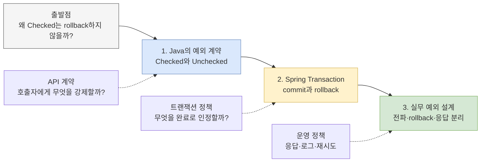

Spring에서 `@Transactional`이 붙은 메서드가 `RuntimeException`을 던지면 transaction은 rollback된다. 그런데 같은 메서드가 `IOException` 같은 Checked Exception을 던지면 기본 설정에서는 commit된다.

처음 이 동작을 만나면 어색하다. 메서드가 성공하지 못하고 예외로 끝났는데 왜 일부 예외만 rollback하는가? 더구나 Checked Exception은 호출자에게 처리를 강제하므로 더 엄격한 실패처럼 보이기도 한다.

이 질문은 두 개의 서로 다른 정책을 한 축으로 볼 때 생긴다.

> **Checked/Unchecked는 호출자에게 실패 처리를 강제할지 정하는 API 계약이고, rollback은 지금까지의 데이터 변경을 완료로 인정할지 정하는 트랜잭션 정책이다.**

Java와 Spring은 이 두 정책을 연결해 기본값을 만들었다. 그러나 연결은 필연이 아니며, Spring 6.2부터는 모든 `Exception`에 rollback하는 전역 기본값도 선택할 수 있다. 이 시리즈는 “Checked는 복구 가능하고 Runtime은 복구 불가능하다”는 짧은 공식 대신, 그 분류가 왜 만들어졌고 어디에서 어긋났으며 지금은 어떤 기준으로 선택해야 하는지 따라간다.

## 먼저 두 축을 분리한다

| 축 | 답하는 질문 | 결정 주체 | 대표 수단 |
|---|---|---|---|
| **예외 전파 계약** | 호출자가 이 실패를 반드시 인지하고 처리해야 하는가? | Java 언어와 API 설계자 | Checked Exception, RuntimeException, `throws` |
| **트랜잭션 완료 정책** | 이 실패가 발생했을 때 지금까지의 DB 변경을 commit할 것인가? | 트랜잭션 경계와 Spring 설정 | `rollbackFor`, `noRollbackFor`, `RollbackOn` |
| **외부 표현 정책** | 호출자에게 어떤 안정적인 오류로 보여 줄 것인가? | Web/API 경계 | HTTP 상태, 오류 코드, `@ExceptionHandler` |
| **운영 복구 정책** | 다시 시도하거나 대체 경로를 사용할 수 있는가? | 애플리케이션과 운영 설계 | retry, fallback, 보상 작업, 알림 |

한 예외가 네 정책의 입력이 될 수는 있다. 하지만 `RuntimeException`이라는 이유만으로 항상 HTTP 500이어야 하는 것도 아니고, Checked Exception이라는 이유만으로 재시도할 수 있는 것도 아니다. DB transaction이 rollback됐다고 이미 전송한 HTTP 요청이나 발행한 메시지가 취소되는 것도 아니다.

## 시리즈 전체 지도

## 3편에서 답할 질문

### 1. [Checked Exception은 왜 만들어졌고 왜 외면받았는가?](/blog/exception-01-checked-unchecked)

Java의 Checked Exception은 단순히 귀찮은 문법으로 만들어진 것이 아니다. 메서드가 던질 수 있는 복구 가능한 실패를 parameter와 return value처럼 공개 API에 포함하고, 호출자가 처리하거나 다시 선언하도록 강제하려는 설계였다.

첫 편에서는 다음을 살펴본다.

- Java는 왜 일부 예외만 `catch or specify` 대상으로 만들었는가?
- “복구 가능하다”는 말은 누구의 관점에서 판단해야 하는가?
- `throws`가 여러 계층으로 전파될 때 왜 하위 구현이 상위 API를 오염시키는가?
- Spring은 왜 `SQLException`을 unchecked `DataAccessException`으로 번역했는가?
- Checked를 강제하지 않는 Kotlin과 오류를 반환값으로 다루는 Go는 무엇이 다른가?

핵심은 비즈니스 예외와 기술 예외를 Checked/Unchecked에 기계적으로 대응시키지 않는 것이다. **호출자가 그 자리에서 의미 있는 복구 결정을 할 수 있는지, 하위 구현의 실패 타입이 상위 계약에 속하는지**가 더 중요한 기준이다.

### 2. [Spring은 왜 Checked Exception을 롤백하지 않는가?](/blog/exception-02-spring-transaction-rollback)

Spring의 전통적인 기본 규칙은 `RuntimeException`과 `Error`에는 rollback하고 Checked Exception에는 commit하는 것이다. Spring은 Checked Exception을 의도적으로 선언된 비즈니스 예외, 즉 정상적인 resource operation을 완료할 수 있는 대체 반환값처럼 해석해 왔다.

두 번째 편에서는 설명을 실제 실행 경로와 연결한다.

- transaction interceptor는 어느 시점에 예외를 관찰하는가?
- 메서드 안에서 예외를 잡으면 왜 rollback되지 않는가?
- `rollbackFor`와 `noRollbackFor`는 어떤 타입 규칙으로 적용되는가?
- 내부 transaction이 rollback-only가 된 뒤 외부에서 예외를 잡으면 왜 `UnexpectedRollbackException`이 발생하는가?
- Spring 6.2의 `RollbackOn.ALL_EXCEPTIONS`는 전통적인 기본값을 어떻게 바꾸는가?

이 편의 결론은 “비즈니스 예외는 commit”도 “모든 예외는 rollback”도 아니다. transaction 안에서 어떤 상태 변경을 성공으로 남길지 먼저 정하고, 그 의도를 설정과 테스트로 표현해야 한다.

### 3. [예외 설계의 결론: 전파, 롤백, 응답을 분리하라](/blog/about-exception)

마지막 편은 앞선 논의를 애플리케이션 설계 규칙으로 바꾼다.

- 인프라 예외를 어느 경계에서 번역하고 원인을 어떻게 보존하는가?
- 도메인·애플리케이션 예외 계층은 어느 정도로 구체화해야 하는가?
- exception type, rollback, HTTP status, retry와 log level을 왜 따로 설계해야 하는가?
- 예상 가능한 오류와 예상하지 못한 결함을 응답과 로그에서 어떻게 구분하는가?
- 팀의 기본 rollback 정책과 예외 처리 규칙을 어떤 테스트로 고정하는가?

이미 존재하던 [백엔드 예외 처리의 경계와 원칙](/blog/about-exception)의 오류 응답, 계층별 변환, 재시도 체크리스트를 확장해 시리즈의 실무 결론으로 삼는다.

## 이 시리즈에서 피할 단순화

### “비즈니스 예외는 Checked다”

Oracle의 전통적인 지침은 비즈니스 예외라는 분류가 아니라 **API client가 합리적으로 복구할 수 있는가**를 기준으로 제시한다. 같은 실패도 저수준 라이브러리 호출자에게는 복구 대상이고, HTTP 요청을 처리하는 상위 service에는 요청 실패로 종료할 사건일 수 있다.

### “RuntimeException은 프로그래밍 오류다”

Java의 초기 설명에서는 `NullPointerException`이나 잘못된 index처럼 호출자가 복구하기 어려운 프로그래밍 오류를 대표 사례로 들었다. 하지만 현대 Java/Spring 애플리케이션은 재고 부족, 중복 가입, 낙관적 락 충돌처럼 예상 가능한 사건도 구체적인 RuntimeException으로 표현한다. **unchecked라는 문법 속성이 예상 가능성을 없애지는 않는다.**

### “예외가 발생했으니 당연히 rollback이다”

주문 거절 이력을 transaction 안에 저장한 뒤 Checked Exception으로 결과를 알리는 설계라면 commit이 의도일 수 있다. 반대로 파일 처리 실패 뒤 DB 상태를 남겨서는 안 된다면 Checked Exception도 rollback해야 한다. 판단 기준은 예외 이름이 아니라 transaction의 불변식이다.

### “Go의 모든 예외는 Checked다”

Go의 일반적인 실패는 exception이 아니라 `error` 반환값이다. 호출자가 값을 검사한다는 점은 Checked Exception과 닮았지만, 메서드 선언에 가능한 오류 타입이 열거되지 않고 `panic`이라는 별도의 비정상 종료 수단도 있다. 두 모델은 비교 대상이지 같은 메커니즘은 아니다.

## 시리즈를 읽을 때 사용할 질문

1. 이 실패를 받은 호출자가 지금 위치에서 실제로 복구할 수 있는가?
2. 하위 라이브러리의 예외 타입이 상위 계층의 공개 계약에 포함돼도 되는가?
3. 예외가 transaction 경계 밖으로 전파되는가, 내부에서 처리되는가?
4. 실패 전에 변경한 데이터 중 commit되어야 하는 것이 있는가?
5. DB rollback 밖에 남는 외부 부수 효과가 있는가?
6. 이 예외는 클라이언트 응답, 로그, 재시도 정책에서 각각 어떻게 분류되는가?

이 질문에 답하면 “Checked니까 commit”, “Runtime이니까 500”, “예외니까 재시도” 같은 우연한 결합을 의도적인 정책으로 바꿀 수 있다.

## 참고 자료

- [Oracle Java Tutorials — Unchecked Exceptions: The Controversy](https://docs.oracle.com/javase/tutorial/essential/exceptions/runtime.html)
- [Spring Framework — Rolling Back a Declarative Transaction](https://docs.spring.io/spring-framework/reference/data-access/transaction/declarative/rolling-back.html)
- [Spring Framework — DAO Support](https://docs.spring.io/spring-framework/reference/data-access/dao.html)
- [Spring Guide - Exception 전략](https://cheese10yun.github.io/spring-guide-exception/)
- [Checked Exception을 대하는 자세](https://cheese10yun.github.io/checked-exception/)

마지막 두 글은 이 시리즈의 문제의식을 구체화하는 데 도움을 준 출발점이다. 역사와 현재 Spring 동작에 관한 판단은 Java와 Spring 공식 문서를 우선 기준으로 삼는다.
