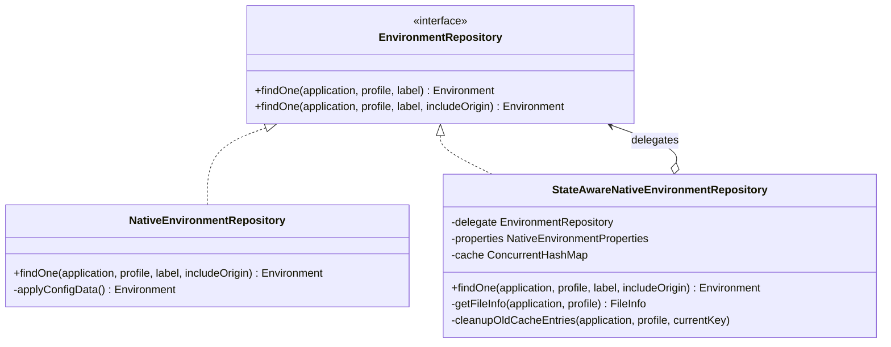
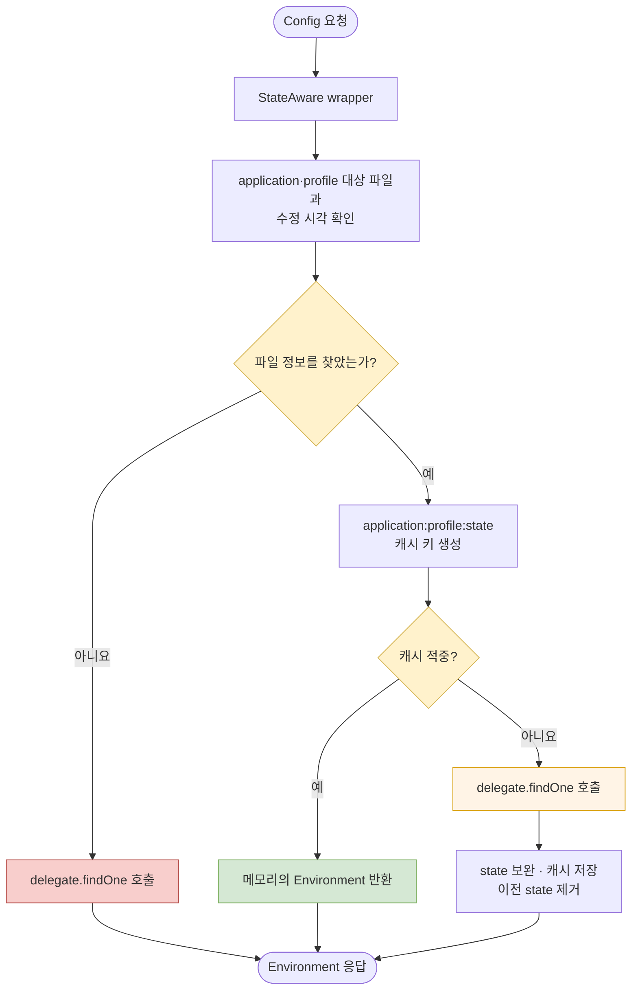

Gateway의 라우팅 정책을 애플리케이션에 묶어 배포하면 경로 하나를 바꾸는 일도 빌드와 재배포가 된다. 이를 분리하기 위해 `sp-gw-mgmt`는 Spring Cloud Config Server의 native backend를 사용해 외부 볼륨의 YAML과 Properties를 제공한다. 그런데 기본 동작을 그대로 쓰는 것만으로는 우리가 원하는 변경 식별과 프로세스 로컬 캐시를 함께 넣기 어려웠다.

여기서 선택지는 Spring Cloud Config의 파일 해석을 직접 다시 구현하는 것이 아니라, 이미 검증된 `NativeEnvironmentRepository`에 필요한 동작만 덧붙이는 것이었다. 현재 소스를 기준으로 `StateAwareNativeEnvironmentRepository`는 `EnvironmentRepository`를 구현하고 내부의 native repository에 실제 설정 구성을 위임한다. 이 글은 왜 이 composition 경계를 택했는지, 그리고 그 경계가 어디까지 유효한지를 정리한다.

## 바꾸려던 것은 설정 해석기가 아니었다

native backend는 application, profile, label을 받아 Spring Boot Config Data 규칙으로 설정 파일을 찾고 여러 `PropertySource`를 합쳐 Config Server의 `Environment`를 만든다. profile 우선순위, `application.yml`과 애플리케이션별 파일의 결합, YAML 문서 처리까지 이미 프레임워크가 맡고 있다.

내가 추가하려던 책임은 더 좁았다.

- 대상 파일의 마지막 수정 시각을 변경 식별자인 `state`로 만든다.
- 같은 application과 profile의 같은 state가 다시 요청되면 직전에 만든 `Environment`를 반환한다.
- 파일이 바뀌어 state가 달라지면 delegate에서 다시 읽고 이전 캐시를 제거한다.
- 커스텀 파일 탐색이 실패해도 Config Server의 기본 해석 경로는 유지한다.

즉 변경 대상은 **어떻게 YAML을 읽고 병합할 것인가**가 아니라 **언제 다시 구성하고 어떤 변경 식별자를 응답에 붙일 것인가**였다.

## 검토한 구현 경계

| 선택지 | 얻는 것 | 감수할 문제 |
|---|---|---|
| Config Server와 무관한 파일 API 직접 구현 | 응답과 캐시를 완전히 통제 | profile·label·PropertySource 병합과 향후 호환성을 직접 책임져야 함 |
| `NativeEnvironmentRepository` 상속 | 일부 메서드 재사용 가능 | 프레임워크 구체 클래스의 생성자와 내부 구현 변화에 강하게 결합 |
| `EnvironmentRepository` composition | 기존 native 해석을 보존하고 전후 동작만 추가 | delegate 선택과 Bean 등록 순서를 명시해야 함 |

직접 구현은 작은 요구를 위해 Config Server 자체의 해석 규칙을 복제하는 선택이었다. 상속도 가능하지만 확장용 template method가 아닌 구체 구현의 내부 변화에 기대게 된다. 최종적으로는 인터페이스를 구현한 wrapper가 delegate의 `findOne()`을 호출하는 composition을 택했다.

아래 다이어그램은 현재 코드에서 프레임워크의 책임과 커스텀 책임을 나눈 경계를 보여 준다.

> 실선 구현 관계는 같은 계약을, 집합 관계는 wrapper가 실제 설정 구성을 delegate에 맡긴다는 뜻이다.

## 자동 구성된 Bean을 어디서 감쌀 것인가

delegate를 직접 `new NativeEnvironmentRepository(...)`로 만들면 Spring Cloud Config 자동 구성이 제공하는 속성과 부가 구성을 다시 조립해야 한다. 현재 구현은 `BeanPostProcessor`에서 초기화가 끝난 Bean을 확인하고, `NativeEnvironmentRepository`인 첫 Bean만 wrapper로 교체한다.

이 연결 방식에는 세 가지 의도가 있다.

첫째, 프레임워크가 생성한 native repository를 그대로 delegate로 사용한다. 둘째, `native` profile에서만 구성을 활성화한다. 셋째, 모든 `EnvironmentRepository`를 무차별하게 감싸지 않는다. Git, Vault, composite repository가 함께 존재할 때까지 같은 파일 탐색 규칙을 적용하면 오히려 잘못된 확장이 된다.

초기 구현은 첫 번째 `EnvironmentRepository`를 넓게 감쌌다. 이후 커밋에서 대상 타입을 `NativeEnvironmentRepository`로 좁혔다. 이 변화는 composition을 썼다고 자동으로 결합도가 낮아지는 것이 아니라, **어떤 delegate를 장식할지까지 경계에 포함해야 한다**는 점을 보여 준다. `AtomicBoolean`은 해당 후처리 과정에서 중복 wrapping을 막는다.

## 요청은 wrapper를 지나 다시 native 동작으로 돌아간다

현재 요청 흐름은 다음과 같다.

> fallback은 빈 응답을 직접 만드는 경로가 아니다. 커스텀 state를 붙이지 못할 뿐, 해석 책임은 다시 native delegate가 갖는다.

파일 탐색에 실패했을 때 한때 예외를 강제하는 변경도 시도했다. 그러나 Config Server가 내부적으로 수행하는 `app`과 `application` 요청까지 오류 로그가 늘어났고, 결국 strict 동작을 되돌려 delegate에 맡겼다. 이 이력은 프레임워크 위에 정책을 추가할 때 내부 호출까지 애플리케이션 요청과 같은 규칙으로 재단하면 안 된다는 교훈을 남겼다.

## composition이 해결하지 않는 문제

wrapper는 변경 범위를 줄였지만 정확성을 자동으로 보장하지 않는다. 현재 코드에는 명시적으로 관리해야 할 경계가 남아 있다.

- 쉼표로 여러 profile이 들어오면 커스텀 파일 탐색은 첫 profile만 사용한다.
- 캐시 키에는 label과 `includeOrigin`이 없다. 이 배포가 해당 변형을 사용하지 않는다는 전제에 기대고 있다.
- state 탐색은 애플리케이션·profile 이름의 `.yml`, `.yaml`, `.properties` 후보를 본다. native delegate가 함께 합칠 수 있는 모든 공통 설정 파일의 변경을 대표하지는 않는다.
- 수정 시각을 초 단위로 절삭하므로 같은 초 안의 연속 변경은 같은 state로 보일 수 있다.
- 캐시한 `Environment`는 복사본이 아니라 같은 객체 참조다. 후속 코드가 이를 변경하지 않는다는 계약이 필요하다.

따라서 이 구현을 범용 Config Server extension이라고 부르기보다, 사용 중인 파일 배치와 요청 형태를 전제로 한 **프로젝트 전용 adapter**라고 보는 편이 정확하다.

## 결과와 회고

composition을 선택한 핵심 근거는 익숙한 “상속보다 조합”이라는 문구가 아니었다. 변경하려는 책임이 native 설정 해석보다 훨씬 작았고, 프레임워크가 이미 처리하는 profile과 PropertySource 규칙을 다시 소유할 이유가 없었기 때문이다.

그 결과 커스텀 코드는 파일 수정 시각, state, 캐시 교체에 집중하고 실제 `Environment` 구성은 계속 Spring Cloud Config가 맡는다. 반대로 wrapper의 파일 탐색과 delegate의 설정 탐색이 완전히 같은 의미인지 검증해야 하는 새 책임도 생겼다. 좋은 composition은 의존성을 숨기는 장치가 아니라, **그 의존성을 좁고 검토 가능한 경계에 남기는 선택**이었다.

[다음: Config Server는 요청마다 파일을 다시 읽을까](/blog/gateway-config-02-filesystem-memory-cache)

## 참고

- [Spring Cloud Config 4.3.0 `NativeEnvironmentRepository` 소스](https://github.com/spring-cloud/spring-cloud-config/blob/v4.3.0/spring-cloud-config-server/src/main/java/org/springframework/cloud/config/server/environment/NativeEnvironmentRepository.java)
- 프로덕션 근거: `StateAwareNativeConfigServerConfiguration`, `StateAwareNativeEnvironmentRepository`
