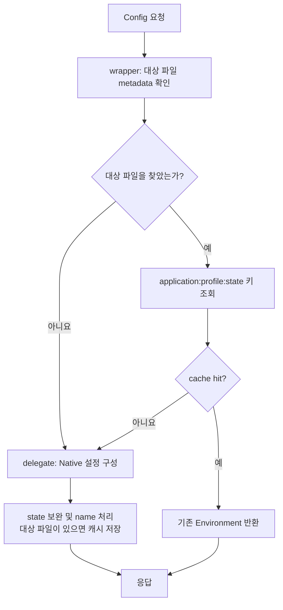

Gateway의 라우팅 설정을 실행 파일 밖으로 꺼내면 경로 하나를 바꾸기 위해 애플리케이션을 다시 빌드할 필요가 줄어든다. 하지만 파일을 외부화한 다음에는 다른 질문이 남는다. 설정이 바뀌었음을 어떻게 식별하고, 같은 설정을 반복해서 구성하는 비용은 어떻게 줄일 것인가?

`config-server-example`에서는 Spring Cloud Config Server의 native backend 위에 파일 수정 시각 기반 state와 프로세스 메모리 캐시를 더했다. 구현의 출발점은 YAML 파서를 만드는 것이 아니라, 프레임워크의 설정 해석 앞뒤에 필요한 정책을 배치하는 것이었다.

이 시리즈는 설계 선택을 설명한 뒤 실제 부하 실험으로 어디까지 확인했는지 연결한다. [2편](/blog/gateway-config-02-filesystem-memory-cache)은 파일과 캐시, [3편](/blog/gateway-config-03-bus-rabbitmq)은 갱신 신호, [4편](/blog/gateway-config-04-load-test-evidence)은 측정 결과와 한계를 다룬다. 원본 접근 없이 핵심 동작을 확인하는 학습용 Demo는 블로그 저장소의 `demos/gateway-config/cache_boundary_demo.py`에 있다.

## 변경하려던 책임은 좁았다

native repository는 application과 profile을 기준으로 설정을 구성한다. 공통 설정과 서비스 설정의 병합, profile 적용 같은 규칙은 기존 프레임워크를 계속 사용하고 싶었다. 내가 추가하려던 동작은 대상 파일의 mtime으로 state를 만들고, 같은 state면 이미 구성한 `Environment`를 반환하는 것이었다.

예를 들어 Gateway replica 두 개가 같은 `sp-gw/local` 설정을 요청한다면, 설정 내용 자체는 같을 수 있다. 두 번째 요청에서 다시 구성하는 일을 줄이는 정책과 YAML 해석 규칙은 별개의 책임이다. 이 차이가 확장 지점을 정하는 기준이 됐다.

| 선택 | 직접 책임져야 하는 범위 | 판단 |
|---|---|---|
| 파일 조회 API 직접 구현 | 응답 계약, profile 우선순위, 병합, 오류 처리 | 요구보다 넓은 책임 |
| Native Repository 상속 | 구체 클래스 생성자와 확장 지점 변화에 대응 | 내부 구현과 결합이 커짐 |
| EnvironmentRepository composition | delegate 선택, 캐시 정책, 반환 계약 | 필요한 책임을 좁히기 쉬움 |

composition을 선택했다고 호환성 문제가 사라지지는 않는다. 다만 설정 해석을 수정하는 작업과 캐시 정책을 수정하는 작업을 별도로 검토할 수 있다.

아래 흐름은 wrapper가 무엇을 생략하고 무엇을 위임하는지 보여준다.

> 화살표는 요청 처리 순서다. 파일 탐색 실패는 곧바로 요청 실패를 뜻하지 않으며 delegate로 이어진다.

## BeanPostProcessor에서 감싼 이유

delegate를 직접 생성하면 native repository의 생성자 인자와 자동 구성 조건을 다시 조립해야 한다. 현재 구현은 Spring이 초기화한 Bean을 `postProcessAfterInitialization`에서 받아 `NativeEnvironmentRepository`인 경우 wrapper로 교체한다. 기존 자동 구성을 이용하면서 마지막에 정책을 붙이는 방식이다.

여기에는 두 가지 제한이 있다. 설정 클래스에 `@Profile("native")`가 붙고, `AtomicBoolean`의 compare-and-set으로 첫 native Bean만 감싼다. 이것은 **중복 wrapping 방지**이지, 요청마다 발생하는 cache miss를 한 번으로 묶는 lock이 아니다. 두 동시성 문제를 혼동하면 4편의 중복 구성 현상을 설명할 수 없다.

변경 이력 비공개 이력에서는 wrapping 대상을 넓은 `EnvironmentRepository`에서 `NativeEnvironmentRepository`로 좁혔다. Git이나 Vault repository에 같은 파일 탐색 규칙을 적용할 이유가 없었기 때문이다. 여러 native Bean이 있다면 모두 감싸는 것도 아니므로 이 구현을 범용 장식기로 설명해서는 안 된다.

## 인터페이스를 구현해도 원본과 완전히 같지는 않다

현재 wrapper는 `EnvironmentRepository`와 `Ordered`를 구현한다. native 객체가 제공하는 다른 타입 계약까지 자동으로 보존하지 않는다. 원본에 있는 `SearchPathLocator` 역할이나 구체 타입 주입을 전제로 한 소비자가 있다면 별도 검증이 필요하다. 인터페이스 composition은 결합을 줄이는 도구이지 투명한 프록시라는 보증은 아니다.

응답에도 의도적인 차이가 있다. 현재 구현은 `environment.setName("")`을 수행하고, delegate state가 비어 있을 때만 mtime state를 보완한다. 파일을 찾지 못해 delegate로 넘어가는 fallback도 name은 빈 값으로 바꾼다. 따라서 “기본 동작을 그대로 보존했다”보다 “설정 해석을 위임하되 일부 응답 메타데이터를 바꿨다”가 정확하다.

또한 non-static `@Bean` 메서드가 BeanPostProcessor를 만들면서 `NativeEnvironmentProperties`를 일찍 주입한다. 실제 기동 로그에 일부 Bean이 모든 후처리기를 거치지 못할 수 있다는 경고가 있었다. 기동 성공과 lifecycle 설계가 이상적이라는 평가는 구분해야 한다. 후속 개선에서는 factory의 static 선언 가능성과 의존 Bean의 조기 초기화를 함께 검토할 수 있다.

## fallback을 남긴 이유와 그 대가

커스텀 파일 탐색은 native resolver보다 좁다. 첫 profile과 제한된 파일명을 보고 대상 하나를 고른다. 여기서 찾지 못했다고 native 해석까지 막으면, 프레임워크가 정상적으로 수행할 수 있는 요청을 wrapper가 거부할 수 있다.

이력상 strict 탐색 실패 처리를 되돌린 커밋이 비공개 이력다. 현재는 파일 정보가 없으면 delegate로 돌아간다. 그 결과 기본 해석 가능성은 유지하지만 이 경로에는 커스텀 cache가 적용되지 않는다. 존재하지 않는 이름이나 wrapper가 이해하지 못하는 profile 요청이 반복될 때의 비용도 따로 봐야 한다.

## 면접에서 설명한다면

**“왜 상속이 아니라 composition인가요?”** 추가 요구가 설정 해석의 변경이 아니라 state와 재사용 정책이었기 때문이다. native 구현을 delegate로 두어 파싱·병합을 다시 작성하지 않았다. 다만 캐시 키와 반환 메타데이터는 wrapper의 책임이므로 별도 호환성 테스트가 필요하다.

**“BeanPostProcessor 말고 직접 Bean을 만들면 안 되나요?”** 가능하다. 대신 자동 구성과 충돌하지 않게 원본을 확보하고 설정해야 한다. 현재는 초기화된 native Bean을 재사용하려고 후처리기를 택했으며, 조기 초기화 경고와 타입 계약 축소는 이 선택의 대가다.

**“테스트는 무엇부터 하겠습니까?”** hit에서 delegate를 건너뛰는지, fallback에서 호출하는지, 복수 profile과 label이 응답을 잘못 공유하지 않는지, 두 요청의 cold miss가 중복 구성되는지를 분리해서 확인한다. Demo는 마지막 두 흐름 중 캐시와 동시 miss 원리를 보여주는 축소 모델이며 Spring 통합 테스트를 대신하지 않는다.

## 근거를 찾아가는 경로

원본 checkout은 `private-workspace`이며 아래는 그 루트 기준 경로다. 확인 기준 커밋은 비공개 이력다.

| 근거 | 경로 또는 확인 방법 |
|---|---|
| wrapping 조건과 첫 Bean 제한 | `src/main/java/com/example/configserver/StateAwareNativeConfigServerConfiguration.java` |
| cache, state, fallback, name 변경 | `src/main/java/com/example/configserver/StateAwareNativeEnvironmentRepository.java` |
| wrapping 대상 변경 | 비공개 변경 이력 |
| strict 탐색 rollback | 비공개 변경 이력 |
| 블로그만으로 실행하는 Demo | `demos/gateway-config/cache_boundary_demo.py` |

원본의 타입 계약과 구성 흐름은 [Config Server 4.3.0 NativeEnvironmentRepository 공식 소스](https://github.com/spring-cloud/spring-cloud-config/blob/v4.3.0/spring-cloud-config-server/src/main/java/org/springframework/cloud/config/server/environment/NativeEnvironmentRepository.java)에서도 확인할 수 있다.
