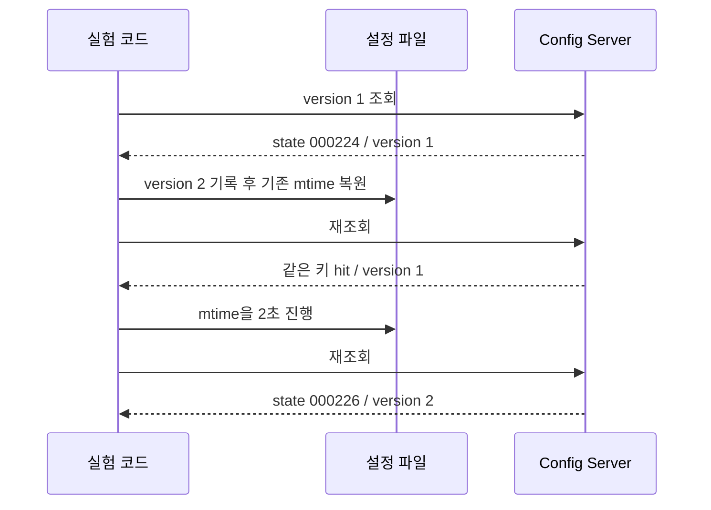

설정 파일은 작다. 그렇다면 요청마다 다시 읽어도 괜찮지 않을까? 반대로 캐시를 넣었다면 파일 접근은 완전히 사라진 것일까? 이 질문에 답하려면 “읽는다”를 metadata 조회, 내용 스트림 처리, YAML 파싱으로 나눠야 한다.

[1편](/blog/gateway-config-01-composition-boundary)의 wrapper는 파일 수정 시각을 확인한 뒤 이미 만들어 둔 `Environment`를 반환한다. 절약하려는 것은 파일에 관한 모든 작업이 아니라 native 설정을 다시 구성하는 작업이다.

## 공식 소스에서 실제 경로를 확인했다

기준은 Config Server **4.3.0**, Spring Boot **3.5.6**, Spring Framework **6.2.11**이다. native `findOne()`은 요청용 environment를 만들고 `ConfigDataEnvironmentPostProcessor.applyTo()`를 호출한다. 이 경로에는 이전 HTTP 요청의 완성된 Environment를 계속 돌려주는 우리 방식의 캐시가 없다. [NativeEnvironmentRepository 소스](https://github.com/spring-cloud/spring-cloud-config/blob/v4.3.0/spring-cloud-config-server/src/main/java/org/springframework/cloud/config/server/environment/NativeEnvironmentRepository.java)

YAML 경로에서는 `StandardConfigDataLoader`가 선택된 property-source loader를 호출한다. `YamlPropertySourceLoader`는 origin을 추적하는 YAML loader로 이어지고, 그 loader는 상위 YAML processor의 처리 과정을 이용한다. [StandardConfigDataLoader](https://github.com/spring-projects/spring-boot/blob/v3.5.6/spring-boot-project/spring-boot/src/main/java/org/springframework/boot/context/config/StandardConfigDataLoader.java), [YamlPropertySourceLoader](https://github.com/spring-projects/spring-boot/blob/v3.5.6/spring-boot-project/spring-boot/src/main/java/org/springframework/boot/env/YamlPropertySourceLoader.java), [OriginTrackedYamlLoader](https://github.com/spring-projects/spring-boot/blob/v3.5.6/spring-boot-project/spring-boot/src/main/java/org/springframework/boot/env/OriginTrackedYamlLoader.java)

내용을 여는 지점은 `YamlProcessor`의 `resource.getInputStream()`이며, 이어서 `yaml.loadAll(reader)`로 문서를 처리한다. 그러므로 wrapper miss 후 native가 해당 YAML을 로드하는 경로는 metadata만 보는 경로가 아니다. [YamlProcessor 소스](https://github.com/spring-projects/spring-framework/blob/v6.2.11/spring-beans/src/main/java/org/springframework/beans/factory/config/YamlProcessor.java)

다만 이 호출을 “매번 물리 디스크에서 읽는다”로 바꾸어 말할 수는 없다. 파일 내용이 OS page cache에 있으면 저장장치 접근 없이 공급될 수 있다. 스트림 처리와 객체 생성, 파싱 비용이 남는다는 주장과 물리 I/O 횟수에 대한 주장은 다르다.

## hit에서도 파일 metadata를 조회한다

현재 wrapper의 `getFileInfo()`는 후보 파일의 존재, 읽기 가능 여부, mtime, 크기를 확인한다. `Files.size()`를 포함해 이 함수는 내용 파싱을 하지 않는다. 그 뒤 cache key를 만들어 hit이면 delegate를 호출하지 않는다.

| 작업 | wrapper hit | wrapper miss 후 YAML 로드 |
|---|---|---|
| 후보 파일 metadata 조회 | 수행 | 수행 |
| native 설정 구성 | 건너뜀 | 수행 |
| YAML 내용 스트림·파싱 | 이 경로에서는 건너뜀 | loader 경로에서 수행 |
| HTTP 응답 직렬화 | 필요 | 필요 |

로컬 SSD에서는 가벼운 metadata 조회도 원격 volume에서는 의미 있는 비용이 될 수 있다. 따라서 “메모리 hit라서 파일시스템과 무관하다”는 설명은 현재 코드에 맞지 않는다.

## 작은 설정을 프로세스 메모리에 둔 판단

이번 fixture는 20개 application, application당 route 20개, 총 약 76 KB YAML이다. 이는 실험에서 정한 크기이며 운영 설정의 실측 크기는 아니다. 파일을 해석한 Java 객체는 문자열·map 등으로 확장되므로 파일 bytes를 그대로 heap 사용량이라고 볼 수도 없다.

프로세스 내부 캐시는 요청에서 바로 접근할 수 있고 원격 호출이나 직렬화 왕복이 필요 없다. 이런 작은 설정을 재사용하기 위해 별도 캐시 서비스를 추가하면 연결 실패, TTL, 공유 데이터 직렬화와 운영 의존성이 함께 생긴다. 우선 로컬 캐시로 시작한 판단은 이 비용에 근거한다. Redis와 성능 비교를 해서 이긴 결과가 아니다.

반대로 Config Server replica마다 캐시가 다르며, 현재 map에는 전체 key 수의 상한이나 TTL이 없다. application/profile 조합이 계속 늘면 메모리 관리가 필요하다. 공유 캐시를 도입하더라도 잘못된 invalidation 기준이 자동으로 해결되지는 않는다.

## mtime은 내용의 버전과 같지 않다

현재 키는 `application:profile:state`다. state는 mtime을 초 단위로 절삭한 뒤 서버 시간대의 `yyyyMMdd-HHmmss` 문자열로 만든다. 변경 식별자를 사람이 읽기 쉽게 만들었지만 해상도를 잃었다.

다음 시퀀스는 실제 HTTP 실험의 stale 조건이다.

> 숫자는 측정 state의 시각 부분이다. 변경은 있었지만 key가 같아서 내용 재구성을 건너뛴다.

실측 JSON에는 `stale_reproduced: true`와 `refresh_after_mtime_change: true`가 기록돼 있다. 정확히 같은 mtime 보존은 HTTP 실험으로 재현했고, 같은 초 내부의 서로 다른 mtime이 충돌하는 사례는 블로그의 축소 Demo로 추가 확인할 수 있다. 두 검증을 같은 실험이라고 섞지 않는다.

## 추적한 파일 하나가 전체 설정을 대표하는가

mtime 해상도만 높여도 남는 문제가 있다. wrapper는 첫 profile의 후보 파일 하나를 선택하지만 delegate는 공통 설정과 여러 profile 등을 해석할 수 있다. 대표 파일은 그대로이고 공통 설정만 바뀌면 캐시가 전체 변경을 놓칠 수 있다.

또한 key에 `label`과 `includeOrigin`이 없다. 두 요청의 응답이 달라져야 하는 입력을 key에서 빼면 먼저 채운 응답을 다른 요청에 반환할 수 있다. 여러 search location, 복수 profile, label 사용을 늘리기 전에 캐시의 동등성 조건부터 다시 정의해야 한다.

metadata를 읽은 뒤 내용 읽기 전에 파일이 교체되는 경쟁도 있다. 원자적 rename은 불완전한 파일 노출을 줄이지만, metadata와 내용이 같은 세대라는 보증까지 자동으로 주지는 않는다. 읽기 전후 버전을 확인하거나 불변 버전 디렉터리를 읽는 방식이 후속 선택지다.

## 면접에서 이어질 질문

**“hash를 key로 쓰면 해결되지 않나요?”** 내용 hash는 동일 mtime 문제를 줄일 수 있다. 다만 매 요청에 hash를 계산하려면 내용을 읽어야 하므로 캐시로 줄이려던 작업 일부가 돌아온다. 배포 시 명시적 버전을 발급하고 불변 파일 묶음을 참조하는 방안도 비교할 수 있다.

**“ConcurrentHashMap이면 중복 로딩이 안 되나요?”** map 연산의 안전성과 `get → load → put` 전체가 한 번 수행되는 것은 다르다. 두 요청이 모두 null을 보면 둘 다 load할 수 있다. key별 single-flight가 별도로 필요하다. 현재 구현은 그 기능이 없다.

**“외부 캐시를 안 쓴 근거가 충분한가요?”** 작은 설정, 단순한 운영, 낮은 원격 의존성이라는 설계 근거는 있다. 운영 heap과 hit ratio를 계측하지 않았으므로 영구히 불필요하다고 결론 내리지는 않는다. 실험 결과는 [4편](/blog/gateway-config-04-load-test-evidence)의 범위에서만 인용한다.

## 코드와 Demo 경로

원본 루트: `private-workspace`.

- `src/main/java/com/example/configserver/StateAwareNativeEnvironmentRepository.java`: `getFileInfo`, `buildCacheKey`, `findOne`, `cleanupOldCacheEntries`
- `load-test/scripts/load_test.py`: 실제 HTTP 기반 `test_invalidation`
- 블로그 저장소 `demos/gateway-config/cache_boundary_demo.py`: 동일 초 mtime와 동시 miss 학습 모델
- 블로그 저장소 `demos/gateway-config/2026-09-08-results.json`: 당시 측정값의 고정 사본. 4편에서 결과와 측정 한계를 해설한다.

Demo 실행은 블로그 루트에서 `python3 demos/gateway-config/cache_boundary_demo.py`다. Java Spring 런타임이 필요하지 않으며 처리량을 측정하는 도구는 아니다.
