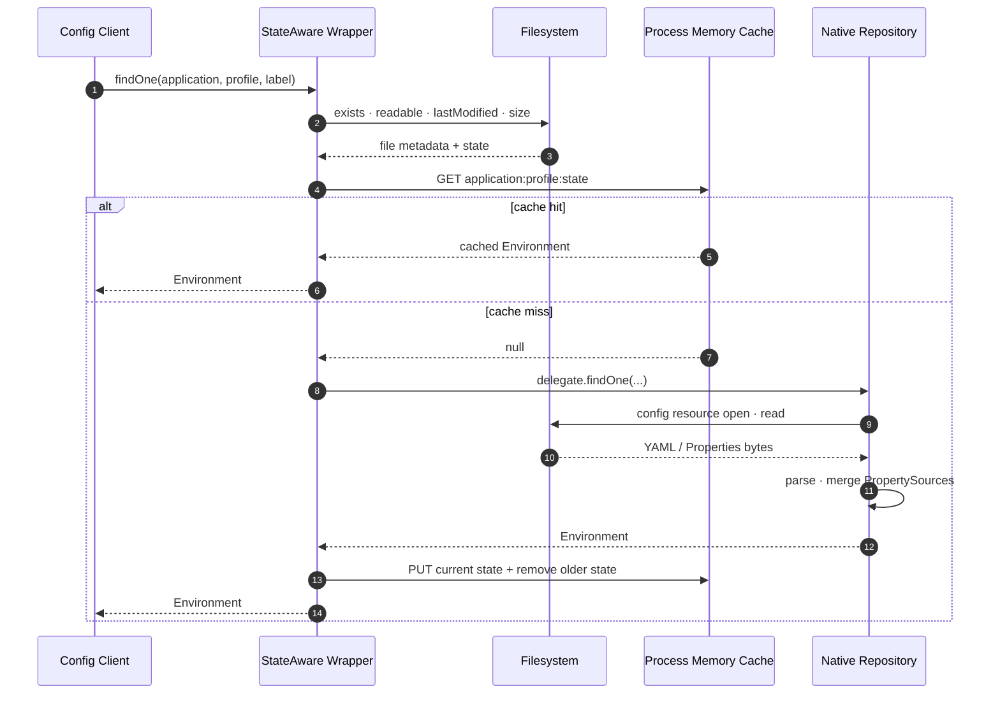
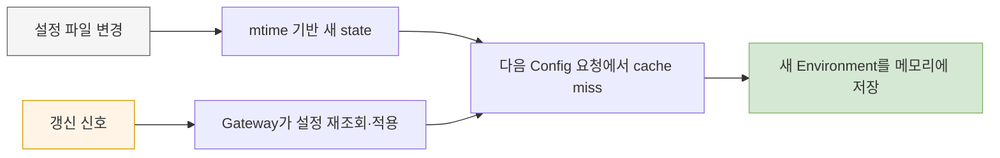

파일 기반 Config Server에 캐시를 넣기 전에 먼저 확인할 질문은 “느릴 것 같다”가 아니라 **요청할 때 정말 파일을 다시 읽는가**였다. 파일 경로를 설정해 두었다고 해서 시작할 때 한 번만 메모리에 올라오는지, 매 요청마다 다시 구성하는지는 API 이름만 보고 알 수 없다.

`sp-gw-mgmt`의 캐시는 파일시스템 접근을 전부 없애지 않는다. 매 요청에서 대상 파일의 존재와 수정 시각을 확인하고, state가 같을 때만 이전에 구성한 `Environment`를 프로세스 메모리에서 반환한다. state가 달라지면 Spring Cloud Config의 native delegate를 다시 호출한다. 이 차이를 생략하면 캐시의 효과와 stale 조건을 모두 잘못 설명하게 된다.

## 공식 구현에서 실제 구성 경로를 확인했다

프로젝트는 Spring Cloud 2025.0.0 BOM과 Config Server를 사용한다. 이에 대응하는 Spring Cloud Config 4.3.0의 `NativeEnvironmentRepository.findOne()`을 확인하면 요청마다 새 `StandardEnvironment`를 만들고 `ConfigDataEnvironmentPostProcessor.applyTo(...)`를 호출한다. 여기에는 application, profile, search location이 전달되고, Spring Boot Config Data loader가 해당 resource의 PropertySource를 구성한다.

즉 기본 native repository의 `findOne()`은 이미 만들어 둔 Map을 단순 조회하는 메서드가 아니다. 호출될 때마다 설정 resource를 해석해 응답용 `Environment`를 다시 조립하는 경로다. 파일 backend라면 이 과정에 설정 파일 open/read와 YAML 또는 Properties 파싱이 포함된다.

이 사실을 코드에서 확인한 뒤, cache hit에서는 delegate 호출 자체를 건너뛰도록 했다. 단, 커스텀 wrapper의 `getFileInfo()`가 수행하는 다음 작업은 그대로 남는다.

- 후보 경로별 `Files.exists()` 확인
- 발견한 파일의 `Files.isReadable()` 확인
- `Files.getLastModifiedTime()` 조회
- 로그에 남기기 위한 `Files.size()` 조회

따라서 정확한 표현은 “file read를 없앴다”가 아니다. **파일 메타데이터 확인은 변경 감지를 위해 유지하고, 파일 내용의 재로딩·파싱과 `Environment` 재구성을 cache hit에서 피했다**가 현재 소스에 맞다.

## hit와 miss에서 무엇이 달라지는가

아래 시퀀스는 같은 application과 profile 요청이 들어왔을 때 남는 파일 접근과 생략되는 작업을 구분한다.

> 파일시스템 화살표는 모두 같은 비용이 아니다. hit에도 metadata syscall은 남지만 내용 읽기와 설정 파싱은 생략된다.

첫 요청이나 파일 변경 뒤 첫 요청은 miss다. delegate가 만든 `Environment`에 state가 없다면 wrapper가 파일 수정 시각을 `yyyyMMdd-HHmmss` 형식으로 넣는다. 이후 `application:profile:state`가 같은 요청은 캐시된 객체를 반환한다.

파일을 수정하면 마지막 수정 시각이 달라지고 새 키로 miss가 발생한다. 새 `Environment`를 저장한 다음 같은 application·profile prefix의 이전 키를 제거한다. 이 정리 덕분에 변경 횟수만큼 과거 버전이 무한히 쌓이는 구조는 아니다.

## 왜 외부 캐시가 아니라 프로세스 메모리였나

캐시 대상은 대용량 응답이나 사용자별 데이터가 아니라, 라우트 수가 제한된 작은 YAML/Properties 설정과 이를 변환한 `Environment`다. 설정 수와 크기가 작다는 업무 전제가 있었고, application·profile마다 현재 state 하나만 유지하도록 오래된 항목도 제거한다.

이 조건에서는 Redis 같은 외부 캐시를 추가하는 비용이 이득보다 컸다.

| 판단 기준 | 프로세스 메모리 | 외부 분산 캐시 |
|---|---|---|
| 대상 크기 | 작은 설정 몇 개에 적합 | 큰 데이터나 여러 노드 공유에 유리 |
| 조회 경로 | JVM 내부 Map 조회 | 네트워크 왕복과 직렬화 필요 |
| 장애 의존성 | 인스턴스별 독립 | 캐시 서비스 가용성에 영향받음 |
| 일관성 | 각 인스턴스가 파일 state로 판단 | key·TTL·무효화 프로토콜을 별도 설계 |
| 재기동 | 캐시가 비고 첫 요청에서 다시 구성 | 캐시를 유지할 수 있지만 이 프로젝트에는 필수 아님 |

`ConcurrentHashMap`을 택한 이유도 거창한 분산 상태가 필요해서가 아니다. Config Server는 여러 HTTP 요청을 동시에 처리할 수 있으므로 공유 Map의 기본 안전성을 확보하려는 선택이다. 동시에 같은 miss가 들어오면 두 요청이 모두 delegate를 호출할 가능성은 남는다. 이 캐시는 single-flight를 보장하지 않으며, 대상 설정이 작고 변경 빈도가 낮다는 전제에서 중복 첫 로딩을 허용한다.

“용량이 작다”는 말도 숫자 없이 만능 근거로 쓰면 안 된다. 저장소의 예시 설정은 소수의 route를 가진 짧은 YAML이지만 실제 배포 파일의 최대 크기와 application·profile 개수는 이 저장소만으로 측정할 수 없다. 따라서 판단을 운영에 유지하려면 캐시 entry 수, 직렬화 전후 대략적인 크기, hit/miss, delegate 수행 시간을 관측해야 한다.

## 수정 시각을 version으로 사용한 이유

내용 hash를 계산하면 byte 단위 변경을 정확하게 구분할 수 있다. 그러나 매 요청마다 hash를 만들려면 파일 전체를 읽어야 하므로 cache hit에서 피하고 싶은 비용이 다시 생긴다. TTL만 쓰면 파일이 바뀌어도 만료 전까지 stale 응답을 주고, 짧은 TTL은 반복 파싱을 되살린다. `WatchService`는 변경 이벤트를 받을 수 있지만 컨테이너의 volume 종류와 파일 교체 방식에 따른 동작을 별도로 검증해야 한다.

수정 시각은 내용 전체를 읽지 않고도 변경 후보를 판별할 수 있고 사람이 로그에서 읽기 쉽다. 이 프로젝트에서는 이를 state와 cache key로 함께 사용했다. 대신 다음 한계를 받아들였다.

- 수정 시각을 초 단위로 절삭하므로 한 초 안에서 두 번 바뀌면 구분하지 못할 수 있다.
- 파일 내용을 바꾸고 mtime을 보존하면 변경을 감지하지 못한다.
- 애플리케이션별 파일 외에 delegate가 합치는 공통 파일이 바뀌어도 현재 후보 탐색만으로는 state가 달라지지 않을 수 있다.
- 여러 profile 요청은 첫 profile의 파일만 state 근거로 사용한다.

라우팅 설정 변경 절차가 사람이 수행하는 저빈도 작업이고 파일이 작다는 조건에서는 단순성이 이 한계보다 중요하다고 판단했다. 고빈도 자동 변경이나 강한 무결성이 필요해지면 content hash, 명시적 version 파일, 원자적 rename 규약을 비교해야 한다.

## 메모리 캐시와 변경 전파는 다른 문제다

프로세스 캐시는 Config Server가 같은 설정을 다시 구성하는 비용을 줄인다. 하지만 Gateway 인스턴스가 새 설정을 언제 다시 요청할지는 결정하지 않는다. Config Server의 파일과 cache key가 바뀌어도 client가 요청하지 않으면 실행 중인 route는 그대로일 수 있다.

이 때문에 저장 비용 최적화와 갱신 신호는 분리해 설계해야 했다.

> 위쪽은 Config Server 내부의 freshness 판단이고, 아래쪽은 실행 중인 client를 움직이는 별도 흐름이다.

다음 글에서는 왜 client별 재시작이나 직접 refresh 호출 대신 Spring Cloud Bus를 붙였고, 처음의 Kafka binder를 가용한 RabbitMQ로 바꿨는지 다룬다.

[이전: Spring Cloud Config를 다시 만들지 않고 감싼 이유](/blog/gateway-config-01-composition-boundary) · [다음: 파일은 바뀌었는데 Gateway는 왜 그대로일까](/blog/gateway-config-03-bus-rabbitmq)

## 참고

- [Spring Cloud Config 4.3.0 `NativeEnvironmentRepository.findOne()`](https://github.com/spring-cloud/spring-cloud-config/blob/v4.3.0/spring-cloud-config-server/src/main/java/org/springframework/cloud/config/server/environment/NativeEnvironmentRepository.java)
- 프로덕션 근거: `StateAwareNativeEnvironmentRepository`, `application.yaml`
