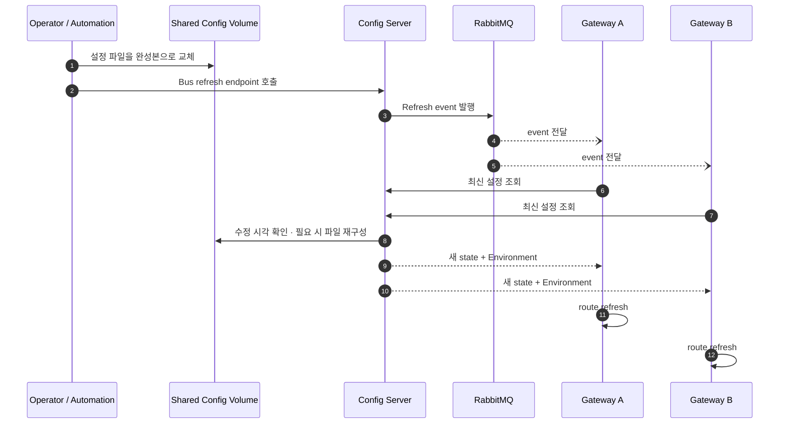
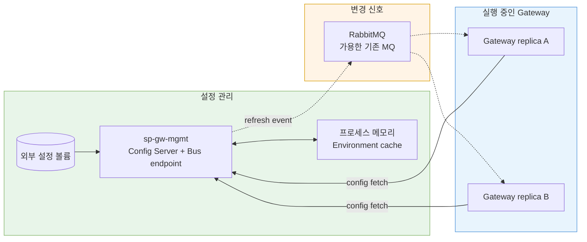

Config Server의 파일을 바꾸는 것과 실행 중인 Gateway가 새 route를 쓰는 것은 같은 사건이 아니다. 파일은 저장소의 상태이고, Gateway가 이미 메모리에 들고 있는 route는 실행 상태다. Config Server에 최신 값이 있어도 client가 다시 조회하고 자신의 context를 갱신하지 않으면 동작은 바뀌지 않는다.

`config-server-example`에는 이 간극을 메우기 위해 Spring Cloud Bus가 들어갔다. 처음 커밋은 Kafka binder를 사용했지만 이후 RabbitMQ AMQP binder로 바뀌었다. 선택 이유는 RabbitMQ가 더 우수한 MQ라서가 아니라, 대상 환경에서 실제로 사용할 수 있는 MQ가 RabbitMQ뿐이었기 때문이다. 이 글은 Bus가 왜 필요했는지와 현재 소스가 어디까지 보장하는지를 나눠 설명한다.

## Config Server는 저장소이지 자동 배포기가 아니다

native Config Server는 요청을 받으면 파일에서 `Environment`를 구성해 반환한다. 앞 글의 프로세스 캐시는 이 응답 구성을 줄이고 수정 시각으로 stale 여부를 판단한다. 그러나 파일시스템 변경 이벤트를 감시해 모든 Gateway에 알아서 알리는 코드는 현재 저장소에 없다.

필요한 것은 두 단계였다.

1. 파일 변경 뒤 Config Server가 새 state의 설정을 반환할 수 있어야 한다.
2. 현재 실행 중인 Gateway 인스턴스들에 “설정을 다시 확인하라”는 신호를 전달해야 한다.

첫 단계는 filesystem state와 cache miss로 해결했다. 두 번째 단계에서 여러 선택지를 검토했다.

| 선택지 | 장점 | 운영상 문제 |
|---|---|---|
| Gateway 재시작·재배포 | 새 설정 로딩 시점이 명확 | 라우트 변경이 배포 작업이 되고 가용성 관리가 필요 |
| 각 인스턴스의 refresh endpoint 직접 호출 | MQ 없이 구현 가능 | replica 주소 탐색, 일부 실패 재시도, 증감하는 인스턴스 관리 필요 |
| Gateway가 주기적으로 polling | 중앙 발행 작업 불필요 | 변경 반영 지연과 불필요한 반복 요청 사이에서 주기를 결정해야 함 |
| Spring Cloud Bus broadcast | 한 번의 신호를 참여 인스턴스에 fan-out | broker 의존성과 이벤트 소비 구성을 운영해야 함 |

인스턴스가 하나이고 거의 바뀌지 않는다면 직접 호출도 충분하다. 그러나 Kubernetes에서 replica가 교체되거나 늘어날 수 있는 Gateway를 대상으로 주소 목록을 직접 관리하는 방식은 운영 상태와 쉽게 어긋난다. 결국 Spring 생태계 안에서 refresh event를 broadcast하는 Bus를 채택했다.

## Bus를 붙여도 파일 변경만으로 자동 발행되지는 않는다

현재 `application.yaml`은 Bus와 refresh를 활성화하고 Actuator exposure에 `bus-refresh`, health, info를 포함한다. 의존성은 `spring-cloud-starter-bus-amqp`이며 RabbitMQ 접속 정보는 환경변수로 받는다.

중요한 한계가 있다. 이 구성은 **Bus refresh endpoint와 broker 연결 경로를 제공**하지만, 누군가 파일을 수정했다는 이유만으로 endpoint가 자동 호출되지는 않는다. 운영자나 설정 반영 자동화가 파일 교체를 완료한 뒤 Bus refresh를 호출해야 한다. 파일 변경과 event 발행을 한 트랜잭션으로 묶는 코드도 현재 저장소에는 없다.

아래 시퀀스는 현재 구성으로 의도한 반영 흐름과 자동화가 맡아야 할 구간을 함께 보여 준다.

> 첫 번째와 두 번째 메시지 사이의 순서 보장은 운영/자동화의 책임이다. 실선은 요청, 점선은 broker를 통한 비동기 전달을 뜻한다.

Gateway client의 실제 Bus 구독과 route refresh 코드는 이 저장소에 포함되어 있지 않다. 따라서 이 소스만으로 전체 end-to-end 반영 성공을 주장할 수는 없다. `config-server-example`에서 확인할 수 있는 범위는 Config Server의 Bus AMQP 의존성, endpoint 노출, RabbitMQ 접속 구성과 배포 주입까지다.

## Kafka에서 RabbitMQ로 바뀐 이유

Bus를 처음 추가한 커밋은 `spring-cloud-starter-bus-kafka`와 Kafka binder 주소를 넣었다. 약 3주 뒤 AMQP starter로 교체하고 RabbitMQ 연결 설정을 추가했다. 최종 소스와 배포 chart도 RabbitMQ를 기준으로 한다.

이 전환을 처리량, 지연 시간, 전달 의미를 비교한 벤치마크 결과로 포장하면 사실과 다르다. 당시 환경에서 가용한 MQ가 RabbitMQ 하나였다는 인프라 제약이 결정적이었다. 이미 사용할 수 있는 broker를 두고 Config refresh만을 위해 Kafka를 새로 도입하면 다음 책임까지 함께 생긴다.

- broker cluster 구축과 장애 대응
- 인증·네트워크·secret 관리
- 모니터링과 용량 계획
- 팀의 운영 지식과 업그레이드 경로

Bus refresh는 대용량 event streaming이 아니라 설정 변경 신호의 fan-out이 목적이었다. 이 요구에서는 새 MQ의 이론적 장점보다 **이미 운영 가능한 broker인가**가 더 중요한 선택 기준이었다. 그래서 Kafka 초안을 유지하지 않고 RabbitMQ binder로 변경했다.

## 배포 구성까지 포함해야 Bus가 동작한다

라이브러리를 추가하는 것만으로 컨테이너에서 broker에 연결되지는 않는다. Helm Deployment는 RabbitMQ host, port, username, password를 `sp-rabbitmq-conn-info-secret`의 key에서 환경변수로 주입한다. 애플리케이션은 이를 `spring.rabbitmq` 속성으로 읽는다.

초기 local chart는 RabbitMQ 값을 values에서 직접 받는 형태였지만 최종 개발계 배포는 기존 Secret 참조로 바뀌었다. 이는 자격정보를 애플리케이션 이미지나 일반 설정 파일과 분리한다. 다만 Helm template에는 local 용도로 Secret을 생성할 수 있는 경로도 남아 있으므로 실제 환경에서는 `createSecret` 정책과 values 보관 방식을 구분해야 한다.

전체 구성요소의 책임은 다음과 같다.

> 실선은 설정 조회, 점선은 변경 신호다. RabbitMQ가 설정 내용을 저장하는 구조가 아니라 refresh event를 전달하는 구조다.

## 반드시 다뤄야 하는 실패 조합

Bus는 fan-out 문제를 줄이지만 “파일 수정부터 모든 route 반영까지 정확히 한 번”을 보장하지 않는다.

- 파일은 바뀌었지만 endpoint 호출이 실패하면 client는 새 설정을 모른다.
- event가 먼저 발행되고 volume 교체가 늦으면 client가 이전 state를 다시 받을 수 있다.
- 일부 Gateway가 broker와 끊겨 있으면 replica별 적용 버전이 달라질 수 있다.
- Config Server가 여러 replica인데 각 pod가 서로 다른 local `hostPath`를 보면 같은 요청에도 다른 파일을 읽을 수 있다.
- 파일 수정 시각이 달라지지 않으면 Config Server의 프로세스 캐시가 이전 `Environment`를 반환할 수 있다.
- refresh 중 잘못된 route가 들어오면 “전파 성공”이 오히려 전체 인스턴스로 오류를 넓힐 수 있다.

따라서 운영 절차는 최소한 파일 원자적 교체, Config Server에서 새 state 조회 확인, Bus 발행 성공, Gateway replica별 적용 확인을 구분해야 한다. RabbitMQ queue 상태와 consumer 연결만 보고 route 적용까지 성공했다고 판단해서도 안 된다.

현재 저장소에는 이 전체 흐름을 고정한 자동화 테스트나 replica별 적용 metric이 없다. 이후 보강한다면 다음 관측값이 우선이다.

- Bus refresh 요청 ID와 발행 결과
- Gateway별 수신 시각과 적용한 config state
- Config Server cache hit/miss와 delegate 재구성 시간
- 설정 검증 실패 및 마지막 정상 state
- broker 연결 실패와 재연결 횟수

## 결과와 회고

Bus를 채택할 수밖에 없었던 이유는 설정 저장과 실행 상태의 갱신이 분리돼 있었고, replica별 endpoint를 직접 추적하는 방식이 Kubernetes의 동적 인스턴스와 맞지 않았기 때문이다. RabbitMQ를 고른 이유도 추상적인 제품 비교의 승리가 아니라, 해당 환경에서 가용한 유일한 MQ라는 현실적 제약이었다.

이 선택으로 한 번의 refresh 신호를 여러 인스턴스에 전달하는 표준 경로를 만들었다. 동시에 broker와 client 구독이라는 새 운영 의존성도 생겼다. 가장 중요한 교훈은 “동적 설정”을 파일을 수정할 수 있다는 뜻으로만 보면 안 된다는 것이다. **저장, 변경 식별, 신호 발행, client 적용, 적용 확인**이 모두 있어야 비로소 운영 가능한 변경 경로가 된다.

[이전: Config Server는 요청마다 파일을 다시 읽을까](/blog/gateway-config-02-filesystem-memory-cache)

## 참고

- [Spring Cloud Bus reference](https://docs.spring.io/spring-cloud-bus/reference/)
- 프로덕션 근거: `build.gradle`, `application.yaml`, Helm `deployment.yaml`, `rabbitmq-secret.yaml`
