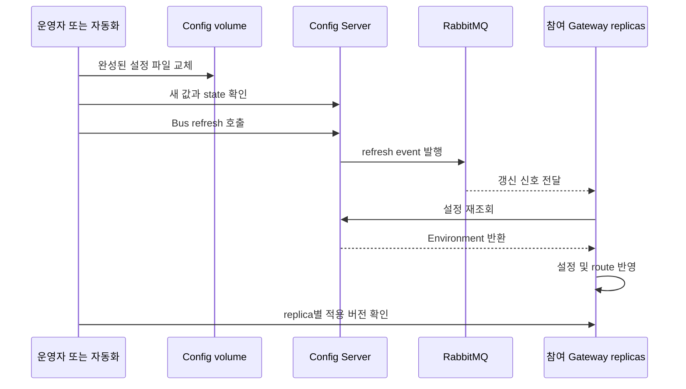

파일을 수정한 뒤 Config Server에 요청했더니 새 설정이 보인다. 그런데 실제 Gateway의 동작은 그대로다. 두 응답이 모순되는 것은 아니다. Config Server의 저장 상태와 Gateway가 이미 메모리에 구성한 실행 상태는 서로 다른 위치에 있다.

[2편](/blog/gateway-config-02-filesystem-memory-cache)의 캐시는 Config Server가 요청을 받았을 때 무엇을 반환할지에 관한 문제였다. 이 글은 실행 중인 client가 언제 다시 요청하고, 그 값을 어떻게 반영할 것인가를 다룬다.

## 설정 저장부터 실행 반영까지는 여러 단계다

최소한 파일 교체, Config Server의 새 설정 확인, client에 갱신 신호 전달, client 재조회, 실행 객체 갱신을 거쳐야 한다. 중간 단계 하나가 성공해도 나머지 단계가 성공했다는 뜻은 아니다.

Spring Cloud Bus는 참여 애플리케이션에 refresh 신호를 전달하는 표준 경로를 제공한다. refresh endpoint는 refresh scope와 configuration properties 갱신을 다룬다. 그러나 특정 Gateway의 route 적용 완료 여부는 그 client 구성과 실행 결과까지 확인해야 한다. [Spring Cloud Bus 4.3 endpoint 문서](https://docs.spring.io/spring-cloud-bus/reference/4.3/spring-cloud-bus/bus-endpoints.html)

## 직접 호출, polling, Bus 중에서 고른 이유

| 방법 | 운영자가 관리할 것 | 감수할 비용 |
|---|---|---|
| 재시작·재배포 | 배포 순서와 정상 기동 | 설정 변경이 배포 작업이 됨 |
| 각 replica의 refresh 직접 호출 | 현재 replica 주소와 실패 재시도 | replica 교체·증감에 따른 대상 추적 |
| 주기적 polling | 조회 주기와 실패 복구 | 반영 지연과 반복 조회량의 교환 |
| Bus broadcast | broker 연결과 참여 client | broker 운영 및 적용 확인 |

Kubernetes에서는 replica가 늘거나 교체된다. client 목록을 직접 유지하기보다 참여 애플리케이션이 Bus를 통해 신호를 받도록 구성하는 편이 운영 책임을 줄일 수 있었다. 그렇다고 작은 시스템에서 직접 호출이 틀린 선택인 것은 아니다. replica 수와 변경 빈도, 기존 broker의 유무에 따라 판단이 달라진다.

플랫폼 전체 규모는 20개 application과 38개 Pod다. 일반 서비스 18개가 각각 replica 2개, batch 2개가 각각 하나다. **이 수치만으로 38개가 모두 Gateway이거나 실제 Bus 구독자라고 확정할 수는 없다.** 부하 실험에서는 이 수를 client 요청량의 가정으로 사용했다.

## Kafka 초안에서 RabbitMQ로 바꾼 근거

원본 이력 `9b7bf77`에는 Kafka Bus starter가 들어갔고, `d4e731d`에서 AMQP starter로 교체됐다. `2d47a91`은 RabbitMQ 접속 설정 방식 변경을 담고 있다. 이력은 제품 전환을 확인하는 근거다.

전환 이유는 대상 환경에서 가용한 MQ가 RabbitMQ뿐이었다는 프로젝트 제약이다. 이 이유는 작업 맥락에 근거하며, dependency diff만으로 역추론한 사실이 아니다. Kafka와 RabbitMQ를 같은 조건으로 벤치마크한 결과도 없다.

설정 변경 신호를 fan-out하기 위해 새로운 Kafka 운영 기반을 만드는 비용보다, 이미 사용할 수 있는 RabbitMQ와 Spring의 AMQP binder를 연결하는 편이 현실적이었다. 면접에서는 이를 “RabbitMQ가 더 빠르다”로 설명하기보다 “요구 기능과 가용 인프라를 함께 고려했다”로 설명하는 것이 맞다.

## 현재 구현에는 파일 변경 감시가 없다

`application.yaml`에는 Bus와 refresh 활성화, Actuator의 `bus-refresh` 노출, RabbitMQ 환경변수 연결이 있다. 파일 변경을 감시해 endpoint를 자동 호출하는 구현은 없다. 따라서 파일 저장만으로 event가 발생한다고 설명하면 현재 동작보다 넓은 보장을 주장하게 된다.

아래는 운영 자동화가 완성해야 하는 목표 흐름이다. Gateway client 내부의 마지막 단계는 이 저장소만으로 검증되지 않았다.

> 실선은 요청·처리, 점선은 broker 전달이다. 파일 저장과 Bus 호출 사이의 자동 연결은 현재 미구현이다.

## 실패를 단계별로 나누면 운영 절차가 보인다

파일 교체에 성공하고 Bus 호출에 실패하면 서버에는 새 설정이 있지만 client는 이전 상태일 수 있다. event를 먼저 발행하고 파일을 나중에 교체하면 client가 이전 값을 다시 읽을 수 있다. event 전달에 성공해도 2편의 mtime 충돌이 있으면 Config Server가 stale 값을 반환할 수 있다.

일부 client가 broker에서 끊어진 경우에는 재연결 후 최종 버전 수렴을 어떻게 확인할지도 필요하다. 중복 event와 순서 역전을 고려해 버전 식별, 재시도, 마지막 정상 설정 유지 정책을 설계할 수 있다. 이런 복구 기능은 현재 서버 코드에 모두 구현되어 있다는 뜻이 아니라 후속 개선안이다.

Config Server가 여러 replica라면 각 Pod가 보는 volume도 확인해야 한다. 모든 Pod에 같은 이름의 `hostPath`가 있다고 파일 내용이 자동으로 같아지는 것은 아니다. 갱신 신호를 넓게 보내기 전에 서버가 일관된 설정을 반환하는 조건부터 필요하다.

## 부하 테스트가 확인한 구간은 어디인가

이번 하네스는 `--spring.cloud.bus.enabled=false`로 실행됐다. JSON의 `bus_refresh_burst_38_pods`는 broker 전달 후 생길 수 있는 HTTP 재조회 burst를 흉내 낸 이름이다. 실제 Bus endpoint 호출이나 RabbitMQ consumer fan-out을 측정하지 않았다.

그 시나리오의 p95 3.018 ms를 “모든 Gateway에 3 ms 만에 반영됐다”로 말하면 안 된다. 이것은 파일이 바뀌지 않은 상태에서 Config Server에 보낸 짧은 요청 집합의 지연이다. 전체 적용 시간을 보려면 event ID, 발행 시각, replica별 수신 시각과 적용 version, 실제 route 응답을 연결해야 한다. 수치와 측정 경계는 [4편](/blog/gateway-config-04-load-test-evidence)에서 자세히 다룬다.

## 면접 답변과 근거

**“Bus를 쓰면 원자적인 설정 배포가 되나요?”** 아니다. 파일 저장과 event 발행, client 적용이 별개다. 각각의 성공 조건과 재시도가 필요하고 마지막에는 replica별 적용을 확인해야 한다.

**“RabbitMQ를 선택한 기술적 이유는 무엇인가요?”** 설정 변경 신호 fan-out이라는 요구에 맞는 binder가 있었고, 프로젝트에서 사용할 수 있는 MQ가 RabbitMQ였다. 제품 성능의 우열로 주장하지 않는다.

**“가장 먼저 보강한다면요?”** 변경 버전을 발급하고 파일 반영 확인 뒤 event를 발행하며, client별 적용 결과를 추적하겠다. 현재 캐시가 같은 mtime에서 stale을 반환할 수 있으므로 신호 전파만 고쳐서는 충분하지 않다.

원본 루트는 `/Users/son-inchang/Work/mobility/backup/GatewayPoC/sp-gw-mgmt`다.

| 근거 | 루트 기준 경로 |
|---|---|
| AMQP starter | `build.gradle` |
| Bus 활성화·endpoint·환경변수 | `src/main/resources/application.yaml` |
| 배포 시 환경변수 주입 | `charts/sp-gw-mgmt/templates/deployment.yaml` |
| Secret 템플릿 | `charts/sp-gw-mgmt/templates/rabbitmq-secret.yaml` |
| Kafka → RabbitMQ 이력 | `git show d4e731d -- build.gradle` |
| 실제 실험의 Bus 비활성화 | `load-test/scripts/run.sh` |

블로그의 `demos/gateway-config/README.md`에는 실험과 Demo의 범위가 정리돼 있다. 이 Demo에는 RabbitMQ나 Gateway가 없으며, 저장된 설정과 캐시된 값의 차이만 직접 확인할 수 있다.
